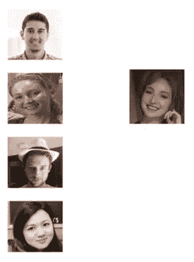
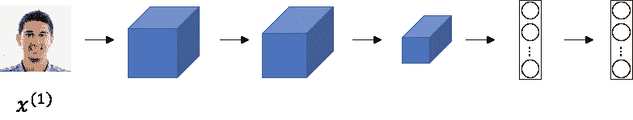
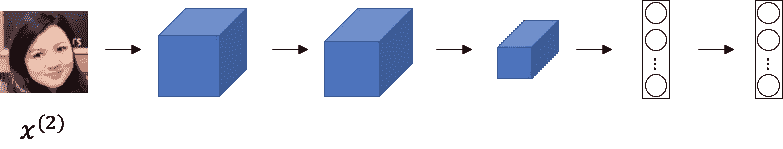
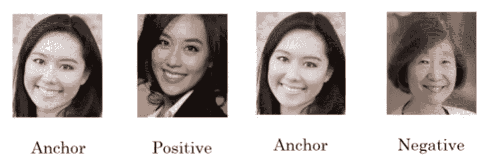
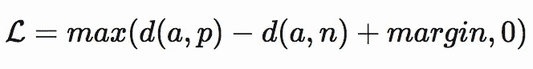

# 连体网络和三重损耗

> 原文：<https://towardsdatascience.com/siamese-network-triplet-loss-b4ca82c1aec8?source=collection_archive---------3----------------------->

## 介绍

深度学习迅速崛起到人工智能的前沿，这是由大量可用数据推动的。深度学习概念在它所应用的几乎所有用例中都表现得非常好，例如计算机视觉、医疗保健、NLP 等。但是，当缺乏可用的训练数据时，它很难执行。在许多用例中，模型可用于训练的数据量相当低，这阻碍了模型学习有助于预测的特征的能力。一个这样的用例是你为一个组织建立一个面部识别系统。

## 一次性学习

一次性学习是从单个样本中学习表示的技术。以前面提到的例子为例，假设有一个组织，它想要一个面部识别系统来允许其员工进入大楼，而您被赋予了构建这样一个系统的任务。这项任务的问题是，组织可能不会为每个员工提供超过 10 张图片。因此，构建和训练一个典型的卷积神经网络是行不通的，因为它无法学习给定数据量所需的特征。所以，这是一个一次性的学习任务，你可以建立一个相似度函数来比较两幅图像，并告诉你是否匹配。

假设，左边的图像是该组织员工的脸。由于没有太多的数据来构建 CNN，您可以构建一个相似性函数来比较右边的图像和左边的所有图像。相似性函数将返回一个值，如果该值小于或等于一个阈值，您可以说这两个图像是相似的，否则它们不是。

## 暹罗网络

在暹罗网络中，我们获取一个人的输入图像，并找出该图像的编码，然后，我们获取相同的网络，不对权重或偏差进行任何更新，并输入不同人的图像，再次预测其编码。现在，我们比较这两种编码来检查这两个图像之间是否有相似之处。这两种编码充当图像的潜在特征表示。同一个人的图像具有相似的特征/编码。利用这一点，我们比较并判断两幅图像是否是同一个人。

## 三重损失

你可能想知道，如何训练网络？您可以通过获取锚点图像并将其与正样本和负样本进行比较来训练网络。锚图像和正面图像之间的相异度必须低，而锚图像和负面图像之间的相异度必须高。

Triplet Loss Funciton

上面的公式表示三重损失函数，使用该函数计算梯度。变量“a”表示锚图像，“p”表示正图像，“n”表示负图像。我们知道 a 和 p 之间的相异度应该小于 a 和 n 之间的相异度。另一个称为裕度的变量是一个超参数，它被添加到损耗方程中。Margin 定义了相异点应该有多远，即如果 margin = 0.2 并且 d(a，p) = 0.5，那么 d(a，n)应该至少等于 0.7。边距有助于我们更好地区分两幅图像。

因此，通过使用该损失函数，我们计算梯度，并且在梯度的帮助下，我们更新暹罗网络的权重和偏差。为了训练网络，我们取一个锚定图像并随机采样正图像和负图像，计算它的损失函数并更新它的梯度。

## 结论

使用这样的新方法，深度学习正在不断缩小人类水平表现的差距。我相信在几年之内，人工智能甚至可以在其应用的某些领域超越人类水平。因此，人工智能和人类一起可以拯救生命，让人们的生活更轻松。

**确认**

所有图片均取自吴恩达[深度学习课程](https://www.coursera.org/specializations/deep-learning)。