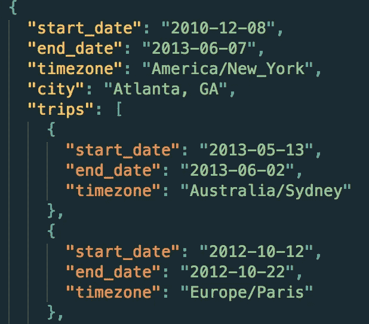

# 十年 Twitter 数据的可视化(第一部分——数据集)

> 原文：<https://towardsdatascience.com/side-project-10-years-of-twitter-8fd5724f7b1a?source=collection_archive---------6----------------------->

本文是数据可视化项目生产笔记的一部分:

[](http://tany.kim/twitter) [## @tanyofish 的 10 年推特

### 10 年间超过 10.2 万条推文的可视化

tany.kim](http://tany.kim/twitter) 

10 年前的今天，我开通了我的推特账户，从那以后我已经发了超过 102，000 条推特。是的，我经常发微博。这是一个私人账户，我主要用韩语发微博，所以请不要马上离开来关注我。

作为一名数据可视化设计师，我一直想从我自己的推文中做出一些东西，可能是我能获得的最个性化、最大规模和最强大的数据集。 在实际的设计和编码之前，我一直在思考这些数据的哪些方面会让自己设计起来有趣，让别人开心。在这个项目开始时，我想发现的包括:

*   我真的经常发微博吗，即使是在工作时间，甚至是刚睡醒的时候？
*   我多久用 Twitter 和朋友聊天一次？
*   电脑和电话，我更常使用哪一个发微博？
*   我和 Twitter 朋友的关系网是什么样的(它更具探索性，最终会有很多想法)？

在这篇文章中，我描述了我想用这个可视化项目展示什么，以及相应地我是如何生成数据集的。

# 获取和清理数据

我认为有两种方法可以检索你所有的推文——1)下载并存档你的推文，这个选项可以在你的帐户设置下找到，2)使用 [Twitter 的 Rest API](https://dev.twitter.com/rest/public)。众所周知，没有一个数据集的格式是完美的，没有丢失的信息，所以我必须彻底清理数据集。我可以写一篇关于这个过程的全新文章，但是我的 Python 代码可以更好地解释这个过程。几个亮点是

1.  关于时间戳，来自下载档案的旧推文数据只有最新的，而不是小时、分钟或秒。因为我想知道一天中我发推特的时间，所以我需要这些数据。为此，我使用 rest APIs 获取每条 tweet 的所有完整元数据，这些 tweet 的 ID 可以在存档中找到。
2.  再说一次，我想知道我什么时候发微博。每条 tweet 的元信息现在包括精确到秒的时间戳，但是，它是用 UTC 表示的，所以我必须将所有的时间戳转换成正确的时区。为此，我制作了一个 JSON 文件[，列出了我过去 10 年居住和旅行过的地方，包括时区](https://github.com/tanykim/twitter-ten-years/blob/master/data-generation/locations.json)。



为此，我查看了护照上的印章，并查看了我的机票预订电子邮件。因为我不知道我搬到另一个时区的确切时间，所以我把搬家/旅行开始日期的所有推文都转换到了新的时区。我知道这不是完美的清理，但考虑到整个数据量(+10 万条推文)，这是可以接受的。

一条 tweet 的 JSON 数据如下所示:

 [## 获取状态/查找— Twitter 开发人员

### 编辑描述

dev.twitter.com](https://dev.twitter.com/rest/reference/get/statuses/lookup) 

# 数据集:“推特”和“朋友”

现在我有+102K 的 tweets，包含正确的时间和时区信息以及其他元数据。那接下来是什么？设计数据可视化时，明确您想要传递的信息是至关重要的。澄清消息并不意味着你限制用户将要探索的见解或故事，而是帮助你找出你必须关注原始数据的哪些方面。

在对我的推文数据进行了大量的迭代和构思之后，我最终得到了两个主题——**推文和朋友**。

## 小鸟叫声

Tweets 视图显示了我在宏观和微观角度发推文时的**。首先，它用柱状图**显示了**每月的推文数量。在这个条上，一个滑块被覆盖以选择时间跨度，在该范围内进行进一步的分析。关于所选的时间跨度，我添加了一个可视化的 7 天 24 小时矩阵，每个 7X24 块代表我在所选的时间跨度内，在所选的小时和天的组合中发了多少条推文。**

当然，发推的时间告诉了我一些有趣的事情(例如，我一起床就发了很多推)，我也想利用一条推的所有元数据。在硕果累累的数据中，我重点关注了四类——***交互、媒体、语言、来源****。*

*互动有三种类型——**提及、转发和引用**。提及是对另一个用户的直接引用，通常是以@开头的推文，带有用户名。转发和引用是引用其他公开推文的方式。*

*媒体有四种类型— **照片、视频和网址**。事实上，一条 tweet 可以同时包含照片和 URL，但是在这个分析中，URL 意味着 twee 只包含外部源的链接。*

*正如我之前提到的，我主要用韩语发微博，但是在乞讨的时候，我主要用英语发微博。所以我加了这一类，看看语言超时使用的变化。这两种语言——朝鲜语和英语——是我包含的语言类型。分析中没有指定其他或未定义的(主要是纯表情符号推文)语言。*

*Source 指的是我发微博时使用的媒介。一些例子是“iPhone 的 Twitter”(iOS 的官方应用程序)和“Twitter Web 客户端”。在这个分析中，我将这些来源归纳为两大类— **大屏幕和小屏幕**。大屏幕包括我用在大屏幕上的网络客户端，那是我的电脑。小屏幕意味着包括 iPhone、Android 和 Windows Phone 应用程序在内的移动设备以及移动浏览器。如果您通过第三方服务上的共享按钮发布推文，源将被指定为服务，例如“Ask FM”或“YouTube”这些第三方来源从技术上来说来自大屏幕或小屏幕，但我没有包括这些，因为我想将来源视为我用于推特的物理设备。*

*在挖掘从早期步骤获得的数据到前端使用的最终数据集时，我希望优化文件大小和格式，以便 Javascript 代码完成最少的工作。现在一个单独的 tweet 数据如下所示。数组第二项中的单个字母代表类别的类型(例如，p 代表照片，k 代表韩语)。整个+102K 的最小化数据的大小现在是 3.6M！*

```
*["2017-04-15 13 6", ["p", "f", "k", "s"]]*
```

## *老友记*

*我在推特上认识了很多很棒的人。作为一个 10 年的 Twitter 用户，我没有太多的追随者，主要是因为我大部分时间都在保护我的账户。我上面描述的分析显示，我有 349 个好友，这还不包括已删除的账户。最初我想包括那些被删除的账户，尽管我无法检索他们唯一的数字 Twitter ID。然后我意识到，如果我从我的 tweets 文本中手动追踪所有那些被删除的帐户(大部分包括@)，可能会违背那些朋友在 Twitter 上抹去他们痕迹的意图。因此，349 个好友是截至 2017 年 4 月保持其账户活跃的人。*

*通过分析我的 Twitter 好友，我可以发现哪些有趣的事实？我的一些即时想法是**我给他们发了多少封短信**，以及**我和他们聊了多久**。通信的计数和持续时间很容易被挖掘；Count 是指对特定朋友自己的推文“回复推文”的次数。当朋友的 ID 被简单地包含在推文中时，她或他的 ID 不被包含在内；持续时间是第一次提及和最后一次提及之间的时间差。*

*除了计数和持续时间，我想做一些更个人化和面向社区的事情。*

*出于一些个人方面的考虑，我手动将每个朋友标记为以下人员— **1)我在现实世界中首先遇到的人，2)我仅通过 Twitter 交谈的人，3)我首先在 Twitter 上遇到的人，然后是本人，4)非人类(即机构或事件账户)或名人。**在可视化中，这四个类别是可视化的颜色编码。一个朋友的数据简介是这样的:*

```
*{
  "name": "exampleUser",
  "points": [
    [
      "2017-04",
      32
    ],
    [
      "2017-03",
      69
    ],
    [
      "2017-02",
      27
    ]
  ],
  "first": "Feb  6, 2017",
  "count": 128,
  "duration": 53,
  "id": "931827750",
  "common": 9,
  "category": 2
}*
```

*Twitter 允许我通过连接到我朋友的朋友来建立我的网络。考虑到 Twitter 的这种性质，我想知道当我与其他人交谈时，都有哪些人参与其中。当一个回复的线程生成时，通常在一条推文中会提到多个 Twitter 账户。通过分析这些提及，我得出了一个社区的数据集— **这些人参与了与朋友的对话。***

*最后，我分析了我所有 twitter 好友的计数、持续时间和共享好友数量的分布。朋友部分更像是**一个视觉分析工具**，超越了一组交互式可视化。可以用多种方式选择朋友，包括传统的搜索/下拉菜单，以及可视化的交互式特征。选择一个朋友会触发所有这些可视化的更新，并指定该朋友的计数、持续时间和共享朋友数量的排名。*

# *下一步是什么？*

*该项目现已在 http://tany.kim/twitter[可用](http://tany.kim/twitter)*

*在下一篇文章中，我将描述数据可视化的设计过程，包括可视化形式和交互的决策。*