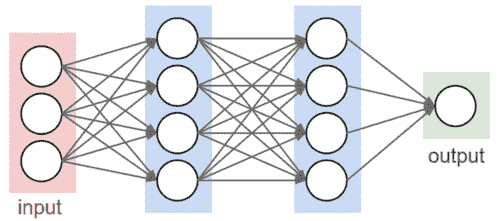
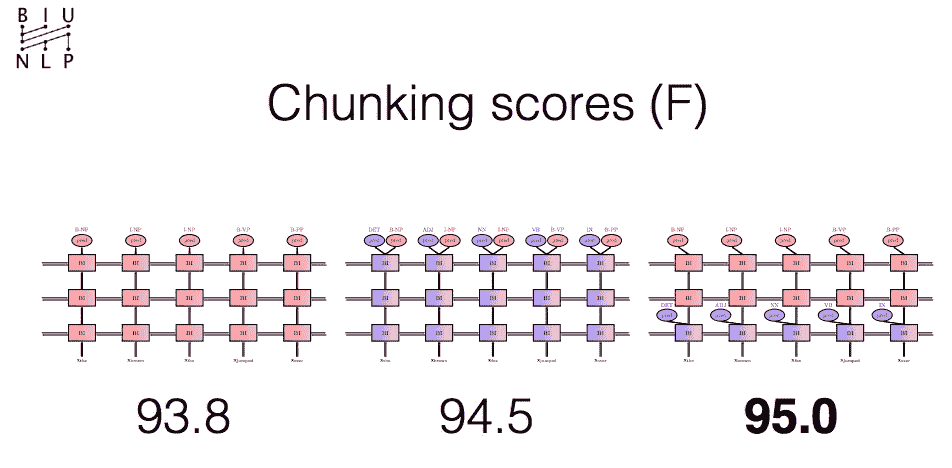
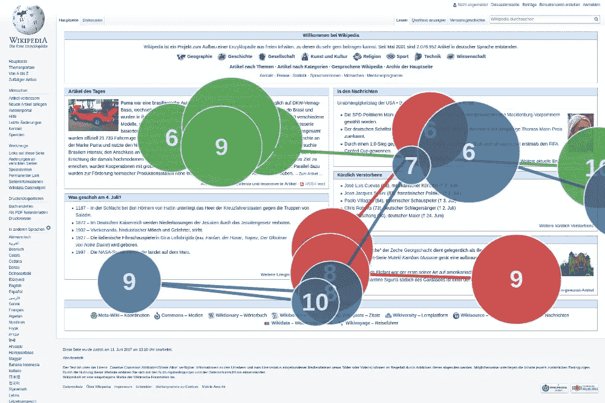
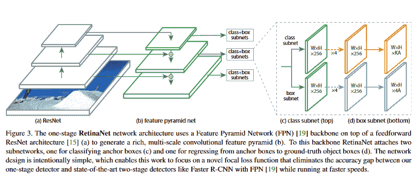

# 多任务深度学习的 3 种数据技术。

> 原文：<https://towardsdatascience.com/silver-gold-electrum-3-data-techniques-for-multi-task-deep-learning-2655004970a2?source=collection_archive---------20----------------------->

**TLDR；**这篇文章对多任务学习技术进行了高度的介绍，然后概述了三种实用的数据准备方法，我称之为银、金和银金矿。

# 什么是多任务学习？

**多任务学习** (MTL)是学习**的**共享表征**互补**任务**任务**以提高给定目标任务结果的过程。

数据科学领域之外的 MTL 的一个很好的例子是健身房的组合练习，例如俯卧撑和引体向上，它们相互补充，以最大限度地增加全身的肌肉。

单独俯卧撑主要锻炼胸部，其次是背部。而引体向上主要锻炼背部，其次是上胸部。然而，当一起做时，引体向上和俯卧撑相辅相成，为胸部和背部提供比单独做时更好的增益。

为了更好地理解这个概念，让我们后退一步，回顾一下机器学习和深度学习的基础知识。

**机器学习** ML 的目标是找到**特性**来训练**模型**，该模型将输入数据(如图片、时间序列或音频)转换为给定的输出(如字幕、价格值、转录)。在传统的数据科学中，这些特征通常是手工选择的。

A canonical example of a feed forward deep neural network.

在**深度学习(DL)** 中，我们通过将我们的输入表示为向量，并通过一系列巧妙的线性代数运算将其转换为给定的输出，来学习提取这些特征。

然后我们使用一个叫做**损失函数**的等式来评估我们的输出是否是我们所期望的。该过程的目标是使用来自每个训练输入的损失函数的结果来指导我们的模型提取将在下一次传递中导致较低损失值的特征。

> **“多任务学习** (MTL)是通过组合****任务**的**损失函数**来学习**共享表征**以提高给定目标任务的结果的过程。”**

**通过在相关任务之间共享表示，我们可以使模型更好地概括每个原始任务。**

**例如，让我们看看两个 NLP 任务[词性标注](https://en.wikipedia.org/wiki/Part-of-speech_tagging)和[句法短语分块](https://en.wikipedia.org/wiki/Phrase_chunking)。如果我们使用相同的表示层，并通过结合我们的位置损失和分块预测来更新我们的权重，我们可以将我们的结果提高 0.7 的 [F1 分数。当 MTL 模型共享所有相同的参数，但是通过在输出层直接组合两个或更多不同的损耗来更新时，这被称为**硬参数共享**。](http://anthology.aclweb.org/P16-2038)**

**另一方面，**选择性参数共享，**利用下游任务的分级性质，并且仅在相关层更新任务损失。想法是上游任务的更好的表示将导致更好的整体结果。在我们的分块示例中，使用软参数共享导致 [1.2 F1 分数比我们的独立结果](http://anthology.aclweb.org/P16-2038)高。**

****

**From left to right. F1 results on standalone chunking, MTL (Hard Parameter sharing), MTL (Soft Parameter Sharing)**

**一个多任务学习的聪明例子是通过将预测[人阅读时的凝视位置的任务与压缩句子结合起来进行的。](https://arxiv.org/abs/1604.03357)**

****

**An example of gaze tracking.**

**在对象检测模型中，诸如 [RetinaNet](https://github.com/fizyr/keras-retinanet) 和[faster CNN](https://github.com/yhenon/keras-frcnn)之类的最先进的区域提议网络使用多任务学习来组合来自区域提议和分类任务的损失。**

****

**RetinaNet MultiTask Architecture Image [Src](http://jleehome.blogspot.com/2018/02/notes-on-focal-loss-for-dense-object.html)**

## **MTL 为什么工作**

**多任务学习似乎直觉上可行，原因如下:**

*   ****隐性数据扩充**——通过一起学习两个相关的任务，我们可以在每个任务之间转移隐性理解。**
*   ****聚焦表征——**MTL 将习得的特征表征聚焦在正在学习的任务之间的交集上。**
*   ****注意** **规则化**——MTL 提供监督*防止模特过度配合主任务* ***。*** 在这种情况下任务应该是*并行学习的。***

## **警告**

**然而，在执行多任务学习时会面临一些挑战。**

*   **让它发挥作用并不容易。**
*   **很难找到好的任务对，大多数任务对在某些有害的性能上没有任何改进。**
*   **当两个或更多的任务重叠太多，MTL 往往提供微不足道的收益。**
*   **如果一个网络不够宽，MTL 伤害所有的任务。**

**根据经验，更多的任务内数据会比简单地增加更多的任务带来更好的结果。然而，在处理不平衡数据集时，它被证明是有效的。我希望在未来我们可以建立一个框架来尽量减少这些警告。这些挫折通常是为 MTL 准备数据的结果。下面，我将概述三种适用于 MTL 的最佳实践数据技术。**

**关于多任务学习的更深入的阅读，我强烈推荐 Sebastian Ruder 的[帖子](http://ruder.io/multi-task/)和来自 BIU CS 89–687 课程的 [Yoav Goldberg 的幻灯片](http://u.cs.biu.ac.il/~89-687/lec9.pdf)，以及来自 [Yoav 的书](https://www.amazon.com/Language-Processing-Synthesis-Lectures-Technologies-ebook/dp/B071FGKZMH/ref=sr_1_1?ie=UTF8&qid=1534841076&sr=8-1&keywords=yoav+goldberg+neural+network+methods+for+natural+language+processing)的第 20 章。**

# **MTL 数据技术**

****

**Assorted metal coins. Image [Src](https://mysite.du.edu/~jcalvert/phys/copper.htm)**

**如前所述，多任务学习的最大驱动力之一是数据。多任务学习面临的一个挑战通常是给定数据集中所有任务缺乏统一的预先标记或**黄金**标记的数据。**

**例如，如果一个人想要在带有词性任务的 [SNLI 数据集](https://nlp.stanford.edu/projects/snli/)上用纯金色标签执行多任务学习，他们需要用 POS 标签手动注释 570，000 个人类书写的英语句子对中的每一个。**

**这种注释是昂贵的，并且通常是禁止的，下面我提出了三种不同的技术，可以应用于处理给定数据集的直接金标记的缺乏，我称之为银、金和银金矿。**

## ****白银:****

**因为我们没有 POS 值，所以我们可以使用一个预先训练好的标记器，比如 Spacy 或 AllenNLP，来为我们的 SNLI 任务生成 POS 标记，并根据它们计算我们的损失。虽然不能保证标签是正确的，但是我们可以希望它们足够接近来指导我们的模型学习我们的主要 SNLI 任务所需的 POS 的正确特征。这种方法的优点是我们的主要 SNLI 任务的 POS 覆盖将是完整的，缺点是我们在我们的模型中引入了噪声。**

## ****金色:****

**虽然我们可能没有给定任务(如 SNLI)的黄金 POS 数据，但我们仍然可以利用来自单独数据集(如 TreeBank)的黄金数据，然后我们可以根据 treebank 计算 POS 任务的损失，并根据 SNLI 数据集计算 SNLI 任务的损失。这种方法的优点是我们保证树库值没有噪声。缺点是，在树库和 SLNI 数据集之间的 POS 标签和句法结构之间可能存在不均匀的覆盖。**

## ****银金矿:****

**Electrum 结合了上述黄金和白银技术，交替或组合加权损失。希望来自 treebank 数据集的黄金值将有助于调节白银数据中的噪声，但白银数据中的正确值将为我们的最终模型提供更好的覆盖范围。这种方法的缺点是需要计算额外的损失和两倍的数据。**

# ****行动号召****

**在我自己的实验中，金、银和银金矿的数据准备方法对我很有效。在未来的帖子中，我希望通过一个基本的 MTL 任务为这种方法提供更好的基准，并可能提供一个简单的 API 来管理 MTL 的数据集和损失。**

**如果这是你会在下面发现有趣的评论或者发推特给我[@ python coder](https://twitter.com/pythiccoder)。希望有合作者**

## **资源**

*   **[自然语言处理中的神经网络方法 2017 章](https://www.amazon.com/Language-Processing-Synthesis-Lectures-Technologies-ebook/dp/B071FGKZMH/ref=sr_1_1?ie=UTF8&qid=1534841076&sr=8-1&keywords=yoav+goldberg+neural+network+methods+for+natural+language+processing) 20**
*   **[深度神经网络中多任务学习概述](http://ruder.io/multi-task/)**
*   **[面向 NLP 课程的 Bar Ilan 深度学习 89–687](http://u.cs.biu.ac.il/~89-687/lec9.pdf)**
*   **[Coursera MTL 讲座](https://www.coursera.org/lecture/machine-learning-projects/multi-task-learning-l9zia)**