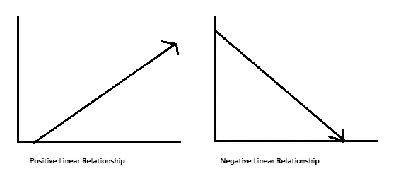
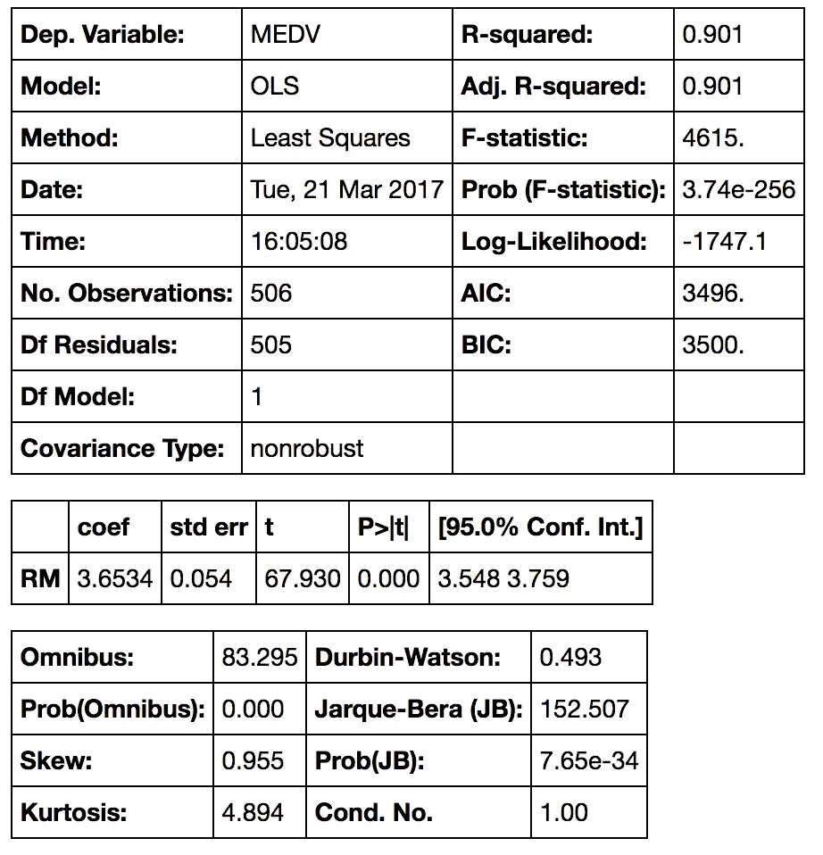
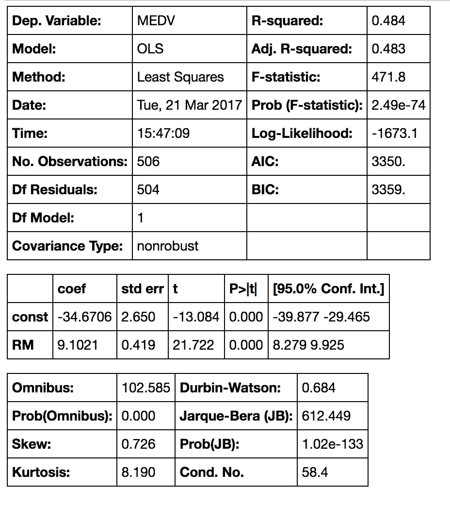
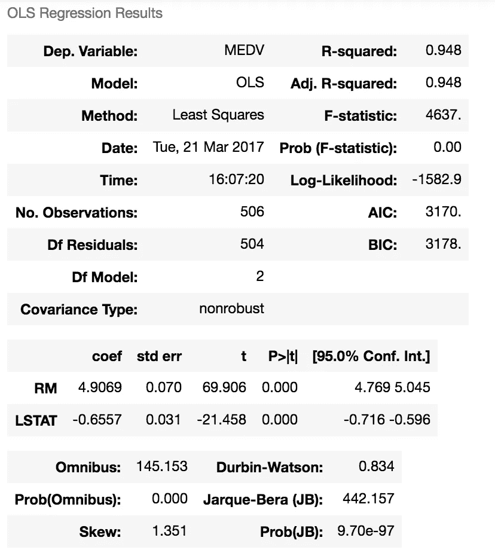

# Python 中的简单和多元线性回归

> 原文：<https://towardsdatascience.com/simple-and-multiple-linear-regression-in-python-c928425168f9?source=collection_archive---------0----------------------->

**Python 中线性回归的快速介绍**

大家好！在[简单介绍了“熊猫”库](https://medium.com/@adi.bronshtein/a-quick-introduction-to-the-pandas-python-library-f1b678f34673)和 [NumPy 库](https://medium.com/@adi.bronshtein/a-quick-introduction-to-the-numpy-library-6f61b7dee4db)之后，我想提供一个用 Python 构建模型的快速介绍，还有什么比最基本的模型之一线性回归更好的起点呢？这将是关于机器学习的第一篇文章，我计划在未来写一些更复杂的模型。敬请期待！但是现在，让我们关注线性回归。

在这篇博文中，我想重点介绍线性回归的概念，以及它在 Python 中的实现。[线性回归](https://en.wikipedia.org/wiki/Linear_regression)是一种统计模型，用于检验两个(简单线性回归)或多个(多元线性回归)变量(因变量和自变量)之间的线性关系。线性关系基本上意味着当一个(或多个)自变量增加(或减少)时，因变量也增加(或减少):



如你所见，线性关系可以是正的(自变量上升，因变量上升)，也可以是负的(自变量上升，因变量下降)。正如我所说的，我将重点关注回归模型在 Python 中的实现，所以我不想过多地钻研回归背后的数学，但我会写一点关于它的内容。如果你想写一篇关于这方面的博文，请不要犹豫给我回信！

## 稍微了解一下数学

变量 Y 和 X 之间的关系由以下等式表示:

```
**Y`i = mX + b**
```

在这个等式中， *Y* 是因变量——或者是我们试图预测或估计的变量；x 是独立变量——我们用来做预测的变量；m 是回归线的斜率——它代表了 *X* 对 *Y* 的影响。换句话说，如果 *X* 增加 1 个单位， *Y* 将增加正好 *m* 个单位。(**“全公开”**:只有当我们知道 *X* 和 *Y* 有线性关系时才成立。在几乎所有的线性回归情况下，这都不会是真的！) *b* 是常数，也称为 Y 截距。如果 X 等于 *0，Y* 将等于 *b* ( **警告**):参见之前的完整披露！).这在现实生活中不一定适用——我们不会总是知道 *X* 和 *Y* 之间的确切关系或者有一个确切的线性关系。

这些警告将我们引向一个简单的线性回归。在 SLR 模型中，我们基于数据构建模型——斜率和 Y 轴截距来自数据；此外，我们不需要 *X* 和 *Y* 之间的关系是完全线性的。SLR 模型还包括数据中的误差(也称为残差)。我现在不会过多地讨论它，也许在以后的文章中，但残差基本上是 Y 的真实值和 Y 的预测/估计值之间的差异。需要注意的是，在线性回归中，我们试图预测一个连续变量。在回归模型中，我们试图通过找到“最佳拟合线”来最小化这些误差——误差的回归线将是最小的。我们试图将黑线的长度(或者更准确地说，是蓝点与红线的距离)最小化，尽可能接近零。它与最小化[均方误差(MSE)](https://en.wikipedia.org/wiki/Mean_squared_error) 或[误差平方和(SSE)](https://en.wikipedia.org/wiki/Residual_sum_of_squares) 相关(或等效)，也称为“残差平方和”。(RSS)但是这可能超出了这篇博客的范围:-)


在大多数情况下，我们会有不止一个自变量——我们会有多个变量；它可以小到两个独立变量，大到数百个(理论上甚至数千个)变量。在这些情况下，我们将使用多元线性回归模型(MLR)。回归方程与简单回归方程非常相似，只是变量更多:

```
**Y’i = b0 + b1X1i + b2X2i**
```

这篇文章的数学部分到此结束:)准备好用 Python 实现它了吗？

# Python 中的线性回归

在 Python 中有两种主要的方法来执行线性回归——使用 [Statsmodels](http://www.statsmodels.org/stable/regression.html) 和 [scikit-learn](http://scikit-learn.org/stable/modules/generated/sklearn.linear_model.LinearRegression.html) 。使用 [Scipy 库](https://docs.scipy.org/doc/scipy-0.14.0/reference/generated/scipy.stats.linregress.html)也是可能的，但是我觉得这不如我提到的另外两个库那么常见。让我们来研究一下在这两种情况下进行线性回归:

## 统计模型中的线性回归

[Statsmodels](http://www.statsmodels.org/stable/index.html) 是“一个 Python 模块，它为许多不同的统计模型的估计，以及进行统计测试和统计数据探索提供了类和函数。”(来自文档)

与 [Pandas](https://medium.com/@adi.bronshtein/a-quick-introduction-to-the-pandas-python-library-f1b678f34673) 和 [NumPy](https://medium.com/@adi.bronshtein/a-quick-introduction-to-the-numpy-library-6f61b7dee4db) 一样，获取或安装 Statsmodels 的最简单方法是通过 [Anaconda 包](https://www.continuum.io/downloads)。如果出于某种原因，你有兴趣以另一种方式安装，请查看[此链接](http://www.statsmodels.org/stable/install.html)。安装后，每次需要使用它时，您都需要导入它:

```
**import statsmodels.api as sm**
```

让我们看看如何实际使用 Statsmodels 进行线性回归。我将使用我在 DC 大会[上的](https://generalassemb.ly/locations/washington-dc/downtown-dc)[数据科学课](https://generalassemb.ly/education/data-science-immersive)中的一个例子:

首先，我们从 sklearn (我提到的另一个库)导入一个[数据集:](http://scikit-learn.org/stable/datasets/)

```
**from** **sklearn** **import** datasets *## imports datasets from scikit-learn*
data = datasets.load_boston() *## loads Boston dataset from datasets library* 
```

这是波士顿房价的数据集(链接到描述)。因为它是为测试和学习机器学习工具而指定的数据集，所以它附带了数据集的描述，我们可以通过使用命令**打印**数据来查看它。DESCR(这只适用于 sklearn 数据集，而不是每个数据集！虽然会很酷…)。为了更好地理解变量，我添加了描述的开头:

```
Boston House Prices dataset
===========================

Notes
------
Data Set Characteristics:  

    :Number of Instances: 506 

    :Number of Attributes: 13 numeric/categorical predictive

    :Median Value (attribute 14) is usually the target

    :Attribute Information (in order):
        - CRIM     per capita crime rate by town
        - ZN       proportion of residential land zoned for lots over 25,000 sq.ft.
        - INDUS    proportion of non-retail business acres per town
        - CHAS     Charles River dummy variable (= 1 if tract bounds river; 0 otherwise)
        - NOX      nitric oxides concentration (parts per 10 million)
        - RM       average number of rooms per dwelling
        - AGE      proportion of owner-occupied units built prior to 1940
        - DIS      weighted distances to five Boston employment centres
        - RAD      index of accessibility to radial highways
        - TAX      full-value property-tax rate per $10,000
        - PTRATIO  pupil-teacher ratio by town
        - B        1000(Bk - 0.63)^2 where Bk is the proportion of blacks by town
        - LSTAT    % lower status of the population
        - MEDV     Median value of owner-occupied homes in $1000's

    :Missing Attribute Values: None

    :Creator: Harrison, D. and Rubinfeld, D.L.

This is a copy of UCI ML housing dataset.
http://archive.ics.uci.edu/ml/datasets/Housing

This dataset was taken from the StatLib library which is maintained at Carnegie Mellon University.
```

运行 *data.feature_names* 和 *data.target* 将分别打印自变量和因变量的列名。也就是说，Scikit-learn 已经将房价数据设置为目标变量，并将 13 个其他变量设置为预测变量。让我们看看如何对这个数据集进行线性回归。

首先，我们应该将数据加载为 pandas 数据框以便于分析，并将房屋价值中值设置为我们的目标变量:

```
**import** **numpy** **as** **np**
**import** **pandas** **as** **pd**# define the data/predictors as the pre-set feature names  
df = pd.DataFrame(data.data, columns=data.feature_names)

*# Put the target (housing value -- MEDV) in another DataFrame*
target = pd.DataFrame(data.target, columns=["MEDV"])
```

我们在这里所做的是获取数据集并将其作为熊猫数据框加载；之后，我们设置预测值(如 df)，即数据集中预设的独立变量。我们也在设定目标——因变量，或者我们试图预测/估计的变量。

接下来，我们要拟合一个线性回归模型。我们需要选择我们认为能很好预测因变量的变量——这可以通过检查变量之间的相关性，通过绘制数据并直观地搜索关系，通过对哪些变量能很好预测 y 等进行初步研究来完成。对于第一个例子，让我们以 RM——房间的平均数量和 LSTAT——较低地位人口的百分比为例。需要注意的是，Statsmodels 默认情况下不添加常量。让我们先看看回归模型中没有常数的情况:

```
*## Without a constant*

**import** **statsmodels.api** **as** **sm**

X = df["RM"]
y = target["MEDV"]

*# Note the difference in argument order*
model = sm.OLS(y, X).fit()
predictions = model.predict(X) # make the predictions by the model

*# Print out the statistics*
model.summary()
```

输出:



解读桌子这是一张很长的桌子，不是吗？首先我们有因变量，模型和方法。 **OLS** 代表[普通最小二乘法](https://en.wikipedia.org/wiki/Ordinary_least_squares)，方法“最小二乘法”意味着我们试图拟合一条回归线，这将最小化到回归线的距离的平方(见本文的前一部分)。日期和时间是不言自明的:)观察次数也是如此。残差和模型的 Df 与[自由度](https://en.wikipedia.org/wiki/Degrees_of_freedom_(statistics))相关——“统计数据最终计算中可自由变化的值的数量。”

系数 3.6534 意味着 *RM* 变量增加 1， *MDEV* 的预测值增加 *3.6534* 。其他几个重要的值是 R 平方——我们的模型解释的方差的百分比；标准误差(是统计抽样分布的标准偏差，通常是平均值)；假设检验的 t 分数和 p 值——*RM*具有统计上显著的 p 值； *RM 有 95%的置信区间(*意味着我们以 95%的置信度预测 *RM* 的值在 *3.548* 到 *3.759* 之间)。

如果我们想在模型中添加一个常量，我们必须使用命令`X = sm.add_constant(X)`来设置它，其中 X 是包含输入(独立)变量的数据框的名称。

```
**import** **statsmodels.api** **as** **sm #** import statsmodels

X = df["RM"] *## X usually means our input variables (or independent variables)*
y = target["MEDV"] *## Y usually means our output/dependent variable*
X = sm.add_constant(X) *## let's add an intercept (beta_0) to our model*

*# Note the difference in argument order*
model = sm.OLS(y, X).fit() *## sm.OLS(output, input)*
predictions = model.predict(X)

*# Print out the statistics*
model.summary()
```

输出:



**解读表格** —常数项的系数不同。如果没有常数，我们将强制我们的模型通过原点，但是现在我们有一个 y 截距在 *-34.67* 。我们还将 *RM* 预测器的斜率从 *3.634* 更改为 *9.1021* 。

现在让我们尝试拟合一个包含多个变量的回归模型——我们将使用我之前提到的 RM 和 LSTAT。模型拟合是相同的:

```
X = df[[“RM”, “LSTAT”]]
y = target[“MEDV”]model = sm.OLS(y, X).fit()
predictions = model.predict(X)model.summary()
```

输出是:



Note: this table looks different because I’ve updated my Jupyter Notebook

**解释输出** —我们可以看到，该模型的 R 平方值更高，为 0.948，这意味着该模型解释了因变量中 94.8%的方差。每当我们向回归模型中添加变量时，R 会更高，但这是一个相当高的 R。我们可以看到 *RM* 和 *LSTAT* 在预测(或估计)中值房屋价值方面具有统计显著性；毫不奇怪，我们看到当 *RM* 增加 *1* ， *MEDV* 将增加 4.9069，当 *LSTAT* 增加 *1* ， *MEDV* 将**减少**-0.6557。你可能还记得，LSTAT 是较低地位人口的百分比，不幸的是，我们可以预计它会降低房屋的中值。同样的逻辑，房子里的房间越多，通常它的价值就会越高。

这是统计模型中一元和多元线性回归的例子。我们可以在回归模型中使用尽可能少或尽可能多的变量——最多 13 个！接下来，我将演示如何在 SKLearn 中运行线性回归模型。

## SKLearn 中的线性回归

当谈到 Python 中的机器学习时，SKLearn 几乎是黄金标准。它有许多学习算法，用于回归、分类、聚类和降维。查看[我关于 KNN 算法的帖子](https://medium.com/@adi.bronshtein/a-quick-introduction-to-k-nearest-neighbors-algorithm-62214cea29c7)获得不同算法的地图和更多 SKLearn 的链接。为了使用线性回归，我们需要导入它:

```
**from** **sklearn** **import** linear_model
```

让我们使用之前用过的数据集，波士顿房价。该过程在开始时是相同的——从 SKLearn 导入数据集并加载到波士顿数据集中:

```
**from** **sklearn** **import** datasets *## imports datasets from scikit-learn*
data = datasets.load_boston() *## loads Boston dataset from datasets library*
```

接下来，我们将数据加载到 Pandas(与之前相同):

```
# define the data/predictors as the pre-set feature names  
df = pd.DataFrame(data.data, columns=data.feature_names)

*# Put the target (housing value -- MEDV) in another DataFrame*
target = pd.DataFrame(data.target, columns=["MEDV"])
```

现在，和以前一样，我们有包含自变量的数据框(标记为“df”)和包含因变量的数据框(标记为“target”)。让我们用 SKLearn 拟合一个回归模型。首先，我们将定义 X 和 y，这一次我将使用数据框中的所有变量来预测房价:

```
X = df
y = target[“MEDV”]
```

然后我会拟合一个模型:

```
lm = linear_model.LinearRegression()
model = lm.fit(X,y)
```

lm.fit()函数适合线性模型。我们希望使用模型进行预测(这就是我们在这里的目的！)，所以我们将使用 lm.predict():

```
predictions = lm.predict(X)
print(predictions)[0:5]
```

print 函数将打印 y 的前 5 个预测(为了“节省空间”，我没有打印整个列表。移除[0:5]将打印整个列表):

```
[ 30.00821269  25.0298606   30.5702317   28.60814055  27.94288232]
```

记住，lm.predict()使用我们拟合的线性模型来预测 y(因变量)。你一定注意到了，当我们用 SKLearn 运行线性回归时，我们不会像在 Statsmodels 中那样得到一个漂亮的表(好吧，它不是那么漂亮…但它相当有用)。我们能做的是使用内置函数返回分数、系数和估计截距。让我们看看它是如何工作的:

```
lm.score(X,y)
```

会给出这样的输出:

```
0.7406077428649428
```

这是我们模型的 R 分。你们可能还记得，这是解释预测方差的百分比。如果你有兴趣，[在这里阅读更多](http://scikit-learn.org/stable/modules/generated/sklearn.linear_model.LinearRegression.html#sklearn.linear_model.LinearRegression.score)。接下来，让我们检查预测值的系数:

```
lm.coef_
```

将给出以下输出:

```
array([ -1.07170557e-01,   4.63952195e-02,   2.08602395e-02,
         2.68856140e+00,  -1.77957587e+01,   3.80475246e+00,
         7.51061703e-04,  -1.47575880e+00,   3.05655038e-01,
        -1.23293463e-02,  -9.53463555e-01,   9.39251272e-03,
        -5.25466633e-01])
```

截距:

```
lm.intercept_
```

这将给出以下输出:

```
36.491103280363134
```

这些都是我之前提到的多元回归方程的(估计/预测)部分。查看文档，了解关于 coef_ 和 intercept_ 的更多信息。

所以，这是一个快速(但相当长！)关于如何用 Python 进行线性回归的介绍。实际上，您不会使用整个数据集，但是您会将数据拆分为用于训练模型的训练数据和用于测试模型/预测的测试数据。如果你想了解它，请看看我的下一篇博文。与此同时，我希望你喜欢这篇文章，我会在下一篇文章中“看到”你。

感谢您的阅读！