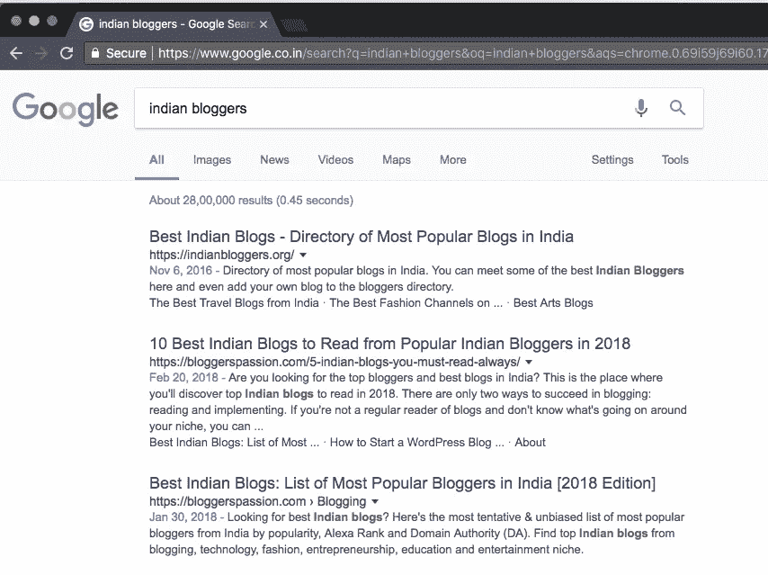
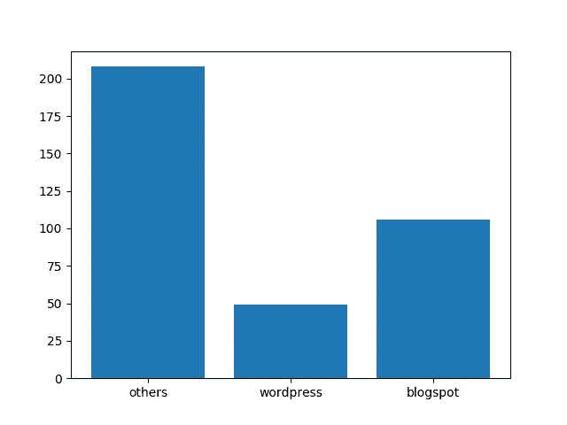

# 简单的网络抓取入门

> 原文：<https://towardsdatascience.com/simple-beginning-to-web-scraping-ef2f2287aff9?source=collection_archive---------10----------------------->


Photo by [Jay Wennington](https://unsplash.com/photos/OLIcAFggdZE?utm_source=unsplash&utm_medium=referral&utm_content=creditCopyText) on [Unsplash](https://unsplash.com/search/photos/junk?utm_source=unsplash&utm_medium=referral&utm_content=creditCopyText)

当您需要数据仓库中不容易获得的数据时，或者当数据可以在线获得但不能通过 API 获得时，Web 抓取几乎是您的首选技术，您可以使用 API 通过 HTML 请求提取信息。

假设我们的目标是找到流行的印度博客平台。记住这个用例，现在让我们看看如何为我们的分析找到信息。

# 数据源:

在谷歌上快速搜索关键词——[印度博客](https://www.google.co.in/search?q=indian+bloggers&oq=indian+bloggers&aqs=chrome.0.69i59j69i60.1750j0j1&sourceid=chrome&ie=UTF-8)，这个[网站](https://indianbloggers.org/)会出现在第一个结果中。这个网站列出了一些最受欢迎的印度博客和他们的博客链接。因此，这个网站成为我们的数据来源，我们将从那里收集信息，供我们进一步分析。



# 工具箱:

对于这个分析，我们将使用 Python 编程语言。以下是此分析所需的软件包列表。

*   请求—对于 HTML 请求
*   bs4——著名的解析 html 内容和收集所需数据的工具
*   re —用于正则表达式和模式匹配
*   matplotlib —用于可视化

让我们加载所需的库:

```
import requests
from bs4 import BeautifulSoup, Comment
import pandas as pd
import re
import matplotlib.pyplot as plt
```

# HTTP 请求

web 抓取的第一步只是发出一个 HTTP 请求，获取 URL 内容(记住这一步只是收集 URL 的内容，并不抓取所需的信息)。

```
url='https://indianbloggers.org/'
content = requests.get(url).text
```

对于使用`get()`的请求，创建一个带有 url 内容的请求对象，而`.text`方法提取对象/ URL 的内容。

# 初始化所需的数据对象:

为了进一步进行分析，我们将需要一些数据对象，这里我们正在初始化那些将在后续步骤中使用的对象。

```
#initalizing an empty dictionary that would be written as Pandas Dataframe and then CSV
d = {'title':[],'links':[]}#initializing blog hosting category
cat = {'blogspot':0,'wordpress':0,'others':0}
```

正如你所看到的，我们已经创建了两个字典——一个用于肌酸 a 熊猫数据框架，另一个用于我们想要收集信息的必需博客平台。所以基本上是 Blogspot vs WordPress(我们还有其他的，可以包括从自定义域到 medium.com 的任何东西)

# 开始刮

```
soup = BeautifulSoup(content, "html.parser") for link in soup.find_all('a',):
    if len(link.text.strip()) > 1 and bool(re.match('^http',link['href'])) and not bool(re.search('indianbloggers|twitter|facebook',link['href'])):
        d['title'].append(link.text)
        d['links'].append(link['href'])
        #finding the blog hosting type
        if re.search('blogspot',link['href']):
            cat['blogspot']+=1
        elif re.search('wordpress',link['href']):
            cat['wordpress']+=1
        else:
            cat['others']+=1
        #d['len'].append(len(link.text.strip()))
```

从上面的代码中，您可以注意到已经使用 BeautifulSoup 函数启动了抓取，该函数使用了我们在 HTTP 请求后提取的内容。那只是刮的开始。正如我们在目标中定义的那样，我们在这里提取链接——尤其是域名，以分析哪个博客平台(由 URL 的域名定义)受欢迎。考虑到这一点，我们可以确定我们需要抓取锚链接(带有 HTML 标签‘a’的超链接)。在这个过程中，我们需要做一些数据清理步骤。例如，有一些标签什么都没有，这需要被绕过，我们也不需要获得网站中社交媒体个人资料 URL 的超链接。因此，我们设法用一些正则表达式和 if 条件来清理数据。因为我们提取多个 URL，所以我们需要通过 for 循环迭代我们的数据提取，以提取域信息并统计各个类别——blogpost、WordPress 等——还需要构建追加到我们在上一步中创建的字典中，该字典可以转换为 Pandas 数据框。

# 输出数据帧:

上一步结束时，我们已经获得了所有需要的信息。为了更进一步，我们将把字典对象‘d’转换成 Pandas 数据框，这在数据分析中更加灵活和有用。然后，可以将数据框保存在您的计算机上，以供将来参考或进一步分析。同时，让我们也打印一些关于数据帧和数据摘要的信息。

```
blog_list = pd.DataFrame(d).set_index('title')
print(blog_list.head())
blog_list.to_csv('blog_list.csv', encoding='utf-8')
print(str(len(blog_list.index))+' rows written')
print(cat)
>>> 
                                            links
title                                            
Amit Agarwal               [http://www.labnol.org/](http://www.labnol.org/)
Jyotsna Kamat  [http://www.kamat.com/jyotsna/blog/](http://www.kamat.com/jyotsna/blog/)
Amit Varma             [http://www.indiauncut.com/](http://www.indiauncut.com/)
Sidin Vadukut              [http://www.whatay.com/](http://www.whatay.com/)
Hawkeye           [http://hawkeyeview.blogspot.in/](http://hawkeyeview.blogspot.in/)
363 rows written
{'wordpress': 49, 'blogspot': 106, 'others': 208}
```

正如您在结果中看到的，对象“cat”为我们提供了可视化所需的数据。

# 可视化流行领域:

有了生成的字典“cat ”,现在让我们使用 matplotlib 来可视化数据(不太美观)。

```
#plotting the blog hosting type 
plt.bar(range(len(cat)), cat.values(), align='center')
plt.xticks(range(len(cat)), cat.keys())
plt.show()
```

给出了这个图:



虽然“其他”类别(包括自定义域名和任何其他博客平台)赢得了这场比赛，但 WordPress 和 Blogspot 之间——博客帖子成为了赢家——这也可能是第一批移动者主要在博客帖子平台上的原因，然后他们可能会变得受欢迎，并最终出现在这个网站上。

# 最终注释:

尽管如此，这篇文章的目的只有一个，那就是找到流行的博客平台。这篇文章旨在帮助你开始掌握网络抓取的基础知识。如果你有兴趣了解更多关于网络抓取的知识，你可以查看一下这个 Datacamp 教程。这里使用的完整代码可以在[我的 Github](https://github.com/amrrs/Scraper-Projects/tree/master/Indian%20Blog%20List%20Extraction) 上获得。这个帖子最初出现在 [DS+](https://datascienceplus.com/finding-the-popular-indian-blogging-platform-by-web-scraping-in-python/) 上。