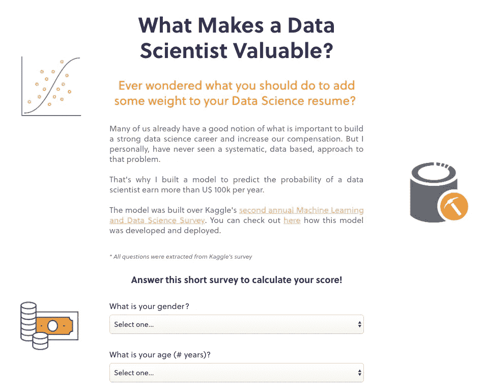
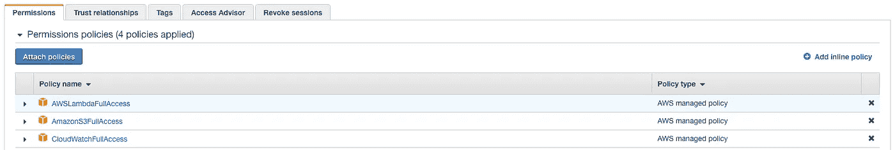
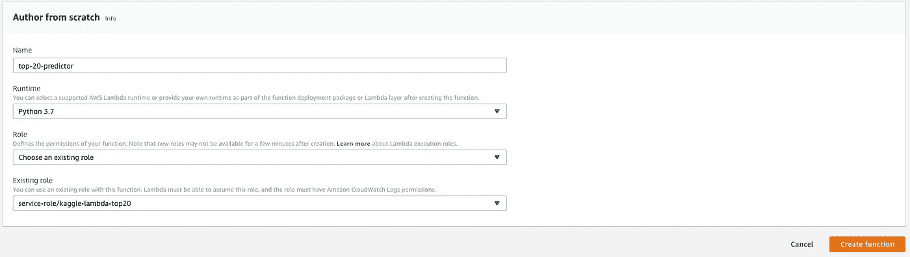
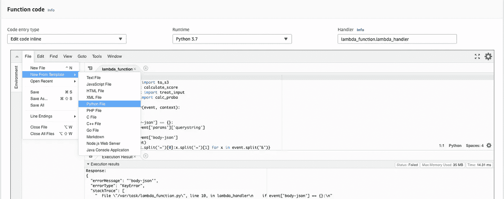
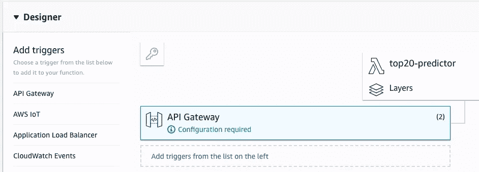
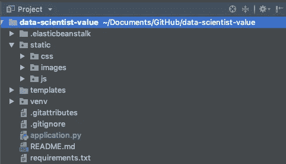
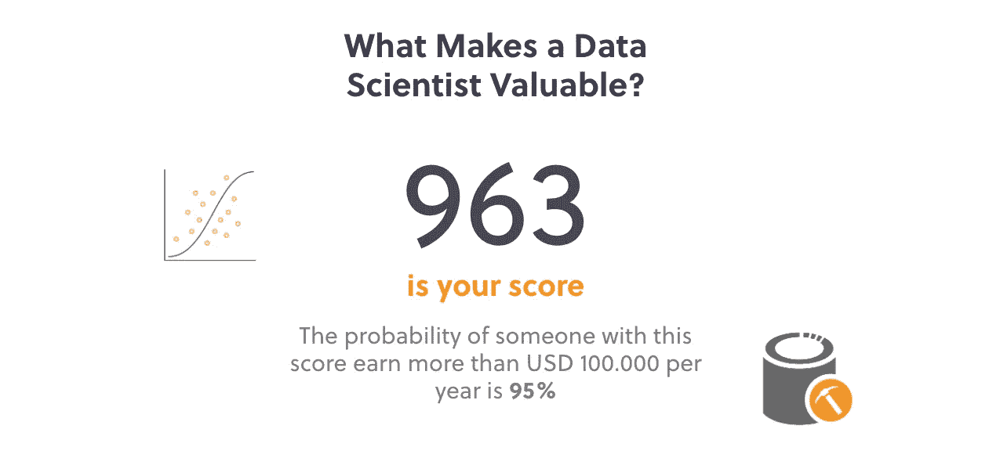

# 部署 Web 应用程序+ ML 模型+API—教程

> 原文：<https://towardsdatascience.com/simple-deployment-of-web-app-ml-model-apis-tutorial-2ece8e66d98c?source=collection_archive---------9----------------------->

## 了解如何部署由逻辑回归模型提供服务的 web 应用程序。我们将创建一个应用程序来预测数据科学家年收入超过 10 万美元的概率。

如果不投入生产，创造一个 ML 模型有什么意义？计算模型的指标并将其调整到更好的性能并不是数据科学家工作的终点。你能做的远不止这些。事实上，部署一个可伸缩的模型比看起来容易得多。知道如何做到这一点，肯定会给你的简历增加很大的价值，因为大多数数据科学家不会走那么远。您可以将本教程视为成为数据科学独角兽的第一步。

# 我们在这里做什么？

我们将在 AWS Lambda 中部署一个逻辑回归模型，然后用 API Gateway 创建 API 端点。这样你就有了一个可扩展的服务模型，你只需要做一个简单的 POST 请求，它就会把预测结果返回给你。

然后，我们将构建一个带有 HTML 表单的 Flask 应用程序，以获取一些答案来填充我们的模型。该应用程序向我们的 API 发出请求，将用户重定向到另一个页面，并在其上展示模型预测。

> 在这里，您可以访问我们在本教程中开发的工作应用程序。你爱怎么玩就怎么玩。



This is how our Flask App will look like.

# 第一:模型

这篇文章的主要目的不是开发一个模型，但是你可以自由地[查看我们在这里使用的模型是如何开发的。](https://www.kaggle.com/andresionek/what-makes-a-kaggler-valuable)这是一个简单的逻辑回归模型。要部署它，我们基本上有两种选择:

1.  将模型导出为序列化对象，加载到 AWS lambda 并开始进行预测。
2.  [参数化](https://en.wikipedia.org/wiki/Parametrization)模型，将所有系数和截距手动加载到λ。

我选择第二个选项，因为我希望模型对任何人都是透明的。应该清楚系数是什么，分数是怎么算出来的。一个系列化的模型不会让我们看到细节。

在这篇由本·韦伯撰写的[关于数据科学的文章中，你会找到关于如何向 AWS Lambda 部署序列化模型的说明。](/data-science-for-startups-model-services-2facf2dde81d)

## 参数化:那是什么鬼东西？

逻辑回归模型可以写成这样:

```
log-odds = b0 + b1x1 + b2x2 + ... + bnxn **Where**:
**b0** is the intercept
**b1,b2, bn** are the coefficients
**x1, x2, xn** are the variables
```

我们[训练我们的模型](https://www.kaggle.com/andresionek/what-makes-a-kaggler-valuable)并得到所有系数的值。所以这只是一个手工写方程的问题:将所有系数和截距相加。然后为了得到 0 到 1 之间的分数(概率),我们做:

```
scores = 1 / (1 + exp(-(b0 + b1x1 + b2x2 + ... + bnxn)))
```

# 第二:λ

登录 AWS 控制台，转到 IAM 并创建一个至少附加了这些权限策略的角色:

*   AWSLambdaFullAccess
*   亚马逊 3 完全访问
*   CloudWatchFullAccess



IAM Role Permissions

然后你可以去 Lambda，点击进入“创建函数”。现在我们将定义函数的基本配置。



Choose the runtime to be Python 3.7, and the role to be the one you just created.

现在，您转到函数代码，将以下内容添加到已经创建的 lambda 函数中:

**这段代码是做什么的？**

该函数接收一个 json 作为事件参数，并将其处理为正确的格式。接下来，我们用下面将要定义的帮助函数计算分数，然后我们构建一个响应并返回它。就这么简单。

现在我们将创建一些辅助函数。转到文件>从模板新建> Python 文件:



添加以下代码，并将其保存为 normalizer.py:

创建一个新的 Python 文件，将其命名为 pre_treatment.py:

最后，我们将添加一个计算分数的函数。请注意，这里的模型系数是硬编码的。命名为 scorer.py。

搞定了。现在让我们为我们的模型创建一个 API。在设计器>添加触发器，点击 API 网关。



点击 configuration required，选择 create a new API，然后保存 lambda 函数。如果您返回到 API 网关，您应该会看到一个可用的端点。这就是你用来访问你的 API 的那个。

要测试您的 API，只需向端点发送一个 POST 请求，如下所示(用您刚刚创建的 url 替换 URL):

您应该期望得到计算的分数作为响应。大概是这样的:

```
{ “isBase64Encoded”: False, 
  “headers”: {“Content-Type”: “application/json”}, 
  “statusCode”: 200, 
  “body”: {“score”: 350}
}
```

太好了！我们刚刚创建了一个可伸缩的服务，它在给定输入的情况下运行我们的模型。现在，我们构建了一个 web 应用程序，它向我们的服务发送请求，并期望得到答案。

完整的项目有更多的功能，看看这里:

[](https://github.com/andresionek91/kaggle-top20-predictor) [## andresionek 91/ka ggle-top 20-预测器

### 预测数据科学家的年收入是否超过 10 万美元-andresionek 91/ka ggle-top 20-预测者

github.com](https://github.com/andresionek91/kaggle-top20-predictor) 

# 第三:Flask 应用

用下面的文件夹结构创建一个项目([你可以从我的 github](https://github.com/andresionek91/data-scientist-value) 中克隆它)。



有两个 HTML 页面(index.html 和 score.html)存储在模板文件夹中。所有的 css，图片和 js 都在静态文件夹中。我们对这个应用程序感兴趣。py:

将我们的应用程序部署到 beanstalk 也很简单。

1.  首先确保在文件夹中创建了 git 存储库。确保代码被提交并推送到主服务器。
2.  打开终端并运行`pip install awsebcli`来安装 Beanstalk 命令行界面
3.  然后`cd`到你的项目文件夹并运行`eb init`
4.  运行之后，您可以运行`eb create`来创建您的应用程序
5.  最后`eb open`会打开你的 app 网址

要进行额外的部署和更新:

1.  首先提交/推送代码
2.  然后运行`eb deploy`

完整烧瓶项目可从以下网址获得:

[](https://github.com/andresionek91/data-scientist-value) [## andresionek 91/数据-科学家-价值

### 计算数据科学家报酬的 Flask 应用程序-andresionek 91/data-scientist-value

github.com](https://github.com/andresionek91/data-scientist-value) 

这是一个将 ML 模型部署为服务的教程，创建一个 API，最后使用 Flask 构建一个 web 应用程序来请求我们的模型的 API。我知道这个教程可能过于简单，但是你可以通过简单的网上搜索找到大量关于每个主题的详细资料。这个想法只是为了证明这是可能的，而且并不复杂！

我希望这篇文章能帮助你找到成为更有价值的数据科学家的方法！