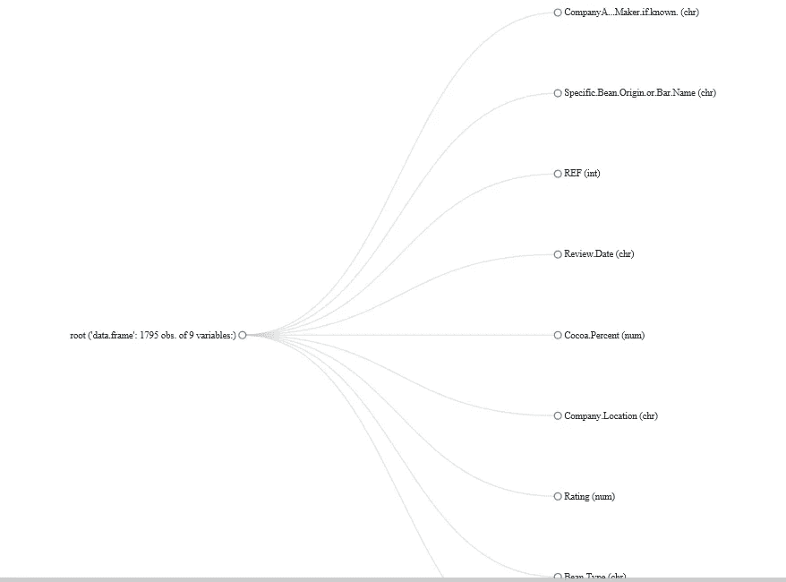
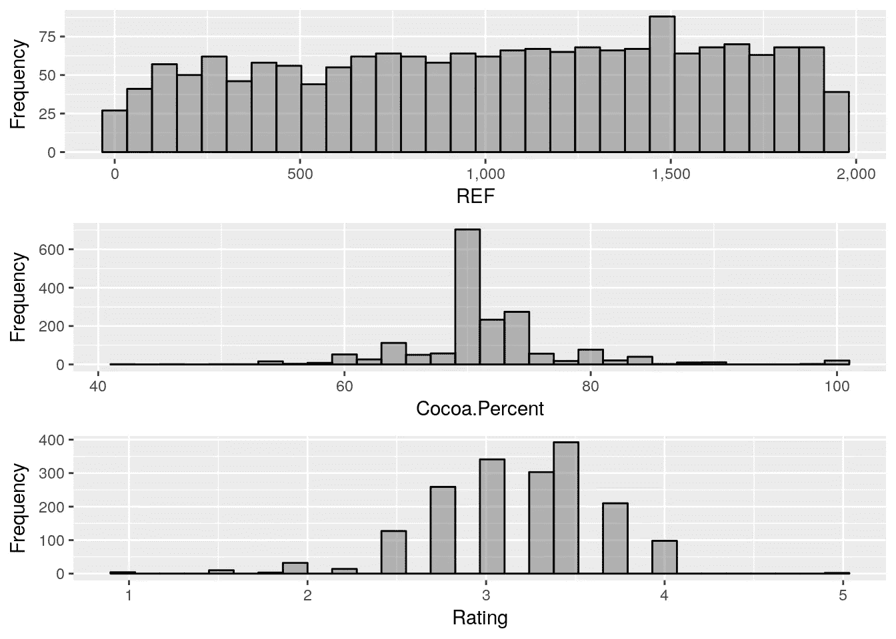
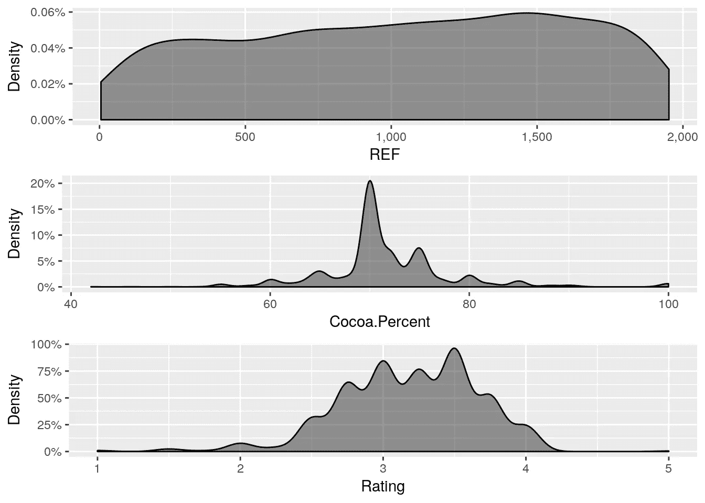
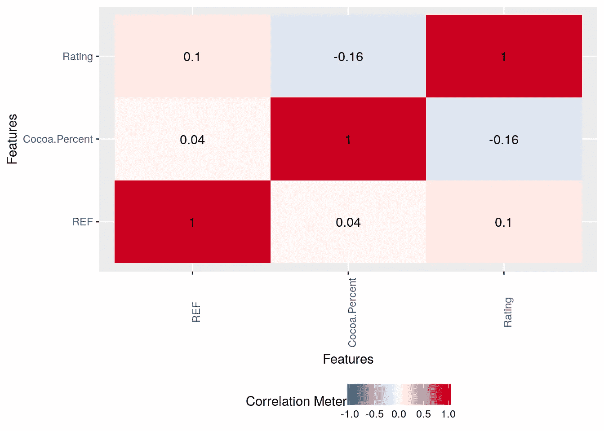
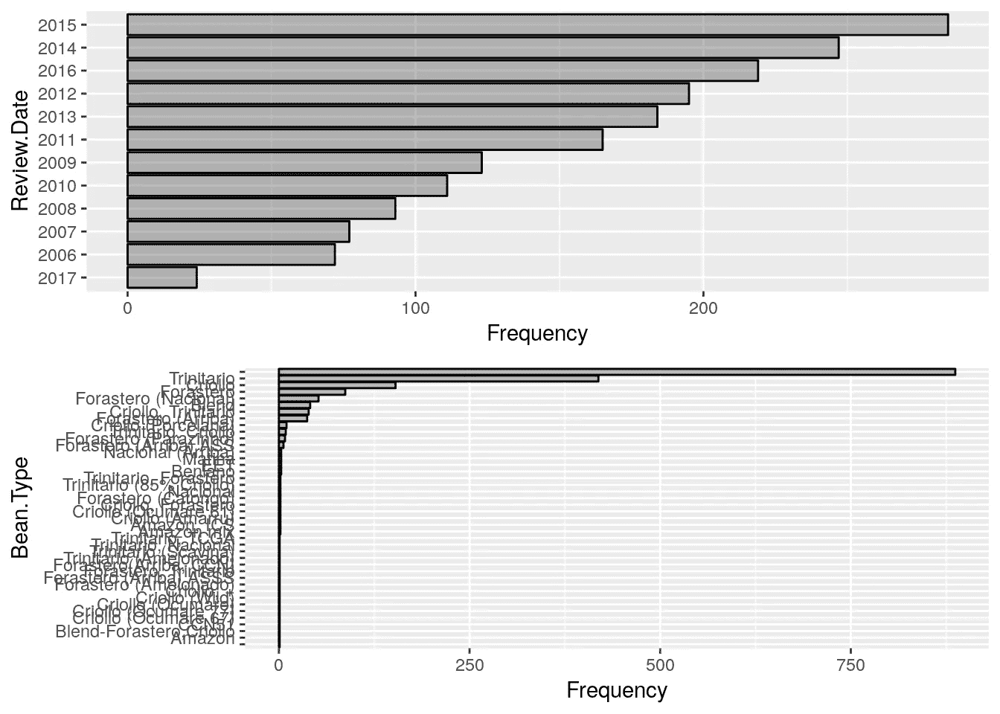

# 使用 DataExplorer 包在 R 中进行简单快速的探索性数据分析

> 原文：<https://towardsdatascience.com/simple-fast-exploratory-data-analysis-in-r-with-dataexplorer-package-e055348d9619?source=collection_archive---------0----------------------->


Image Courtesy: [https://pixabay.com/en/calculator-calculation-insurance-1680905/](https://pixabay.com/en/calculator-calculation-insurance-1680905/)

> [***订阅 1littlecode YT 频道更多 R 教程***](https://www.youtube.com/channel/UCpV_X0VrL8-jg3t6wYGS-1g?sub_confirmation=1)

探索性数据分析在整个数据科学工作流程中扮演着非常重要的角色。事实上，这占用了整个数据科学工作流程的大部分时间。有一句很好的引言(不确定是谁说的):

> “在数据科学中，80%的时间花在准备数据上，20%的时间花在抱怨需要准备数据上。”

随着 R 成为许多数据分析师的首选语言，EDA 需要一名 R 程序员将几个来自臭名昭著的`tidyverse`世界的包放到他们的 R 代码中——即使是最基本的带有一些条形图和直方图的 EDA 也是如此。

最近，我遇到了这个包 [DataExplorer](https://cran.r-project.org/web/packages/DataExplorer/index.html) ，它似乎只用一个函数`create_report()`就完成了整个 EDA(至少是典型的基本 EDA ),这个函数生成了一个很好的可呈现的 Rmarkdown html 文档。这只是一个自动生成的报告，如果您想要控制想要在其上执行 EDA 的内容，DataExplorer 为此提供了几个绘图功能。

这篇文章的目的是解释使用`DataExplorer`包在 R 中你能有多快。

# 安装和装载

让我们从加载库开始我们的 EDA:

```
#Install if the package doesn't exist 
#install.packages('DataExplorer) 
library(DataExplorer)
```

# 资料组

我们将用于此分析的数据集是发布在 Kaggle 上的[巧克力棒评分](https://www.kaggle.com/rtatman/chocolate-bar-ratings)。数据集可以在这里下载[。将输入数据集加载到 EDA 的 R 会话中:](https://www.kaggle.com/rtatman/chocolate-bar-ratings/downloads/flavors_of_cacao.csv)

```
choco = read.csv('../flavors_of_cacao.csv', header = T, stringsAsFactors = F)
```

# 数据清理

在继续之前，需要对数据类型进行一些重新格式化。比如可可。百分比应该是一个数字值，但由于%符号的存在而被读作一个字符，因此需要固定。

```
choco$Cocoa.Percent = as.numeric(gsub('%','',choco$Cocoa.Percent))
choco$Review.Date = as.character(choco$Review.Date)
```

# 变量

在 EDA 中，首先要做的是检查输入数据集的维度和变量的时间。

```
plot_str(choco)
```

给出了这个图:



这样，我们可以看到我们有一些连续变量和一些分类变量。

# 人类寻找缺失的价值

在深入分析之前，查看用于分析的输入数据是否有缺失值非常重要。

```
plot_missing(choco)
```

给出:


幸运的是，这个数据集中没有缺失值。

# 连续变量

直方图是分析师分析/表示连续变量的最好朋友。

```
plot_histogram(choco)
```

给出了这个图:



也许，你是密度图的粉丝，`DataExplorer`已经有了一个函数。

```
plot_density(choco)
```

给出了这个图:



# 多变量分析

这标志着单变量分析的结束和双变量/多变量分析的开始，从相关性分析开始。

```
plot_correlation(choco, type = 'continuous','Review.Date')
```

给出了这个图:



与相关图类似，`DataExplorer`具有绘制箱线图和散点图的功能，语法与上面类似。

# 分类变量—柱状图

到目前为止，我们已经看到了 EDA 绘图的种类，`DataExplorer`让我们为连续变量绘图，现在让我们看看我们如何能为分类变量做类似的练习。没想到，这变成了一个非常简单的功能`plot_bar()`。

```
plot_bar(choco)
```

给出了这个图:



最后，如果你只有几分钟时间(就像 maggi noodles 广告中那样，两分钟！)只要简单地使用`create_report()`就可以了，它在 html 中给出了一个非常好的可展示/可分享的渲染 markdown。

```
create_report(choco)
```

希望这篇文章能帮助您执行简单快速的 EDA，并使用典型的 EDA 元素生成可共享的报告。要了解更多关于 R 中的探索性数据分析，请查看这个 [DataCamp 课程](https://www.datacamp.com/courses/exploratory-data-analysis?tap_a=5644-dce66f&tap_s=210728-e54afe)

# 参考

[数据集](https://www.kaggle.com/rtatman/chocolate-bar-ratings/data)
[Kaggle 内核](https://www.kaggle.com/nulldata/perform-ridiculously-simple-fast-eda-in-r)
[源代码—Github](https://github.com/amrrs/fast-eda-in-R/)
[data explorer—CRAN](https://cran.r-project.org/web/packages/DataExplorer/index.html)

这篇文章最初发表在[数据科学+](https://datascienceplus.com/blazing-fast-eda-in-r-with-dataexplorer/)