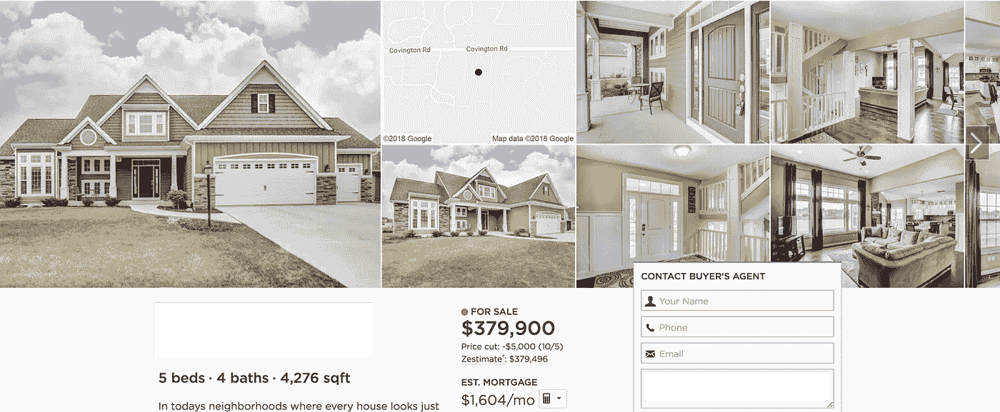
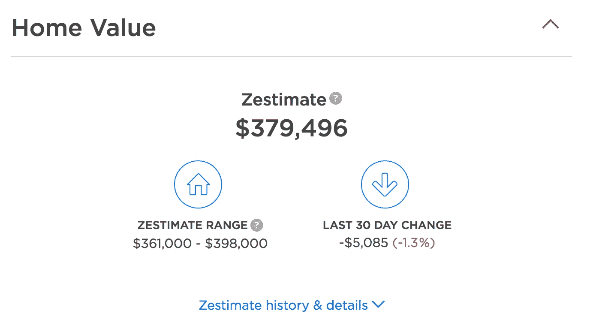
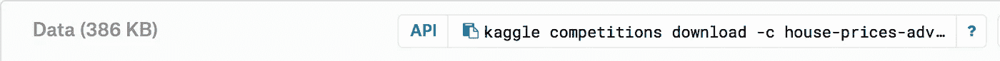
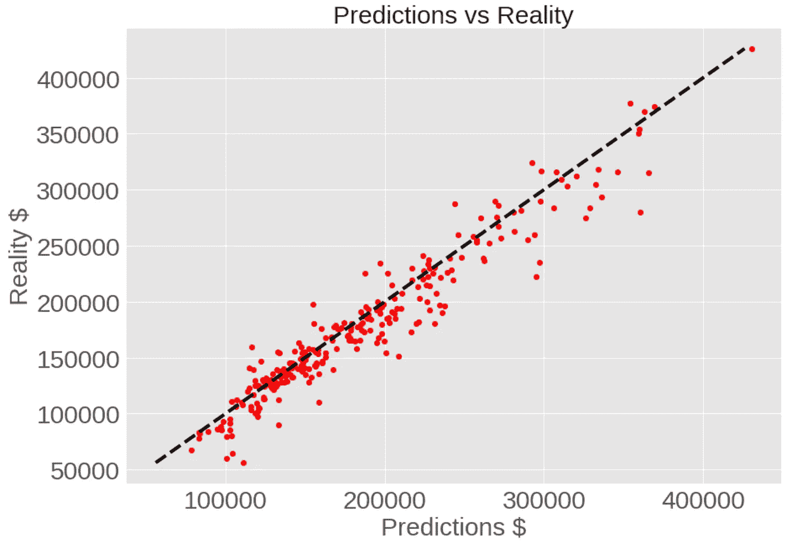

# 通过 Python 中的 TensorFlow 使用 ML 进行简单的房价预测

> 原文：<https://towardsdatascience.com/simple-house-price-predictor-using-ml-through-tensorflow-in-python-cbd2b637904b?source=collection_archive---------6----------------------->


现实职业正在进入 21 世纪，正如你可以想象的那样，房屋清单充斥着互联网。如果你曾经考虑过买房、租房，或者只是想看看城里最贵的房子是什么样的(我们都去过)，那么你很可能去过 Zillow、Realtor.com、Readfin 或 Homesnap。如果你去 Zillow 网站搜索你附近的房子，你会看到这样的列表:



这肯定是一个审美清单，像所有分类广告一样，它有一个要价；在这种情况下，379，900 美元。但是如果你继续向下滚动，你会看到一个标题为“家庭价值”的标签，展开窗口会给你一个“Zestimate”



Zestimate 是 Zillow 预测的房子的价值；这是他们最好的猜测。Zillow 给出了这个定义，“Zestimate 住宅估价是 Zillow 的估计市场价值。这不是评估。用它作为一个起点来确定一个家的价值。

但是 Zillow 是怎么把价格猜的这么准的？要价和 Zestimate 的差价只有 404 美元。但这肯定不是手动完成的，对吗？Zillow 的数据库中有超过 1.1 亿套住房(并非目前全部在市场上)，手工进行这些估算是不可行的。你可能会认为这是某种形式的算法，你可能是对的。但考虑到房屋估价的复杂性，即使是传统的算法也可能表现不佳，而且复杂得不可思议。房屋价值取决于位置、浴室数量、面积、楼层数、车库、游泳池、邻近价值等。我想你明白了。这就是本文主题发挥作用的地方，机器学习！

在这篇文章中，我将带你使用 python 中的神经网络构建一个简单的房价预测工具。喝杯咖啡，打开一个新的 Google Colab 笔记本，让我们开始吧！

# 步骤 1:选择模型

在我们开始告诉计算机做什么之前，我们需要决定我们将使用什么样的模型。我们需要首先问自己目标是什么。在这种情况下，我们有一些关于房子的输入(位置、浴室数量、条件等)，我们需要产生一个输出:价格。这是一个数字输出，这意味着我们可以在一个连续的尺度上表达它(稍后会详细介绍)。给定这些参数，我们可以选择利用神经网络来执行回归。谷歌机器学习框架 Tensorflow 是一个很好的基础，可以在其上建立这样一个模型。

如果你不熟悉神经网络是如何工作的，这将有助于理解这里发生的事情，简单地谷歌一下或找到一个 YouTube 视频，有一个很好的资源。

# **第二步:收集数据**

我们将要使用的数据集来自 Kaggle.com。如果你不熟悉 Kaggle，这是一个很好的机会去那里看看！本质上，它是一个存放数据科学应用数据集以及举办竞赛(通常有可观的现金奖励)的网站。事实上，Zillow 举办了一场比赛来帮助改进 Zestimate。当我告诉你奖金是 120 万美元时，我不是在开玩笑。有一天…

无论如何，去 Kaggle.com 创建一个账户，只需要几秒钟，而且是免费的。找到“编辑配置文件”并向下导航到“创建新的 API 令牌”这将创建一个名为“kaggle.json”的文件，您可以下载该文件。这是一个包含你的用户名和 API 密匙的文件，所以不要把它给任何人，也不要编辑它的内容(如果你不小心丢失了它或者改变了它，你可以让旧的过期，换一个新的)。

导航到 Kaggle 的“竞争”标签，搜索“房价:高级回归技术”您将看到有一个“Data”选项卡，我们将从这里提取数据。

旁注:你需要接受与比赛相关的条款和条件来下载数据，但这并不需要参与比赛，不用担心。

现在我们有了得到这个面包所需要的一切…我指的是数据。

# **第三步:建立模型**

我们将要构建这个模型的环境是 Google Colab，一个免费的在线 python 笔记本环境。在浏览器中输入 colab.research.google.com，开始一个新的 Python 3 笔记本。

对于以前没有使用过笔记本的人来说，在移动下一个单元格之前，您可以通过点击 run 来编译每个单元格。

让我们从安装和导入依赖项开始:

```
import tensorflow as tf
import pandas as pd
import numpy as np
import matplotlib.pyplot as plt
from sklearn.preprocessing import MinMaxScaler
```

Tensorflow 是我们将使用的机器学习框架，pandas 将作为我们的数据框架，numpy 将协助数据操作，matplotlib 是我们的数据可视化工具，sklearn 将为我们提供一种扩展数据的方法。

下一个命令将安装 Kaggle API，我们将结合 kaggle.json 文件使用它来将数据直接导入到环境中。

```
!pip install kaggle
```

下一行使用内置的 Colab 文件工具，它允许我们将“kaggle.json”上传到笔记本。只需执行下面的命令，并使用出现的按钮上传文件。

```
from google.colab import files
files.upload()
```

Kaggle API 需要该文件位于特定的位置，以便进行身份验证。这次就相信我吧。执行此命令创建目录并放置文件。

```
!mkdir -p ~/.kaggle
!cp kaggle.json ~/.kaggle/!chmod 600 ~/.kaggle/kaggle.json
```

现在我们已经准备好使用 API 导入数据了！转到 Kaggle 竞赛页面上的数据选项卡并按下以下按钮，这会将您需要的特定命令直接复制到您的剪贴板:



当然，你可以复制下面的代码，但这是你从不同的数据集/比赛中获取数据的方式。重要提示:您需要放置“！”在 Colab 中的命令前面，如果您在本地运行，就不需要这样做。

```
!kaggle competitions download -c house-prices-advanced-regression-techniques
```

如果您运行该行并收到“错误 403:禁止”，那么您可能不接受 Kaggle 竞争的条款和条件。

执行以下命令，查看当前目录中文件的名称(我们刚刚下载的内容):

```
!ls
```

现在来看一大段代码。下一个单元格正在读取。csv 文件并构建一个数据框架来存放它们。我们可以使用这个数据框架与我们的数据进行交互。这段代码获取数据帧，删除这里不需要的“Id”列，然后将数据分成两个独立的数据帧:一个用于分类值，另一个用于连续值。

```
#Build the dataframe for train data
train=pd.read_csv('train.csv',encoding='utf-8')
train.drop(['Id'], axis=1)
train_numerical = train.select_dtypes(exclude=['object'])
train_numerical.fillna(0,inplace = True)
train_categoric = train.select_dtypes(include=['object'])
train_categoric.fillna('NONE',inplace = True)
train = train_numerical.merge(train_categoric, left_index = True, right_index = True)
```

那么，我们为什么要将数据分成数字列和分类列呢？这是因为它们是两种不同的数据类型。一个由连续谱上的数字数据组成，另一个包含与类别相关联的字符串。我们需要区别对待他们。

附注:如果您想查看数据帧的内容以帮助可视化，只需调用 head()函数，如下所示。

```
train.head()
```

运行以下命令来隔离异常变量。Sklearn 将帮助我们去除数据中的异常值。这将使那些更准确地代表非异常情况的数据点的学习过程更容易。

```
from sklearn.ensemble import IsolationForestclf = IsolationForest(max_samples = 100, random_state = 42)
clf.fit(train_numerical)
y_noano = clf.predict(train_numerical)
y_noano = pd.DataFrame(y_noano, columns = ['Top'])
y_noano[y_noano['Top'] == 1].index.valuestrain_numerical = train_numerical.iloc[y_noano[y_noano['Top'] == 1].index.values]
train_numerical.reset_index(drop = True, inplace = True)train_categoric = train_categoric.iloc[y_noano[y_noano['Top'] == 1].index.values]
train_categoric.reset_index(drop = True, inplace = True)train = train.iloc[y_noano[y_noano['Top'] == 1].index.values]
train.reset_index(drop = True, inplace = True)
```

下一段代码获取数据帧，将其转换为矩阵，并应用所谓的最小最大缩放器。该过程将值缩小到指定的范围，以使训练更容易。例如，从 100 到 1000 的数字列表可以转换为 0 到 1 的范围，其中 0 表示 100，1 表示 1000。

```
col_train_num = list(train_numerical.columns)
col_train_num_bis = list(train_numerical.columns)col_train_cat = list(train_categoric.columns)col_train_num_bis.remove('SalePrice')mat_train = np.matrix(train_numerical)
mat_new = np.matrix(train_numerical.drop('SalePrice',axis = 1))
mat_y = np.array(train.SalePrice)prepro_y = MinMaxScaler()
prepro_y.fit(mat_y.reshape(1314,1))prepro = MinMaxScaler()
prepro.fit(mat_train)prepro_test = MinMaxScaler()
prepro_test.fit(mat_new)train_num_scale = pd.DataFrame(prepro.transform(mat_train),columns = col_train_num)
train[col_train_num] = pd.DataFrame(prepro.transform(mat_train),columns = col_train_num)
```

下面的代码将把分类特征散列成我们的模型可以理解的数字输入。哈希是另一篇文章的主题，如果你感兴趣，可以在谷歌上搜索一下。

```
from sklearn.model_selection import train_test_split
from sklearn.preprocessing import MinMaxScaler
COLUMNS = col_train_num
FEATURES = col_train_num_bis
LABEL = "SalePrice"FEATURES_CAT = col_train_catengineered_features = []for continuous_feature in FEATURES:
    engineered_features.append(
        tf.contrib.layers.real_valued_column(continuous_feature))for categorical_feature in FEATURES_CAT:
    sparse_column = tf.contrib.layers.sparse_column_with_hash_bucket(
        categorical_feature, hash_bucket_size=1000)engineered_features.append(tf.contrib.layers.embedding_column(sparse_id_column=sparse_column, dimension=16,combiner="sum"))
```

现在，我们将隔离输入和输出变量，然后将它们分成测试集和训练集。创建测试序列时要使用的经验法则是 80%测试和 20%训练，我已经在下面完成了(test_size=0.2)。这里的结果是测试和训练的输入和输出集

```
# Build the training set and the prediction set
training_set = train[FEATURES + FEATURES_CAT]
prediction_set = train.SalePrice# Split the train and prediction sets into test train sets
x_train, x_test, y_train, y_test = train_test_split(training_set[FEATURES + FEATURES_CAT] ,
                                                    prediction_set, test_size=0.2, random_state=42)
y_train = pd.DataFrame(y_train, columns = [LABEL])
training_set = pd.DataFrame(x_train, columns = FEATURES + FEATURES_CAT).merge(y_train, left_index = True, right_index = True)y_test = pd.DataFrame(y_test, columns = [LABEL])
testing_set = pd.DataFrame(x_test, columns = FEATURES + FEATURES_CAT).merge(y_test, left_index = True, right_index = True)
```

现在，我们可以将连续和分类特征重新组合在一起，然后通过调用 DNNRegressor 函数并传入特征、隐藏层和所需的激活函数来构建模型框架。这里我们使用了三层，每层的节点数量都在减少。激活函数是“relu”但是尝试使用“leaky relu”或者“tanh”看看你是否得到更好的结果！

```
training_set[FEATURES_CAT] = training_set[FEATURES_CAT].applymap(str)
testing_set[FEATURES_CAT] = testing_set[FEATURES_CAT].applymap(str)def input_fn_new(data_set, training = True):
    continuous_cols = {k: tf.constant(data_set[k].values) for k in FEATURES}

    categorical_cols = {k: tf.SparseTensor(
        indices=[[i, 0] for i in range(data_set[k].size)], values = data_set[k].values, dense_shape = [data_set[k].size, 1]) for k in FEATURES_CAT}# Combines the dictionaries of the categorical and continuous features
    feature_cols = dict(list(continuous_cols.items()) + list(categorical_cols.items()))

    if training == True:
        # Converts the label column into a constant Tensor.
        label = tf.constant(data_set[LABEL].values)# Outputs the feature columns and labels
        return feature_cols, label

    return feature_cols# Builds the Model Framework
regressor = tf.contrib.learn.DNNRegressor(feature_columns = engineered_features, 
                                          activation_fn = tf.nn.relu, hidden_units=[250, 100, 50])categorical_cols = {k: tf.SparseTensor(indices=[[i, 0] for i in range(training_set[k].size)], values = training_set[k].values, dense_shape = [training_set[k].size, 1]) for k in FEATURES_CAT}
```

执行以下功能将开始训练过程！这需要几分钟的时间，所以伸个懒腰吧！

# 步骤 5:训练模型

```
regressor.fit(input_fn = lambda: input_fn_new(training_set) , steps=10000)
```

让我们把结果可视化吧！这段代码将导入我们的数据可视化工具，计算预测值，获取实际值，然后将它们绘制成图表。

# 步骤 6:评估模型并可视化结果

```
import matplotlib.pyplot as plt
import matplotlibev = regressor.evaluate(input_fn=lambda: input_fn_new(testing_set, training = True), steps=1)
loss_score = ev["loss"]
print("Final Loss on the testing set: {0:f}".format(loss_score))import matplotlib.pyplot as plt
import matplotlib
import itertoolsev = regressor.evaluate(input_fn=lambda: input_fn_new(testing_set, training = True), steps=1)
loss_score = ev["loss"]
print("Final Loss on the testing set: {0:f}".format(loss_score))
reality = pd.DataFrame(prepro.inverse_transform(testing_set.select_dtypes(exclude=['object'])), columns = [COLUMNS]).SalePricey = regressor.predict(input_fn=lambda: input_fn_new(testing_set))
predictions = list(itertools.islice(y, testing_set.shape[0]))
predictions = pd.DataFrame(prepro_y.inverse_transform(np.array(predictions).reshape(263,1)))matplotlib.rc('xtick', labelsize=30) 
matplotlib.rc('ytick', labelsize=30)fig, ax = plt.subplots(figsize=(15, 12))
plt.style.use('ggplot')
plt.plot(predictions.values, reality.values, 'ro')
plt.xlabel('Predictions', fontsize = 30)
plt.ylabel('Reality', fontsize = 30)
plt.title('Predictions x Reality on dataset Test', fontsize = 30)
ax.plot([reality.min(), reality.max()], [reality.min(), reality.max()], 'k--', lw=4)
plt.show()
```



还不错！要获得更好的结果，请尝试更改激活函数、层数或层的大小。或许完全使用另一种模式。这不是一个庞大的数据集，所以我们受到信息量的限制，但这些技术和原理可以转移到更大的数据集或更复杂的问题上。

如有任何疑问、意见、担忧或建议，请随时联系我。

我也想给朱利安·海杜克大声喊出来，他的模型是。点击这里查看他的视频:[https://www.kaggle.com/zoupet](https://www.kaggle.com/zoupet)