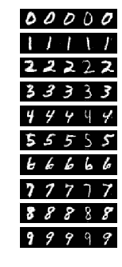
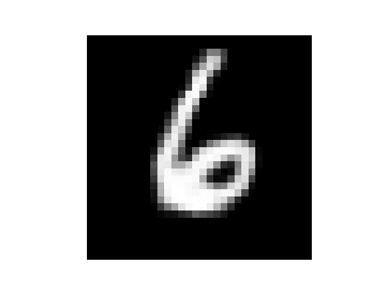

# 简单介绍使用 TorchFusion 和 PyTorch 的条件性 GANs

> 原文：<https://towardsdatascience.com/simple-intro-to-conditional-gans-with-torchfusion-and-pytorch-404264a3267c?source=collection_archive---------8----------------------->

人类非常善于认识事物，也非常善于创造新事物。长期以来，我们一直致力于教计算机模仿人类识别事物的能力，但创造新事物的能力长期以来一直未能被人工智能系统所掌握。直到 2014 年，Ian Goodfellow 发明了生成式对抗网络。在这篇文章中，我们将对生成对抗性网络进行一个基本的概述，并且我们将使用它们来生成特定数字的图像。

# **生成性对抗网络概述**

想象一下，你是一名艺术家，正试图画一幅非常逼真的奥巴马画像，让法官误以为这幅画是真的。你第一次这样做，法官很容易发现你的照片是假的，然后你一次又一次地尝试，直到法官被愚弄，认为照片是真的。生成敌对网络是这样工作的，它由两个模型组成，

***绘制图像的生成器*** 和试图区分真实图像和由鉴别器绘制的图像的 ***鉴别器*** 。

从某种意义上说，两者是相互竞争的，生成器被训练来愚弄鉴别器，而鉴别器被训练来正确区分哪些图像是真实的，哪些是生成的。最终，生成器将变得如此完美，以至于鉴别器将无法区分真实图像和生成的图像。

下面是由 GAN 发生器创建的样本。


Source: Karras et al, 2017 ([http://arxiv.org/abs/1710.10196](http://arxiv.org/abs/1710.10196/))

GANs 分为两大类，无条件 GANs 随机生成任意类图像，有条件 GANs 生成特定类图像。在本教程中，我们将使用条件 gan，因为它们允许我们指定我们想要生成的内容。

# **工具设置**

训练 GANs 通常很复杂，但多亏了 Torchfusion，一个建立在 PyTorch 基础上的研究框架，这个过程将会超级简单和直接。

## 通过 PyPi 安装火炬融合

```
pip3 install torchfusion
```

## 安装 PyTorch

如果你还没有安装 torchfusion，去[pytorch.org](https://pytorch.org)下载 PyTorch 的最新安装文件。

现在您已经完全设置好了！

接下来，导入几个类。

定义发生器网络和鉴别器

在上面，我们指定要生成的图像的分辨率为 1 x 32 x 32。

为生成器和鉴别器模型设置优化器

现在我们需要加载一个数据集，我们将尝试从中抽取样本。在这种情况下，我们将使用 MNIST。

下面我们创建一个学习者，torchfusion 有各种各样的学习者，他们高度专业化，用于不同的目的。

现在，我们可以调用训练函数来训练这两个模型

通过将 save_outputs_interval 指定为 500，学习者将在每 500 次批量迭代后显示示例生成的输出。

这是完整的代码

仅经过 20 个时期的训练，就生成了下图:



现在到了最激动人心的部分，使用你训练过的模型，你可以很容易地生成特定数字的新图像。

在下面的代码中，我们生成了数字 6 的新图像，您可以指定 0-9 之间的任何数字

结果:



生成对抗网络是一个令人兴奋的研究领域，torchfusion 通过最佳 GAN 算法的优化实现使它变得非常简单。

火炬融合由我和摩西·奥拉芬瓦(I and Moses Olafenwa)开发和维护，这是我们努力实现人工智能民主化并让地球上每个人和组织都可以使用它的一部分。

火炬传递的官方回购是 https://github.com/johnolafenwa/TorchFusion

火炬融合的教程和文档可以从[https://torch fusion . readthedocs . io](https://torchfusion.readthedocs.io)获得

你可以随时在推特上通过 [@johnolafenwa](https://twitter.com/johnolafenwa) 联系我