# 线性回归

> 原文：<https://towardsdatascience.com/simple-linear-regression-2421076a5892?source=collection_archive---------2----------------------->

"正确问题的近似答案比近似问题的精确答案更有价值。"约翰·图基

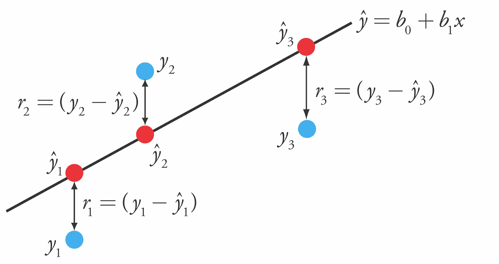

**线性回归**是一种线性方法，用于模拟标量因变量 *y* 和一个或多个独立变量*x*之间的关系，与[逻辑回归](https://medium.com/@paragradke/logistic-regression-2b555e5f80e6)不同，这里的因变量可以取连续的值范围。使用称为**线性假设**的线性预测函数对关系进行建模，其未知模型参数根据数据进行估计。让我们从一个线性假设开始。

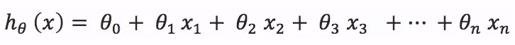

**其中**

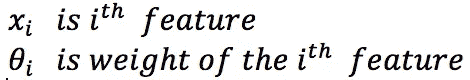

我们可以用如下简洁的符号来表示。

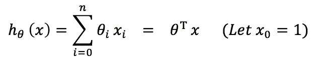

上述等式表明，给定新的输入特征向量 ***x*** ，输出的预测值将由假设 ***h*** 给出。所以预测的准确性取决于输入特征的 ***权重。***

如果我们用大小为 m 的向量*来表示 ***m*** 训练示例的实际输出值，一种合理的方式是使用训练集来使*的值接近于*y .*我们将的实际差值定义为 ***代价函数*******

**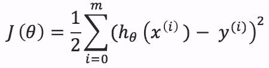**

**所以现在这个等式变成了寻找 ***权重*** 对于哪个 ***代价函数 J*** 最小。**

**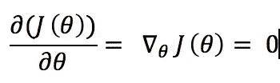**

**让**

**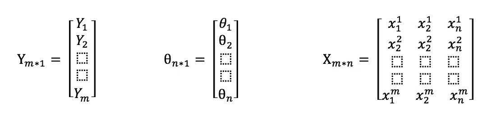**

**其中
**Y** :为 **m 个训练样本的输出向量。
X** :是大小为 **m*n** 的矩阵，其中每第 I 行属于第 I 个训练集。
**Q** :为 **n** 训练特征的大小为 n 的权重向量。
所以**

**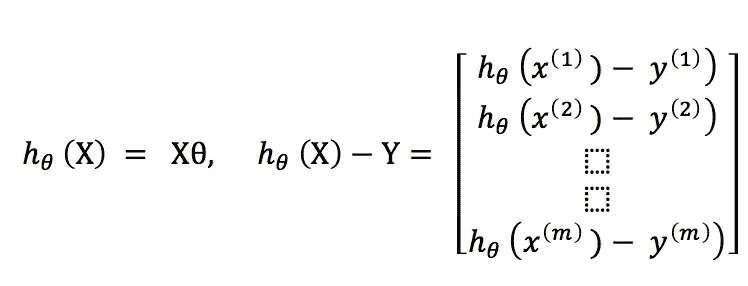**

**和**

**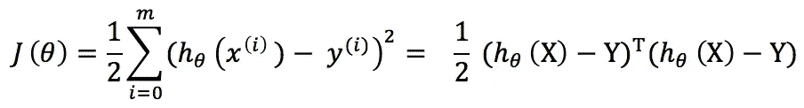****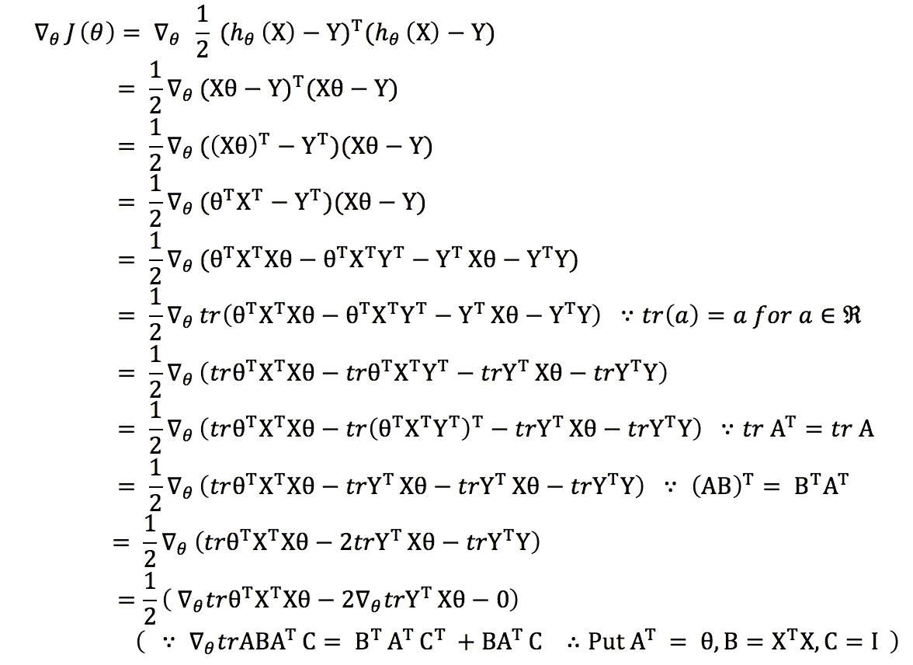****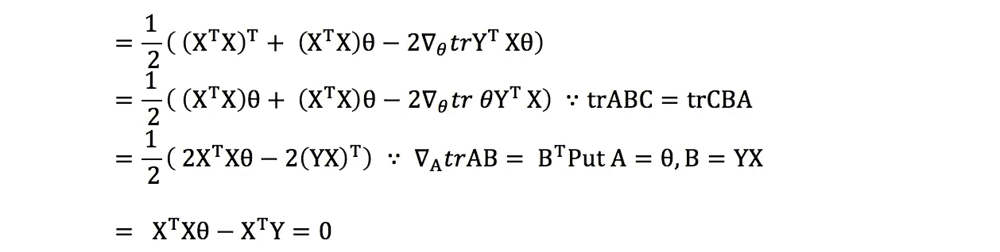**

**这导致了**

**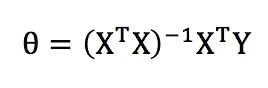**

****示例:** 给定训练集[此处](http://college.cengage.com/mathematics/brase/understandable_statistics/7e/students/datasets/slr/frames/slr06.html)
X =索赔数量
Y =所有索赔的总支付金额，单位为千瑞典克朗**

**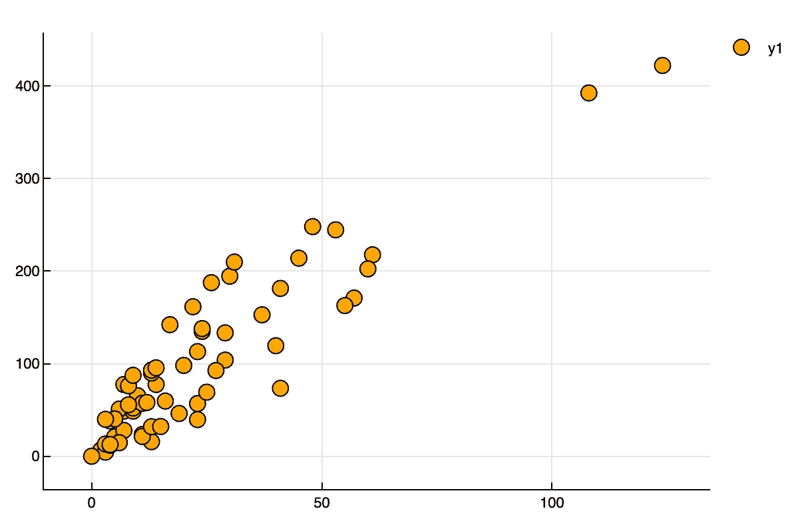**

**Plot of Y w.r.t. X.**

**以上将解决**

**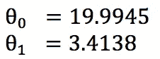**

**最后，这个模型将会是**

**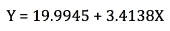****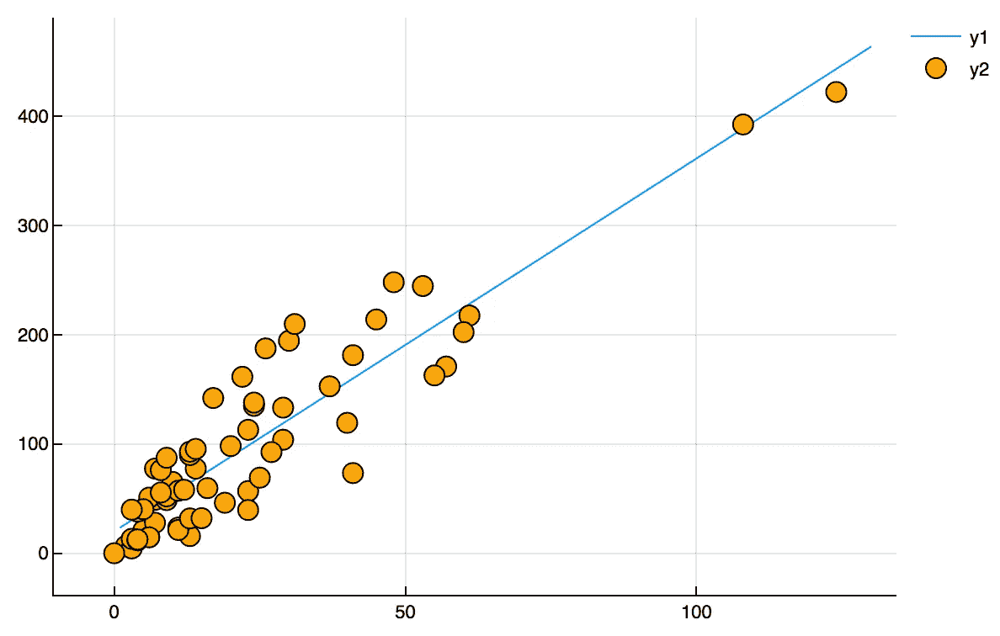**

**The plot of data along with model fitting the data.**