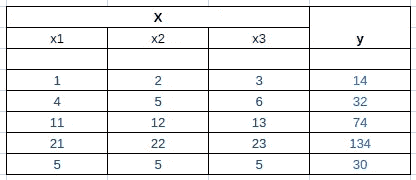
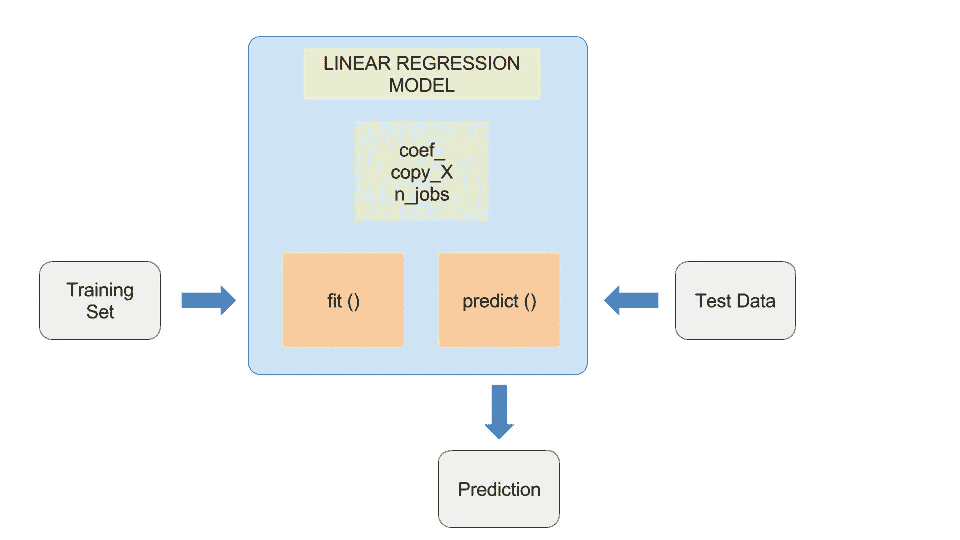

# 用 Python 编写的简单机器学习模型，只有 5 行代码

> 原文：<https://towardsdatascience.com/simple-machine-learning-model-in-python-in-5-lines-of-code-fe03d72e78c6?source=collection_archive---------0----------------------->

在这篇博客中，我们将训练一个线性回归模型，并期望在新的输入上执行正确。

> 任何机器学习模型的基本思想是，它暴露于大量的输入，并且还提供适用于它们的输出。通过分析越来越多的数据，它试图找出输入和结果之间的关系。

考虑一个非常原始的例子，当你必须根据天气决定是否穿夹克时。你可以访问我们称之为的**训练数据**

```
+---------------------+---------------+
| Outside Temperature | Wear a Jacket |
+---------------------+---------------+
| 30°C                | No            |
| 25°C                | No            |
| 20°C                | No            |
| 15°C                | Yes           |
| 10°C                | Yes           |
+---------------------+---------------+
```

不知何故，你的大脑找到了输入(温度)和输出(决定穿夹克)之间的联系。

因此，如果温度是 12 摄氏度，你仍然会穿夹克，尽管你从来没有被告知这一特定温度的结果。

现在，让我们转到一个稍微好一点的代数问题，这个问题将由计算机来解决。

在我们开始之前，不要忘记安装 [scikit-learn](http://scikit-learn.org) ，它提供了易于使用的功能和预定义的模型，节省了大量时间

```
pip install scikit-learn
```

# **样本训练集**

这里，X 是输入，y 是输出。



给定训练集，您很容易猜到输出(y)是(x1 + 2*x2 + 3*x3)。

# 如何生成训练集

# ML 模型-线性回归

使用线性回归模型很简单。创建一个模型，训练它，然后使用它:)



# 训练模型

我们已经准备好了训练集，所以创建一个线性回归模型，并将训练数据传递给它。

# **测试数据**

> X = [[10，20，30]]

结果应该是 10 + 20*2 + 30*3 = 140。让我们看看我们得到了什么…

> 结局:【140。]
> 系数:[ 1。2.3.]

你注意到刚才发生了什么吗？该模型可以访问训练数据，通过这些数据计算分配给输入的权重，以达到期望的输出。在给出测试数据时，它成功地得到了正确的答案！

如果你想更深入地研究机器学习，使用 Python 我更喜欢从这本书开始。

[](http://shop.oreilly.com/product/0636920030515.do?sortby=publicationDate) [## Python 机器学习简介

### 机器学习已经成为许多商业应用和研究项目不可或缺的一部分，但这个领域是…

shop.oreilly.com](http://shop.oreilly.com/product/0636920030515.do?sortby=publicationDate) 

我也做了很多实验，修补代码。在我尝试公开 scikit 的功能的地方，可以随意使用 ML 原型。如果你觉得这篇文章有趣，别忘了鼓掌。