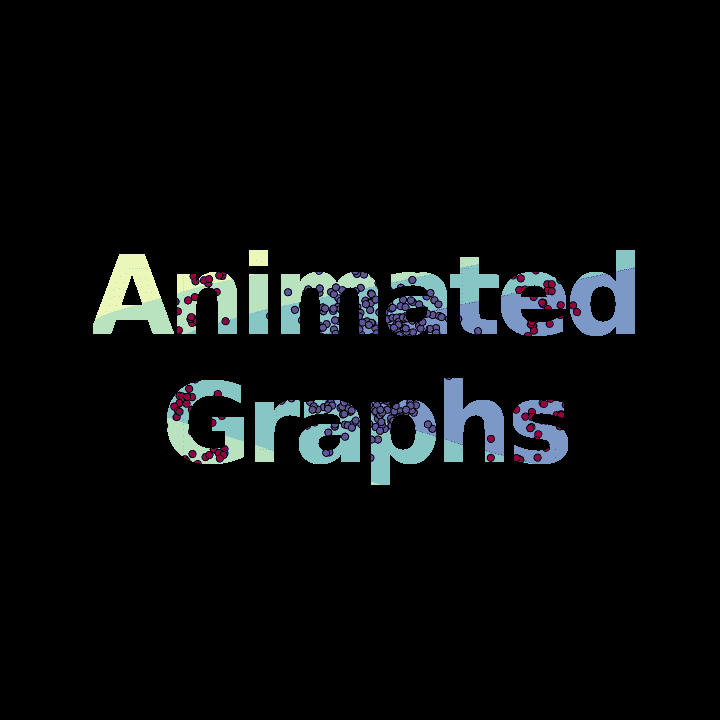
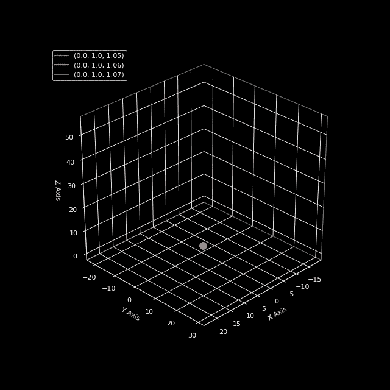
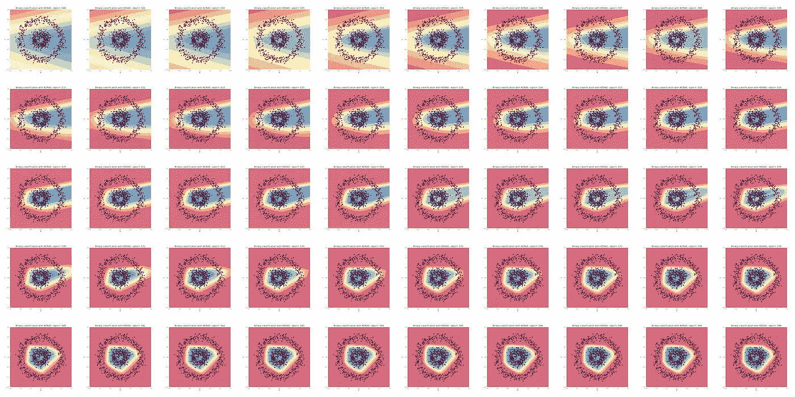

# 创建动画图形的简单方法

> 原文：<https://towardsdatascience.com/simple-method-of-creating-animated-graphs-127c11f58cc5?source=collection_archive---------6----------------------->

## **数据科学工具包**

# 介绍

答在我最近的一篇[文章](/https-medium-com-piotr-skalski92-deep-dive-into-deep-networks-math-17660bc376ba)发表后，许多人向我询问如何用 Python 制作动画图表的技巧。事实上，经常会出现静态图表已经不够用的情况，为了说明我们正在处理的问题，我们需要更强大的工具。当然，有许多库允许我们制作动画，有时甚至是交互式图形，比如 Bokeh、Pygal 或我个人最喜欢的 Plotly。然而，这一次我们将采用传统的方法——我将向您展示如何仅使用“简单的”Matplotlib 和一些命令行技巧来创建令人印象深刻的图表。在文章中，我将只放置代码中最重要的部分。但是在我的 [GitHub](https://github.com/SkalskiP/ILearnDeepLearning.py) 上，你可以找到用来创建可视化展示的完整笔记本。

Figure 1\. Gradient descent visualization coming from my previous [article](/https-medium-com-piotr-skalski92-deep-dive-into-deep-networks-math-17660bc376ba)

# Matplotlib 动画 API

寻找我可以在这篇文章中使用的有趣的例子，我决定说明洛伦兹吸引子。其优雅的形式和独特的属性使其成为创造引人注目的视觉效果的绝佳材料。洛伦兹吸引子以对几乎相同的初始条件产生完全不同的结果而闻名。让我们尝试使用 Matplotlib 库中的专用动画 API 来可视化这个属性。我们将在三维空间中创建三个独立的轨迹，并呈现它们在不同时间点的行为。首先，当然，我们必须导入所有必要的依赖项。

将帮助我们执行动画的类是`FuncAnimation` ( [链接](https://matplotlib.org/api/_as_gen/matplotlib.animation.FuncAnimation.html#matplotlib.animation.FuncAnimation))。然而，为了使用它，我们首先必须准备一个基本的空图表和一个函数，该函数将在每次迭代中执行，以更新当前帧中呈现的数据。在我的例子中，创建和样式化图表的过程被提取到一个单独的辅助函数中— `create_blank_chart_with_styling`，您可以在完整的笔记本中查看它的细节。在其他事情中，它负责选择背景颜色，调用轴或缩放它们。创建图表后，我们还定义(目前为空)数据序列，用符号表示相应的轨迹。

我们动画的核心是图表更新功能，它将当前渲染帧的索引作为参数，并确保在图表上显示一组适当的数据。在版本中，我在每一帧中使用 Matplotlib，获取一个我们在构造函数中提供的干净的图形，并将当前选择的数据添加到其中。这意味着在每一帧中，我必须添加我想要显示的所有元素。顺便说一句，值得注意的是，该库还包含另一种模式，即在上一次迭代中获得的图中添加更多元素。

Figure 2\. Lorenz Attractor created using the Matplotlib animation API

最后，我们创建一个`FuncAnimation`类的实例，给出参数:初始图形、更新函数、帧数以及它们应该改变的时间间隔。我们现在可以选择输出文件格式和我们的动画质量。我们工作的结果可以在图 2 中看到。

# 让我们阅读神经网络思想

M atplotlib 动画 API 很棒，但我经常选择将单独的帧渲染为 png 图像，然后使用 [ImageMagick](https://www.imagemagick.org/script/index.php) 将它们组合成一个移动的 gif 这是一个在 Linux、Mac 以及 Windows 上可用的非常有用的工具。我这样做是因为创建一个更新图表的函数并不总是那么明显和方便——例如，当我们想要可视化我们的神经网络的学习过程时，使用 [Keras](https://keras.io/) 进行训练。

Figure 3\. Fages obtained in successive epochs of neural network learning process.

由于使用了`keras.callbacks.LambdaCallback` ( [link](https://keras.io/callbacks/#lambdacallback) )，我们可以在每次迭代后访问我们的模型，收集所有必要的数据并进行可视化。我们所要做的就是将我们的渲染方法作为`.fit()`方法的一个参数来传递。我为完成这项任务而创建的函数如下所示。

假设我们已经定义了模型的架构(参见如何做)，我们现在可以开始训练了。让我们不要忘记添加我们的回调。我们可以这样做。

结果，在每个时期，我们未来动画的一个单独的帧被创建。获得的所有图像在图 3 中并排显示。现在我们唯一要做的就是将它们相互结合，创造出流畅的动画。幸运的是，使用 ImageMagic，我们只需要一个命令。

Figure 4\. Visualization showing the boundaries of classification during the neural network learning process.

# 结论

我希望我的提示和例子对你有所帮助，你会在工作中、在大学里或者在下一篇关于媒体的文章中用到它们。你需要的只是一点创造力和一些空闲时间。如果你喜欢这篇文章，分享出来，在 [Twitter](https://twitter.com/PiotrSkalski92) 和 [Medium](https://medium.com/@piotr.skalski92) 上关注我，在 [GitHub](https://github.com/SkalskiP) 和 [Kaggle](https://www.kaggle.com/skalskip) 上查看我正在做的其他项目。保持好奇！

