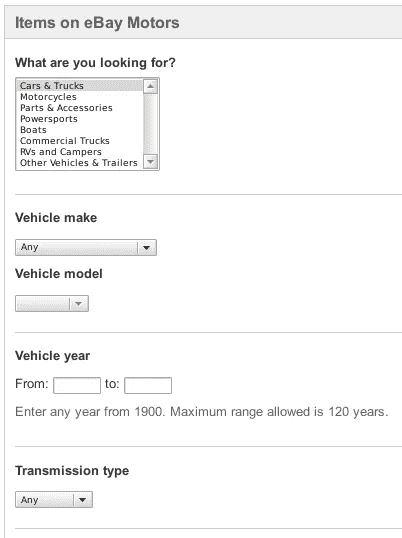
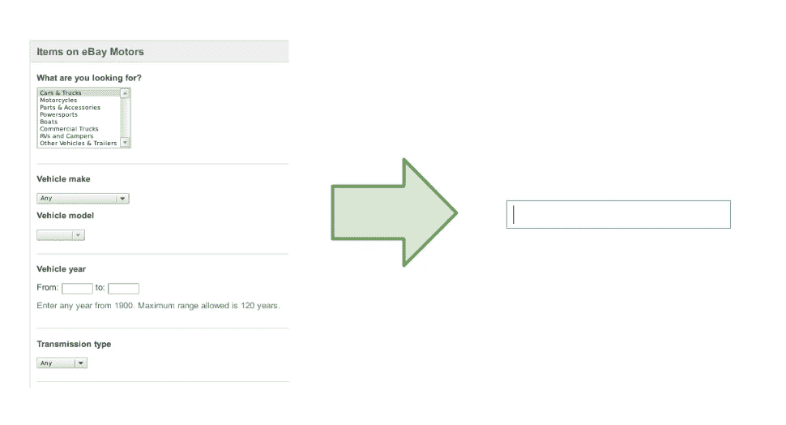

# 应用中的简单 NLP 搜索 Scala 中的逐步指南

> 原文：<https://towardsdatascience.com/simple-nlp-search-in-your-application-step-by-step-guide-in-scala-22ca1ce3e475?source=collection_archive---------1----------------------->

全文搜索很容易使用。但是自然语言固有的模糊性导致搜索结果存在误报。为了获得更准确的结果，我们需要改变方法，向搜索引擎提供更多特定领域的数据。

改善搜索结果最常见和最容易的方法是引入过滤器，即多个输入字段(文本字段、单选按钮等)。)以属性命名。这样我们就知道如何构造查询，然后返回特定的结果。结合一些近似的字符串匹配算法，我们可以获得非常精确的搜索结果。不幸的是，过滤器需要具有多个字段的表单，代价是简单的 UX。(参见*图 1* )。

Figure 1

如果我们希望坚持使用单个文本字段，并且仍然有准确的搜索结果(见*图 2* )会怎么样？当然，人们需要使用自然语言处理(NLP)工具。但是 IT 行业的每个人都知道 NLP 很难掌握，大多数人认为这是一种高度学术化的方法。如何轻松地利用这一点来改善特定领域的搜索结果？

Figure 2

## 领域

领域的特殊性是该方法的关键部分。机器学习算法还远远没有准备好回答一般的问题。即使算法存在，它们也离我们很远。为了简单起见，我们必须缩小范围。通常，当我们需要引入一个搜索表单时，我们在某个区域内操作，即在 ebay.com 找到一辆车，我们指定车的类型、生产年份、制造商、型号等..

对于本文，让我们以电影放映的领域为例，即:电影、剧院和日期时间的元组。我们也可以假设我们知道电影院的地理位置和电影的类型。我们将通过标题(或只是流派)、影院名称(或只是地点)以及放映的日期和时间来查询电影放映，这是我们需要从用户那里收集的数据。我们想要处理的示例表达式:

*   *明天旧金山的火星人*:查询旧金山所有明天上映*火星人*的影院，
*   *下周 amc 的《归来者》*:查询 *AMC* 剧场*下周《归来者》*的所有演出，
*   *cinemark 下周三*:查询 *Cinemark* 影院下周三将上演的所有节目，
*   *6 月 11 日旧金山的戏剧*:查询旧金山所有剧院将于 6 月 11 日上演的戏剧。

所有表达式都从自然语言转换为以下形式的查询:

## 对自然语言处理的需求

很难从自然语言中提取信息。如果我们假设只有几种输入语句，如**【电影名称】****【剧院位置】【时间表情】**，那么就有可能为这种语句显式地编写解析器。但是，即使有人设法做到了这一点，这样的算法将是不可维护的。有了 NLP 工具，我们可以在不需要显式编程的情况下解决这个问题。

此外，一些语句在结构上极其相似，例如:**【电影名称】【时间表达式】**和**【剧院名称】【时间表达式】**——不可能明确区分这两种语句。NLP 工具还关心**【MOVIE _ NAME】**和**【THEATER NAME】**的结构，那么当从语句中提取信息时，它拥有比显式解析器更多的数据来做出决定。

## 解决方案的描述

对于我们的例子，我们需要的信息提取的唯一子任务叫做*命名实体识别*。正确标记了语句之后，我们就能够编写我们的*查询*。我们所说的标记是指为语句中的每个单词分配一些特定于领域的元信息，例如:

*   *明日旧金山的火星人*——**(电影 _ 名字:火星人)(介词:在)(影院 _ 地点:旧金山)(时间 _ 表情:明日)**
*   *amc 下周三*——**(剧场 _ 名称:amc)(时间 _ 表情:下周三)**

## 工具

当试图解决这个问题时，我们的第一次尝试是尝试斯坦福命名实体识别器，它给了我们惊人的结果，但不幸的是，由于 GNU GPLv2 许可，它不能用于商业。

最后，我们决定使用 ScalaNLP 套件中的 Epic 库。Epic 实现了许多 NLP 算法，但是我们遇到的缺点是缺少文档，因此它的使用远非简单明了。

## 抽样资料

为了训练命名实体识别器(NER ),我们需要为算法提供样本数据。如果我们没有任何现实生活中的数据，那么我们可能会根据可能的模式生成一些随机语句，例如:

*   [影院 _ 位置][时间 _ 表情]中的[电影 _ 名称]
*   [影院 _ 位置]中的[电影 _ 流派][时间 _ 表情]

输入的格式取决于我们使用的库。描述训练数据的学术标准 [CoNLL](http://www.cnts.ua.ac.be/conll2003/ner/) 涵盖了我们所需要的更多。幸运的是，有一种方法可以简化标记，即:

训练样本的最佳大小取决于领域的复杂性，应该根据经验进行验证。

你可以在 [GitHub](https://github.com/evojam/simple-nlp-search-dataset-generator) 查看我们如何生成样本数据的例子。

## 训练 NER

我们需要对标记语句之间的关系进行编码，然后构建一些一致的解释以供进一步重用。解决这个问题的统计工具被称为*条件随机场(CRF)*。在 *ScalaNLP* 中，有两种可用的 CRF 实现。第一个 *epic.sequences.CRF* 是普通的线性链 CRF，第二个 *epic.sequences.SemiCRF* 是半马尔可夫线性链的实现，它应该以较小的精度代价具有更好的性能。

**将输入数据加载到序列阅读器**
*ScalaNLP* 具有内置的用于 CoNLL 数据的解析器—*epic . corpora . conllsequencereader*，它接受我们在*示例数据*一节中提出的数据输入。

**应用分段函数**
我们通过将输入数据转换为*epic . sequences . segmentation【Any，String】*来训练 CRF。分段是将相同的标签组合成一行。

我们使用的分段函数:

**构建 CRF**
将输入分段后，我们可以构建 CRF:

**使用经过训练的*通用报告格式*来标记序列**

*epic . preprocess . tokenize*只是通过空格进行标记。

*分段*携带标记序列。当我们呈现一个样本表达式时，我们得到一个带有标记段的字符串:

*【电影 _ 名称:* ***火星人*** *】【介词:* ***在*** *】【剧场 _ 地点:* ***三藩*** *】【介词:* ***在*** *】【时间 _ 表情:****2016 年 6 月 11 日*唯一缺少的部分是 *TIME_EXPRESSION* s。我们需要类型 *DateTime* 的从*和*到*的显式*参数。我们可以使用 [PrettyTime::NLP](http://www.ocpsoft.org/prettytime/nlp/) 来解析显式的时间表达式，比如:*2016 年 6 月 11 日*，但是如果我们想要获得更复杂的东西，比如*下周三*或*明天*，我们应该再次使用 NLP 方法，即训练 CRF 用于时间表达式。结果相当惊人。 *crf* 一旦经过训练，马上就能发挥作用。解释的准确性将根据领域的复杂性和训练样本的大小而变化。在我们的案例中，我们对准确性感到惊讶——即使对于含糊不清的陈述, *crf* 也做得很好。****

对于 20 万条输入语句的样本量(用[simple-ner-search-dataset-generator](https://github.com/evojam/simple-nlp-search-dataset-generator)生成)，我们用 [ner-trainer](https://github.com/evojam/ner-trainer) 对 ner 进行了训练，得到如下结果:

通过安装 [ner-trainer](https://github.com/evojam/ner-trainer) 并通过调用***ner-trainer-l film-screenings.tar.gz***加载序列化的[示例](https://www.dropbox.com/s/qfezeynlcegkfni/film-screenings.tar.gz?dl=0)，您可以在互动会话中亲自检查这一点。

## 权衡

不幸的是，训练 *CRF* 非常耗时(以小时计算)。为了不浪费时间，需要序列化 *SemiCRF* 对象。序列化是以牺牲二进制兼容性为代价的。此外，SemiCRF 可能是一个相当重的物体，因此会增加额外内存的成本。

*Epic* 库不好用。文档不是很有帮助，也缺乏严肃的静态类型。即使在这个简短的例子中，我们也无法避免将*作为*的实例。

## 结论

目前可用的库很好地覆盖了问题的困难部分。权衡是可能克服的，而且其中许多相对容易解决，所以将来可能会消失。尽管如此，我们还是有可能构建非常复杂的基于自然语言处理的搜索，而不会淹没在复杂的数学中。即使是新手也应该能够在几天内实现搜索。

## 资源定位符

*   http://www.scalanlp.org/
*   斯坦福命名实体识别器:[http://nlp.stanford.edu/software/CRF-NER.shtml](http://nlp.stanford.edu/software/CRF-NER.shtml)
*   pretty time::NLP:[http://www.ocpsoft.org/prettytime/nlp/](http://www.ocpsoft.org/prettytime/nlp/)
*   https://github.com/evojam/ner-trainer[NER 培训师](https://github.com/evojam/ner-trainer)
*   电影放映数据集生成器:[https://github . com/Evo jam/simple-NLP-search-dataset-Generator](https://github.com/evojam/simple-nlp-search-dataset-generator)
*   样本[用于电影放映的序列化通用报告格式](https://drive.google.com/file/d/0ByjmxsRtyWkLMWwxT2cyamJ1WUU/view?usp=sharing)

你们所有人都觉得被邀请去使用 NER 训练器和数据集生成器在你们的领域进行测试和黑客攻击。请在评论中提供反馈，说明这种方法如何为您服务。

该帖子最初在 tech.evojam.com 发表。