# 调整深度神经网络的简单参考指南

> 原文：<https://towardsdatascience.com/simple-reference-guide-for-tuning-deep-neural-nets-e2d37d6fa933?source=collection_archive---------20----------------------->

# 入门指南

考虑到涉及到如此多的参数，设计深度神经网络可能是一项痛苦的任务，而且似乎没有通用公式适合所有的用例。我们可以使用 CNN 进行图像分类，使用 LSTMs 进行 NLP 相关的任务，但是仍然需要特征的数量、特征的大小、神经元的数量、隐藏层的数量、激活函数的选择、权重的初始化等。在不同的使用案例中会有所不同。

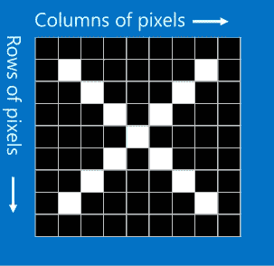

Image Dataset: with neighboring pixels being related.

这些参数的变化可归因于不同类型的数据，需要独立于其他数据集的分析。像图像数据集将具有不同的属性，因为相邻位置的像素是相关的，但是在关系数据库中，条目可以是随机的，没有关系。因此，为此需要一种不同的方法。

我们能够概括数据类型的类型和适合它们的神经网络结构，如用于图像、音频、视频的 CNN 和用于 NLP 相关任务的 RNN/lstm 等。但是，为了最大限度地发挥它们的性能，我们应该让它们变得更聪明。什么是神经网络的智能？概括而不是记忆神经网络可以被认为是智能神经网络。这种行为在任何形式的学习中都是可取的。

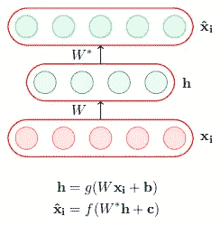

dim(h) < dim(xi) <- undercomplete autoencoder || overcomplete autoencoder -> dim(h) ≥ dim(xi)

为简单起见，本文只讨论自动编码器，这是一种特殊类型的前馈神经网络，它对隐藏层中的输入进行编码，并从该隐藏表示中进行解码。CNN 是自动编码器的一个例子，例如，CNN 以与自动编码器相同的方式对 MNIST 函数中的数字进行分类，其中网络试图近似从隐藏层重构输出信息的函数。每个神经网络架构都有自动编码器作为其基本块。因此，通过对它们的讨论，我们可以扩展不同深度学习架构的思想。

在本文中，我们将探索微调网络的技术，以获得更好的验证准确性，从而实现更好的预测。此外，我们还将研究这些技术背后的一些数学知识，以加深对这些技术背后的理解。

# 创建智能自动编码器有什么问题？

嗯，我们真正想从神经网络中得到的是从可用数据中归纳出 T1，而不是 T2 记忆 T3。记忆的问题是模型可能会过度拟合。因为深度学习模型很复杂，并且倾向于过度拟合目标函数。考虑非常基本情况，其中模型在训练数据集上被广泛训练，使得训练数据集上误差最小化并接近零。有可能神经网络没有捕捉数据的趋势，只是记住了用非常复杂的函数再现整个数据的方法。

让我们使用偏差 v/s 方差权衡的概念来更清楚地理解这一点。看看下面的图，x 轴代表模型的复杂性，而 y 轴代表误差。随着复杂度的增加，训练误差趋于减小，但方差增大，验证误差增大。


**Blue: Training Error, Red: Validation Error.** Initially bias will be high with model being primitive. With training error approaching zero, model will overfit resulting in high variance.

我们想要对变化更敏感的模型，以捕捉稀疏但重要的特征的微小细节。因此，**欠拟合**数据根本不是一个选项。因为更复杂的模型对变化更敏感。只有在深度学习的背景下进行关于过度拟合的讨论才有意义。

对于**示例**以过完备自动编码器为例，在这种情况下，它们可以学习简单琐碎的编码，即在整个网络中复制粘贴值。比如将输入(xi)复制到隐藏层(h)，然后再从 *h* 复制到输出层(x *hat* )。显然，错误将是最小的，但没有学习😉

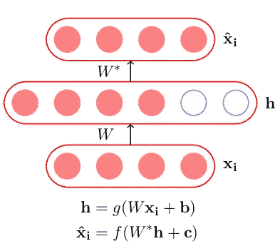

It is also a type of overfitting as autoencoders captures all the variations in the mapping of weights in training data. **Remember**, above figure doesn’t mean that undercomplete autoencoders doesn’t have overfitting problems instead cause for them is different like in complex network architecture.

让我们建立在上述讨论的想法上，为了深度学习自动编码器的成功，必须消除过度拟合。当然，也有其他问题，如**没有足够的数据**，**大量参数**，相关特征是否被学习，何时停止训练。从这里我们可以说**智能自动编码器**是对我们可以观察到的信息进行归纳，并从中了解重要趋势，从而能够做出预测的编码器。让我们开始探索这些技术，目的是培养直觉，找到使用它们的理由和合适的例子，以增加我们的学习。

1.  数据集扩充
2.  提前停止
3.  l2 正则化
4.  避免普通的自动编码器:噪声和稀疏
5.  参数共享和捆绑
6.  drop 和 DropConnect 的集成方法

# 数据集扩充

在计算机视觉分类任务中，模型通过更多的训练数据学习得更好。但是大数据的问题是它增加了训练时间。

嗯，深度学习模型中的参数数量是巨大的(*百万量级*)。如果一开始就没有足够的可用数据，这显然会有所帮助。但是，如果你已经有了**足够的数据**会有帮助吗？是的，因为它将增加数据集中的相关特征，这有助于自动编码器学习重要的稀疏特征，而不是不相关的丰富特征。

**数据扩充**是一种从现有数据中创建新数据的技术，目的是增加原始数据中的相关特征。请参见下图，了解数据扩充。

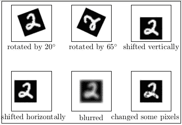

**Invariance:** data is robustly classified at difference in translations, rotations, size, viewpoints and illumination.

以这种方式增加用于分类的最明显的特征成为最相关的特征。在 ML 管道中哪里增加我们的数据？首先是**离线增强**应用变换并将图像添加到数据集。但是，它会根据应用的变换数量增加大小。其次，**在线增强**是在输入到我们的学习模型之前应用于小批量的。在这里，看到一些张量流脚本应用于这样的转换，并假设我们不关心图像边界外的东西。

这是什么意思？假设图像的某个部分什么也没有，即它是未知空间，那么我们需要如下不同的变换。例如，一些黑色背景的旋转图像。


From the left, we have the constant, edge, reflect, symmetric and wrap transformations applied. Courtesy: [Nanonets](https://medium.com/nanonets/how-to-use-deep-learning-when-you-have-limited-data-part-2-data-augmentation-c26971dc8ced)

Tensorflow 脚本基于上述对小批量数据应用简单转换的假设。

```
**# 1\. Flip: 'x' = A placeholder for an image.** shape = [height, width, channels]
x = tf.placeholder(dtype = tf.float32, shape = shape)
flip_2 = tf.image.flip_up_down(x)
flip_5 = tf.image.random_flip_left_right(x)**# 2.** **Rotate: 'y' = A batch of images
# To rotate in any angle. In the example below, 'angles' is in radians** shape = [batch, height, width, 3]
y = tf.placeholder(dtype = tf.float32, shape = shape)
rot_tf_180 = tf.contrib.image.rotate(y, angles=3.1415)**# 3\. Noise: 'x' = A placeholder for an image.** shape = [height, width, channels]
x = tf.placeholder(dtype = tf.float32, shape = shape)**# Adding Gaussian noise**
noise = tf.random_normal(shape=tf.shape(x), mean=0.0, stddev=0.5,
dtype=tf.float32)
output = tf.add(x, noise)
```

可以类似地为随机裁剪、换行、颜色通道移动等编写其他增强。

# **提前停止**

顾名思义，这给了我们一些想法，我们可以通过在训练时尽早停止来避免过度适应。但是多早停止呢？基本上，我们的目标是在训练误差趋于零，验证误差即将爆发之前停止。

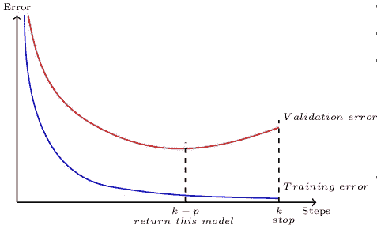

Patience Parameter P: If you are at step k and there was no improvement in validation error in the previous p teps then stop training and return the model stored at step k − p.

这些提前停止规则通过将原始训练集分成新的训练集和验证集来工作。在确定过度拟合何时开始时，验证集上的误差被用作原始训练误差的替代。有了 Keras，你可以简单地用下面的方法做到这一点。

```
keras.callbacks.EarlyStopping(monitor='val_loss',
                              min_delta=0,
                              patience=0,
                              verbose=0, mode='auto')
```

`min_delta`是是否将某个时期的损失量化为改善的阈值。如果损失差异低于`min_delta`，则量化为无改善。最好让它为 0，因为我们感兴趣的是损失何时变得更严重。`patience`自变量代表当你的损失开始增加(停止改善)时，在停止之前的周期数。`mode`争论取决于你监控的数量的方向(应该是减少还是增加)，因为我们监控损失，我们可以使用`min`。

现在，如果我说*提前停止*也是一种正则化技术。这个说法是真的吗？让我们看少量的数学来理解早期停止的可见工作的背后。记住，正则化是在学习神经网络中对权重&偏差添加一些约束的任何技术。

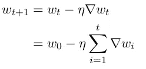

Update rule for Stochastic Gradient Descent Method. Let ‘τ’ be maximum value gradient of delta(wi). Apply inequality to above equation and we get:

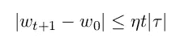

Clearly, t controls how far **wt** can go from the initial **w0\.** It controls the **space
of exploration.**

提前停止停止只允许 **t** 更新参数**。**维度越重要，与其相关的损失就越大，因为使用上述等式，我们控制学习速率和*t。*只有与梯度相关的损失仍然是主导因素，这实际上意味着只有损失越大的重要参数才占更多。因此，与不太重要的参数相比，重要参数的比例缩小较少，这将导致更好的精度。这类似于 L2 正则化，参见下文。

# L2 正则化

正则化是在学习时分配给模型的约束。L2 正则化是权重衰减正则化，它使权重更接近原点，同时更多地缩小不太重要的要素。

让我们以直观的方式来理解真误差的概念。该误差可以用下面的给定形式表示，其中经验误差项是基于估算程序，因为我们不知道 f(x)。

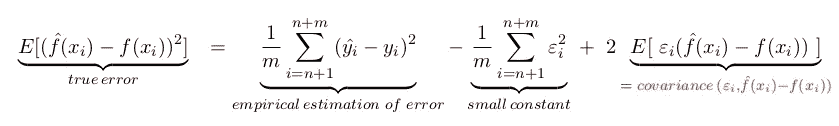

where yi = f(xi) + ε, ε is small value

主要目的是将模型复杂性对真实误差的影响联系起来。显然，它将训练误差加上一些东西。那是什么东西？利用斯坦引理和一些数学知识，我们可以证明

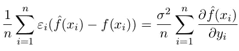

When a small change in the observation causes a large change in the estimation(**fhat**(xi)). The error will be more.

这和复杂模型有关系吗？是的，上述观察结果与模型越复杂，对观察结果的变化越敏感这一事实有关。因此，我们可以说真实误差=经验训练误差+小常数+ω(模型复杂度)。这个ω是正则化的基础。因此，在正则化中，我们的目标是最小化由于模型复杂性而导致的误差，而模型复杂性又与偏差-方差权衡相关。

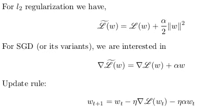

The intuition for adding this term is that training error doesn’t drive to zero. **w** influence gradient and update rules from above equations.

以上加入更新规则和 SGD 的公式是什么意思？等式**上面提到的两个**运算在数学上表示权重矩阵在重要性方向上的缩放，即具有主要特征值和次要特征值的权重矩阵被缩小，但是不太重要的特征被缩小得更多。该正则化操作有效地首先旋转权重矩阵，然后对角化它，然后再次旋转它。这里，在等高线图上可以看到这些操作的效果。参考这篇[文章](/why-visualize-gradient-descent-optimization-algorithms-a393806eee2)的等高线图，只看那部分。

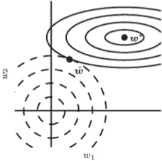

weight vector(w∗) is getting rotated to (w̃). Geometrically it is visible that all elements are getting shrunken down but for some more shrinking is there like the one in the direction of **w1**. Important features gets more weight assigned.

这是 Tensorflow 脚本，用于在基于上述公式的神经网络模型中使用正则化。第一个例子是仅在一层上使用它，第二个例子是在所有层上使用它。

```
**# Code 1:**
# Loss function using L2 Regularization
regularizer = tf.nn.l2_loss(weights)
loss = tf.reduce_mean(loss + beta * regularizer)
# Optimizer.
 optimizer = tf.train.GradientDescentOptimizer(0.5).minimize(loss)**# Code 2:** #Loss for all trainable variables, 0.001 is beta above
vars   = tf.trainable_variables() 
regularizer = tf.add_n([ tf.nn.l2_loss(v) for v in vars ]) * 0.001
# Let's say you wan't to regularize biases
regularizer = tf.add_n([ tf.nn.l2_loss(v) for v in vars
                    if 'bias' not in v.name ]) * 0.001# More descriptive code
regularizers = tf.nn.l2_loss(weights_1) + tf.nn.l2_loss(weights_2) + tf.nn.l2_loss(weights_3) + tf.nn.l2_loss(weights_4) +         tf.nn.l2_loss(weights_5) + tf.nn.l2_loss(weights_6)loss = tf.reduce_mean(loss + beta * regularizers)
```

# 避免普通的自动编码器:噪声和稀疏

考虑如上所述的过完备普通自动编码器的情况。显然，他们容易过度适应和琐碎的学习。因此，在这些情况下，使用这些普通的自动编码器不会有太大的好处。解决这一问题的一种方法是向输入中添加噪声，这将迫使神经网络不学习琐碎的编码，而是专注于更多的概括。

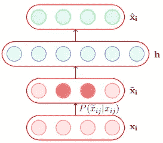

A denoising encoder simply corrupts the input data using a probabilistic process (P (**x(tilda)ij** |**xij** )) before feeding it to the network. These are known as Denoising Autoencoders.

```
# Generate corrupted MNIST images by adding noise with normal dist                       # centered at 0.618 and std=0.618 
noise = np.random.normal(loc=0.618, scale=0.618, size=x_train.shape)
x_train_noisy = x_train + noisenoise = np.random.normal(loc=0.618, scale=0.618, size=x_test.shape)
x_test_noisy = x_test + noise# np.clip to move out of bound values inside given interval
x_train_noisy = np.clip(x_train_noisy, 0., 1.)                       x_test_noisy = np.clip(x_test_noisy, 0., 1.)
```

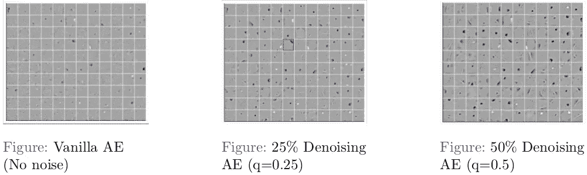

Plot describes neurons firing for different features like strokes, edges for MNIST dataset digits. Clearly we can see more meaningful patterns are captured by denoising AE as compared to Vanilla AE.

随着高斯噪声的加入，这些隐藏的神经元成为边缘检测器，PCA 不能给出这些边缘检测器。此外，噪声可以应用于目标类别，这将导致具有随机分析的软目标，而不是硬目标。

**稀疏自动编码器**也用于解决稀疏参数的这种问题，当特征与要观察的特征相关时，这将导致神经元在罕见的情况下放电。可以写成 Lˇ(θ)= L(θ)+ω(θ)，其中 L(θ)是平方误差损失或交叉熵损失，ω(θ)是稀疏性约束，它强制触发重要特征的神经元。

**奖励:收缩型自动编码器，**正则项ω(θ)= | | j x(h)||^ 2 是编码器的雅可比矩阵。雅可比矩阵的(j，l)项捕捉到第*1*个神经元的输出变化，而第*个*个神经元的输入变化很小。L(θ) —捕捉数据中的重要变化&ω(θ)—不捕捉数据中的变化，因为雅可比使神经元对变化不敏感。通过这种权衡，我们可以只捕捉最重要的特征。对于稀疏 AE 可以进行类似的论证。

# **参数共享&捆绑**

***共享权重*** 简单来说就是使用相同的权重向量来进行*运算。*这样做的主要动机是限制参数的数量。

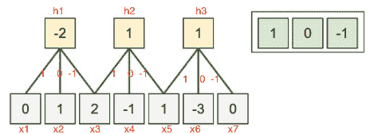

*ℎ*1=*𝑤*⋅*𝑥*[1:3], *ℎ*2=*𝑤*⋅*𝑥*[3:5], *ℎ*3=*𝑤*⋅*𝑥*[5:7]

我们可以通过一个直观的假设来大幅减少我们的参数，如果一个特征在一点上很重要，那么它在另一点上也很重要。**示例:**如果在特定位置检测边缘很重要。因此，由于图像的 的 ***平移不变结构，对于所有位置，边缘重复自身。这将导致更快的收敛。此外，我们限制了灵活性，这也可以作为避免过度拟合的正则化机制。考虑这样一种情况，我们希望并行处理两组图像，但也希望各列共享参数。***

```
def function(x, reuse):
  with tf.variable_scope(layer_name) as s:
    output = tf.contrib.layers.convolution2d(inputs = x, num_outputs = 10, kernel_size = [3, 3], stride = [1, 1], padding = 'VALID', reuse = reuse, scope = s)
  return output

output1 = function(image1, False)
output2 = function(image2, True)
```

*权重绑定*概念基于与上述相同的想法，具有相同的动机来减少向下参数，但应用于自动编码器单元，其中编码器权重和解码器权重被绑定和使用。它减少了自动编码器的容量，并作为一个正则化。

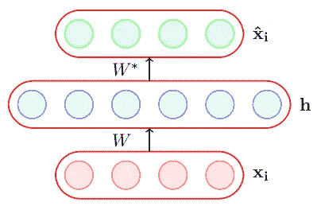

Tie the weights of the encoder and decoder i.e., **W**∗=**W**T

# 整体到辍学和 DropConnect

集成组合不同模型的输出以减少泛化误差，模型可以是不同的分类器。这里，它们是在不同的超参数、特征和训练数据的不同样本上训练的相同神经网络的不同实例。 **Bagging** 是一种跨整个数据集的方法，它根据训练数据的子集训练模型。因此，一些训练示例没有显示给定的模型。它允许不同的神经元跨训练数据集捕捉不同的相关特征。所有模型平均预测产生的误差？

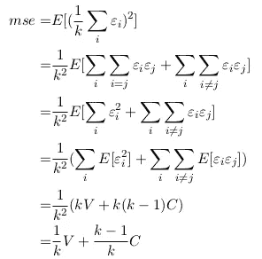

Expect Square Error is given by: Expectation of error made by average prediction of all models.

从上面可以看出，模型之间的独立性越强，误差就越小，只有(V/k)。非常好，因为当神经网络的结构变化很大时，误差理想地变得非常小。但是，随着单个模型数量的增加，要处理的训练参数的数量会激增。这使得训练在计算上变得昂贵。

如果我们能减少这些参数不是很好吗？此外，不同的架构将帮助我们增加模型之间的差异。这两个问题通过退学**解决了。**它给出了组合许多不同网络的近似方法，并在没有任何显著开销的情况下训练几个网络。它在所有网络之间共享权重，并为每个训练实例采样不同的训练网络。只有活动参数从正向和反向传播中更新。不要聚集 2^n 稀疏网络，而是通过训练期间每个节点打开的时间来缩放其输出。

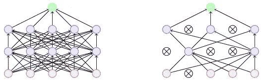

**Dropout refers to dropping out units. i.e.** Temporarily remove a node and all its incoming/outgoing connections resulting in a thinned network.

它应用于每个训练示例中的特征，导致某些特征对网络不可用。因为一个神经元不能完全依赖于一个输入，所以这些网络中的表示往往更加分散，网络不太可能过度适应。这种情况发生是因为丢失给隐藏单元添加了屏蔽噪声，这阻止了**协同适应**，本质上隐藏单元不会依靠其他单元来检测特定特征，因为那些单元可能会被丢失。这使得隐藏单元更加健壮。

```
**# Simple keras implementation of MNIST for dropout**import tensorflow as tf
mnist = tf.keras.datasets.mnist

(x_train, y_train),(x_test, y_test) = mnist.load_data()
x_train, x_test = x_train / 255.0, x_test / 255.0

model = tf.keras.models.Sequential([
  tf.keras.layers.Flatten(),
  tf.keras.layers.Dense(512, activation=tf.nn.relu),
  tf.keras.layers.Dropout(0.2),
  tf.keras.layers.Dense(10, activation=tf.nn.softmax)
])
model.compile(optimizer='adam',
              loss='sparse_categorical_crossentropy',
              metrics=['accuracy'])

model.fit(x_train, y_train, epochs=5)
model.evaluate(x_test, y_test)
```

什么是 **dropconnect** ？假设我们决定随机丢弃权重子集，而不是丢弃节点。其行为方式与辍学类似。从伯努利分布中提取的二进制掩码被应用于原始权重矩阵。

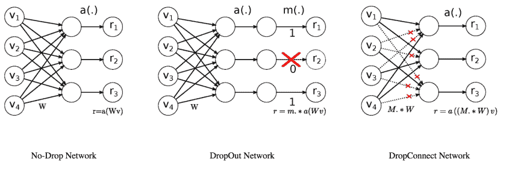

Courtesy: [nickcdryan](http://nickcdryan)

不是在每次训练中随机丢弃连接，而是由于输入数据类或连接对更深层的贡献，连接会丢弃并保持丢弃。

```
tf.nn.dropout(W, keep_prob=p) * p 
OR
tf.layers.dropout(W, rate=1-p) * p
```

# 结论

何时使用这些技术的直觉我们可以创建有效的深度神经网络，这些网络在其核心内更智能，同时具有学习任何特定任务的功能。有了这些知识，我们对创建更好的深度学习架构有了更好的理解。但是，这绝不意味着这个讨论是完整的，因为随着更好的精度**更快的收敛**也是一个期望的行为。让我们看看**后续文章**中关于衔接的内容。

感谢[艾西瓦娅](https://medium.com/@aishwaryasingh257)的改进。基线内容改编自来自 IITM 的 [CS7015(DL)](https://onlinecourses.nptel.ac.in/noc18_cs41/preview) ，由 Mitesh M. Khapra 教授主讲的精彩课程。感谢阅读！！