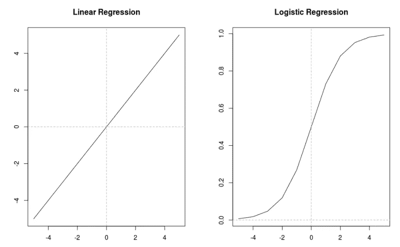

# 用 R 中的例子简单解释了逻辑回归

> 原文：<https://towardsdatascience.com/simply-explained-logistic-regression-with-example-in-r-b919acb1d6b3?source=collection_archive---------0----------------------->


我假设读者熟悉线性回归模型及其功能。在这里，我试图用尽可能简单的解释来解释逻辑回归。当我自己试图理解逻辑回归时，我没有得到任何全面的答案，但是在对这个话题做了彻底的研究后，我想到了这篇文章。请注意，这更多的是一篇介绍性文章，要深入这个主题，您必须了解数据分析及其实现的许多不同方面。

话虽如此，我们还是开始吧。我们知道，线性模型假设响应变量是正态分布的。我们有形式为 *Yi = β0 + β1X+ εi，*的方程，其中我们预测 X 的某个值的 Y 值。我们知道这是线性的，因为对于 X 的每个单位变化，它将在一定程度上影响 Y 值 *β1。此外，*误差项 *εi 是*假设正态分布，如果误差项添加到 Y 的每个输出，则 Y 也正态分布，这意味着对于 X 的每个值，我们得到 Y，并且 Y 对该正态分布有贡献。现在，当 Y 的值可以是-∞到+ ∞时，这都是好的，但是如果值需要为真或假，0 或 1，是或否，那么我们的变量不遵循正态分布模式。我们所有的是 0 和 1 的计数，它只对发现概率有用，例如，如果你有五个 0 和十五个 1，那么得到 0 的概率是 0.25，得到 1 的概率是 0.75。但是我们如何用这个概率来做一个平滑的分布，拟合一条线(非线性的)尽可能接近你所拥有的所有的点，假设那些点不是 0 就是 1。

要做到这一点，你必须想象概率只能在 0 和 1 之间，当你试图用一条线来拟合这些点时，它不可能是一条直线，而是一条 S 形曲线。



Linear vs Logistic

如果你有更多的 1，那么 S 将向上倾斜，如果你有更多的 0，那么它将向下倾斜。请注意，Y 轴上的数字 0 表示总计数的一半在左边，总计数的一半在右边，但情况并不总是如此。

现在问题来了，我们如何将 1 和 0 的二进制信息映射到使用连续变量的回归模型？我们做这种映射的原因是因为我们希望我们的模型能够发现预期结果为真的概率。下面我将描述我们是如何进行映射的。请记住，逻辑回归的主要前提仍然是基于一个典型的回归模型，有一些方法上的变化。

现在，要找到预期结果的概率，我们必须始终遵循两件事。

1-概率不能为负，所以我们在我们的正态回归模型中引入一个称为指数的项，使其成为逻辑回归。

2-由于概率永远不会大于 1，我们需要将结果除以比它本身更大的数。

基于这两点，我们的逻辑回归公式展开如下:

1.回归公式使用公式 *Yi = β0 + β1X+ εi.* 给出 Y

2.我们必须使用指数，这样它就不会变成负数，因此我们得到 P = exp( *β0 + β1X+ εi* )。

3.我们将 P 除以比它本身大的数，使它保持小于 1，因此我们得到 P = e(*β0+β1X+εI*)**/**e(*β0+β1X+εI*)+1。

4.经过一些计算后，第三步中的公式可以改写为 log(p**/**(1-p))=*β0+β1X+εI .*

5.log(p **/** (1-p))称为概率的赔率。如果你仔细观察，它是预期结果为真的概率除以预期结果不为真的概率，这叫做 logit 函数。

# 工作:

当您计算 1 和 0 的总数时，您可以很容易地计算 log(p **/** (1-p))的值，我们知道该值等于*β0+β1X+εI。*现在您可以将该值放入公式 P = e(*β0+β1X+εI*)**/**e(*β0+β1X+εI*)+1 和

从另一个角度来看，假设您已经有了截距和斜率的回归公式，您只需要输入 X 的值来预测 y。但您知道在逻辑回归中它不是这样工作的，这就是为什么您将 X 值放在这个公式 P = e(*β0+β1X+εI*)**/**e(*β0+β1X+εI*)+1 中，并将结果映射到 X-上如果该值高于 0.5，则您知道它接近于期望的结果(即 1)，如果该值低于 0.5，则您知道它接近于不期望的结果(即 0)。

# 稍微涉及一下指数的功能

假设你在某个地方投资了一美元。现在，一年内它将增长其先前价值的 50%，所以在 2018 年，如果它是 1 美元，那么在 2019 年它将变成 1.5 美元，在 2020 年它将变成 2.25 美元。为什么是 2.25？因为 1 美元产生了 0.5 美元，这 0.5 美元开始赚取自己的利息，也就是 0.25 美元，随着时间的推移，每个新芽不断赚取自己的利息，这就是为什么我们有上面显示的 S 形曲线。

# R 中的示例

需要记住的事情，

1-线性回归方法试图最小化残差，这意味着最小化((MX+c)-y)的值。而逻辑回归模型则试图在考虑了手头的所有变量后，尽可能准确地预测结果。

2-它计算数据集中每个点的概率，该点可以是 0 或 1，并将其提供给 logit 函数。

3-使用逻辑回归后得到的系数告诉我们特定变量对对数概率的贡献有多大。

数据来源于加州大学洛杉矶分校，它有 4 个变量，称为录取，GRE 分数，GPA 和他们的本科学校排名。我们的目标是建立一个模型，以便在给定学生简介的情况下，预测该学生被录取的概率。

```
df <- read.csv(“https://stats.idre.ucla.edu/stat/data/binary.csv")
 str(df)
 ## ‘data.frame’: 400 obs. of 4 variables:
 ## $ admit: int 0 1 1 1 0 1 1 0 1 0 …
 ## $ gre : int 380 660 800 640 520 760 560 400 540 700 …
 ## $ gpa : num 3.61 3.67 4 3.19 2.93 3 2.98 3.08 3.39 3.92 …
 ## $ rank : int 3 3 1 4 4 2 1 2 3 2 …
```

我们看到变量不是整数就是数字。

```
sum(is.na(df))## [1] 0
```

没有空值

```
summary(df)##      admit             gre             gpa             rank      
 ##  Min.   :0.0000   Min.   :220.0   Min.   :2.260   Min.   :1.000  
 ##  1st Qu.:0.0000   1st Qu.:520.0   1st Qu.:3.130   1st Qu.:2.000  
 ##  Median :0.0000   Median :580.0   Median :3.395   Median :2.000  
 ##  Mean   :0.3175   Mean   :587.7   Mean   :3.390   Mean   :2.485  
 ##  3rd Qu.:1.0000   3rd Qu.:660.0   3rd Qu.:3.670   3rd Qu.:3.000  
 ##  Max.   :1.0000   Max.   :800.0   Max.   :4.000   Max.   :4.000
```

我们可以注意到，由于变量 admit 的平均值小于“0.5”，所以拒绝的数量大于接受的数量。

```
xtabs(~ admit +rank ,data=df) ##         rank
 ## admit  1  2  3  4
 ##     0 28 97 93 55
 ##     1 33 54 28 12
```

我们这样做是为了检查录取是否在每个等级类别中分布得足够好。如果假设一个等级只有 5 个接纳或拒绝信息，那么就没有必要在分析中包括该等级。

现在，我们运行我们的 logit 函数，但在此之前，我们还必须将秩变量从整数转换为因子。

```
df$rank <- as.factor(df$rank)

 logit <- glm(admit ~ gre+gpa+rank,data=df,family="binomial")

 summary(logit)## 
 ## Call:
 ## glm(formula = admit ~ gre + gpa + rank, family = "binomial", 
 ##     data = df)
 ## 
 ## Deviance Residuals: 
 ##     Min       1Q   Median       3Q      Max  
 ## -1.6268  -0.8662  -0.6388   1.1490   2.0790  
 ## 
 ## Coefficients:
 ##              Estimate Std. Error z value Pr(>|z|)    
 ## (Intercept) -3.989979   1.139951  -3.500 0.000465 ***
 ## gre          0.002264   0.001094   2.070 0.038465 *  
 ## gpa          0.804038   0.331819   2.423 0.015388 *  
 ## rank2       -0.675443   0.316490  -2.134 0.032829 *  
 ## rank3       -1.340204   0.345306  -3.881 0.000104 ***
 ## rank4       -1.551464   0.417832  -3.713 0.000205 ***
 ## ---
 ## Signif. codes:  0 '***' 0.001 '**' 0.01 '*' 0.05 '.' 0.1 ' ' 1
 ## 
 ## (Dispersion parameter for binomial family taken to be 1)
 ## 
 ##     Null deviance: 499.98  on 399  degrees of freedom
 ## Residual deviance: 458.52  on 394  degrees of freedom
 ## AIC: 470.52
 ## 
 ## Number of Fisher Scoring iterations: 4
```

# 简要解释

gre 中每一个单位的变化都会使被录取的对数几率增加 0.002，其 p 值表明它在决定录取方面有一定的意义。

2-平均绩点每增加一个单位，录取几率的对数就增加 0.80，p 值表明它在决定录取方面有一定的意义。

3-排名的解释与其他人不同，从排名第一的大学去排名第二的大学会将被录取的几率降低-0.67。从等级 2 到等级 3 将减少-1.340。

零偏差和剩余偏差之间的差异告诉我们，该模型是一个很好的拟合。差异越大，模型越好。零偏差是当方程中只有截距而没有变量时的值，剩余偏差是当考虑所有变量时的值。如果差异足够大，那么认为模型是好的是有道理的。

# 预言；预测；预告

假设一个学生的 GRE 成绩为 790 分，GPA 为 3.8，他就读于一所排名第一的大学。现在你想预测那个男孩将来被录取的机会。

```
x <- data.frame(gre=790,gpa=3.8,rank=as.factor(1))
 p<- predict(logit,x)
 p##       1 
 ## 0.85426
```

我们看到这个人有 85%的机会被录取。

**参考文献**

匿名。“Logit 回归| R 数据分析示例”。*数字研究与教育研究院*。【https://stats.idre.ucla.edu/r/dae/logit-regression/ 

匿名。“逻辑回归解释了”。学习营销。[http://www . learn by marketing . com/methods/logistic-regression-explained/](http://www.learnbymarketing.com/methods/logistic-regression-explained/)

计数模型:理解对数链接功能。theanalysisfactor.com。[https://www . the analysis factor . com/count-models-understanding-the-log-link-function/](https://www.theanalysisfactor.com/count-models-understanding-the-log-link-function/)

匿名。《指数函数直观指南& e》。BETTEREXPLAINED.COM。[https://better explained . com/articles/an-intuitive-guide-to-index-functions-e/](https://betterexplained.com/articles/an-intuitive-guide-to-exponential-functions-e/)

匿名。“视频 7:逻辑回归——简介”。*数据挖掘。*[https://www.youtube.com/watch?v=gNhogKJ_q7U](https://www.youtube.com/watch?v=gNhogKJ_q7U)

*Aggarwal，a .*逻辑回归。简体*”。IITR 数据科学集团。*[*https://medium . com/data-science-group-iitr/logistic-regression-simplified-9 B4 EFE 801389*](https://medium.com/data-science-group-iitr/logistic-regression-simplified-9b4efe801389)

匿名*。* YES NO GAME(青年组比赛)*。年轻的天主教徒。*[https://young-天主教徒网/2017/12/30/yes-no-game-youth-group-game/](https://young-catholics.com/2017/12/30/yes-no-game-youth-group-game/)