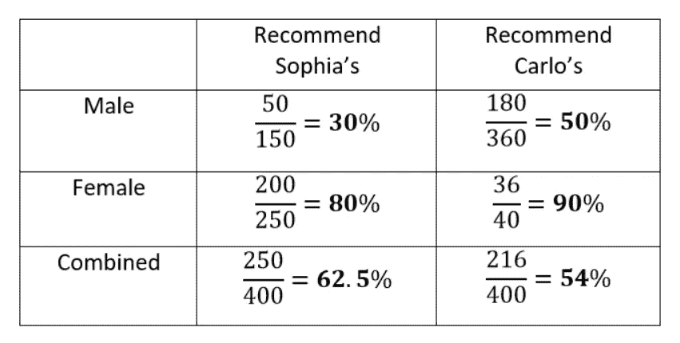
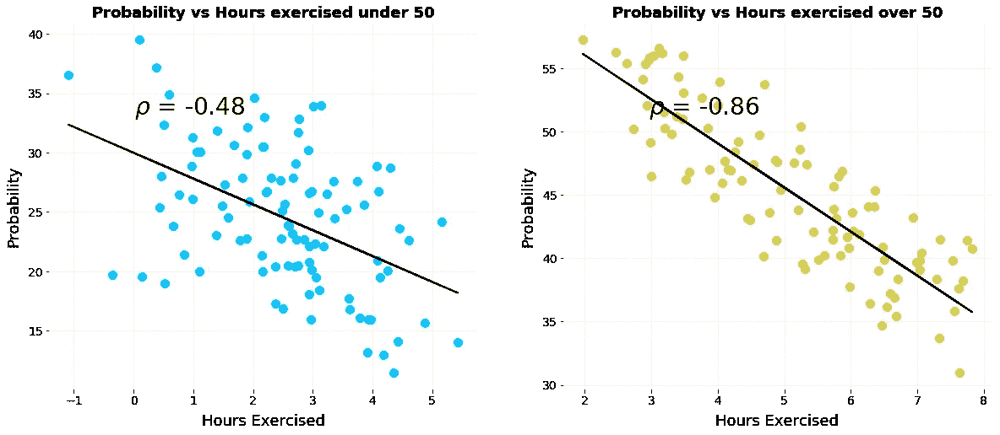
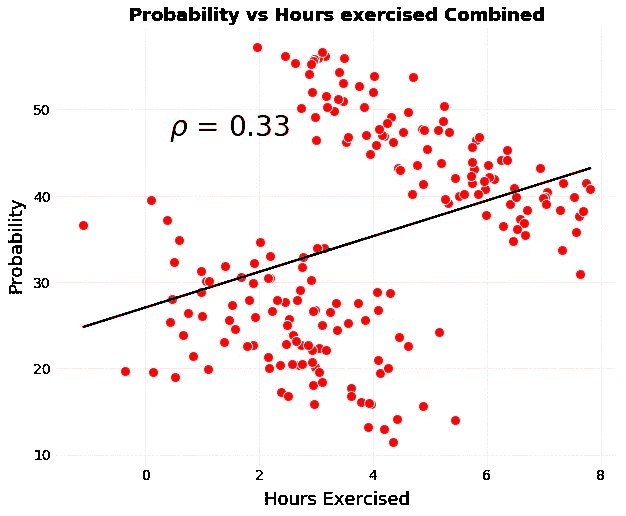
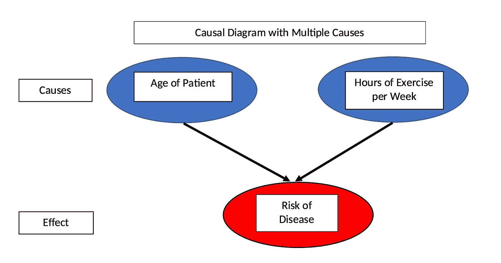
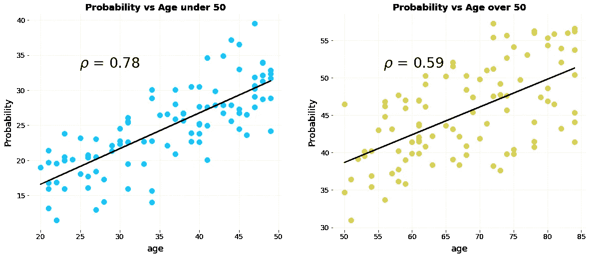
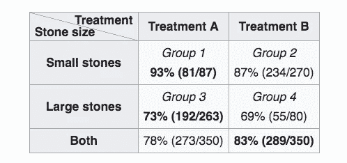
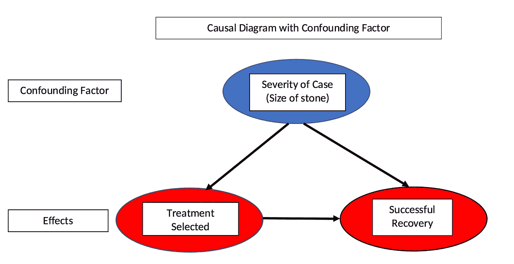
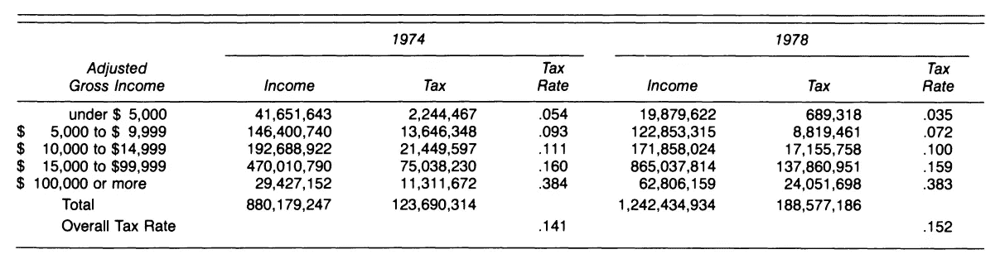

# 辛普森悖论:如何用相同的数据证明相反的论点

> 原文：<https://towardsdatascience.com/simpsons-paradox-how-to-prove-two-opposite-arguments-using-one-dataset-1c9c917f5ff9?source=collection_archive---------3----------------------->

([Source](https://www.pexels.com/photo/walking-path-way-tunnel-59599/))

## 理解一个统计现象和问为什么的重要性

想象一下，你和你的搭档正在寻找一家完美的餐厅享用一顿愉快的晚餐。知道这个过程可能会导致数小时的争论，你开始寻找现代生活的神谕:在线评论。这样，你就找到了你的选择，与你的搭档选择的索菲娅餐厅相比，推荐卡洛餐厅的男女比例更高。然而，就在你即将宣布胜利的时候，你的搭档用同样的数据得意洋洋地说，既然索菲亚的被更高比例的*所有用户*推荐，它就是明显的赢家。

这是怎么回事？谁躺在这里？点评网站是不是算错了？事实上，你和你的伴侣都是对的，你已经不知不觉地进入了辛普森悖论的世界，在那里，一家餐馆可能比它的竞争对手更好也可能更差，锻炼可以降低和增加疾病的风险，同样的数据集可以用来证明两个相反的论点。与其出去吃饭，也许你和你的伴侣应该花一个晚上来讨论这个迷人的统计现象。

[当数据集被分组时出现的趋势**在数据被聚合时逆转**时，就会出现辛普森悖论](https://en.wikipedia.org/wiki/Simpson%27s_paradox)。在餐馆推荐的例子中，确实有可能卡洛的*比索菲亚的*被更高比例的男女***推荐，但是被更低比例的* ***所有评论者*** *推荐。在你宣布这是精神错乱之前，这里有一张表可以证明这一点。***

**

*Carlo’s wins among both men and women but loses overall!*

*数据清楚地表明，当数据分离时，卡洛的是首选，但当数据合并时，索菲亚的是首选！*

*这怎么可能呢？这里的问题是，只看单独数据中的百分比忽略了样本大小，即回答问题的受访者人数。每个分数显示了在被问及的用户中会推荐这家餐馆的用户数量。卡洛的回答来自男性，远多于女性，而索菲亚的回答则相反。由于男性倾向于以较低的比率认可餐馆，当数据被合并时，这导致了对卡洛餐馆的较低的平均评级，因此这是一个悖论。*

*要回答我们应该去哪家餐馆的问题，我们需要决定数据是否可以合并，或者我们是否应该单独查看。我们是否应该汇总数据取决于*生成数据的过程*——也就是数据的[因果模型](https://en.wikipedia.org/wiki/Causal_model)。在看到另一个例子后，我们将讨论这意味着什么以及如何解决辛普森悖论。*

## ***相关反转***

*辛普森悖论的另一个有趣的版本出现了，当在分层的群体中指向一个方向的相关性在对总体进行聚合时变成了在相反方向*的相关性。让我们看一个简化的例子。假设我们有两组患者每周锻炼小时数与患病风险的数据，一组是 50 岁以下的患者，另一组是 50 岁以上的患者。这是显示锻炼和患病概率之间关系的单个图表。**

****

**Plots of probability of disease versus hours of weekly exercise stratified by age.**

**(示例可在本 [Jupyter 笔记本](https://github.com/WillKoehrsen/Data-Analysis/blob/master/statistics/Simpson's%20Paradox.ipynb)中重现)。**

**我们清楚地看到[负相关](https://en.wikipedia.org/wiki/Pearson_correlation_coefficient)，表明每周运动量的增加与两组人群患该疾病的风险降低相关。现在，让我们将数据结合到一个单独的图上:**

****

**Combined plot of probability of disease versus exercise.**

***这种关联已经完全* ***颠倒了*** *！*如果只显示这个数字，我们会得出结论，锻炼会增加患病的风险，这与我们从单个图表中得出的结论相反。运动如何既能降低又能增加患病风险？答案是否定的，要想解决这个悖论，我们需要超越我们看到的数据，并通过数据生成过程进行推理——是什么导致了这些结果。**

# **解决悖论**

**为了避免辛普森悖论导致我们得出两个相反的结论，我们需要选择将数据分组或汇总在一起。这看起来很简单，但是我们如何决定做哪一个呢？答案是[想因果](https://www.nytimes.com/2018/06/01/business/dealbook/review-the-book-of-why-examines-the-science-of-cause-and-effect.html):数据是如何产生的，基于此，*哪些因素影响了我们* ***没有显示*** 的结果？**

**在运动与疾病的例子中，我们直观地知道运动不是影响疾病发生概率的唯一因素。还有其他的影响，如饮食、环境、遗传等等。然而，在上面的图表中，我们只看到了*概率与锻炼时间的关系。在我们虚构的例子中，让我们假设疾病是由运动和年龄引起的。这表现在以下疾病概率的因果模型中。***

****

**Causal model of disease probability with two causes.**

**在数据中，疾病有两种不同的原因，但通过汇总数据并只看概率与运动，我们完全忽略了第二个原因——年龄。如果我们继续绘制概率与年龄的关系图，我们可以看到患者的年龄与患病概率呈正相关。**

****

**Plots of disease probability vs age stratified by age group.**

**随着患者年龄的增长，她/他患病的风险增加，这意味着即使运动量相同，老年患者也比年轻患者更容易患病。因此，为了评估*只是*锻炼对疾病的影响，我们会希望保持年龄*不变*而*改变*每周的运动量。**

**将数据分组是做到这一点的一种方法，通过这样做，我们可以看到，对于给定的年龄组，锻炼降低了患病的风险。也就是说，*控制*对于患者的年龄来说，运动与较低的患病风险相关。考虑到数据生成过程和应用因果模型，我们通过保持数据分层以控制额外的原因来解决辛普森悖论。**

**思考我们想要回答什么问题，也可以帮助我们解决悖论。在餐馆的例子中，我们想知道哪家餐馆最有可能让我们和我们的伙伴都满意。尽管除了餐厅的质量之外，可能还有其他因素影响评论，但在无法获得这些数据的情况下，我们希望将这些评论组合在一起，并查看整体平均水平。在这种情况下，汇总数据最有意义。**

**在运动与疾病的例子中要问的相关问题是，我们个人是否应该进行更多的运动来降低我们个人患疾病的风险？因为我们是一个 50 岁以下或 50 岁以上的人(对不起，那些正好 50 岁的人)，那么我们需要看正确的组，不管我们在哪个组，我们决定我们确实应该锻炼更多。**

**思考数据生成过程和我们想要回答的问题需要*超越*仅仅查看数据。这也许说明了从辛普森悖论中学到的关键一课:仅有数据是不够的。数据从来都不是完全客观的，尤其是当我们只看到最后的情节时，我们必须考虑我们是否了解整个故事。**

**我们可以通过询问是什么导致了数据，以及哪些影响数据的因素没有显示出来，来尝试获得更完整的图片。通常，答案表明我们实际上应该得出相反的结论！**

# **现实生活中的辛普森悖论**

**这一现象并不像某些统计概念那样，是一个理论上可能但实际上从未发生的人为问题。事实上，在现实世界中有许多关于辛普森悖论的著名研究案例。**

**一个例子是关于两种肾结石治疗效果的数据。查看分成治疗组的数据，显示治疗 A 对*大小肾结石*都有更好的效果，但是汇总数据显示治疗 B 对*所有病例都有更好的效果！*下表显示了回收率:**

****

**Treatment data for kidney stones ([Source](https://en.wikipedia.org/wiki/Simpson%27s_paradox#Examples))**

**怎么会这样呢？这个悖论可以通过考虑领域知识提供的数据生成过程——因果模型——来解决。事实证明，小结石被认为是不太严重的病例，治疗 A 比治疗 B 更具侵入性。因此，医生更有可能为小肾结石推荐较差的治疗 B，因为患者更有可能在第一时间成功康复，因为病例不太严重。对于大而严重的结石，医生通常会采用更好但更具侵入性的治疗方法 A。尽管治疗方法 A *在这些病例中表现更好*，但由于它适用于更严重的病例，治疗方法 A 的总体治愈率低于治疗方法 b。**

**在这个现实世界的例子中，肾结石的大小——情况的严重性——被称为[混杂变量](https://en.wikipedia.org/wiki/Confounding),因为它既影响**独立变量**治疗方法——也影响**非独立变量**恢复。混淆变量也是我们在数据表中看不到的，但可以通过绘制因果图来确定:**

****

**Causal diagram with confounding factor**

**问题中的效果，恢复，是由治疗和结石的大小(情况的严重性)引起的。此外，治疗方法的选择取决于结石的大小，使大小成为一个混杂变量。为了确定哪种治疗方法实际上更有效，我们需要通过将两组分开并比较组内而不是组间的恢复率来控制混杂变量。通过这样做，我们得出结论，治疗 A 是优越的。**

**这里有另外一种思考方式:*如果你有小结石，你更倾向于治疗 A；如果你有一颗大结石，你也会选择处理 A。*因为你必须要么有一颗小结石，要么有一颗大结石，你总是选择处理 A，这样矛盾就解决了。**

> **有时查看汇总数据是有用的，但在其他情况下，它可能会掩盖真实情况。**

## **证明一个论点和反面**

**第二个真实的例子展示了辛普森悖论如何被用来证明两个相反的政治观点。下表显示，在杰拉尔德·福特总统任内，**他不仅降低了每个收入阶层的税收，而且从 1974 年到 1978 年在全国范围内提高了税收。**看一下数据:**

****

**All individual tax rates decreased but the overall tax rate increased. ([Source](https://www.jstor.org/stable/2684093))**

**我们可以清楚地看到，从 1974 年到 1978 年，每个税级的税率*都在下降*，而同一时期的总税率*却在上升*。现在，我们知道如何解决这个悖论:寻找影响总体税率的其他因素。总体税率是单个等级税率和*的函数，也是每个等级*的应纳税所得额的函数。由于通货膨胀(或工资增长)，1978 年高税率的高收入阶层收入增加，低税率的低收入阶层收入减少。所以整体税率提高了。**

**除了数据生成过程之外，我们是否应该汇总数据还取决于我们想要回答的问题(也许还有我们试图提出的政治论点)。从个人层面来说，我们只是一个人，所以我们只关心我们支架内的税率。为了确定从 1974 年到 1978 年我们的税收是否增加了，我们必须确定我们税级的税率是否发生了变化，以及我们是否转向了不同的税级。个人支付的税率有两个原因，但在这部分数据中只有一个原因。**

## **为什么辛普森悖论很重要**

**辛普森悖论很重要，因为它提醒我们，我们看到的数据并不是所有的数据。我们不能只满足于数字或一个图形，我们必须考虑[数据生成过程](https://en.wikipedia.org/wiki/Data_generating_process)——因果模型——负责*数据。*一旦我们理解了产生数据的机制，我们就可以寻找不在图上的影响结果的其他因素。大多数数据科学家都没有学习因果思考的技能，但这对于防止我们从数字中得出错误的结论至关重要。除了数据之外，我们还可以利用我们的经验和领域知识(或该领域专家的经验和知识)来做出更好的决策。**

**此外，虽然我们的直觉通常很好地服务于我们，但在并非所有信息都立即可用的情况下，它们可能会失败。我们倾向于专注于眼前的事物——我们所看到的都是存在的——而不是深入挖掘，使用我们理性、缓慢的思维模式。特别是当有人有产品要卖或者有计划要实施的时候，我们不得不对这些数字本身持极度怀疑的态度。数据是一种强大的武器，但它既可以被那些想要帮助我们的人使用，也可以被邪恶的行为者使用。**

> **辛普森悖论是一个有趣的统计现象，但它也证明了防止操纵的最佳屏障是理性思考和问为什么的能力。**

## **参考**

1.  **[维基百科关于辛普森悖论的文章](https://en.wikipedia.org/wiki/Simpson%27s_paradox)**
2.  **[斯坦福百科关于辛普森悖论的文章](https://plato.stanford.edu/entries/paradox-simpson/)**
3.  **[辛普森悖论:高级分析中的警示故事](https://www.statslife.org.uk/the-statistics-dictionary/2012-simpson-s-paradox-a-cautionary-tale-in-advanced-analytics)**
4.  **朱迪亚·珀尔的《为什么之书:因果的新科学》**
5.  **[现实生活中的辛普森悖论](https://www.jstor.org/stable/2684093)**
6.  **[理解辛普森悖论](http://ftp.cs.ucla.edu/pub/stat_ser/r414.pdf)**

**一如既往，我欢迎讨论和建设性的批评。可以通过推特 [@koehrsen_will](http://twitter.com/@koehrsen_will) 或者我的个人网站 [willk.online](https://willk.online) 联系到我。**