# CIKM AnalytiCup 2018 第二名解决方案

> 原文：<https://towardsdatascience.com/simtext-2nd-solution-for-cikm-analyticup-2018-b3347e026e67?source=collection_archive---------12----------------------->

[Conference on Information and Knowledge Management (CIKM)](http://www.cikm2018.units.it/#firstPage) will be held at Torino, Italy, 22–26 October 2018.

这是我为 [CIKM AnalytiCUP 2018](https://tianchi.aliyun.com/markets/tianchi/CIKM2018) 做的解决方案总结，是一个关于短文本语义相似度和知识转移的比赛。

# [问题定义](https://tianchi.aliyun.com/markets/tianchi/CIKM2018)

> 这项挑战的目标是建立一个跨语言的短文本匹配模型。源语言是英语，目标语言是西班牙语。参与者可以通过应用先进的技术来训练他们的模型，以对问题对是否具有相同的含义进行分类。

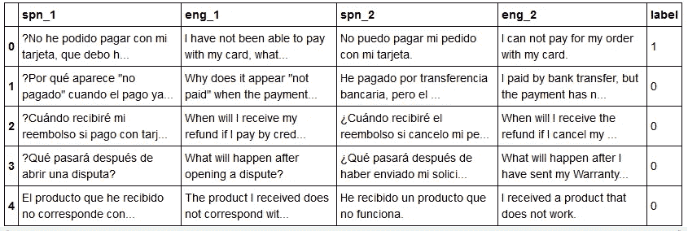

Overview of this dataset. We are asked to distinguish the intents between sentence 1 and sentence 2\. Label being 1 indicates that spn_1 and spn_2 have the same meaning.

# 概观

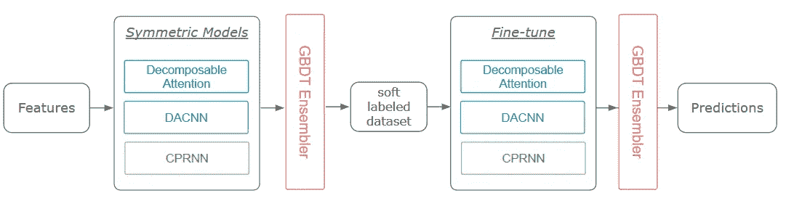

Overview of the workflow. It is a 2-stage training framework where the first stage is to aggregates the word features and hand-crafted features using various symmetric models. And the second stage is inspired by the idea of knowledge distillation, I fine-tuned each model trained in the first stage with the soft labels.

# 特征工程

除了预先训练的单词嵌入，我还额外创建了三种特征来丰富句子信息。

1.  距离特征

我测量句子向量之间的距离，句子向量可以通过三种方式构建:

*   词袋模型
*   带 TF/IDF 的词袋模型
*   基于 TF/IDF 的加权平均单词嵌入

2.主题特征

在这个数据集中有许多常见的模式，因为当客户咨询相同的意图时，他们倾向于使用相同的前缀或后缀。

例如:

*   “我想”创造一个论点
*   “我想”和一个人说话
*   “我想”问是否…

我们可以假设句子有相同的前缀或后缀，主题相同。为了捕捉共现信息，我用 LDA/LSI 对句子进行了矢量化，并用余弦距离比较了它们之间的差异。

3.文本特征

文本特征都是关于句子的性质，例如:

*   句子的长度:句子越长，概率应该越低。
*   停用词和唯一词的数量:它可以显示冗余的程度。
*   词语的多样性:它通常反映了上诉的复杂性。

最后，我创建了 56 个统计特征。以下是功能重要性和相关性热图的概述:

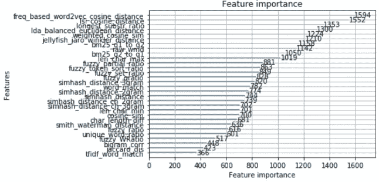

The feature importances, generated by a random forest classifier

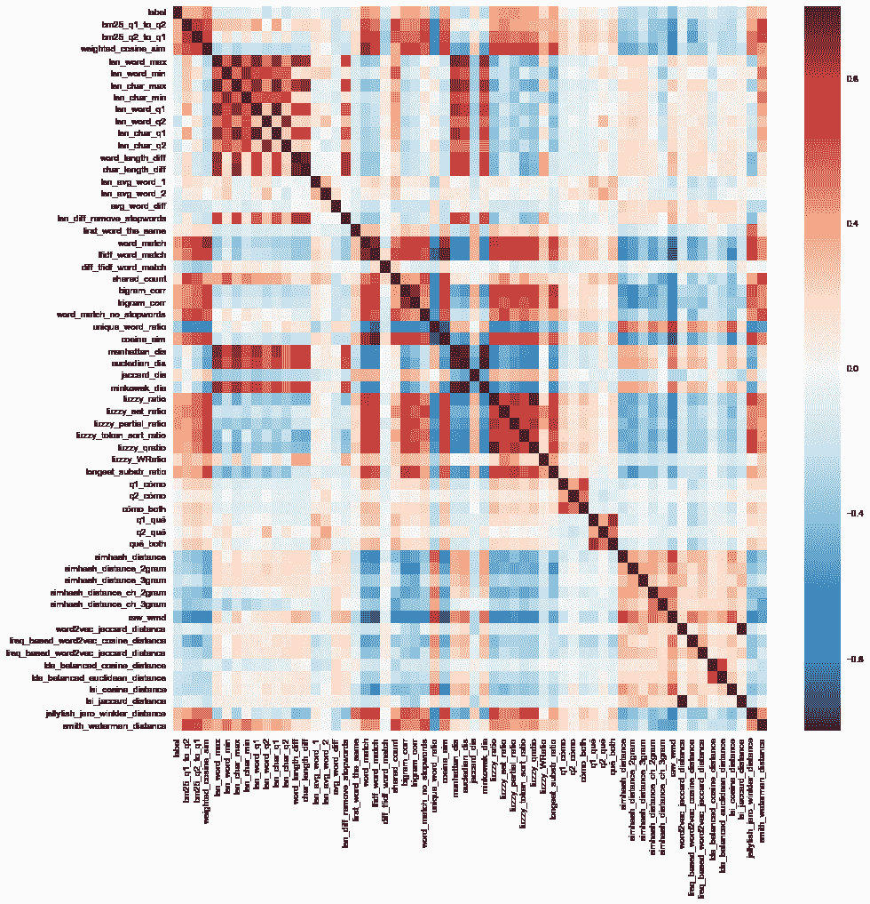

The correlation heatmap of all my features

# 模型

由于一些模型仍在开发中，我目前只在我的 [github](https://github.com/zake7749/Closer) 上传了部分解决方案。在清理完我的代码后，我会分享它们。回到主题，我尝试了三种基于不同假设的模型。

## 可分解注意力

可分解注意力是判断两句话是否相同的一个非常标准的解法。简而言之，可分解注意力将 sent1 中的单词与 sent2 中的相似单词对齐。

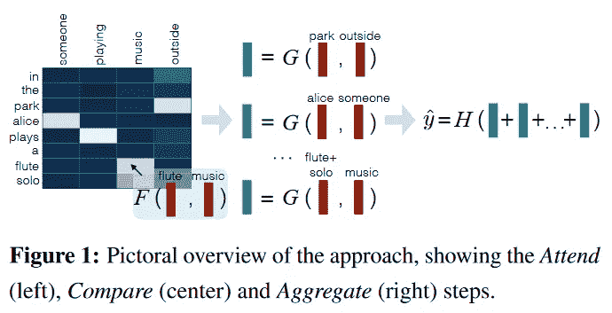

Figure from [A Decomposable Attention Model for Natural Language Inference](https://arxiv.org/abs/1606.01933)

这在这个数据集中很有帮助，因为有如此多的表面模式不断重复。例如:

*   什么是<x>？</x>
*   *—什么是区号？*
*   什么事？
*   *—什么是愿望清单？*
*   怎么才能拿到<x>？</x>
*   *—我如何获得订单？*
*   *—我如何获得退款？*

你可以找到这么多可能的选择，这就是我们要解决的核心问题。如果我们只关注前面提到的统计特征，模型在这些情况下会失败，因为我们将一个单词编码为标识符，并放弃了它的意义。为了清楚起见，该模型会将“我如何才能获得订单”和“我如何才能获得退款”视为相同，因为它们共享了如此多的词(“如何”、“可以”、“我”、“获得”、“该”)。然而，由于“订单”和“退款”之间的区别，人类知道它们是不一样的。

你可能会说我们可以用 TF/IDF 来解决这个问题，但有时关键字不同但语义相同，就像这样:

*   我想和一个男人说话
*   我想和人类说话
*   我想和一个员工谈谈

这些应该认为是一样的。顾客真正想要的是与人交谈，不管这个人是女人、男人还是雇员。

可分解的注意力比较它认为相关的东西。如果两个词确实有关联，也没关系。但是，如果没有，它可以更新上下文嵌入并使它们不同。一般来说，可分解的注意力建立了每个单词的类比关系，这让我们很容易抓住句子之间的显著差异。

除了可分解注意力之外，我还为这个任务设计了另外两个模型。

## 为什么不用可分解注意力呢？

在我看来，可分解注意力有两个缺点:

1.  当应用注意力时，我们丢弃了单词的顺序，这意味着我们也丢失了像短语或单词之间的依赖关系这样的信息。这可能是一场灾难，因为我们被禁止使用任何其他外部数据。一旦特征消失了，我们就再也找不回来了。
2.  冷启动词。我发现 google translator 倾向于将一些相似的概念总结成一个单一的概念，这导致训练数据缺乏词汇的多样性。然而，测试数据是原始的西班牙语句子，并没有那么简单。我想这就是为什么即使可分解的注意力在本地简历上做得很好，它总是大大超过 LB。
3.  为了应对这两个弱点，我深入研究了另外两个模型。RNN 模型用于重建依赖关系，而 CNN 模型用于捕捉区域语义表示。让我们从 RNN 模型开始。

## 比较传播递归神经网络

简而言之，我遵循 Cafe 的精神，也提出了其他的想法，使它更好地完成这项任务。

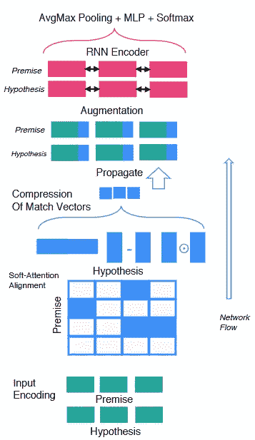

The high level overview of CAFE. Figure from [A Compare-Propagate Architecture with Alignment Factorization for Natural Language Inference](https://arxiv.org/abs/1801.00102)

1.  我用 MLP 替换了 FM 层，并将所有交互特征混合为一个矢量。我发现在尝试用 DeepFM 改变 FM 部分时效果更好。在我看来，这是因为 MLP 可以塑造高层次的互动，可以很好地与辍学正规化。
2.  至于交互层，我加了求和运算，同时比较各种特征。有趣的是，这样一个简单的动作将 LB 分数提高了 0.015。
3.  我将这个模型修改为对称架构。原因我会在正规化部分讲。

## 密集增强卷积神经网络

在实现 Cafe 时，我想出了一个主意。为什么不重复增加和转发的循环，这使得模型更好地融合了本地和序列信息。我试了一下。这个想法对 RNN 来说失败了，但对 CNN 来说却成功了。我认为这是因为 RNN 保留了每个时间步长的冗余信息，而 CNN 没有。CNN 只关注地区信息，这也是这场竞争的关键部分。

让我们回到可分解注意力的第一个缺点——掉话序。例如，它不是“我的”和“你的”。我们不应该独立地比较这几类词。我们需要的是看着它们附近的单词，比较整个短语。此外，该方法还减轻了冷启动字的影响。就像 word2vec 的核心信念一样，我们可以通过一个词的邻居来理解它的意思。

DACNN 的架构是可分解注意力的扩展。我设计了一个比较循环，将结果与原始嵌入重复连接起来，就像 DenseNet 一样。这对于特征重用和正则化是一个很好的想法，使得 DACNN 在几乎相同的性能下运行速度比 CPRNN 快 3 倍。

我们还尝试通过应用两次软对齐来对齐句子本身。这是另一种在语义摘要中起重要作用的自我注意方式。

# 模型种类

正如我们在上一节中看到的，这三个模型基于不同的假设。每个模型之间的相关性也可以表明这一事实。

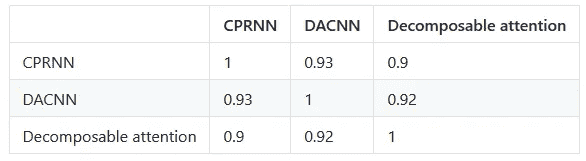

The correlation matrix of prediction from each model

所以我不打算谈论不同型号之间的差异。相反，我将展示如何在模型内部创建变体。方法很简单。如果我们在同一个网络中插入不同的输入，直觉上预测会不同。

我为每个模型准备了三种类型的输入:

1.  字级输入。我从官方的预训练嵌入中查找每个单词。我没有直接训练嵌入层，而是在它上面放置一个公路层来微调权重。
2.  字符级输入。我按照论文“字符感知神经语言模型”来创建字符级嵌入。这里是它的架构概述。

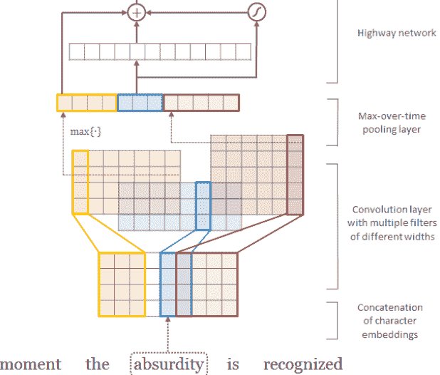

The way to costruct word embedding from char level.Figure from [Character-Aware Neural Language Models](https://arxiv.org/abs/1508.06615)

1.  具有元特征的单词级输入。元特征在特征工程中得到了很好的讨论。在公路图层之后，我将它们与交互功能连接起来。

这三个输入确实产生不同的预测，并在打包时导致显著的提升。

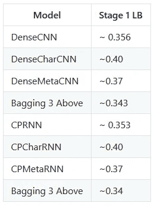

The LB socre of single model and blended.

你可能会问，为什么我们不同时接受各种输入呢？的确，这将是一个很好的尝试。准确地说，我们可以试验 2 - 1 种组合。我训练了其中的三个，因为我只有一台电脑。我相信我们可以通过包装所有类型的模型来进一步提高性能。

# 全体

受“提取神经网络中的知识”的启发，我为我的合奏使用了两级堆叠。第一层是各种模型的简单混合。我使用混合预测作为伪标签，并用它们微调所有模型。

第二层是 DART(漏失符合多重加性回归树),它从微调模型中获取输入。

至于伪标签，我使用软标签而不是硬标签有两个原因:

1.训练数据有噪声。我可以用传递法则做一个简单的证明。

*   规则 1:假设 A 和 B 相同，B 和 C 也相同。我们会认为 A 和 C 是相同的。
*   规则 2:假设 A 和 B 相同，B 和 C 不相同。我们会认为 A 和 C 是不同的。

规则 1 和规则 2 分别只适用于 75%和 95%的情况。我认为标签没有绝对的规则，可能因人而异。

2.软标签适合正则化，通常更有意义。关于软标签在“通过惩罚置信输出分布来正则化神经网络”和“用有噪声的标签学习”中的好处，有充分的讨论。特别是当采用对数损失作为评估标准时，我们希望输出的分布更加平滑，而不是更加极端。此外，在一个没有完美答案的任务中，我认为用概率来表示等级关系的程度会更有意义。

# 正规化

## 软标签

我们已经在合奏部分讨论过了。

## 拒绝传统社会的人

我倾向于在两个地方使用 dropout，而不是在每个密集层后设置小比率的 dropout:

*   与其他公司相比，我们的训练数据实在是太少了。也就是说，我们不能构建一个大模型，否则维度的诅咒会惩罚我们。

    所以我使用嵌入 dropout 在训练批次中随机丢弃一些单词。这一举动可以被认为是一种数据扩充。通过嵌入 dropout，我们可以仅使用少量数据来概括像 CAFE 这样的复杂模型。

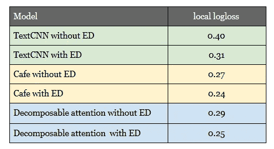

We can see that embedding dropout (ED) improve the performances of all models dramatically.

*   Concat-Feature dropout:
    我将 dropout 放在交互层之后。它遵循随机森林的精神，因为交互层只不过是一个特性池。该模型有时关注来自求和与相乘的特征，有时选择来自点和连接的特征。这种策略有助于模型对不同的数据视图进行归纳。

## 对称

在“NLP 中的外推法”中，他们观察到对称架构是一般化的关键。我认为这在这个任务中是有意义的——相似性度量也是对称的。我们期望 Sim(A，B)应该与 Sim(B，A)相同。但是，我们通常不会把它放在心上。当创建交互特征时，我们总是应用连接操作，该操作破坏了对称性。

那么去掉这个功能怎么样？
没那么容易。根据 Cafe 的消融研究，concat 功能是模型性能的功臣。

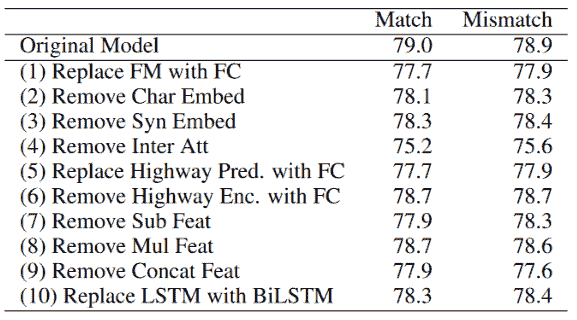

The ablation from [CAFE](https://arxiv.org/abs/1801.00102), we can see the scroe descreases significantly when removing Concat Feat

为了掌握对称性和连接特性，我做了两次连接操作。第一次用于[Sent1，Sent2]，第二次用于[Sent2，Sent1]。最后，平均这两个结果。

顺便说一下，我尝试了其他方法来解决对称的问题。例如，我们可以将训练数据加倍，一个用于句子对，另一个用于句子对**。或者，我们可以在测试阶段对对****和对**的预测进行平均。然而，这两种解决方案背后都有一定的成本，这就是我最终放弃它们的原因。****

# 性能比较

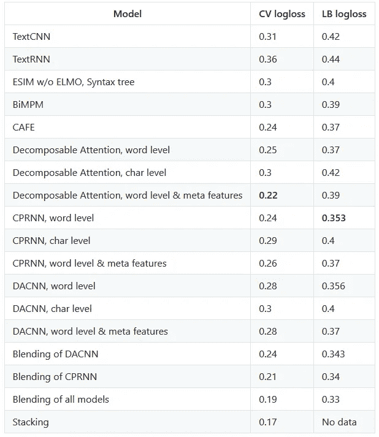

*The log loss of blending methods are measured by corresponding out-of-fold predictions.*

# 参考

1.  一种用于自然语言推理的带有对齐因子的比较传播结构
2.  自然语言推理的可分解注意模型
3.  字符感知神经语言模型
4.  用于句子分类的卷积神经网络
5.  DART:退出者遇到多重加法回归树
6.  DeepFM:一种基于因子分解机的神经网络用于 CTR 预测
7.  密集连接的卷积网络
8.  提取神经网络中的知识
9.  用于自然语言推理的增强型 LSTM
10.  自然语言处理中的外推
11.  从单词嵌入到文档距离
12.  用嘈杂的标签学习
13.  规范和优化 LSTM 语言模型
14.  通过惩罚置信输出分布来正则化神经网络
15.  R-net:具有自匹配网络的机器阅读理解
16.  使用数百万个表情符号来学习任何领域的表达，以检测情绪、情感和讽刺