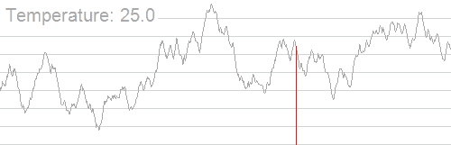
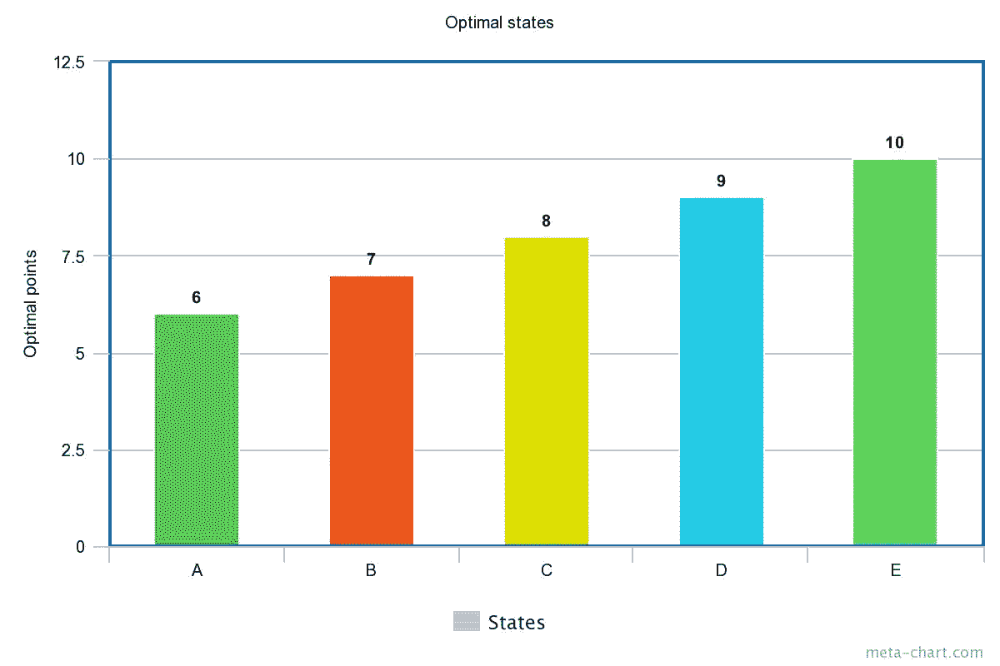
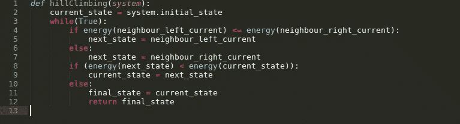
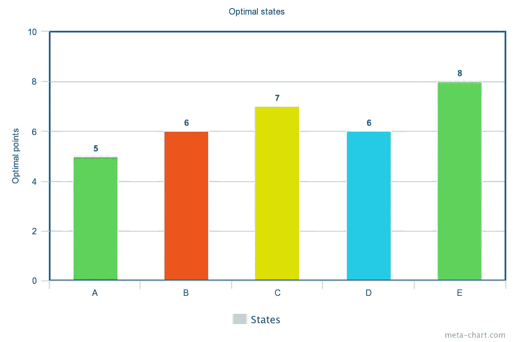
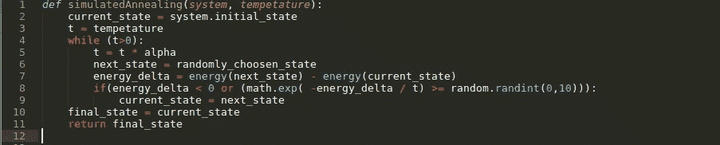

# 聚类问题的模拟退火:第一部分

> 原文：<https://towardsdatascience.com/simulated-annealing-for-clustering-problems-part-1-3fa8994a3ebb?source=collection_archive---------9----------------------->



Image source: Wikipedia

嘿，在这篇文章中，我将尝试解释如何在聚类问题中使用**模拟退火** (AI 算法)，这是一种用于逼近给定函数全局最优值的**概率技术**。首先，我想解释一下什么是模拟退火，在下一部分，我们将看到文章中的代码，它是这篇[研究论文](https://github.com/nvinayvarma189/Research-Papers-To-Code/blob/master/SA%20for%20clustering/1-s2.0-003132039290088Z-main.pdf)的实现。

**模拟退火(SA)** 广泛应用于搜索空间离散(不同且个体化的城市)的搜索问题(例如:寻找两个城市之间的最佳路径)。在这本由**斯图尔特·拉塞尔**和**彼得·诺威格**撰写的书中可以找到一个带有例子的精彩解释。 [AIMA](http://aima.cs.berkeley.edu/) 。

伪代码的 python 代码可以在这里找到。

[](https://github.com/aimacode/aima-python/blob/master/search.ipynb) [## aima code/艾玛-python

### 算法的 Python 实现来自 Russell 和 Norvig 的“人工智能-现代方法”…

github.com](https://github.com/aimacode/aima-python/blob/master/search.ipynb) 

为了直观地理解什么是模拟退火，我们需要对[爬山有一个简要的了解。](https://www.geeksforgeeks.org/introduction-hill-climbing-artificial-intelligence/.)爬山是一种旨在寻找系统最佳状态的算法。让我们快速地看一个例子。

假设有 5 个状态名为 A、B、C、D、E，我们有我们的人工智能算法，在这种情况下是爬山法，最初是在状态 A 上。让我们按降序分配状态的能量值，并且**假设具有最少能量的状态将是最佳的**。为了便于理解，我们取一个与能量成反比的参数`Optimal Points`，它决定了一个状态有多好。因此，最佳点应该以递增的顺序排列，让我们为状态 A、B、C、D、e 设置值 6、7、8、9、10。



这里 E 是最佳状态，因为它的能量较少，A 是最差状态，因为它的能量较多。

该算法的目标是选择最优状态(最小能量)作为最终状态。爬山方法是一种简单的方法，它基本上比较当前状态的相邻状态的能量，并选择三个状态中具有最小能量的一个状态作为下一个状态。 ***在我们的例子中，它比较当前状态的相邻状态的最优点，并选择三个状态中具有更多最优点的一个状态作为下一个状态。***



Pseudocode of Hill-Climbing Algorithm

```
def hillClimbing(system):
    current_state = system.initial_state
    while(True):
         if energy(neighbour_left_current) <=  energy(neighbour_right_current):
    next_state = neighbour_left_current
  else:
    next_state = neighbour_right_current
  if (energy(next_state) < energy(current_state)):
    current_state = next_state
  else:
    final_state = current_state
    return final_state
```

移动到比当前状态更优化(更少能量)的状态被认为是**好移动**，而移动到比当前状态更不优化(更多能量)的状态被认为是**坏移动**。严格来说，爬山只需要好的动作。

**现在我们可以看到，算法在状态 E 上结束，因为它具有最小的能量，因此是最佳状态。**

但是，这种方法有一个问题。如果我们将值 5、6、7、6 和 8 分别分配给状态 A、B、C、D 和 E，初始状态为 A，我们将永远不会到达状态 E，因为算法将选择 C 作为最终状态，因为 C 比其相邻状态具有更多的最佳点(更少的能量),并且当当前状态和下一状态相同时，算法将停止。正如我们所看到的，这不是全局最优。**这就是爬山的问题，它可能会在局部最优状态结束，并将其标记为最终状态**。



**模拟退火借助一个叫做温度**的参数解决了这个问题(在 SA [这里](https://en.wikipedia.org/wiki/Simulated_annealing) ) **了解更多关于温度参数的信息)。**假设你正在灌装一个空水瓶。最初，你会冲过去把水倒进去，对吗？当水到达瓶子的边缘时，你会放慢速度，小心地倒酒。SA 也做了类似的事情。最初，温度被设置为一个较高的值，并不断降低，直到为零。

当温度持续下降时，模拟退火算法将开始采取行动并进入新的状态。还有一个与温度参数成正比的概率因子。**这个概率因子告诉我们算法有多大可能移动到一个新的状态，即使它导致一个坏的移动。**

如果温度高，那么概率因子就高。**换句话说，在初始阶段，算法最有可能做出导致错误移动的动作，因为温度会很高，因此概率因子 P_E 会很高。在最后阶段，温度会很低，概率因子 P_E 会很低，因此它最不可能做出不好的举动。**

SA 用这种方法消除了**“陷入局部最优的机会”**问题。它确保在开始阶段(当温度高时)探索所有的状态，并且当温度降低时，它小心地选择一个状态作为下一个状态。



Pseudocode for Simulated Annealing

```
def simulatedAnnealing(system, tempetature):
    current_state = system.initial_state
    t = tempetature
    while (t>0):
          t = t * alpha
          next_state = randomly_choosen_state
          energy_delta = energy(next_state) - energy(current_state)
          if(energy_delta < 0 or (math.exp( -energy_delta / t) >= random.randint(0,10))):
             current_state = next_state
    final_state = current_state
    return final_state
```

这里**α**(即< 1)是温度下降的衰减率。概率因子是`math.exp(-energy_delta / t )`。

这是 s a 的一个非常基本的版本，我们将在下一部分中修改它，同时尝试使用 SA 将对象放入集群中。如果我解释的对你没有任何意义，请参考这个[视频](https://www.youtube.com/watch?v=eBmU1ONJ-os)，因为了解 SA 对进一步深入真的很重要。很快将会有另一部分，将会是解释这篇[论文](https://github.com/nvinayvarma189/Research-Papers-To-Code/blob/master/SA%20for%20clustering/1-s2.0-003132039290088Z-main.pdf)的代码。

**注:**SA 有几个版本解释不同。有一些例子，初始温度设置为零，并开始增加，直到一个极限。这里 P_E 应该是`math.exp(energy_delta / t )`和 alpha > 0。请不要被这样的例子所迷惑。只要确定你理解了这个概念。