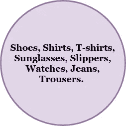
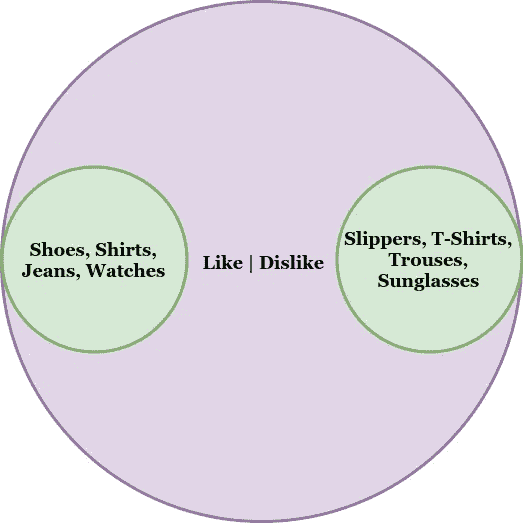
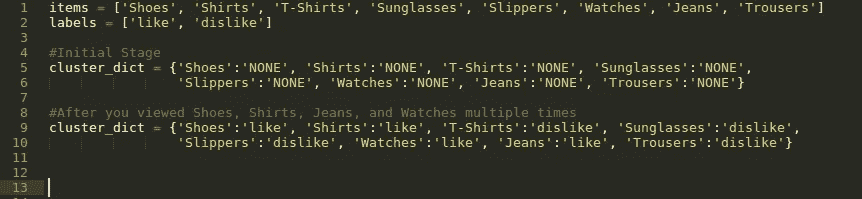
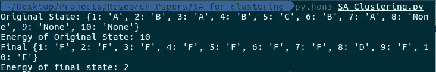

# 聚类问题的模拟退火:第二部分

> 原文：<https://towardsdatascience.com/simulated-annealing-for-clustering-problems-part-2-a095dd100dc?source=collection_archive---------8----------------------->

嘿，大家好，这是这个系列的第二部分，也是最后一部分。在这篇文章中，我们将把这张**[](https://github.com/nvinayvarma189/Research-Papers-To-Code/blob/master/SA%20for%20clustering/1-s2.0-003132039290088Z-main.pdf)**纸转换成 python 代码，从而获得对什么是模拟退火以及它如何用于聚类的实际理解。****

****[**本系列第 1 部分**](/simulated-annealing-for-clustering-problems-part-1-3fa8994a3ebb) 涵盖了模拟退火( **SA** )的理论解释，并附有一些例子。推荐你读一读。然而，如果你对 SA 非常了解或熟悉，我认为你可以理解你将要阅读的大部分内容，但如果有什么不确定的，你可以随时转到第 1 部分阅读。我不打算解释整篇论文，只解释实用部分。****

****因此，让我们从了解集群的含义开始。**聚类是一种无监督学习技术，其目标是基于对象之间的相似性将标签附加到未标记的对象上。**让我们快速进入一个可以使用聚类的真实示例，这样您会有更好的理解。假设有一个购物网站，你可以在那里查看衣服，配饰，如果你喜欢就买。****

********

****Items in the Shopping Website****

****假设这些是您访问过的购物网站上提供的商品。当你反复查看鞋子、衬衫、牛仔裤和手表等少数商品时，你会发现越来越多的商品被推荐给你。你注意到了吗？这是怎么发生的呢？**事情是这样发生的:**网站会统计你浏览一个产品的次数。基于这个数字，项目被聚类成喜欢的**和不喜欢**的**。当你反复看一些产品时，也许你是想买你喜欢的那种相似的产品。因此，该网站将衬衫、鞋子、牛仔裤和手表放在**“喜欢”**集群下(换句话说，给它们贴上喜欢的标签)，并将其他浏览次数较少的商品放在**“不喜欢”**集群下。这些标签只是例子。它们可以被命名为类似于**【可能购买】**或**【可能不购买】**的任何东西，这取决于网站的开发者。******

****

**After Clustering**

**对不起，我的演讲技巧不好，但我希望你去的想法。现在其他网站可以使用这些信息，向你展示关于鞋子、衬衫等的广告。这是一个很基本的例子。在现实生活中，可能有更多的因素影响聚类(不仅仅是你查看它的次数)。**

**从程序上来说，它看起来会像这样:**

****

**Example of how the code looks**

**根据您查看项目的次数，项目将被聚类。**基于发生聚类的因素称为** **内部聚类准则**。这里的内部聚类标准是你查看一个项目的次数。内部聚类标准的另一个流行的例子是**距离，**用于 [**K-Means 聚类**](https://en.wikipedia.org/wiki/K-means_clustering) (参考 [Mubaris Hassan](https://medium.com/u/eaa3b28b4560?source=post_page-----a095dd100dc--------------------------------) 的这篇[帖子](https://mubaris.com/posts/kmeans-clustering/)以获得更好的解释)。**

**现在您已经了解了聚类和内部聚类标准，**我们的目标是使用模拟退火，按照预定义的内部聚类标准进行聚类。****

**让我们使用一个示例场景开始实现本文中所写算法的代码。假设有 10 个对象(1 到 10)和 6 个标签(A 到 F ),初始状态如下:**

```
initial_state = {1:’A’, 2: ‘B’, 3:’A’, 4:’B’, 5:’C’, 6:’B’, 7:’A’, 8:’None’, 9:’None’, 10:’None’ }
```

**这里，对象 1 至 7 被标记，而对象 8 至 9 没有被标记。**

**让我们把未使用的标签放在一个列表中**

```
unused_labels = ['D', 'E', 'F']
```

****基本算法步骤是:****

1.  **称为**“初始温度”**的变量被设置为高，并持续降低，直到称为**“最终温度”的低温值。****
2.  **当温度持续下降时，将**“初始状态”**作为**“当前状态”。****
3.  **对当前状态进行操作，并根据定义的内部聚类标准计算其能量。如果这个**“扰动状态”**(扰动状态)与当前状态不同，则选择它作为**“下一状态”**。**
4.  **计算下一个状态和当前状态的能量之差。**
5.  **仅当能量差小于零或**“概率因子”**(取决于当前温度)大于或等于 0 到 1 之间的随机十进制数(或 0 到 10 之间的随机整数)时，下一状态的值才被放入当前状态。**
6.  **这取决于温度值和一个名为**“最大迭代次数”的参数。****

**存在类似于**、**、**、【成本增加次数】、**、最大随机扰动迭代次数、**、【接受率】、【概率ε】、**(不要与上述概率因子混淆)和**、【Beta】、** (0 < beta < 1】、**的参数，使用这些参数来计算初始和最终温度。****

```
initial_temperature = avg_cost_increase / math.log( num_cost_increases / ((num_cost_increases * acc_ratio) — (1-acc_ratio) * (max_iter — num_cost_increases)))final_temperature = -beta * avg_cost_increase / math.log(prob_e)
```

****“alpha”**定义为温度持续下降的衰减率。**

```
alpha = math.pow(final_temperature / initial_temperature , 1 / num_temp)
```

**最大值、接受率、概率ε和β的值为:**

```
avg_cost_increase = 200
acc_ratio = 0.75 
prob_e = 0.00000000001
beta = 0.125
max_iter =  4 * num_objects
```

****所有这些数值和公式都取自论文本身。**我不想在这里解释所有的参数，因为我们必须更深入地挖掘，我认为这将稍微偏离我们的实际主题。但是，如果您非常感兴趣，请参见[论文](http://www.derczynski.com/sheffield/papers/archive/1-s2.0-003132039290088Z-main.pdf)的参考资料部分。**

**这是我们到目前为止所做的代码。让我们看看模拟退火函数:**

**在解释这一点之前，我需要解释两个叫做**“value”的函数，它计算一个状态的能量**和**“action _ on ”,它干扰当前状态，直到出现变化，并使受干扰的状态成为下一个状态。****

**这是代码中最重要的部分。我们需要计算状态的能量，为此，我们需要定义一个状态何时会高能或低能。**让我们定义，当有更多的对象被标记为 F 时，状态将具有较少的能量，而当有较少的对象被标记为 F 时，状态将具有较高的能量。因此，算法将总是努力使状态具有最低的可能能量，因此，它将尝试将最大数量的对象放入 F 簇中，换句话说，将最大数量的对象标记为 F。****

****因此，这里的内部聚类标准是将最大数量的对象标记为 F。你可以尝试任何其他标签。您可以尝试不同的内部聚类标准，如标记为 B 的对象数量应该等于标记为 A 的对象数量，标记为 A 的对象数量应该是标记为 C 的对象数量的 1/3，以及更多涉及不同标签的此类数学等式。请确保您理解了这一段，因为这是您在各种情况下执行本准则的关键点。****

**现在让我们来看看代码中对当前状态进行操作以产生下一个状态的部分:**

**我们初始化两个列表 L(已用标签)和 Lc ( L 补码-未用标签列表),并将当前状态复制到称为扰动状态的新变量中。选择一个随机对象，进入循环后，在[0，|L|]之间选择一个随机整数 m。如果 m = 0，并且存在一个未使用的簇标签(即|L| < k)，那么较早选择的随机对象将从未使用标签列表中获得一个随机标签。如果使用的标签的长度和标签的总数(k)相等，那么这意味着没有未使用的标签，并且所选择的对象将从使用的标签列表中获得一个随机标签。**

**现在我们需要检查扰动状态是否不同于当前状态。可能有这样一种情况，一个对象获得了它已经拥有的相同标签。**例如:**对象 3 已被随机选择，其中一个条件(m > 0 或 l 的长度等于 k)为真，标签 A 从已用标签列表中随机选择。**在这种情况下，扰动后的状态将与当前状态相同。不会有变化。所以我们将运行这个循环，直到扰动状态不等于当前状态，最后返回扰动状态。****

****所以我们把微扰态作为 nex 态，之后通过值函数计算下一个态的能量。如果下一个状态的能量小于当前状态的能量，或者如果概率因子大于或等于 0 到 10 之间的随机整数，则我们将下一个状态的值放入当前状态。****

1.  **这个过程持续运行(最大迭代次数乘以初始和最终温度的差值)次。**

**以下是最终代码:**

**以下是输出:**

****

**在这里，每次“最终状态能量”都有不同的值，因为在每次执行时，算法会随机选择许多值。您可以对参数进行一些调整，看看结果是如何受到影响的。**通过足够大的最大迭代次数和足够小的(1-接受率)、β和概率ε，您可以获得更好的结果。****

**就是这样，伙计们，我尽了最大努力将论文的一小部分转换成简单的语言。我希望你明白整个概念。如果你觉得一下子处理所有这些很困难，那也没关系。如果你有什么不确定的，请再读一遍。**如果您有任何不明白的地方或发现任何技术或语法错误，请留下您的回复。此外，不要忘记尝试在您的系统上运行这个程序，并调整参数以获得更好的结果。你可以在这里** [**叉**](https://github.com/nvinayvarma189/Research-Papers-To-Code) **一下。****

**非常感谢你的时间。祝您愉快！！**