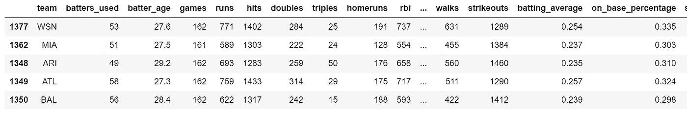
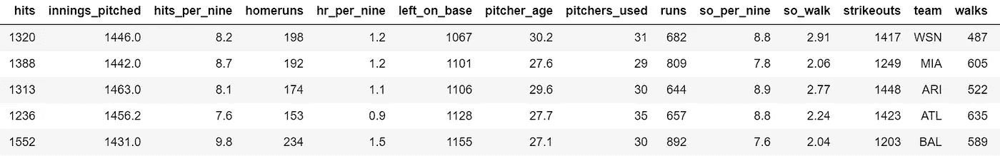
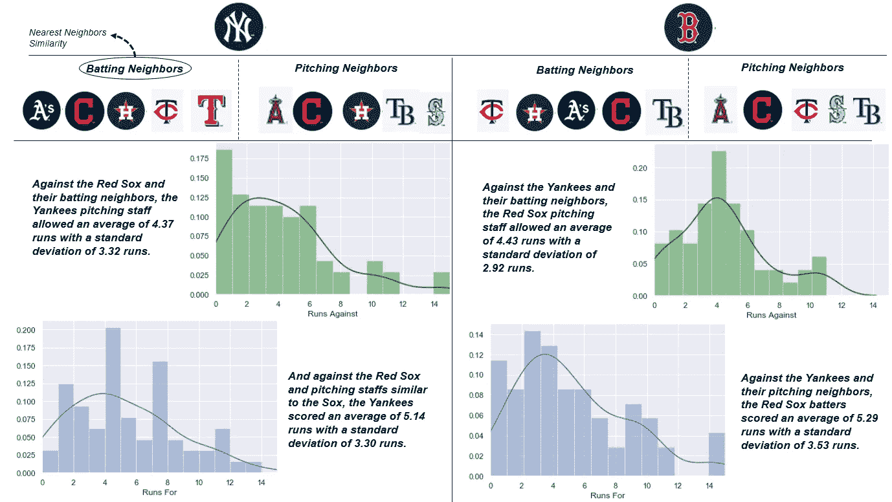
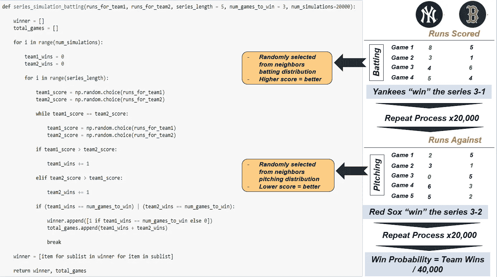
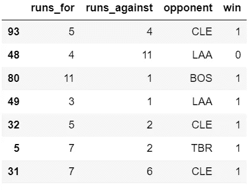
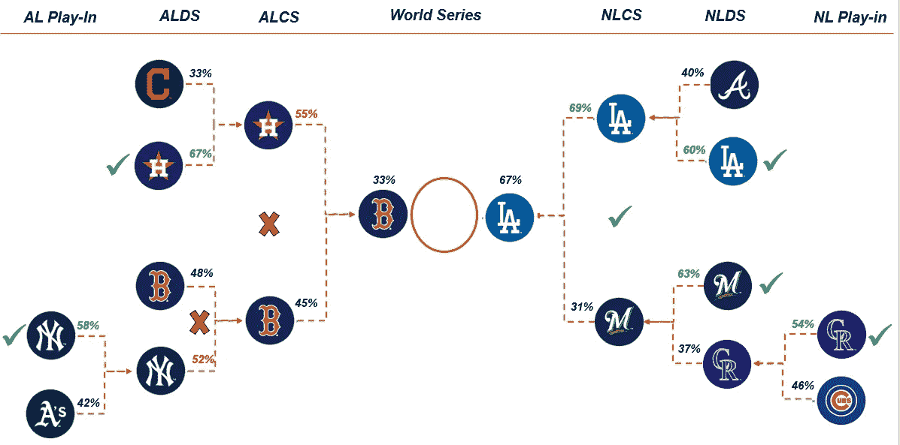

# 模拟 2018 年世界大赛

> 原文：<https://towardsdatascience.com/simulating-the-2018-world-series-45bc16e3aa27?source=collection_archive---------14----------------------->


美国职业棒球大联盟赛季的一个有趣的部分是，162 场比赛的艰苦努力在季后赛中变成了 5 或 7 场赢家通吃的系列赛。每个系列只播放一次，这允许随机性进入方程。更好的团队并不总是赢。

如果我们真的可以多次播放这个系列并找到最有可能的结果呢？这是模拟背后的基本思想:向方程或模型提供输入，多次重复该模型，然后找到与期望结果匹配的出现次数。

棒球模拟可以非常复杂和精细，甚至可以是针对投手、棒球场和其他因素调整的逐个击球手的模拟。这种细节水平令人钦佩，但我决定采取一种新的，不同的方法来模拟。

相反，我会看击球手(得分)和投手(允许得分)对一个球队的对手和其他类似对手的球队的比赛表现，以模拟得分和系列赛获胜者。

所有项目代码都在我的 GitHub 上。

**数据**

这个项目的数据包括投球和击球的年度团队统计数据，这是我为[之前的项目预测季后赛球队](/modeling-mlbs-2018-playoff-teams-b3c67481edb2)收集的。这些数据将允许我们将一个球队的统计数据与他们联盟中的其他球队进行比较。数据示例如下:



Sample of the batting data used



Sample of the pitching data used

除了年度统计数据，该项目还需要每个团队 2018 年的逐场比赛结果。同样，baseball-reference.com 是一个有用的资源，因为我们可以导航到一支球队的 2018 年赛程，并收集所需的数据，如主队和客队以及对手的得分。

**流程**

这个模拟的基本假设是我们可以

1.  在他们的联盟(美国或国家)中找到一个球队最相似的击球和投球“邻居”(即每个类别中季末统计数据最相似的球队)。然后，我们可以看到一个球队在常规赛中分别与对手加上对手的“邻居”在击球和投球方面的表现。
2.  利用与类似对手比赛的结果，我们可以在常规赛中创建得分(击球手)和允许得分(投手)的分布。然后，我们将通过从得分分布中随机抽取每个队的得分来“模拟”一场击球比赛。我们将通过从允许得分分布中随机抽取每个队的允许得分值来单独“模拟”一场投球比赛。比赛的获胜者是得分值(击球)或允许得分值(投球)较高的一方。
3.  接下来，我们通过使用第(2)点中描述的方法继续模拟游戏来模拟系列赛，直到其中一个团队达到 3 胜(5 场系列赛)或 4 胜(7 场系列赛)。
4.  对击球手重复系列模拟过程 20，000 次，对投手重复 20，000 次，总共 40，000 次模拟。
5.  计算一个队赢得系列赛的百分比；这表示从模型中预测的该队将赢得系列赛的总概率(> 50% =系列赛获胜者)。

> 实际上，我们想知道一个队的击球手和投球人员在与另一个队“相似”的对手比赛时表现如何(例如，一个队的击球手与对手相似的投球人员比赛时表现如何，以及一个队的投球人员与对手相似的击球手比赛时表现如何)，并使用这些信息来模拟比赛。

我们可以在已经完成的季后赛系列赛中测试这一过程，以提供对其准确性的早期看法，并模拟世界大赛的获胜者。

让我们以红袜队对洋基队系列赛为例，逐一介绍每一个步骤:



The function to simulate the batting outcome is the code on the left; the pitching function can be found in the linked code on GitHub.

**类似团队表现**

虽然季后赛棒球不同于常规赛棒球，我们可以假设一支球队在常规赛中的表现与他们在季后赛中的表现相似。因此，如果我们能发现一支球队如何对抗对手，以及与对手相似的其他球队，我们就能为他们的季后赛表现找到一个合理的代理。*这一概念是以下段落*中提出的建模的关键。

我们将如何定义相似性？

为了计算相似性，我们可以用一个[最近邻](http://scikit-learn.org/stable/modules/generated/sklearn.neighbors.NearestNeighbors.html#sklearn.neighbors.NearestNeighbors)模型来拟合我们的击球和投球数据集。无监督机器学习算法计算点之间的距离，并返回最接近输入值的点。

```
# Example: Find the closest 5 neighbors to the Yankeesneighbors = NearestNeighbors(n_neighbors = 5)neighbors.fit(df)# Find the distance from the Yankees on our fitted data frame and index values 
distance, idx = neighbors.kneighbors(df[df.index == 'NYY'], n_neighbors=5)
```

因为我们的目标是进行足够多的比赛，我将邻居限制在对手球队联盟中最相似的 5 支球队(加上对手)。这意味着对于扬基队和红袜队，我们将寻找美国联盟中最常见的五支球队。

如果我们要扩展到美国和国家联盟，洋基队最相似的邻居都是红袜队没有打过的国家联盟球队，这不会帮助我们创建我们的分布。因此，为了更高的样本，我们牺牲了一些潜在的更好的相似性邻居。

使用邻居，我们可以看到扬基队击球手在面对类似红袜队投手的比赛中的表现(例如，他们通常得分多少分？)以及洋基队的投手面对类似红袜队打者的球队表现如何(例如，他们通常允许多少分？).

```
# Note how we ensure that the opponent is in the opposite category (i.e. batting performance is against the other team's pitching neighbors).nyy_batting_performance = df_nyy[df_nyy.opponent.isin(bos_pitching_neighbors.index)]nyy_pitching_performance = df_nyy[df_nyy.opponent.isin(bos_batting_neighbors.index)]
```

这产生了一个洋基队对红袜队的表现的数据框架，以及五支以与他们的投手战果最相似的结果结束的球队:



A sample of the Yankees performance in games against teams similar to the Red Sox pitching staff

**模拟游戏**

这个过程的最重要部分是第一步，而剩下的大部分可以通过一系列的`if`语句和`for`循环来完成。

对于一个游戏模拟，我们只是从每个队的击球数据帧中随机选择一个值，然后比较结果，得分高的就是赢家。同样，对于投手，我们遵循同样的过程，但放弃最少得分的队是赢家。

下面的代码提供了一个游戏模拟，确保两个分数永远不会相同:

```
## Draw a random number from the distribution of runs in games against similar opponentsteam1_score = np.random.choice(runs_for_team1)
team2_score = np.random.choice(runs_for_team2)## Repeat simulations until the score is not the same while team1_score == team2_score:

    team1_score = np.random.choice(runs_for_team1)
    team2_score = np.random.choice(runs_for_team2)## If team 1’s score is higher, that team wins. Otherwise, team 2 is credited with the win. if team1_score > team2_score:

    team1_wins += 1

elif team2_score > team1_score:

    team2_wins += 1
```

**模拟连续剧**

在上一部分的基础上，我们可以通过重复这个过程来模拟五到七场比赛，直到一支队伍达到我们期望的获胜场次:

```
## Start each team with 0 winsteam1_wins = 0
team2_wins = 0## Once one of the teams reaches the desired number of games to win, we append either a 1 (if team  1 wins) otherwise a 0 (indicating team 2 wins)if (team1_wins == num_games_to_win) | (team2_wins == num_games_to_win):

    winner.append([1 if team1_wins == num_games_to_win else 0])
    total_games.append(team1_wins + team2_wins)

    ## Stop the simulation and start fresh once we have a winner break
```

到目前为止，这个过程代表一个单一系列的模拟。

**重复该过程并计算百分比**

如前所述，单个游戏或系列引入了随机性，但这种随机性最终应该成为一个重复互动的有凝聚力的故事。

出于这个原因，我们将重复这个过程数千次——在这个例子中是 20，000 次，包括投球和击球——并计算一个队赢得模拟系列赛的百分比。然后这个数字就变成了我们的球队赢得系列赛的概率，超过 50%的是我们预测的球队。

**管用吗？**

这个过程是符合逻辑的，但是它有效吗？要全面评估这个模型的能力，需要大量的回溯测试，几十年的数据是最有帮助的。为了这篇文章，我在 2018 年季后赛结果上进行了测试，以提供示例输出。

到目前为止，运行该系列的算法，包括通配符游戏，导致 8 个正确预测中的 6 个。假设猜对的几率为 50/50，对于 2018 年的季后赛，我们能够将选出赢家的几率提高 25 个百分点。当然，这样一个小样本并不重要，但是值得注意。

唯一不正确的预测是与红袜队的两场系列赛——相当讽刺，因为他们现在在世界系列赛中。



Probability of each team winning the series and accuracy of predictions

**2018 世界大赛预测**

那么，谁会赢得世界大赛呢？该模型预测道奇队，并对 67%的预测率相当有信心，但前两次押注红袜队不会产生很好的结果。

和任何概率一样，它只是说，根据模型，道奇队赢的可能性更大，而不是说他们每次都会赢。

**结论和后续步骤**

概率可以是一种有趣的方式来处理一个静态的、一次性的事件，同时理解结果并不完全可行。洋基队不能赢得 52%的系列赛，但我们可以看到谁可能在一场比赛或系列赛中有优势。

有几种方法可以继续这个项目:

*   回测！这个数据只代表了季后赛的一小部分。代码以这样一种方式设置，即运行抓取算法可以在任何赛季、任何年份和任何球队中进行，然后可以用这些球队调用这些函数。
*   说到函数，我认为它们可以被进一步压缩以简化运行它们的调用。我很想听听任何人对建议的反馈，以尽量减少运行每个模拟所需的呼叫次数。
*   引入额外的统计数据可能会进一步提高准确性。当计算相似性时，我把自己限制在棒球参考上，但这并不意味着这是唯一或最好的数据。

这些只是一些建议，如果有人有兴趣从这里拿起火炬。

在体育运动中，总会有随机因素、人为干预和纯粹的运气。最终，数据和模拟永远不会 100%准确地告诉我们谁是赢家，也不会复制坐下来观看比赛的兴奋感，但当我们将数据纳入画面时，我们可以通过不同的视角来看待比赛和比赛，这也可以提供有趣的见解。

*如果您有任何问题或反馈，我很乐意收到您的来信！在 jordan@jordanbean.com 给我发邮件或者通过* [*LinkedIn*](http://www.linkedin.com/in/jordanbean) *联系我。*