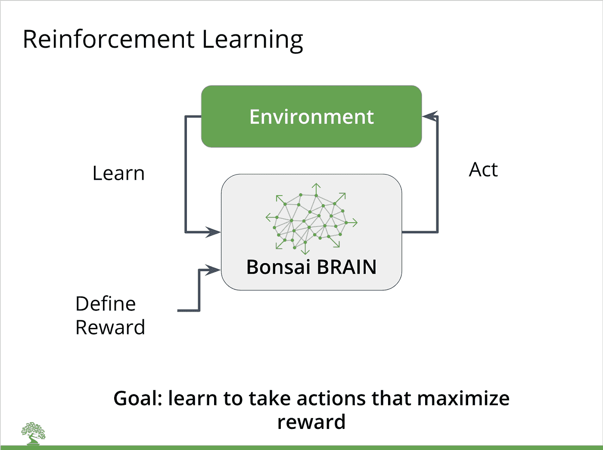

# 模拟器:应用深度强化学习的关键训练环境

> 原文：<https://towardsdatascience.com/simulators-the-key-training-environment-for-applied-deep-reinforcement-learning-9a54353f494f?source=collection_archive---------6----------------------->

深度强化学习(DRL)是目前人工智能中最令人兴奋的领域之一。现在还为时尚早，但这种技术可以应用于明显且服务不足的市场:希望自动化或优化工业系统和流程效率的企业(包括制造、能源、HVAC、机器人和供应链系统)。

但是建立应用 DRL 有一个关键因素:模拟环境。在这篇博客中，我们将告诉你模拟器可以做什么，你为什么需要它们，以及你如何使用 Bonsai 平台+模拟器来解决实际的业务问题。

**什么是模拟？**

让我们从定义术语“T2 模拟”开始，因为这是一个相当抽象的概念。模拟的范围从飞行模拟器到电子和机械部件或整个城市模型的模拟。

****模拟*** *是对现实世界过程或系统随时间的运行的模仿**

*本质上，存在某种系统，该系统具有许多输入，将一些数学函数应用于这些输入，并以可视数据(如机器人模拟器)或纯数据(如能量模拟器， [EnergyPlus](https://energyplus.net/) )的形式传回输出。*

*计算机科学家使用模拟已经有一段时间了，可以追溯到 20 世纪 50 年代末。在过去的 20 年里，不断增长的计算能力和大量的数据使得模拟的逼真度和价值都有了显著的提高。许多领先的工业模拟几乎完全符合物理现实或业务流程。*

*一个巨大的影响是数字游戏产业的发展。游戏玩家希望获得更加身临其境的体验，需要高保真的图形和虚拟世界中更真实的物品行为。在过去的 30 年里，游戏中间件公司开发并交付了强大的 3D 和 2D 物理引擎。*

***工业模拟***

*通过利用这些软件产品和各种数学库，企业能够模拟具有大量组件的复杂系统，允许主题专家(SME)在真实世界中构建系统之前测试和评估系统。用例包括数字双胞胎、机器人、调整小型和大型工业机器、多种电气和物理系统，以及优化供应链等业务流程。*

*虽然存在大量基于单个模型的定制和非常专业的模拟，但是也存在许多能够运行和模拟基本上无限数量的模型的模拟器平台。例子有 [MATLAB Simulink](https://www.mathworks.com/products/simulink.html) (工程和制造) [ANSYS](http://www.ansys.com/) (工程) [AnyLogic](https://www.anylogic.com/) (供应链) [Gazebo](http://gazebosim.org/) (机器人) [TRNSYS](http://www.trnsys.com/) (能源)，等等。*

***模拟+深度强化学习***

*强化学习(RL)被定义为:*

**“一个领域的* [*机器学习*](https://en.wikipedia.org/wiki/Machine_learning) *关心的是如何让* [*软件代理*](https://en.wikipedia.org/wiki/Software_agent) *应当采取* [*行动*](https://en.wikipedia.org/wiki/Action_selection) *在一个环境中获得最大化的累积报酬”*。*

*换句话说，RL 训练智能体通过在给定环境中尝试大量动作来学习如何行动的策略，优化定义的奖励函数。*

*深度强化学习(DRL)遵循相同的方法，使用深度神经网络来表示策略。*

**

*强化学习需要大量的“反复试验”——或与环境的互动——来学习一个好的政策。因此，模拟器需要以一种经济有效且及时的方式获得结果。*

*想象一下，试图教一个机器人走路，通过观察一个真实的，物理的机器人尝试和跌倒 100，000 次，然后才能成功和持续地行走。或者训练一个人工智能玩围棋，实际上是和一个人类对手玩几十万局。模拟器允许这些情节在数字世界中发生，训练人工智能发挥其全部潜力，同时节省时间和金钱。*

*一些模拟对环境进行建模，其中代理可以采取[连续的](https://en.wikipedia.org/wiki/Continuous_simulation)动作来影响环境的状态；其他模拟模型设置，其中[离散](https://en.wikipedia.org/wiki/Discrete_event_simulation)输入产生不同的输出。这两种类型的模拟都可以用于强化学习。*

***模拟+深度强化学习+盆景***

*Bonsai 是一个人工智能平台，允许企业将控制编程到工业系统中，也是唯一一个使用深度强化学习对工业系统进行编程控制的商业产品。*

*使用 Bonsai 平台，企业可以建立一个大脑(一个 ai 模型)，连接他们选择的模拟器，并在那个环境中训练大脑学习一个期望的行为。*

*要了解更多关于构建模拟并将 DRL 应用于您的企业的信息，请访问我们的[入门](https://bons.ai/getting-started)页面。*