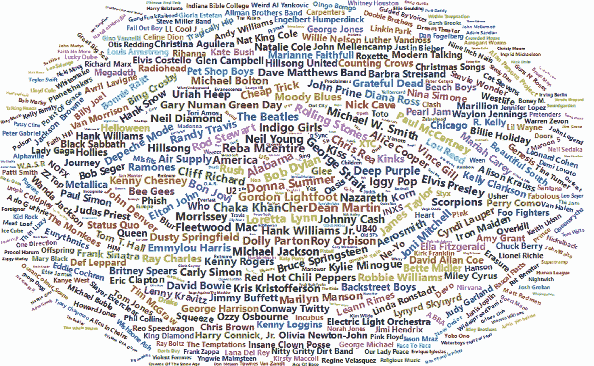
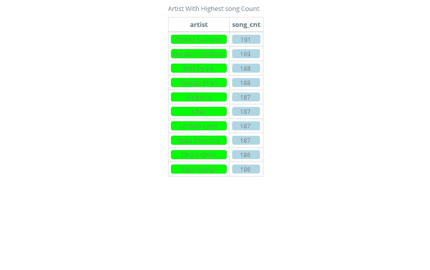
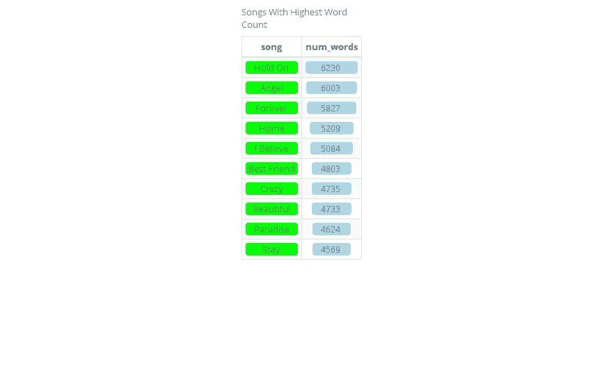
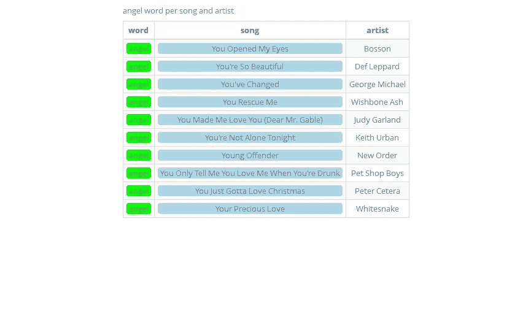
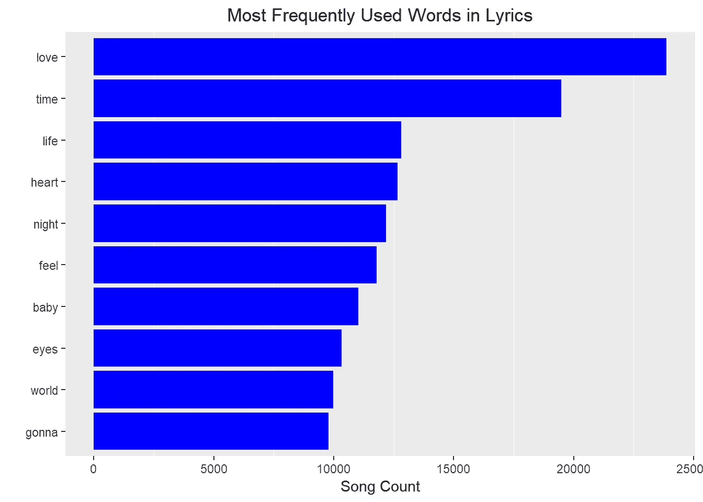
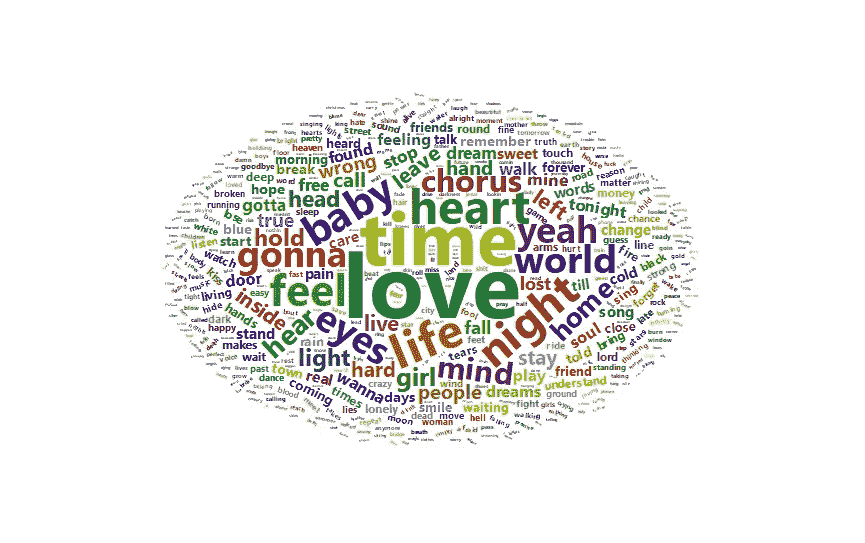
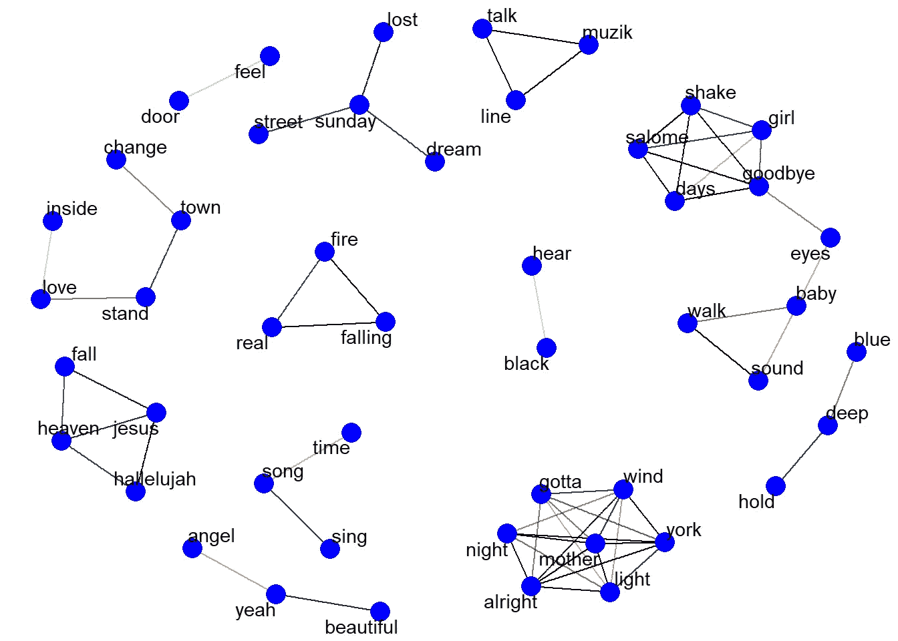
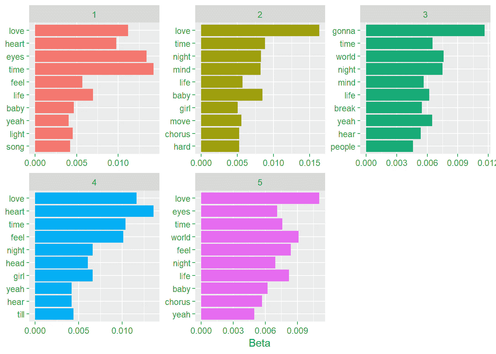
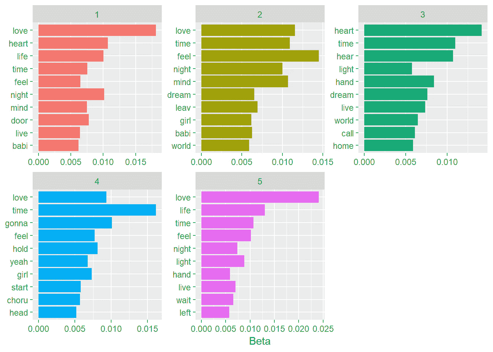

# 用文本挖掘唱歌

> 原文：<https://towardsdatascience.com/sing-song-with-text-mining-cd8508ab51a5?source=collection_archive---------8----------------------->



文本分析应用于许多领域，目标是发现隐藏在文本中的相关信息。自然语言处理(NLP)是一种用于文本挖掘的方法。它试图通过标记化、聚类、提取关系和使用算法识别主题来解码书面语言中的歧义。自然语言处理是人工智能的一个分支，代表着人类和计算机之间的桥梁；它可以广义地定义为通过软件对自然语言(如语音和文本)的自动操作。对于这份工作，我使用了这些参考资料:
[https://www . ka ggle . com/devisangeetha/sing-a-song-lyrics-is-here/](https://www.kaggle.com/devisangeetha/sing-a-song-lyrics-is-here/)
[https://www . data camp . com/community/tutorials/R-NLP-machine-learning](https://www.datacamp.com/community/tutorials/R-nlp-machine-learning)
[https://www.kaggle.com/rtatman/nlp-in-r-topic-modelling](https://www.kaggle.com/rtatman/nlp-in-r-topic-modelling)
[https://www.tidytextmining.com/](https://www.tidytextmining.com/)

## 探索性数据分析

***每位艺人的歌曲数***

```
song_grp<-lyrics %>%group_by(artist)%>%summarise(song_cnt=unique(length(song)))%>%arrange(desc(song_cnt))
song_grp[1:10,] %>%
  ungroup(artist, song_cnt) %>%
  mutate(song_cnt = color_bar("lightblue")(song_cnt)) %>%
  mutate(artist = color_tile("green","green")(artist)) %>%
  kable("html", escape = FALSE, align = "c", caption = "Artist With Highest song Count") %>%
  kable_styling(bootstrap_options = 
                  c("striped", "condensed", "bordered"), 
                full_width = FALSE)
```



## 标记化

已加载 tidytext 库使用 unnest_tokens()函数开始标记化。这个函数至少需要两个参数:输出列名(即 word)和输入列名(即 text)。获取歌词数据集并将其传输到 unnest_tokens()中，然后删除停用词。它们是过于常见的词，可能不会给我们的结果增加任何意义。有不同的列表可供选择，但在这里我使用了 tidytext 包中名为 stop_words 的词典。将歌词标记成单词后，我使用 anti_join()删除了停用的单词，然后使用 distinct()删除了任何重复的记录。最后，我删除了所有少于四个字符的单词，因为在歌词中这些通常是感叹词。

```
lyrics_filtered <- lyrics %>%
  unnest_tokens(word, text) %>%
  anti_join(stop_words) %>%
  distinct() %>%
  filter(nchar(word) > 3)
head(lyrics_filtered)##   artist                  song      word
## 1   ABBA Ahe's My Kind Of Girl wonderful
## 2   ABBA Ahe's My Kind Of Girl     means
## 3   ABBA Ahe's My Kind Of Girl   special
## 4   ABBA Ahe's My Kind Of Girl    smiles
## 5   ABBA Ahe's My Kind Of Girl     lucky
## 6   ABBA Ahe's My Kind Of Girl    fellow
```

## 字频率

在音乐中，无论是重复还是罕见，单个词频都有很大的重要性。两者都会影响整首歌本身的可记忆性。歌曲作者可能想知道的一个问题是词频和热门歌曲之间是否有关联。所以我总结了每首歌的字数，为了简单评估，我还总结了所有数据集中最常用的词。

```
full_word_count <- lyrics %>%
  unnest_tokens(word, text) %>%
  group_by(song) %>%
  summarise(num_words = n()) %>%
  arrange(desc(num_words)) full_word_count[1:10,] %>%
  ungroup(num_words, song) %>%
  mutate(num_words = color_bar("lightblue")(num_words)) %>%
  mutate(song = color_tile("green","green")(song)) %>%
  kable("html", escape = FALSE, align = "c", caption = "Songs With Highest Word Count") %>%
  kable_styling(bootstrap_options = 
                  c("striped", "condensed", "bordered"), 
                full_width = FALSE)
```



***每首歌字数最多的艺人***

```
lyrics_filtered %>% 
  filter(word == "angel") %>%
  select(word, song, artist) %>%
  arrange() %>%
  top_n(10,song) %>%
  mutate(song = color_tile("lightblue","lightblue")(song)) %>%
  mutate(word = color_tile("green","green")(word)) %>%
  kable("html", escape = FALSE, align = "c", caption = "angel word per song and artist") %>%
  kable_styling(bootstrap_options = 
                  c("striped", "condensed", "bordered"), 
                full_width = FALSE)
```



***顶字***

```
lyrics_filtered %>%
  count(word, sort = TRUE) %>%
  top_n(10) %>%
  ungroup() %>%
  mutate(word = reorder(word, n)) %>%
  ggplot() +
  geom_col(aes(word, n), fill = "blue") +
  theme(legend.position = "none", 
        plot.title = element_text(hjust = 0.5),
        panel.grid.major = element_blank()) +
  xlab("") + 
  ylab("Song Count") +
  ggtitle("Most Frequently Used Words in Lyrics") +
  coord_flip()
```



***文字云***



## 相关性:找出艺术家“U2”创作的歌曲中单词之间的相关性

对于变量之间的比较或按行分组，整齐的数据是一种有用的结构，但在行之间进行比较可能具有挑战性。大多数寻找成对计数或相关性的操作需要首先将数据转换成宽矩阵。widyr 包使得诸如计算计数和相关性之类的操作变得简单。一个有用的函数是 pairwise_count()函数。前缀 pairwise_ 意味着它将为单词变量中的每一对单词生成一行。输入中每对文档和单词对应一行，而输出中每对单词对应一行。这也是一个整齐的格式。目标是检查单词之间的相关性，这表明它们一起出现的频率相对于它们单独出现的频率。重点是 phi 系数，这是衡量二进制相关性的常用指标。这相当于皮尔逊关联，单词 X 和 Y 要么都出现，要么都不出现，而不是一个出现另一个。widyr 中的 pairwise_cor()函数让我们可以根据单词在同一部分出现的频率来找到单词之间的 phi 系数。它的语法类似于 pairwise_count()。它使用 ggraph 来可视化二元模型:可视化 widyr 包找到的词的相关性和簇。

```
set.seed(12345)
word_corr %>%
  filter(correlation > .75) %>%
  graph_from_data_frame() %>%
  ggraph(layout = "kk") +
  geom_edge_link(aes(edge_alpha = correlation), show.legend = FALSE) +
  geom_node_point(color = "blue", size = 5) +
  geom_node_text(aes(label = name), repel = TRUE) +
  theme_void()
```



# 基于 LDA 的无监督学习

主题建模是一种对这种文档进行无监督分类的方法，类似于对数字数据进行聚类，这种方法可以找到自然的项目组。潜在狄利克雷分配(LDA)是一种特别流行的拟合主题模型的方法。它将每个文档视为主题的混合，并将每个主题视为单词的混合。潜在狄利克雷分配是主题建模最常用的算法之一。每个文档都是主题的混合体。我们设想每个文档可能包含来自几个主题的特定比例的单词。每个话题都是单词的混合。LDA 是一种数学方法，用于同时估计这两者:找到与每个主题相关联的词的混合，同时还确定描述每个文档的主题的混合。我使用了 topicmodels 包中的 LDA()函数，设置 k = 5，创建了一个五主题 LDA 模型。该函数返回一个包含模型拟合的全部细节的对象，例如单词如何与主题相关联，以及主题如何与文档相关联。

***对数据集进行子采样***

数据集很大，处理整个数据集需要更多的计算时间，所以最好用子样本来处理它。

```
set.seed(1234) 
row_indexes <- sample(1:nrow(lyrics), 1600, replace = F) 
texts_subsample <-slice(lyrics, row_indexes)
```

***创建文档术语矩阵进行清洗，将术语矩阵转换成 tidytext 语料库，去除停用词并应用 LDA***

在第二种方法中，我以前使用过 tm 包来应用 LDA。

开始创建文档术语矩阵:以文档为行，术语为列，以词的频率计数为矩阵单元的矩阵。使用 tidyr 包中的 tidy 函数，我可以将文档术语矩阵转换为 tidytext 语料库，变量在列中，每个观察值在一行中，频率词在单元格中。通过这种方式，我已经准备好清除文本中的停用词，并应用 LDA 建模。

LDA 输出能够给出:

1.  估计每个主题对每个文档的贡献
2.  估计每个单词对每个主题的贡献

第二个对于大文档很有帮助。

```
viewsCorpus <- Corpus(VectorSource(texts_subsample$text)) 
viewsDTM <- DocumentTermMatrix(viewsCorpus)
viewsDTM_tidy <- tidy(viewsDTM)
viewsDTM_tidy_cleaned <- viewsDTM_tidy %>% 
  anti_join(stop_words, by = c("term" = "word")) %>%
  filter(nchar(term) > 3)
top_terms_by_topic_LDA <- **function**(input_text, 
                                   plot = T, 
                                   number_of_topics = 5) 
{    
  Corpus <- Corpus(VectorSource(input_text))
  DTM <- DocumentTermMatrix(Corpus) 
  unique_indexes <- unique(DTM$i) 
  DTM <- DTM[unique_indexes,] 
  lda <- LDA(DTM, k = number_of_topics, control = list(seed = 1234))
  topics <- tidy(lda, matrix = "beta") 
  top_terms <- topics  %>% 
    group_by(topic) %>% 
    top_n(10, beta) %>%
    ungroup() %>% 
    arrange(topic, -beta) 
  **if**(plot == T){
    top_terms %>% 
      mutate(term = reorder(term, beta)) %>% 
      ggplot(aes(term, beta, fill = factor(topic))) + 
      geom_col(show.legend = FALSE) + 
      facet_wrap(~ topic, scales = "free") + 
      labs(x = NULL, y = "Beta") + 
      coord_flip() 
  }**else**{ 
    **return**(top_terms)
  }
}
top_terms_by_topic_LDA(viewsDTM_tidy_cleaned$term, number_of_topics = 5)
```

我选择了五个主题来列出前十个单词，可能两个就足够了，因为它们非常相似。



***词干***

词干是用来去掉单词中所有的词尾变化，例如，“*钓鱼*、“*钓*、“*渔夫*”可以简化为“*鱼*”

```
viewsDTM_tidy_cleaned <- viewsDTM_tidy_cleaned %>% 
  mutate(stem = wordStem(term))
top_terms_by_topic_LDA(viewsDTM_tidy_cleaned$stem, number_of_topics=5)
```



*仓库代码在*[*rpubs.com*](http://rpubs.com/claudio75/391440)