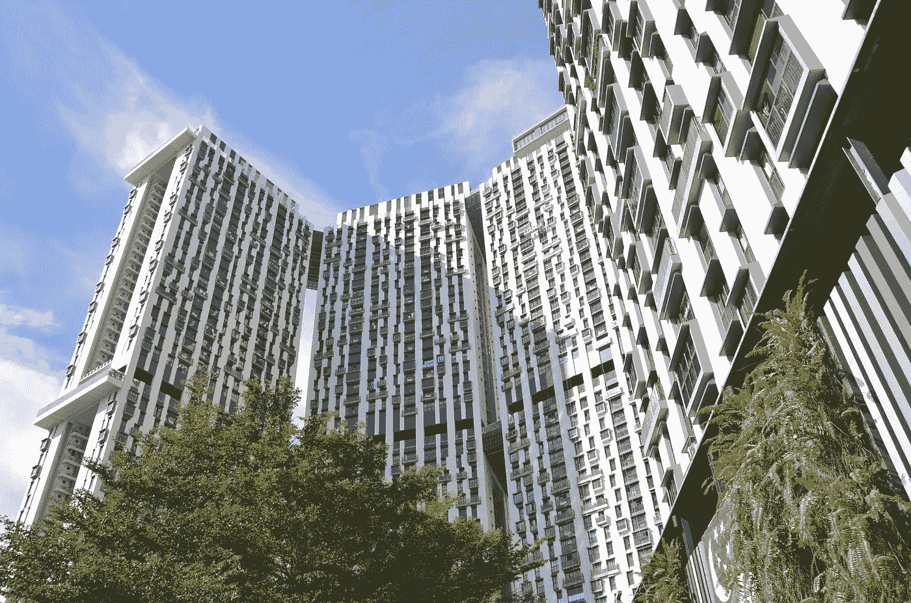
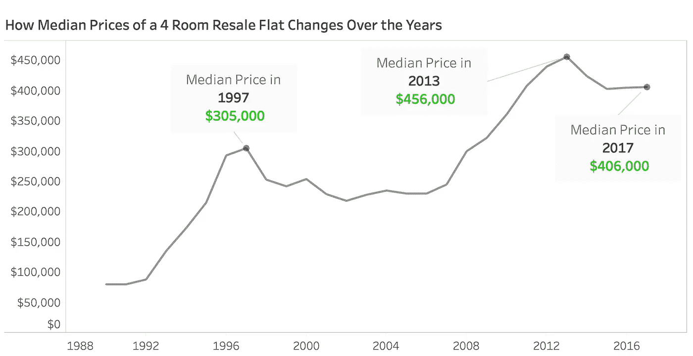
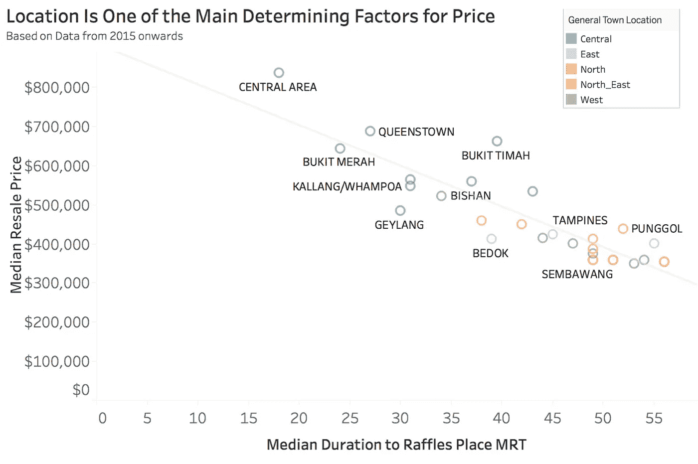
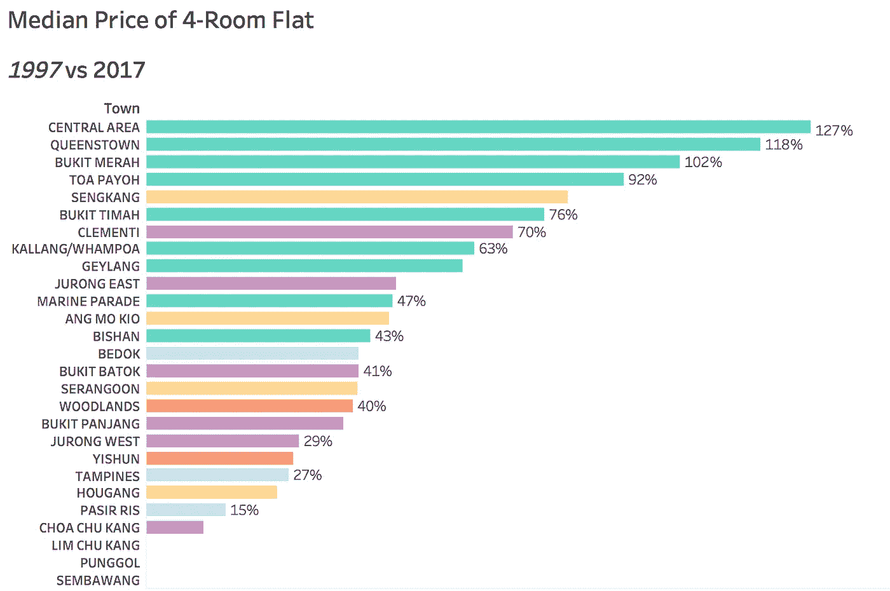
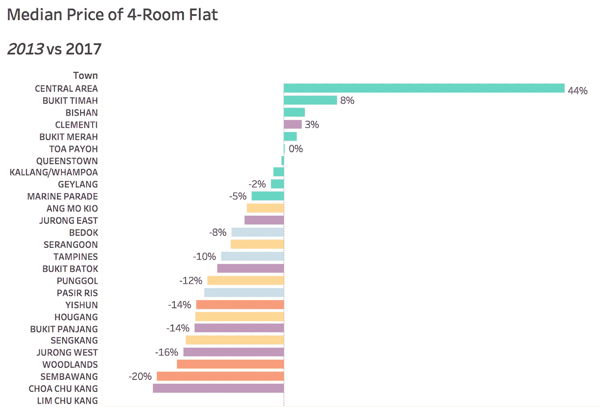

# 新加坡 HDB 转售单位价格

> 原文：<https://towardsdatascience.com/singapore-hdb-resale-flat-prices-c4d8567c21e9?source=collection_archive---------5----------------------->

Image via [PixaBay](https://pixabay.com/photos/the-pinnacle-singapore-2640724/)

在新加坡，大多数人通常会选择由 HDB 住房发展局建造的公共住房作为他们的第一个家。这些房屋通常被称为 HDB 公寓，可以在新建时直接从 HDB 购买，也可以在公开市场上从其他 HDB 房主那里购买(以下称为转售公寓)。

虽然我对如何在不久的将来买房子保持开放的选择，但我决定四处看看，了解转售公寓的市场价格。我很高兴偶然发现了一个关于 data.gov.sg 的相当全面的数据集，它列出了从 1990 年到 2018 年出售的转售公寓的细节。以下概述了我从数据中发现的一些见解

在这里，你可以随意访问底层的可视化[。](https://public.tableau.com/profile/chok.chin.wee#!/vizhome/SingaporeResaleFlatPrices/SingaporeResaleFlatPrices)

# 目前的转售单位价格比过去要低

在这篇文章中，我的分析基于四居室公寓的价格，原因如下

*   根据数据，它们是最常购买的公寓之一，也是大多数城镇和地区最常见的公寓类型之一
*   四居室公寓在面积和价格方面处于所有可供选择的中间位置，因此我相信它不太容易成为异类

Median Price of 4-Room Resale Flat Over Time

这张图表显示了从 1990 年到 2017 年，四居室公寓的转售价格中位数是如何增长的。我们可以立即看到转售价格在 1997 年首次见顶，之后由于亚洲金融危机，价格开始下降。从 2004 年开始，价格再次开始逐渐上涨，并在 2013 年创下新高，然后再次下降。这一下降与同年实施的几项冷却措施相一致，如 TDSR 框架和调整 ABSD。你可以在这里阅读更多的和[这里](https://www.mof.gov.sg/Newsroom/Press-Releases/Additional-Buyer's-Stamp-Duty-for-a-Stable-and-Sustainable-Property-Market)。

到 2017 年，一套四居室公寓的转售价格中位数比 2013 年低 11%。

# 便利很重要

我们知道转售单位的价格在很大程度上取决于它的位置。便利也是主观的，因为它涉及到一所房子离最近的捷运站有多远，或者那个捷运站离市区或个人的工作场所有多远。我们可以尝试从[谷歌地图 API](https://developers.google.com/maps/)中获取一些信息。

在尝试了几个 API 之后，我决定使用莱佛士广场捷运作为市区的代理。使用 Google Maps APIs，我查询了从 Raffles Place MRT 到数据中与每个转售公寓单元相关的地址所需的旅行时间。我决定这样做的原因将在后面的文章中解释。

Travelling Duration vs Median Resale Price for a 4-Room Resale Flat

HDB 将数据中的每个地址归入一个城镇，这应该是大多数新加坡人都熟悉的。在图表中，在[中心区](http://www.hdb.gov.sg/cs/infoweb/about-us/history/hdb-towns-your-home/central&rendermode=preview)(由 Marina、Outram、Newton 和其他几个地方组成)的一套四居室公寓，到莱佛士广场地铁站的平均旅行时间不到 20 分钟，平均转售价格为 80 万美元。当我们观察到去莱佛士广场地铁站的旅行时间较长的城镇时，这种情况会减少。在森巴旺，同样一套四居室公寓的价格不到这个价格的一半，而且租期可能也更长。

# 不同城镇的价格上涨(或下跌)速度不同

我们在第一张图表中看到，价格从 1997 年开始上涨，从 2013 年开始下降。让我们来看另一个视图，在这个视图中，我们可以看到不同城镇的价格是如何变化的。

Price Change from 1997 to 2017 for 4-Room Resale Flat

Price Change from 2013 to 2017 for 4-Room Resale Flat

这两个图表显示了价格从 1) 1997 年到 2017 年，2) 2013 年到 2017 年的变化。虽然从 1997 年到 2013 年，所有城镇的价格普遍上涨，但位于中心位置的房屋价格涨幅更大，中心地区的房屋价格上涨了一倍，而 Pasir Ris 的涨幅为 15%。

2013 年至 2017 年的图表也显示了一个有趣的模式。虽然大多数地方的价格下降，但中心地区的价格在四年内上涨了 44%!

# 结论

在这篇文章中，我们可以看到，尽管转售价格自 20 世纪 90 年代以来普遍上涨，并在 2013 年实施降温措施后略有下降，但价格升值并不是全面的。这项工作还帮助我估算出在我感兴趣的地区买一套转售公寓应该付多少钱。我希望这将是有用的信息给你，如果你正在考虑得到一个转售单位！

## 笔记

*为什么使用从家庭住址到莱佛士广场捷运的旅行时长*

1.  *莱佛士广场捷运是新加坡主要的捷运交汇处之一，位于新加坡市中心。因此，这是一个我认为适合用来确定一个房子有多中心的代理*
2.  *虽然一个人可能认为在三巴旺的房子如果离他工作的地方 5 分钟路程就很方便，但我相信转售单位价格将在很大程度上受到大多数人如何看待三巴旺便利的影响*
3.  只需将莱佛士广场地铁站和住宅位置作为谷歌地图应用编程接口的输入，该应用编程接口将帮助我确定从住宅到莱佛士广场的最佳路线。这将是一个足够好的代理人的最佳路线，一个人可能会采取前往莱佛士广场捷运