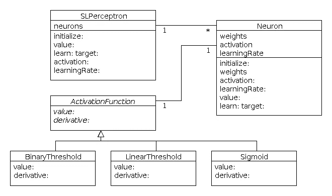
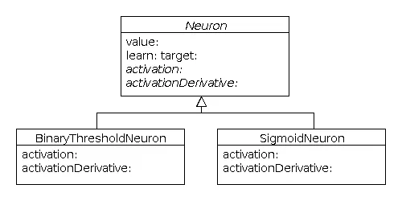
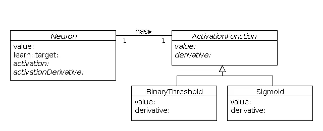
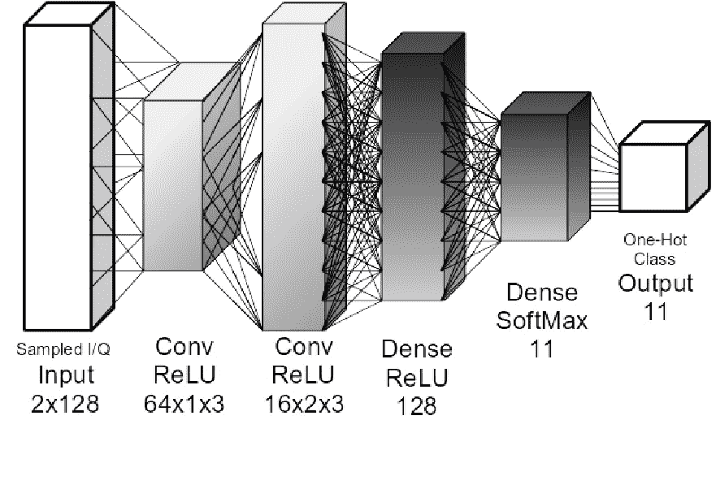

# Pharo 中的单层感知器

> 原文：<https://towardsdatascience.com/single-layer-perceptron-in-pharo-5b13246a041d?source=collection_archive---------2----------------------->

## 面向对象的神经网络方法

在这篇文章中，我将描述我在 Pharo 中实现的单层感知器。它将支持多类分类(一个或多个神经元)。每个神经元将被实现为一个对象。这个项目的代码可以从 Smalltalkhub 使用这个 Metacello 脚本获得(在你的 Pharo 图像的操场上做):

```
Metacello new 
repository: '[http://smalltalkhub.com/mc/Oleks/NeuralNetwork/main'](http://smalltalkhub.com/mc/Oleks/NeuralNetwork/main');
configuration: 'MLNeuralNetwork';
version: #development;
load.
```

我将从说明设计问题和实现这个项目每个部分的不同方法开始。这将是相当长的，所以这是我的最终设计:



# 什么是感知器？

首先，我们需要定义一个感知器。它是人工神经网络的最基本形式，然而，大多数人无法清楚地定义它实际上是什么。

现在，我将感知器称为遵循感知器学习过程的人工神经网络。

这个定义暗示了对感知机是什么以及它们能做什么的一些限制。

## 感知器的限制

*   它们只能收敛于线性可分的输入(参见 XOR 问题，Minski & Pappet)。但是，如果输入是线性可分的，那么无论初始权重和学习速率如何，感知器都保证收敛于此(参见 1962 年由 Block 和 Novikoff 证明的感知器收敛定理)
*   感知器(如上定义)只能有一层神经元。事情是这样的(Geoffrey Hinton 的机器学习神经网络课程的第 3 周)，感知器学习程序只能应用于单层神经元。隐藏层中的神经元需要某种反馈来计算它们的误差并更新权重。这就是为什么我们需要一个不同的学习算法(例如，反向传播，将在下一阶段实现)。
*   感知器只能在线学习(一次一个例子)。这是因为感知器学习是基于将输入向量与基于二进制分类器误差(该误差可以是-1、0 或 1)的权重相加(或相减)。

# 设计问题

## 如何表示权重

当谈到神经网络的面向对象实现时，这可能是必须回答的最重要的问题。权重应该属于神经元吗？如果是，应该是发送还是接收神经元？或者也许他们应该属于一层？或者也许是整个网络？也许我们甚至应该将它们作为单独的对象来实现？

作为只有一层的前馈网络，因此没有连接两个神经元的权重，单层感知器简化了这个问题。基本上，我们有三个选择:

1.  每个神经元的输入权重作为向量存储在该神经元内。
2.  所有输入权重的矩阵存储在网络中。
3.  权重被实现为对象并连接到神经元。

第二种选择是最有效的(向量矩阵乘法)，但不是非常面向对象。这个实现中的神经元是什么？显然，网络只是一个权重矩阵+一些学习规则。神经元应该是具有学习率的激活函数吗？但是话说回来，将它们存储在网络中会更有效率。所以基本上我们不需要`Neuron`类。我们只需要一个矩阵和几个操作它的函数。对我来说这听起来不像面向对象。

在这种情况下，第三种选择是过度设计。这只会让整个事情变得更复杂。在多层神经网络中，将权重实现为对象可能会有一些意义，其中每个权重是两个神经元之间的连接(我们可以将输入视为假神经元)。它连接两个神经元，在它们之间发送信号，并且具有可以更新的“强度”。结果，神经元不知道其他神经元。它们只是接收、处理和发射信号。我假设这样的实现不会很快，但是它可以用于建模目的。我将在一篇关于多层网络的文章中详细阐述这个想法。

第一个选项看起来最适合单层感知器。而且非常容易实现，所以我会坚持下去。

## 激活功能

在这个项目中有两种表示激活函数的方式:

1.  将它们实现为方法
2.  将它们实现为类

第一种方法速度更快，占用的内存更少。我们用抽象方法`activation`和`activationDerivative`创建了一个基类神经元。每个子类将是一种特殊类型的神经元，如`BinaryThresholdNeuron`、`SigmoidNeuron`，实现相应的激活功能。



实现激活的另一种方式是用两个抽象方法`value:`和`derivative:`创建一个基类`ActivationFunction`。这种方法更加灵活，因为如果有人想使用一个新的激活函数，他将能够将其实现为一个子类，只需定义它是什么以及它的派生函数是什么。然后，他将能够将这类对象传递给现有的神经元。每当我们需要创建一个函数时，重新实现整个神经元似乎是不符合逻辑的。



所以真正的问题可以听起来像这样(当然，它可能听起来更好):
*神经元是由它们的激活来定义的吗？具有不同的激活是否意味着是完全不同类型的神经元？*

## 共享或单独激活和学习率？

激活率和学习率既可以由感知器的所有神经元共享，也可以分别存储在每个神经元中。问题是:*我们需要有不同激活和不同学习率的神经元吗？*

让我们假设我们没有。事实上，在大多数情况下，一个网络(或一层)的所有神经元都具有相同的学习速率和相同的激活。如果网络有许多神经元(大多数网络都有)，那么我们将存储同样多的次数。如果激活函数被实现为一个类，那么我们将为每个神经元创建一个单独的类实例。

然而，如果我们想要并行化由神经元完成的计算，那么对每个神经元(或每个神经元块)具有单独的学习速率和单独的激活会更好。否则，它们会在每一步都互相阻止对方访问共享内存。此外，这个“重”神经元占据的总内存仍然很小。我认为，这样的神经元(或一组神经元)将很容易放入 GPU 单核的本地存储器中。

但是单层感知器通常不会执行繁重的计算。它们对于建模更有用。这就是为什么我们可能应该采取“分离”的方法，允许用户用完全不同的神经元(像积木一样)构建一个网络。



顺便说一下，对于多层网络来说，一个好主意是在一层中共享相同的激活和学习速率，但是允许用户拥有完全不同的层。最后，他应该可以建立一些复杂的网络，比如图片上的卷积网络。但这不是这篇文章的主题。

## 数据洗牌

在线感知器对接收训练样本的顺序很敏感。在每个训练示例之后进行权重更新，这就是为什么训练向量`#(#(0 1) #(1 1))`和`#(#(1 1) #(0 1))`会产生不同的权重向量。根据示例的顺序，感知器可能需要不同次数的迭代才能收敛。

这就是为什么，为了测试这种学习的复杂性，感知机必须通过从训练集中随机选择的例子来训练。

# 履行

综上所述，这是我设计的单层 peceptron:


## 神经元类

```
Object subclass: #Neuron
   instanceVariableNames: 'weights activation learningRate'
   classVariableNames: ''
   package: 'NeuralNetwork'
```

权重用范围[0，1]内的随机数初始化。我不确定这是否是一个好的范围，但在简单的例子中，它工作得很好。

`BinaryThreshold`是默认激活函数，默认学习率为 0.1。这些参数可以使用访问器`activation:`和`learningRate:`进行更改。

```
initialize: inputSize
   "Creates a weight vector and initializes it with random values. Assigns default values to activation and learning rate" activation := BinaryThreshold new.
   learningRate := 0.1.

   weights := DhbVector new: (inputSize + 1).

   1 to: (inputSize + 1) do: [ :i |
      weights at: i put: (1 / (10 atRandom))].
   ^ self
```

我们还需要在每个输入向量前加上 1 作为偏差单位。

```
prependBiasToInput: inputVector
   “this method prepends 1 to input vector for a bias unit”

   ^ (#(1), inputVector) asDhbVector.
```

根据《数值方法》一书，每个函数都应该实现`value:`方法。我想强调的是，从数学的角度来看，神经元是一种功能。

虽然内部表示使用了 DhbVector，但我希望用户编写类似于`perceptron value: #(1 0).`的内容，而不是`perceptron value: #(1 0) asDhbVector.`

```
value: inputVector
   "Takes a vector of inputs and returns the output value"

   | inputDhbVector |
   inputDhbVector := self prependBiasToInput: inputVector.
   ^ activation value: (weights * inputDhbVector).
```

我们需要访问器来设置激活的学习速率。出于调试目的，我还为权重添加了一个简单的访问器。所有这些访问器都是琐碎的，所以我不会把代码放在这里。

当然，还有感知机学习规则。

```
learn: inputVector target: target
   "Applies the perceptron learning rule after looking at one training example"

   | input output error delta |
   output := self value: inputVector.
   error := target - output.

   input := self prependBiasToInput: inputVector.

   delta := learningRate * error * input * 
      (activation derivative: weights * input).
```

## 感知器类

单层感知器(根据我的设计)是神经元的容器。它唯一的实例变量是`neurons`数组。

```
Object subclass: #SLPerceptron
   instanceVariableNames: ‘neurons’
   classVariableNames: ‘’
   package: ‘NeuralNetwork’
```

为了创建一个`SLPerceptron`的实例，我们需要指定输入向量的大小和类的数量，这等于我们的感知器(多类分类)中神经元的数量。

```
initialize: inputSize classes: outputSize
   “Creates an array of neurons”
   neurons := Array new: outputSize.

   1 to: outputSize do: [ :i |
      neurons at: i put: (Neuron new initialize: inputSize). ]
```

单层感知器的输出是该层中每个神经元的标量输出向量。

```
value: input
   “Returns the vector of outputs from each neuron”
   | outputVector |

   outputVector := Array new: (neurons size).

   1 to: (neurons size) do: [ :i |
      outputVector at: i put: ((neurons at: i) value: input) ].

   ^ outputVector
```

如果我们要求 SLPerceptron 学习，他会将那个请求传递给他所有的神经元(基本上，SLPerceptron 只是一个神经元的容器，提供了操纵它们的接口)。

```
learn: input target: output
   "Trains the network (perceptron) on one (in case of online learning) or multiple (in case of batch learning) input/output pairs" 1 to: (neurons size) do: [ :i |
     (neurons at: i) learn: input target: (output at: i) ].
```

# 测试

我用 BinaryThreshold 激活函数在 4 个线性可分的逻辑函数上测试了我的 SLPerceptron、OR、NAND 和 NOR，它收敛于所有这些函数。

下面是对 AND 函数的测试。其他 3 个看起来完全一样(只有预期输出值不同)。

```
testANDConvergence
   "tests if perceptron is able to classify linearly-separable data"
   "AND function" | perceptron inputs outputs k |
   perceptron := SLPerceptron new initialize: 2 classes: 1.
   perceptron activation: (BinaryThreshold new).

   "logical AND function"
   inputs := #(#(0 0) #(0 1) #(1 0) #(1 1)).
   outputs := #(#(0) #(0) #(0) #(1)).

   1 to: 100 do: [ :i |
      k := 4 atRandom.
      perceptron learn: (inputs at: k) target: (outputs at: k) ].

   1 to: 4 do: [ :i |
      self assert: (perceptron value: (inputs at: i)) equals: (outputs at: i) ].
```

而这个测试(或者更确切地说是一个演示)表明单层感知器无法学习 XOR 函数(不是线性可分的)。

```
testXORDivergence
   "single-layer perceptron should not be uneble to classify data that is not linearly-separable"
   "XOR function"

   | perceptron inputs outputs k notEqual |
   perceptron := SLPerceptron new initialize: 2 classes: 1.
   perceptron activation: (BinaryThreshold new).

   "logical XOR function"
   inputs := #(#(0 0) #(0 1) #(1 0) #(1 1)).
   outputs := #(#(0) #(1) #(1) #(0)).

   1 to: 100 do: [ :i |
      k := 4 atRandom.
      perceptron learn: (inputs at: k) target: (outputs at: k) ].

   notEqual := false.

   1 to: 4 do: [ :i |
      notEqual := notEqual or:
         ((perceptron value: (inputs at: i)) ~= (outputs at: i)) ].

   self assert: notEqual.
```

我也试图测试`Sigmoid`功能，但是测试失败了。这意味着要么感知器(如本文开头所定义的)不能将 sigmoid 作为其激活，要么我对如何用 sigmoid 实现感知器没有足够好的理解。

# 下一步是什么？

*   具有批量学习和不同学习规则的单层神经网络的实现
*   具有反向传播的多层神经网络的实现