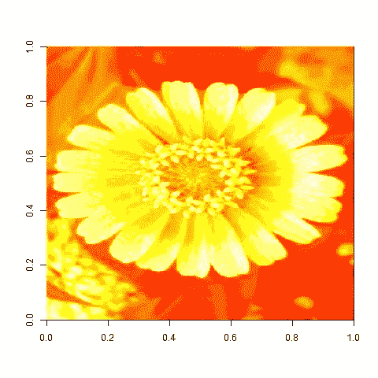
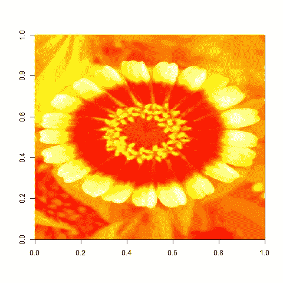
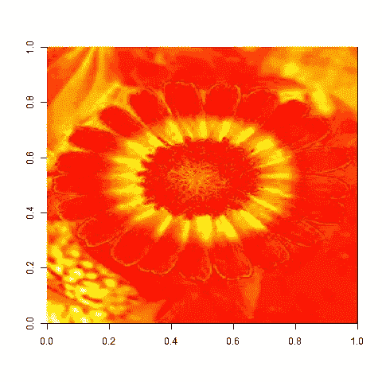
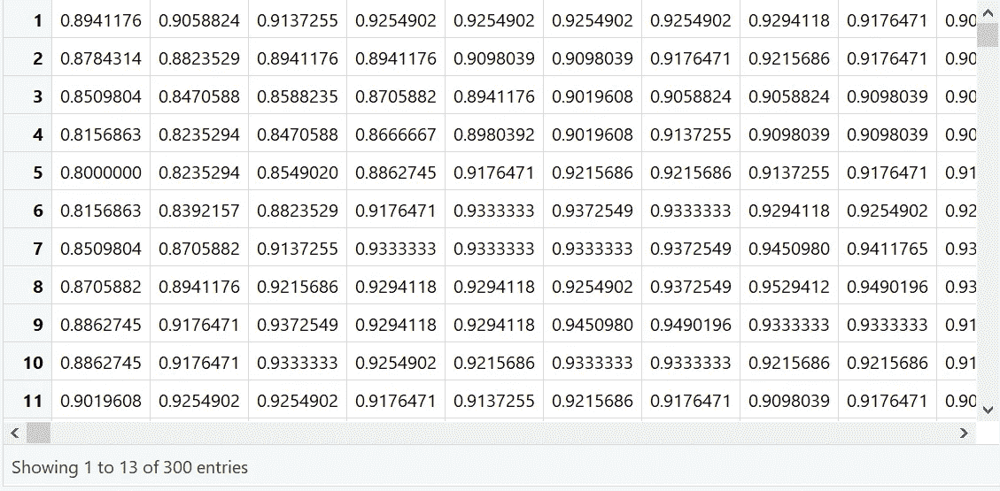
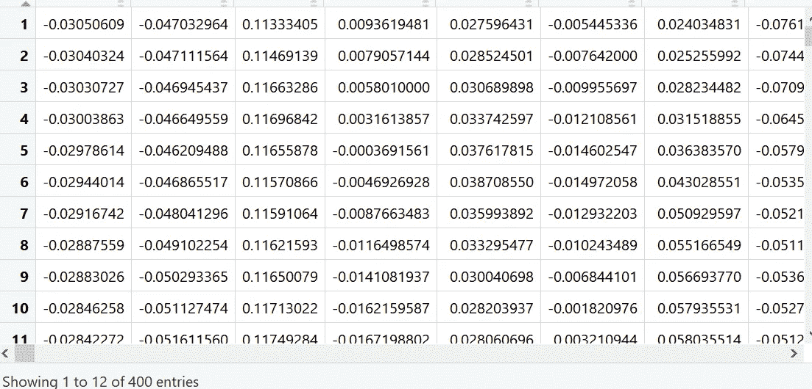
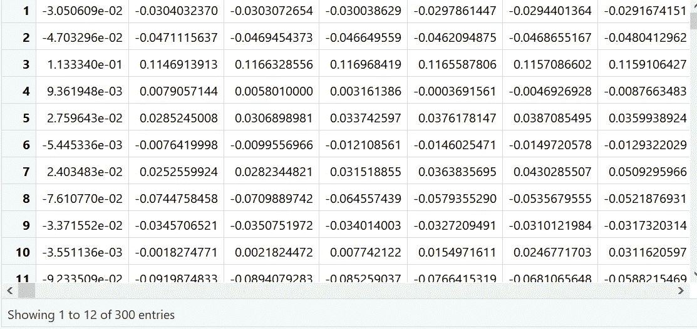
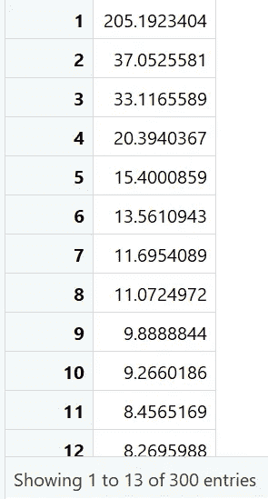
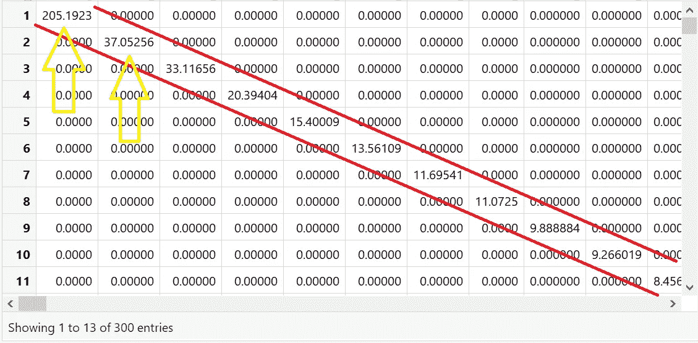
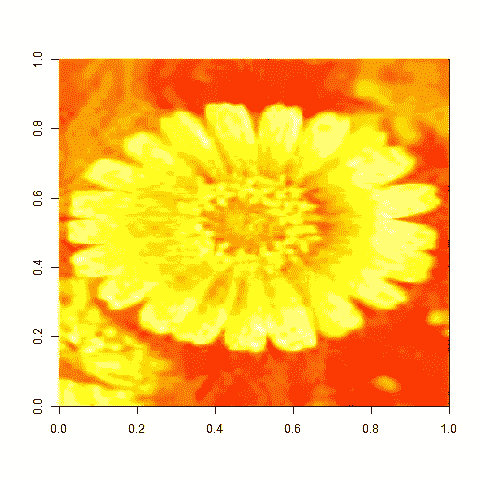

# R 中的奇异值分解及实例

> 原文：<https://towardsdatascience.com/singular-value-decomposition-with-example-in-r-948c3111aa43?source=collection_archive---------7----------------------->

如果你熟悉矩阵和向量，那么理解什么是 SVD 不会花太多时间，但是，如果你不熟悉矩阵，我建议你先掌握它。

SVD 是这样一种方法，我们用矩阵的形式表示数据，然后我们减少它的列数以表示相同的信息。为什么数据不会丢失？有人可能会问。这个问题的答案是 SVD 的本质，我们将看看它是如何工作的。

基本上，SVD 做的是把一个矩阵分解成三个其他的矩阵，它们被称为 u，v 和 d。

1- A 是 m*n 元素的实矩阵。

2- U 是具有 m*m 个元素的正交矩阵

3- V 是具有 n*n 个元素的正交矩阵。

4- D 是具有 m*n 个元素的对角矩阵。

正交矩阵是这样一种矩阵，如果乘以其他数，它的性质不会改变。例如，如果你有一个矩阵“X ”,你用它乘以任何其他矩阵，得到矩阵“Y ”,然后如果你从“Y”中取出“S ”,那么你得到与“X”相同的矩阵,“S”只是一个标量值，叫做特征值。

X*λ = Y (1)

Y= S*X (2)

其中λ是 X 的倍数，S 是 y 的公倍数。

对角矩阵是指从上到下只有非零对角线数的矩阵。对角线以外的地方会有零。

为了更清楚，想象一下你在一个 3D 平面里拿着一支铅笔，现在如果你在铅笔的轴上乘以一个数，它会移动到 3D 平面的另一个地方，但是你的铅笔的长度仍然是一样的。

那么，我们知道 SVD 把矩阵分解成三个分量，那么它有什么用呢？用途是当我们把它们相乘时，我们得到的矩阵和之前的一样。但是请记住，我们不只是将它们相乘，而是使用这个公式——a = u * d * v^t，其中 t 表示矩阵 v 的转置

要记住的一件事是，你的对角矩阵 D 可能只给你一个对角线数的列表，然后你将不得不在非对角线的地方补零。此外，请记住，U 的列数将与 d 的行数相同。

但真正的问题是，这些对我们有什么帮助？让我们看看。

当我们将矩阵 A 分解成 U，D，V 时，所有三个矩阵中最左边的几列代表了我们恢复实际数据所需的几乎所有信息。请记住，我没有说全部，我说的是几乎全部，例如 92%的信息只存在于总列数的 5%的列中。考虑到您已经极大地减少了数据集的大小，这是一笔不错的交易。这意味着奇异值分解在矩阵 A 的所有列之间找到了某种联系，用较少的列表示相同的信息。现在，除了最左边的列之外的列被删除，因为它们被认为是错误的，并且该过程通过删除原始矩阵的几乎 90%的列来减小矩阵的大小。

现在让我们看看它在 r 中是如何工作的。请记住，在每一段代码之后，您都会看到输出以及对该输出的一个小解释。

```
**install.packages(“pixmap”,repos = “http://cran.us.r-project.org")library(pixmap)
 image<- read.pnm(“flower.ppm”)**image@size
```

## [1] 300 400

```
str(image)
```

##具有 8 个插槽的正式类“pixmapRGB”[包“pixmap”]
# #..@ ***红色*** : num [1:300，1:400]0.894 0.878 0.851 0.816 0.8…
# #..@ ***绿色*** : num [1:300，1:400]0.29 0.275 0.255 0.235 0.231…
# #..@ ***蓝色*** : num [1:300，1:400]0.525 0.51 0.494 0.471 0.463…
# #..@ channels: chr [1:3]"红色" "绿色" "蓝色"
##..@ size : int [1:2] 300 400
##..@ cellres : num [1:2] 1 1
##..@ bbox:num[1:4]0 400 300
# #..@ bbcent : logi FALSE

```
red.img <- matrix(image@red,nrow = image@size[1], ncol = image@size[2])

 blue.img <- matrix(image@blue,nrow = image@size[1], ncol = image@size[2])

 green.img <- matrix(image@green,nrow = image@size[1], ncol = image@size[2])

 str(red.img)
```

## num [1:300，1:400] 0.894 0.878 0.851 0.816 0.8 …

我们看到在每种颜色矩阵中都有相同数量的行和列。

我们将它们分成三种颜色的原因是因为在 R 中，这三种颜色构成了 R 中每种颜色的基础。
但是在我们的例子中，我们将只使用红色，所有图像之间的差异可以在下面看到。

```
image(red.img)
```



Red matrix color

```
image(green.img)
```



Green matrix color

```
image(blue.img)
```



Blue Matrix color

```
plot(image)
```


Original Image

从上面给出的图片中，我取红色矩阵进行分解。

为了获得更清晰的图片，这里是红色矩阵的快照。记住，这个矩阵很快就会分解成三个分量。

```
View(red.img)
```



你会看到 R 中的“svd”命令会将红色矩阵分解成三个部分。它们是 d，u，v，给出了各自的行和列。

```
comp<- svd(red.img)
 str(comp)
```

# # 3 的列表
# # $ d:num[1:300]205.2 37.1 33.1 20.4 15.4…
# # $ u:num[1:300，1:300]-0.0431-0.0427-0.0421-0.0419-0.0418…
# # $ v:num[1:400，1:300]-0.0300

为了让下面的图片更清晰，我们也有他们每个人的快照。

```
View(comp$v)
```



v matrix

```
View(t(comp$d))
```



Transpose of v

现在，您可以看到“v”矩阵的行变成了转置矩阵中的列。

```
View(comp$d)
```



你看到它是一个列表并且一个列表不与一个矩阵相乘，所以我们需要在它与其他组件相乘时将其转换为对角矩阵。但是，让我们来感受一下使用“diag”命令后的效果。

```
d <- diag(comp$d)
 View(d)
```



matrix ‘d’ after imputing zeros

这是数字按对角线排列后的样子。这里需要注意的重要一点是，只有“d”中的几个起始列比其他列具有更大的权重，并且随着从左到右权重不断降低，因此我们只需要矩阵最左侧的那些列。让我们取其中的 25 个，它们可能代表了几乎 90%的信息。注意:我没有计算百分比，这只是一个假设。

现在，在我们将这些矩阵的前 25 列相乘之前，我们需要知道,“u”将保持不变，但“v”必须被转置，以便遵循矩阵法则。

```
compressed.image<- (comp$u[,1:25] %*% diag(comp$d[1:25]) %*% t(comp$v[,1:25]))

 image(compressed.image)
```



Final Image we Recovered

记住，左矩阵的列必须总是等于右矩阵的行。如果出现错误，请检查您的列和行。

看到这最后一个图像不像我们之前看到的那样清晰，但很明显它是一朵花的图像；但是我们已经减少了列的数量，因此与表示原始红色矩阵所需的空间相比，我们需要非常少的内存来显示该图像。

参考资料:

## [匿名](https://www.youtube.com/channel/UCd0dc7kQA1FUpJ76o1EjLqQ)。(2016)."什么是特征向量？"。[雷奥索斯](https://www.youtube.com/channel/UCd0dc7kQA1FUpJ76o1EjLqQ)。【https://www.youtube.com/watch?v=ue3yoeZvt8E 

## 无名氏。“奇异值分解”。RPUBS。[https://rpubs.com/aaronsc32/singular-value-decomposition-r](https://rpubs.com/aaronsc32/singular-value-decomposition-r)。

怀特，J. (2009 年)。用 R 中的奇异值分解进行图像压缩。RBLOGGERS。*[**https://www . r-bloggers . com/image-compression-with-the-SVD-in-r/**](https://www.r-bloggers.com/image-compression-with-the-svd-in-r/)*