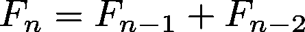
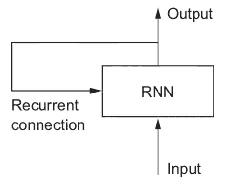
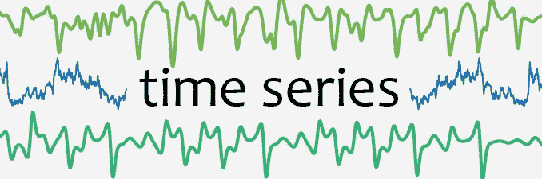
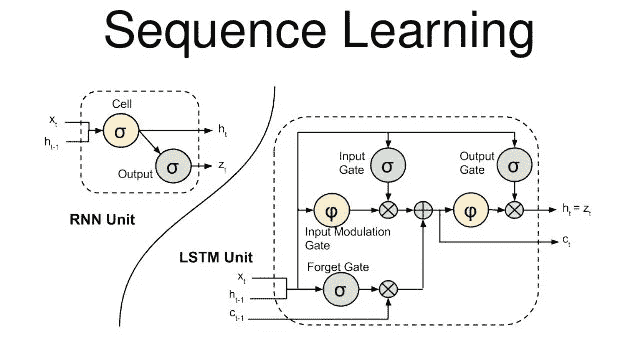
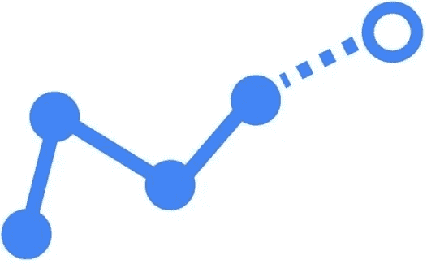
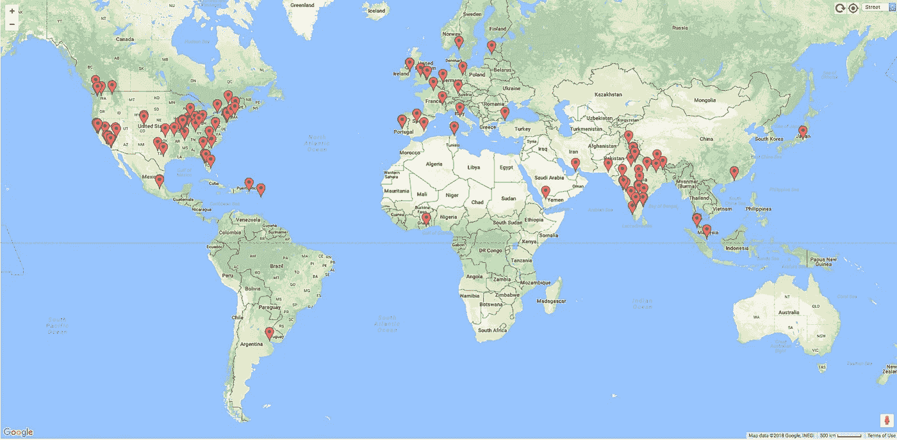

# 深度学习的 Skejul 会议

> 原文：<https://towardsdatascience.com/skejul-meetings-with-deep-learning-5efab285b111?source=collection_archive---------3----------------------->

## 厌倦了试图与某人见面，却找不到日期或时间？我也是。


## 问题是


当你的人在世界各地，在不同的时区，甚至在同一个房间时，安排一次会议是不容易的。我们都超级忙，对吧？

也许你没有正确利用你的时间，也许你某一天有很多会议，而其他时间却没有。如果有一个完美的日历，有多余的时间，所有的会议和活动都有条不紊，那不是很好吗？

你猜怎么着？深度学习拯救世界！

## 斯克尤尔


[http://skejul.com](http://skejul.com)

我很高兴见到了 Skejul 的首席执行官[马修·拉蒙斯](https://www.linkedin.com/in/matthew-lamons-a6a1a87/)先生，对系统及其后端做了简短的解释。

Skejul 是一种人工智能(AI)，它代表你工作，而不需要你花费大量时间来设置偏好、声明优先级、管理其他人的联系信息，或者维护关于你去的地方和你喜欢做的事情的信息。

它还简化了协调涉及人、地点和事物的活动的复杂过程。

但是它是怎么做到的呢？

## 深度学习中的序列模型

什么是序列？

简而言之，就是相关事件、运动或事物相互遵循的特定顺序。在[斐波纳契数列](https://www.youtube.com/watch?v=Nu-lW-Ifyec)的例子中，那些“事物”是数字，它们有一个关联它们的函数，我们称之为递归关系:



如果你是一名程序员，也许你会发现这段 Python 代码更有用:

```
**def fib(n): 
   if n==1 or n==2: 
      return 1 
   return fib(n-1)+fib(n-2)**
```

这段代码是递归的。当你根据问题本身来定义问题时，就会出现递归。

所以编程和数学都很酷。但这和深度学习有什么关系。



Deep Learning With Python, F. Chollet. Page 196.

在深度学习中，有一种特定类型的神经网络(NN)，它能够通过迭代序列元素来处理序列，并保持一种状态，其中包含与迄今为止所见相关的信息。就好像它们有“记忆”一样。是一种逐渐处理信息的方式。

这种类型的神经网络被称为递归神经网络(RNN)，这种类型的神经网络有一个内部循环，其状态在处理两个不同的独立序列之间重置。

## 时间序列的 RNN



因此，Skejul 寻求解决这个问题的一个方法是使用 RNN(和其他种类的神经网络)来处理时间序列。时间序列是在许多时间段(每周、每天等)收集的数据。)

是一种序列类型的数据，其中的元素在时间上是相关的。例如[股票价格](/stock-analysis-in-python-a0054e2c1a4c)，[加密货币价格](/demystifying-cryptocurrency-price-prediction-5fb2b504a110)等等。

RNN 特别擅长时间序列预测，我的意思是，尝试使用单个时间点之前的 *x* 的值来查看某个时间段的 *x* 的值。

虽然 rnn 对于顺序数据非常有用，但它们也有一些问题，比如学习“长期依赖性”，想想看，就像相关信息和需要它的点之间的差距变得非常大。

为了解决这个问题，hoch Reiter schmid Huber(1997)引入了长短期记忆网络(LSTMs)，这是一种特殊的 RNN，能够学习长期依赖性。



关于 LSTMs 的更多信息，请查看这篇[惊人的帖子](http://colah.github.io/posts/2015-08-Understanding-LSTMs/)。

## Keras 中的 LSTM 模型(代码改编自此处的)

没拿到代码也不用担心。这只是为了展示在喀拉斯建造一个 LSTM 是多么容易。我会在 Keras 上做介绍。

```
from keras.layers.core import Dense, Activation, Dropout
from keras.layers.recurrent import LSTM
from keras.models import Sequential
import timedef build_model(layers):
    model = Sequential()

    model.add(LSTM(
        input_shape=(layers[1], layers[0]),
        output_dim=layers[1],
        return_sequences=True))
    model.add(Dropout(0.2))

    model.add(LSTM(
        layers[2],
        return_sequences=False))
    model.add(Dropout(0.2))

    model.add(Dense(
        output_dim=layers[3]))
    model.add(Activation("linear"))

    start = time.time()
    model.compile(loss="mse", optimizer="rmsprop")
    print("> Compilation Time : ", time.time() - start)
    return model
```

使用这个简单的代码，您可以在 Keras:)中创建一个序列模型。

## 时间序列和 Skejul



因此，Skejul 所做的是使用自己的专有算法来做出有根据的猜测，确定与任何数量的客人举行会议的最佳时间和日期。

马修告诉我，这种算法使用深度学习技术，他们一直在探索 [ConvNets](https://hackernoon.com/dl05-convolutional-neural-networks-1d3bb7fff586) 、[残差 NN](https://blog.waya.ai/deep-residual-learning-9610bb62c355) 和[深度强化学习](https://deepmind.com/blog/deep-reinforcement-learning/)。

但是数据呢？你可能会想，他们是如何训练神经网络的？

这是有趣的部分，你可以成为私人测试版的一部分，算法也可以从你这里学习！你可以在这里报名[。](http://skejul.com)

Skejul 做的很多事情是从你的日历中获取数据，但不仅仅是你的会议，还有你对会议的回复，你何时接受，何时拒绝等等。

他们将在今年春天发布该软件的免费版本，在仲夏发布商业版本。Skejul 将有如此多的功能，新的功能将逐步增加，如在应用程序中举行会议的视频平台，为会议和聊天添加媒体。

他们声称，使用他们的算法和平台，你可以通过他们的 Skejul Activity Forecasting Engine(SAFE)为你的会议提供比不知情的猜测更好的建议。此外，他们已经有超过 25 个国家和城市的预激活成员，如:伦敦，孟买，墨西哥城，旧金山，新加坡，柏林，罗马，布宜诺斯艾利斯，都柏林，迪拜，香港和更多！



请保持关注以获取更多信息；).

## 摘要

*   安排会议不是一件小事，让我们用深度学习和 AI 来解决。
*   深度学习是一个非常重要的领域，有很多应用，这里显示的是预测序列模型中的值。
*   序列是相关事件、运动或事物相互遵循的特定顺序。
*   递归神经网络(RNN)是一种具有内部循环的神经网络，其状态在处理两个不同的独立序列之间重置。他们拥有类似记忆东西。
*   RNN 在学习“长期依赖”方面有问题，所以 LSTMs 来帮忙了。LSTM(长短期记忆)网络解决了这个问题。
*   你可以在 Keras 中简单快速地实现一个 LSTM 模型。
*   Skejul 正在使用 RNN、LSTMs、ConvNets、残差神经网络、深度强化学习等解决与全球不同人实时安排会议的问题。

如需了解更多信息，请在 Linkedin 上关注我:

[](https://www.linkedin.com/in/faviovazquez/) [## 法维奥·巴斯克斯| LinkedIn

### 查看 Favio Vázquez 在世界上最大的职业社区 LinkedIn 上的个人资料。Favio 有 12 个工作列在他们的…

www.linkedin.com](https://www.linkedin.com/in/faviovazquez/)