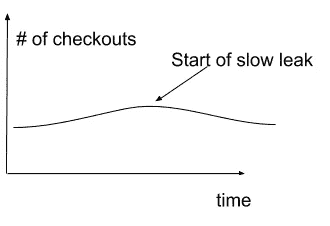
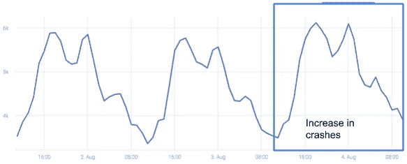
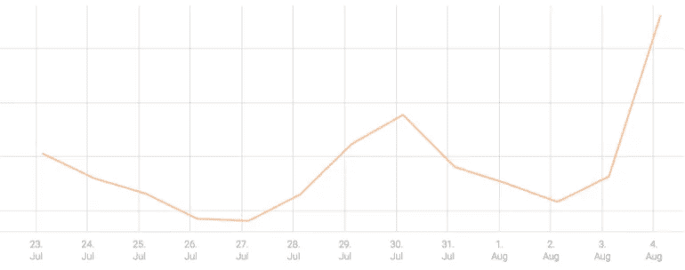
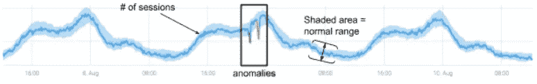
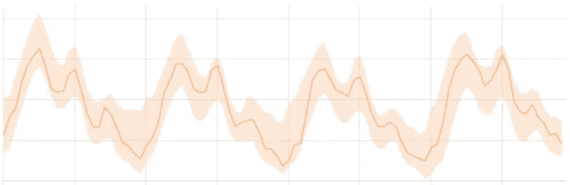
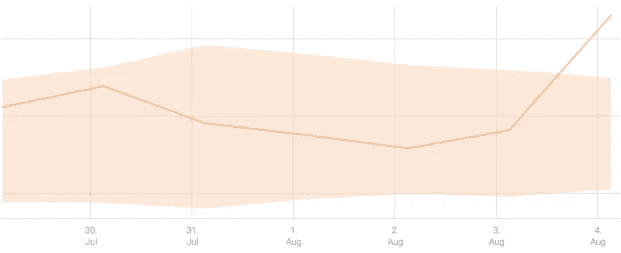
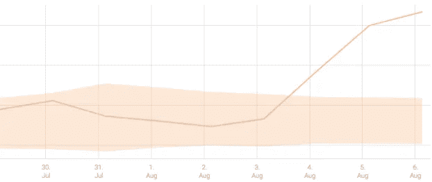
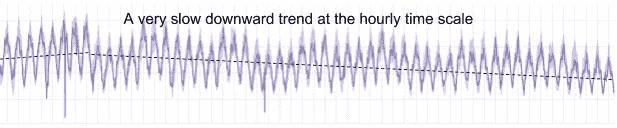

# 缓慢的泄漏会使船只和公司沉没…

> 原文：<https://towardsdatascience.com/slow-leaks-sink-ships-and-companies-36daaad993b4?source=collection_archive---------17----------------------->

机器学习拯救世界！

小而慢的泄漏会使船只沉没——以此类推，如果不及早发现和修复，小而慢的泄漏也会给任何企业造成重大损失。

小漏有意思吗？假设一家电子商务企业在最后一天发现采购量下降了 50%，整个公司将被召集起来，从首席执行官一直到 R&D 支持人员，尽快找出原因。现在假设在最后一天收入下降了 1%——很可能没有人会注意到。但是，如果每天下降 1%，收入下降 50%只需要 2.5 个月。什么时候会被注意到？仅仅两周之后，收入就已经下降了 13%，一个月后下降了 27%。如果被遗漏或忽略，损失可能与大停电一样大。

**有哪些缓慢的业务泄露的例子？**

*   特定平台和操作系统版本的新版本发布后，重要业务流程中的错误(例如，结账或显示的广告)。起初，很少有用户受到影响，但随着更多的用户下载新版本，泄漏变成了洪水。
*   营销活动的变化会导致某个细分市场的转化率下降，并在很长一段时间内不为人知，从而导致潜在客户/客户的流失。
*   一个竞争对手改进了他们的广告定位策略，赢得了更多的广告出价，导致您的广告浏览量和转换率逐渐下降。
*   一个重要特性令人困惑的用户界面/UX 变化会导致特性使用的缓慢和逐渐减少，以及客户流失的缓慢增加，因为沮丧的用户会停止使用产品。
*   您企业的客户支持行动手册的变化会导致票证处理时间增加，从而慢慢增加支持成本。
*   还有更多…

**这些泄露看起来像什么？**

对于上面的每个示例，泄漏应该在至少一个正在测量的 KPI(指标)中可见。例如，衡量某个功能的使用情况、完成结账的次数或流失率的指标应该显示逐渐下降或上升。这些泄露通常以**的形式出现，即收益、转换率等指标的趋势变化。**

但是，在船下沉之前检测这些缓慢的泄漏有两个问题…

首先，对所有相关指标进行手动检查是不可行的——可能需要跟踪数千个指标，尤其是在测量不同细分市场中的每个 KPI 时:例如，针对用户群的不同细分市场、不同操作系统和设备类型等测量结账数量。这种缓慢的泄漏可能发生在任何一种情况下，可能根本不会在聚合级别上显示出来。

其次，除非您查看足够大的时间窗口和时间尺度(聚合级别—每小时、每天等),否则在图中很难注意到缓慢的泄漏。).但是什么才够大呢？一天？一周？一个月？什么是正确的时间尺度？

让我们用一个移动应用程序的例子来检验这两者。下图显示了针对所有用户(所有地理位置、平台和应用版本)的移动应用崩溃总数:

“崩溃”有明确的每日模式，但崩溃总数的趋势没有明显变化。

然而，在使用特定版本的基于 iOS 的设备上，崩溃的数量逐渐增加。当以每小时的时间尺度查看 iOS 和有问题版本的崩溃指标时，很难注意到第一天开始增加时的变化:

即使撞车的数量增加了，如果你看这个图表的仪表板，在每小时的时间尺度上，泄漏会被发现，直到它变得更大。

那么，在这种情况下，我们如何快速检测到缓慢泄漏(崩溃的增加)？让我们改变一下时间尺度——让我们来看看每天的撞车总数:

每个数据点代表每天的撞车总数，很容易看出 8 月 4 日看起来比以前高，并且有潜在的趋势变化。

这两个挑战都表明，手动检测泄漏需要大量分析师的努力，他们必须不断浏览至少数千张图表，在多个时间尺度上查看它们，并希望能够发现这种情况。即便如此——更高的坠机数字代表着有意义的增长，这难道就那么明显吗？

有一个更好的解决方案——基于机器学习的多尺度异常检测。

# 多尺度异常检测

时间序列的异常检测包括学习时间序列的正常行为，并检测与其显著偏离的异常。

下图显示了一个测量会话数量的时间序列，以及两个显示与正常模式相比有所下降的异常情况:

在我们的 [*构建异常检测系统*](https://go.anodot.com/building-large-scale-wp-part-1) 的权威指南中，我们描述了健壮的大规模异常检测系统的构成。

假设手头有一个异常检测软件，我们可以将它应用于我们在多个时间尺度上收集的每个指标，例如，每分钟、每小时、每天甚至每周的崩溃次数。

让我们看看上面的应用崩溃例子。

在每小时的粒度上，碰撞的增加没有超过每小时的正常范围(阴影区域):

在日常生活中，情况大不相同。崩溃的数量明显超过正常范围，将其记录为异常:

如果被忽视，这一事件就会扩大，泄漏开始变成洪水:

在这种情况下，崩溃的增加是通过在多个时间尺度上自动分析相同的指标(iOS 设备和一个版本的应用程序的崩溃数量)来检测的——尽管在每小时的时间尺度上泄漏是缓慢的，并且没有导致任何人的小时异常，但在每天的时间尺度上它显示为重大异常，从而实现早期检测。

# 多尺度分析真的有必要吗？适应/检测权衡

我们可以争辩说，如果我们等一天，泄漏就会在每小时的时间尺度上显现出来。然而，它可能永远不会在每小时的时间尺度上被探测到。所有已知的用于异常检测的时间序列建模方法(来自 ARIMA、霍尔特-温特斯、LSTMs 等)都将趋势估计作为学习正常行为过程的一部分，并且必须适应时间序列行为的微小变化。在衡量企业时，适应性至关重要，因为没有什么是一成不变的。这意味着，如果泄漏与学习算法的适应速率相比较慢，则该算法将持续跟踪泄漏，将其视为正常的行为变化。

下图说明了正常行为算法如何适应衡量会话数量的指标的缓慢下降趋势:

当趋势发生变化时，每日级别的相同指标会记录异常，从而能够检测到趋势的变化。

总之，人工检测缓慢泄漏几乎是不可能的。异常检测算法非常适合检测时间序列正常行为中的变化，但由于缓慢泄漏可能仍然“隐藏”在噪声下，需要这些算法进行调整，因此多尺度方法可确保检测到缓慢泄漏。