# 小数据，并得到它

> 原文：<https://towardsdatascience.com/small-data-and-getting-it-4b3ed795982c?source=collection_archive---------15----------------------->

## 为什么还要麻烦小 N 呢？

**大数据很好很好**:随着我们数据集的样本量( [n](https://rpsychologist.com/d3/NHST/) )接近无穷大，我们可以根据这些数据中越来越细微的偏差和趋势，做出越来越自信和笼统的断言。

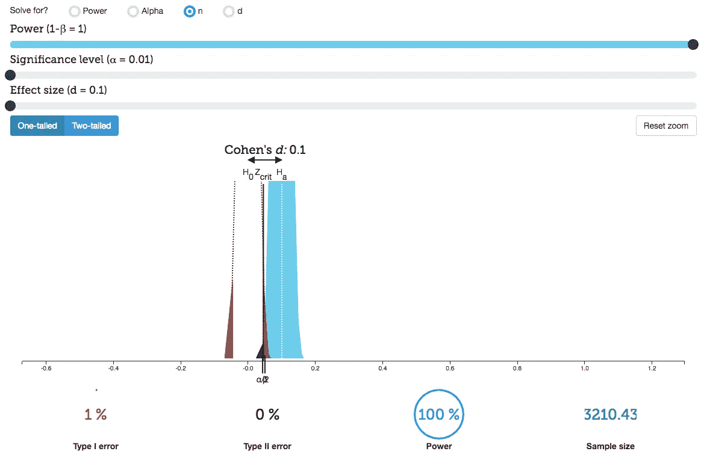

Handy visualization of statistical power from [rpsychologist.com](https://rpsychologist.com/d3/NHST/)

在许多情况下，大样本量是主要的关键，例如火箭科学:精确度是王道，学术声誉岌岌可危，跨越一些统计置信阈值可能会验证对我们的生存至关重要的一些事情的一生的调查，比如大爆炸理论:

I’ve never seen anybody more excited by standard deviations

正如大数据一样伟大，也有理由为**小数据**(带有故意讽刺的大写字母)做准备，在这里我将加入制作它的合唱团。

## 或多或少

对于一些应用来说，大数据可能*太*大，比如直觉概念化和讲故事。还有一个事实是，获取大量高质量的数据集存在障碍。

在这里，我引用《科学美国人》的艾米莉·雷阿斯的话，她在她的文章“[我们的大脑有一张数字地图](https://www.scientificamerican.com/article/our-brains-have-a-map-for-numbers/)”中提到了“[人类顶叶皮层中数字数量的地形图](http://science.sciencemag.org/content/341/6150/1123)”:

> 有一个小的大脑区域沿着一个连续的“地图”代表着数量正如我们沿着一条心理“数字线”组织数字，左边一个数字，右边一个数字，数量映射到大脑的空间。这个大脑区域的一侧对小数字做出反应，邻近的区域对大数字做出反应，以此类推，数字表示向远端增加。

此外，

> [荷兰乌特勒支大学的这些研究人员]发现，顶叶皮层图代表相对数量，而不是绝对数量。

例如，当以十为单位考虑货币时，我们所关心的只是多了**或少了**个逗号。在给昂贵的东西定价时，我们不会想象一堆正确大小的百元钞票，我们只是将 T21 与其他类似东西的市场价格(本质上只是一个符号，甚至不是一个我们可以概念化的数字)进行比较。我们了解三角洲。我们这些虚弱的生物不得不将大量的数字抽象到外部设备中，以便进行操作，特别是为了**获得意义**。我们降低维度，我们分类，我们绘制数据，把它降低到我们可以消化和行动的规模。我们把大数据变小，看它和它隐含的模式。

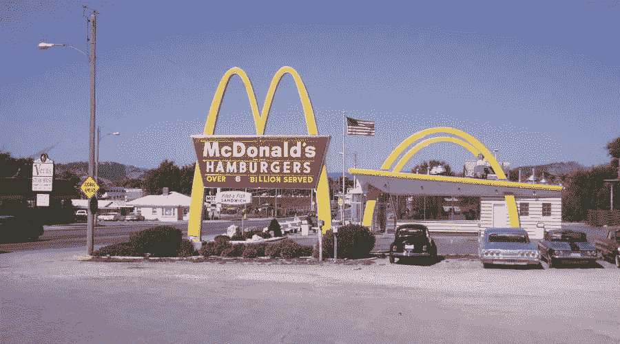

Speaking of Digestion

麦当劳在售出第 990 亿个汉堡后，停止公布这一数字。没人在乎了。他们只是在 990 亿人面前扔了个“大于号”。宋飞有一个关于这个的[片段。他明白了。再卖出 100-150 亿美元不会改变我对麦当劳的看法。](https://www.youtube.com/watch?v=KzOSkO8BZFw)

斯大林在统计学上是对的。虽然我不同意，因为 100 万人死亡肯定是非常悲惨的，但我同意人们很难想象大的数字、总量和平均数。这些不会像个人账户(由附带的小数据支持)那样在情感上**打动我们。**

## 少即是多

2013 年 10 月，五次当选的 CMO·艾伦·邦德参加了[数字脉冲峰会](http://www.digitalclaritygroup.com/digital-pulse-summit-2013-highlights/)，主持了一个关于“小数据”的小组讨论，并带回了[这个定义](https://smalldatagroup.com/2013/10/18/defining-small-data/):

> **小数据**将人们与及时、有意义的见解(源自大数据和/或“本地”来源)联系起来，这些见解通常以可视化方式进行组织和打包，以便可访问、可理解并可用于日常任务。

我不想把重点放在让大数据变小的实践上，因为我们已经用 python 的可视化库做了很多，而是更多地关注小批量、本地来源(我敢说是手工的吗？我想成为下流的布鲁克林潮人吗？)数据，并突出其个人成分。小数据比大数据具有更大的个体相关性和情感权重的能力。仅仅因为我们不能在数据集上运行最先进的、渴望样本的机器学习模型，并不意味着它没有意义！(我现在这样告诉自己，就像面包屑一样，就在我几周内学会如何利用神经网络之类的东西之前。)

在 LitHub 的文章“小数据是新的大数据”中，Marta Bausells 写道:在“亲爱的数据”中，一组插图明信片代表了他们在一年的生活中收集的看似平凡的数据，Giorgia Lupi 和斯蒂芬妮 Posavec 写道:

> 从生活中收集的数据可以是这个世界的快照，就像一张照片捕捉到了瞬间一样。

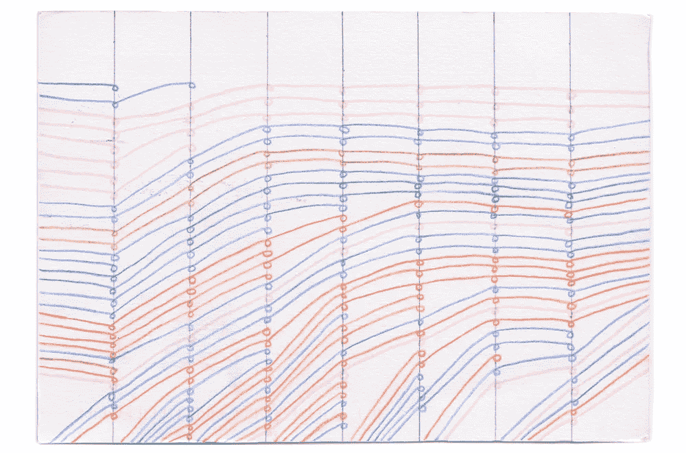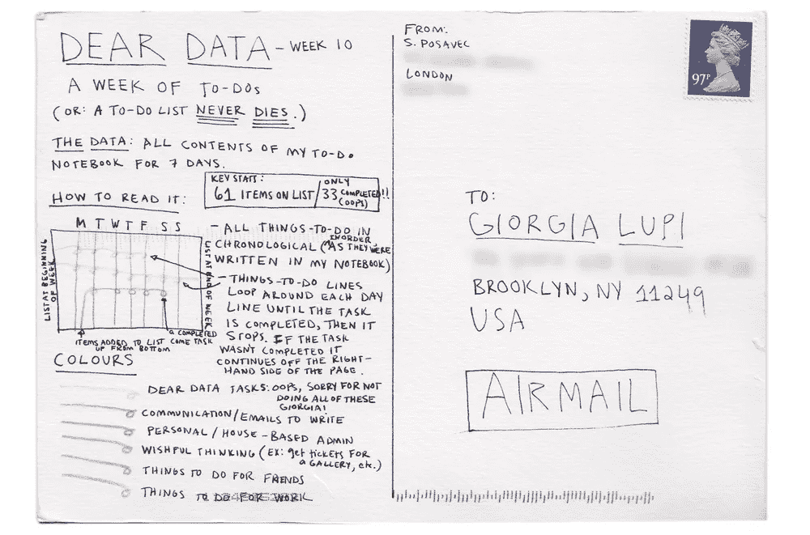

Excerpt from [Dear Data](http://dear-data.com/theproject/)

摘自玛丽亚·波波娃的前言:

> Lupi 和 Posavec 从大数据均质化聚合控制中重新获得了个人的诗意粒度。出现的是一个小数据的美丽及其故意解释、模拟可视化和缓慢传输的案例——一个对无限小、不完整、不完美、但惊人的人类细节的庆祝，通过这些细节，我们从生活中所有可能经历的不可理解的浩瀚中汲取意义。

我和我的一些数据科学训练营同学要感谢 [Jaime Cheng](https://medium.com/u/8f4709303329?source=post_page-----4b3ed795982c--------------------------------) 带我们来听 Lupi 在哥伦比亚大学与 [The Pudding](http://pudding.cool) 一起谈论*亲爱的数据、*以及更一般的小数据。

作为一名正在恢复的电影业工作者和低成本独立电影的爱好者，我认为平凡中有神奇:关于人性和社会的一些最深刻和最相关的真相只能在个体、正常的人类尺度上看到，这就是为什么我不能忍受超级英雄电影。老实说，炸药先生比托尼·史塔克更有关系。

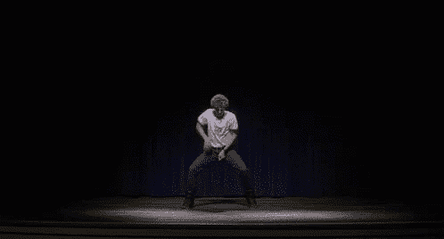

Take the Mundane and make it Extra: Indie filmmaking 101

这个比喻开始变质了，所以我们继续。

虽然多种形式的寓言是道德和行为影响的主要载体之一(咳咳广告)，但小数据的应用并不严格限于讲故事:在他的中期文章“[为什么小数据是人工智能的未来](/why-small-data-is-the-future-of-ai-cb7d705b7f0a)”中，Bradley Arsenault 认为公司可能很快就会处理小数据，因为:

> 许多致力于真正新颖解决方案的人工智能公司不得不手动收集这些解决方案的数据集。对人工智能初创公司的资本投资中有很大一部分被投入到收集使他们的产品工作所需的数据集。

如果你能让你的机器学习模型很好地处理小数据，那么你就能在研究、调查、实验或任何你用来生成数据的事情上节省时间和金钱。

## 明白了吗

数据科学最难的部分之一是获得好的数据来使用(并管理它)。从互联网络下层区域搜罗的数据并不总能激发人们对其收集和组织方法的信心。也许它又旧又硬。雇主提供的数据可能不完整、不可用或根本不存在。

也许我们受到了*亲爱的数据*的创造者的启发，我们想尝试收集我们自己的数据，你知道，为了娱乐和运动。**我们如何得到它**？让我们得到它。

我发推文给 Lupi，问她如何收集她的小数据:

[http://www.reporter-app.com/](http://www.reporter-app.com/)

用手吗？如果你像 Giorgia 一样有才华，你可以利用这种模拟魅力来销售价值不菲的咖啡桌书籍，但我没那么有才华。当我知道我将在熊猫中工作并在网上可视化我的数据时，我看不到中间模拟步骤的意义，而且我不会画画。

使用电子表格？当然，但是保存 GPS 数据呢？我更愿意在移动设备上收集数据，在移动设备上浏览电子表格一点也不好玩。

我喜欢这个专门构建数据收集应用的想法。不过我用的是安卓手机，所以 Lupi 的推荐[记者](http://www.reporter-app.com/)对我不起作用。我去寻找替代方案，结果出奇地少。SocialCops 有一款兼容 android 的数据收集应用，名为 [Collect](https://socialcops.com/collect/#Pricing) ，但它们的价格让我感到害怕。我不是一个完全资助的非政府组织。

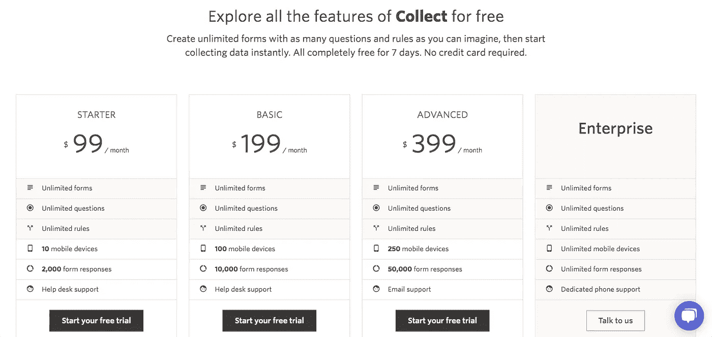

My project(s) might take longer than the free one-week trial

这是我发现[开放数据工具包](https://opendatakit.org/) (ODK)，“一个开放和热情的社区，就像你一样！”他们的安卓数据收集工具 [ODK 收集](https://docs.opendatakit.org/collect-intro/)看起来很有前景。

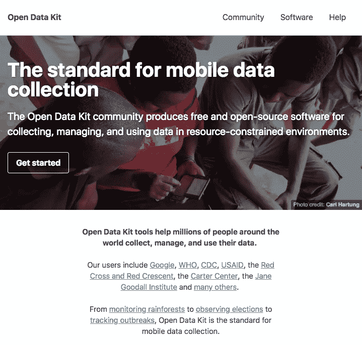

ODK 收集首先是一个笨拙的:它是一个开源社区项目，而不是一个精致的消费者应用程序，所以在开始记录数据之前，你必须阅读一些文档并熟悉它。(我提交了一份与定位服务相关的错误报告，并收到了一份自行修复的邀请..！确实是开源的。一旦我找到一周的空闲时间来学习 Android 开发环境，我就会让它发生。)

这里有一个在 ODK 收集小数据的快速入门:

*   使用 ezpz 工具 [ODK 构建](https://docs.opendatakit.org/build-intro/)、**或**构建您的空白调查，如我所做:
*   通过以一种非常特殊的方式[格式化一个电子表格](https://docs.opendatakit.org/xlsform/)来构建您的空白调查
*   将^转换为正确格式。使用此工具将 xls 转换成 XML
*   在 [ODK 收集](https://play.google.com/store/apps/details?id=org.odk.collect.android&hl=en_US)应用程序中将空白表格全部加载到你的安卓设备中
*   让我们开始填写空白表格并提交！

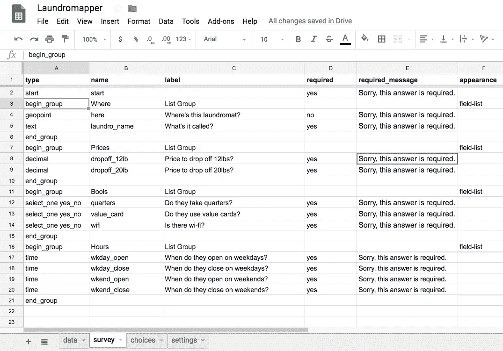

Making a Survey about Laundromats

ODK 收集的好处是你可以把它和谷歌文档连接起来:通过在空白表格的设置标签中设置`submission_url`，你可以让每个提交的表格自动填充到谷歌表单的一行中。我们可以高枕无忧，我们的数据被备份在云中，以后在 Pandas 中以 xls 或 csv 格式下载/导入这些数据将变得很简单。

以下是我在 ODK 收集填写表格时的一些截屏:

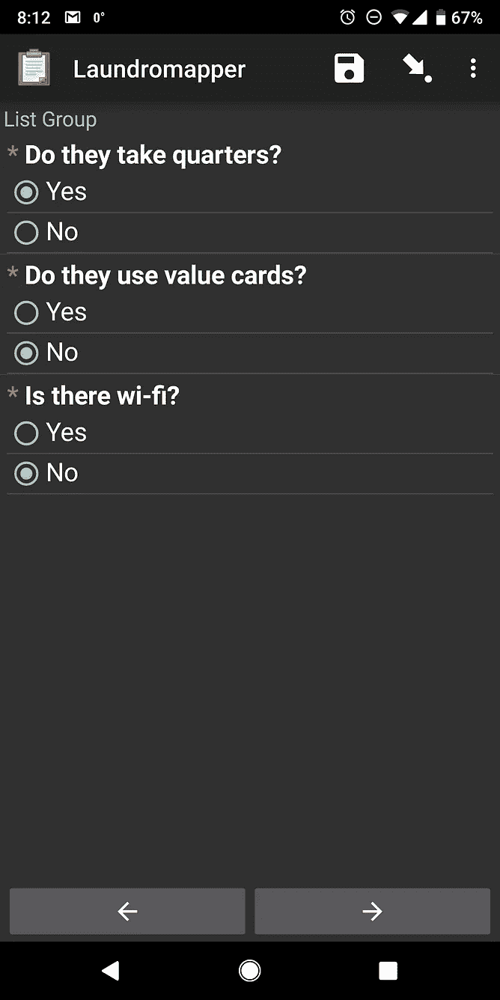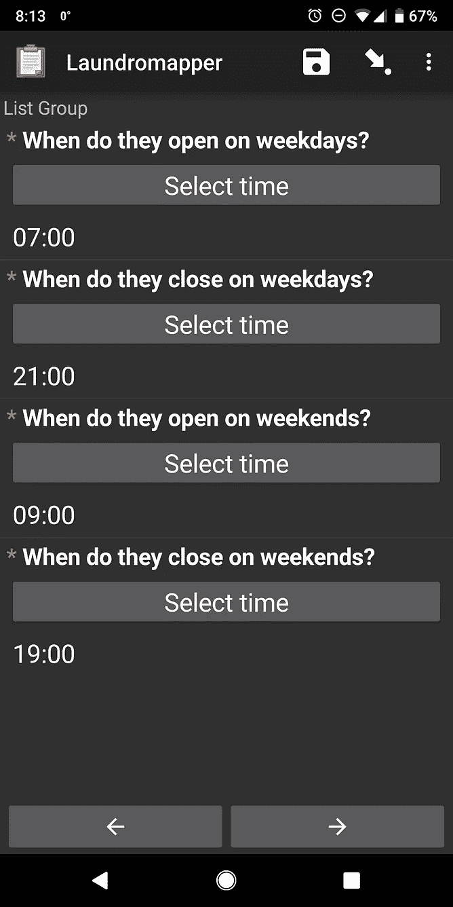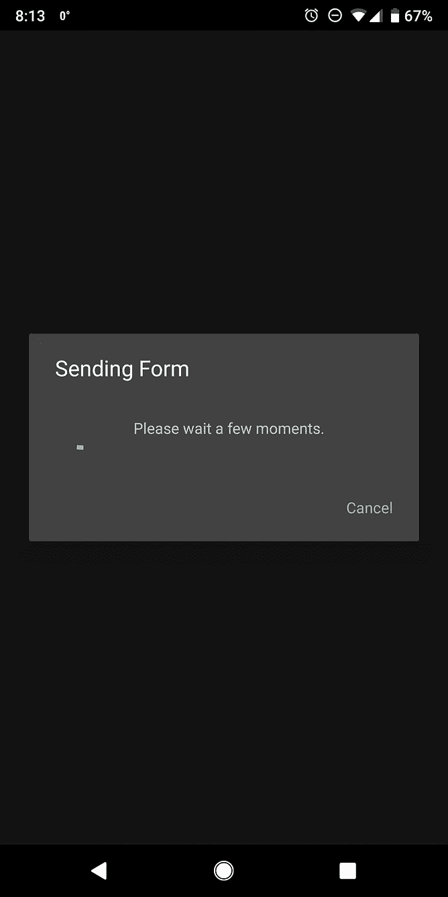

我提交填写好的表单，我的 google 表单被配置为自动填充，所以数据出现了——包括经纬度坐标、布尔值、浮点数、时间戳和 uid。你真的可以骗过你的表格。

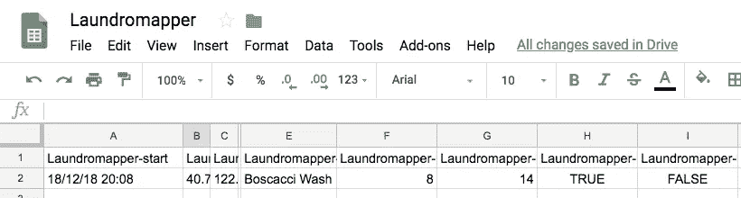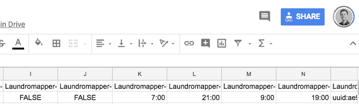

The first row of my small data set!

然后，我们可以将电子表格数据下载为. csv 或。xls 和导入熊猫(在 jupyter 笔记本中):

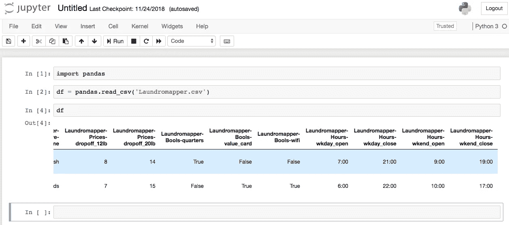

比笔和写字板流畅多了，可持续！任何数量的训练有素、合格的数据收集人员都可以使用该表格进行调查，所有人都填写同一个电子表格。我要提到的是，ODK 是面向非网格数据收集的:在偏远地区，只要有重要的人道主义项目要开展，无论有没有 cel 数据，你都可以使用这一工具。

**另一种****收集调查数据的方式可能更明显，那就是通过发出[谷歌表单](https://www.google.com/forms/about/)来众包。这些很容易创建并一起发送出去。响应滚滚而来，web 应用程序中有漂亮的小可视化，你当然可以通过点击按钮将数据转换成电子表格形式，以便下载和进一步调查。**

**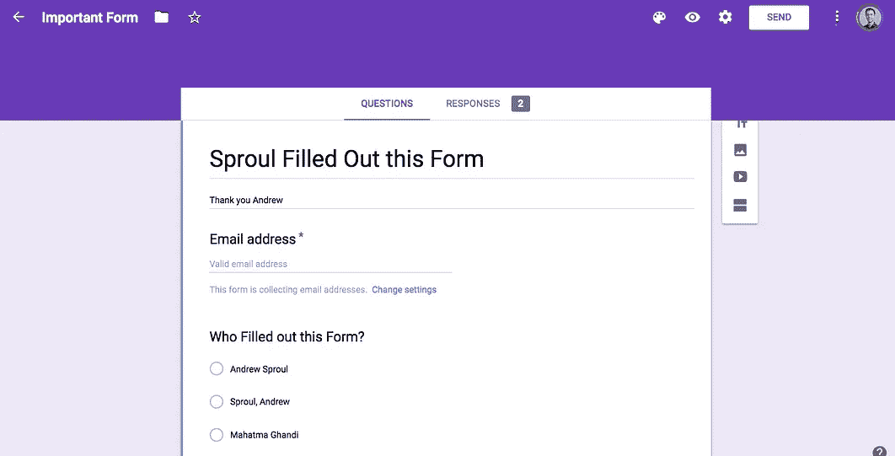****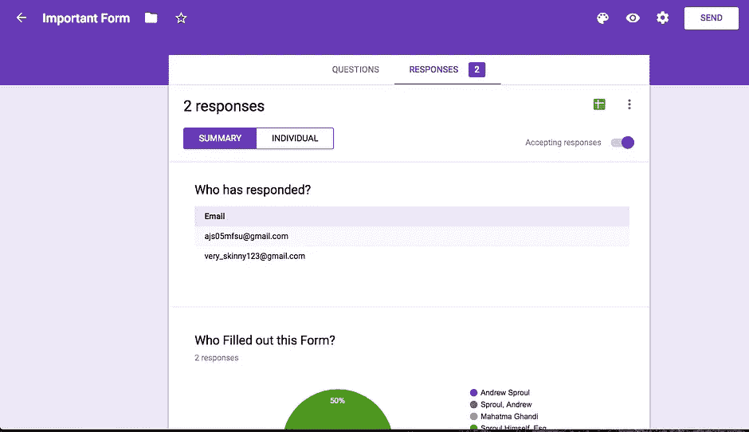**

**Google forms: EZPZ**

**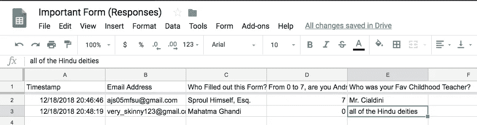**

**We could then bring this spreadsheet into pandas again.**

**发送电子邮件或网络调查的一个缺点是，你会相信回答者会提交准确的信息，但情况并不总是如此:你可能会用质量代替数量，这不符合小数据的精神！**

**[卷](https://elibrary.worldbank.org/doi/abs/10.1596/978-0-8213-6392-8)和[卷](https://zapier.com/learn/forms-surveys/writing-effective-survey/)已经写了如何正确收集数据。知道有一种错误的调查方式。就像在许多领域一样，即使你有技术来有效地做这件事，你也可能做得不正确。不要那样做。在你走之前，不要只看这篇博文。**

**我希望这能激励不同学科和不同技能水平的数据科学家考虑创建他们自己的小数据集——并且用爱来创建它们！丙:**

## **进一步阅读**

**“甚至有一本马丁·林德斯特罗姆的营销研究书， [*小数据:揭开巨大趋势的微小线索*](https://www.amazon.com/Small-Data-Clues-Uncover-Trends/dp/1250118018/ref=tmm_pap_swatch_0?_encoding=UTF8&qid=&sr=)*”提到了加里·克莱因博士，为[今日心理学](https://www.psychologytoday.com/us/blog/seeing-what-others-dont/201807/small-data)撰稿。***