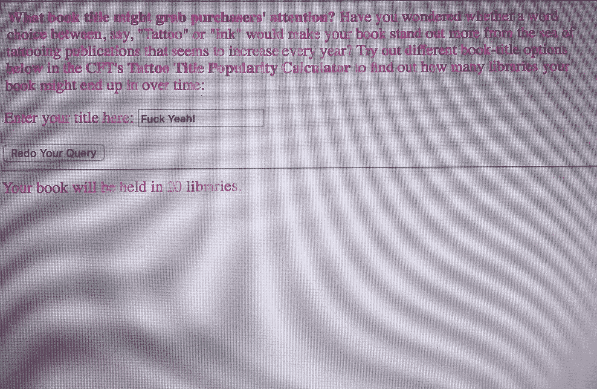
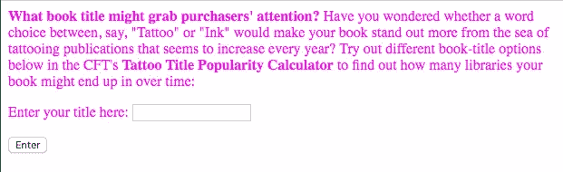
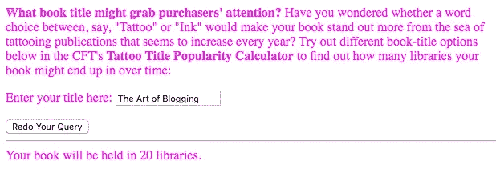
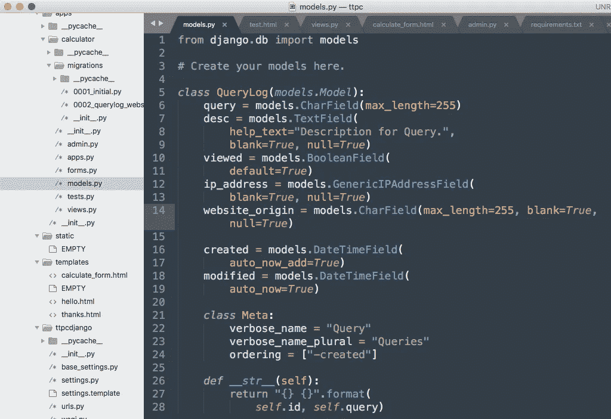
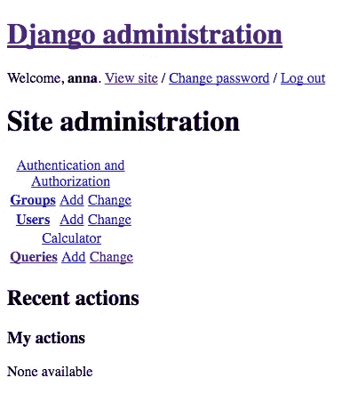
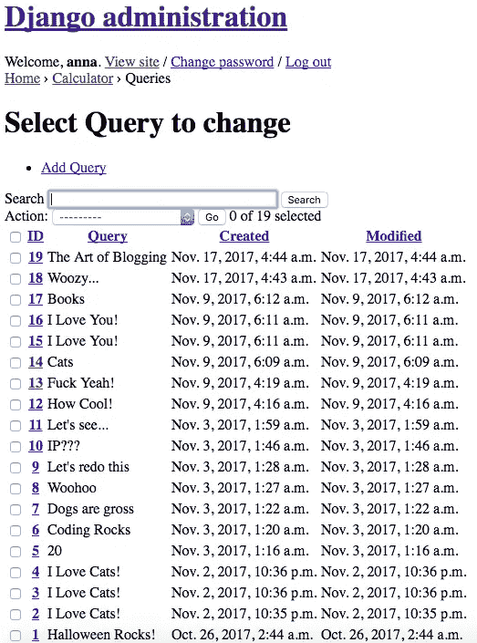
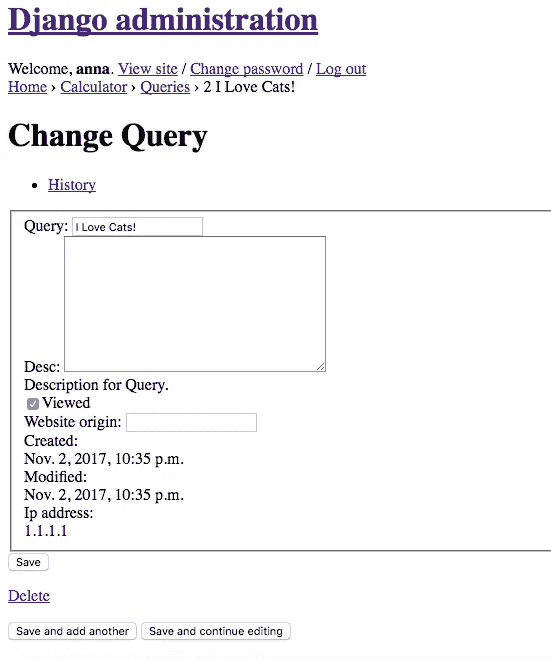

# 小胜利:用 Django 和 AWS 构建一个 Web 应用并建立信心

> 原文：<https://towardsdatascience.com/small-victories-building-a-web-app-with-django-and-aws-and-building-confidence-8ee9d29d744e?source=collection_archive---------4----------------------->

^^^That 是我用手机在电脑屏幕上拍的照片，前几天我高兴地把它上传到了我的个人社交媒体上。(是的，我真的是那种极客…)它代表了我的第一个 web 应用程序原型的成功测试，该应用程序在现实世界中运行(托管在我建立的免费 AWS 实例上)。我是 11 月 8 日拍的上图，原型机还在成功运行。

我称之为一个小小的胜利，因为我意识到，对于技术领域更有经验的人来说，这似乎非常容易。但对于一个在我今年早些时候参加数据科学训练营之前从未上过正式计算机科学课的人来说，终于更全面地理解了 web 应用程序这样的东西是如何工作的，这是一个启示。我自己能做到这一点真是太棒了。

Ooh, what’s that under there? Looks exciting!

这篇文章是我非常喜欢的 Chipy(芝加哥 Python)导师项目的要求系列文章的第三篇。自从我在[的上一篇文章](https://medium.com/@annafelicityfriedman/fighting-impostor-syndrome-through-coding-affirmations-2bff242c2511)以来，在我曾经很有能力的导师[乔·贾辛斯基](http://www.joejasinski.com/)的帮助下，我已经了解了姜戈很多新的方面。今天，我想我会把重点放在这个应用程序将要做的数据收集上，而不仅仅是为用户提供一个微小的服务。

正如我之前提到的，我是一个完全的数据极客——就我而言，一个人能收集的数据越多越好。我长期使用基于 SQL 的数据库，包括运行我的主要客户项目[MyBodyGallery.com](http://www.mybodygallery.com/)的大型数据库。我很高兴 Django 自带了创建 SQLite 数据库的内置功能(如果我想的话，以后我可以改成更好的 Postgres 或 MySQL)。我不一定需要一个数据库作为这个应用程序的一个功能(我没有*存储数据的*，但它是一个受欢迎的附加功能。

我这次指导的主要目标是让我创建的数据科学模型([一个纹身书流行度计算器](https://github.com/annafelicity/predicting_popularity))在现实世界中运行。我本可以让 web 应用程序告诉人们计算器的答案，然后消失在太空中，而不存储他们的查询或其他任何关于他们或他们与应用程序的用户交互的信息。但是第二个 Joe 向我提到，我们可以将用户查询存储在一个表中(在 Django 中称为模型，只是为了让事情变得更加混乱——阅读文档[这里](https://docs.djangoproject.com/en/1.11/topics/db/models/))，这让我的大脑转动起来，我想到了一些其他类型的数据，这些数据非常适合存储用于未来的分析项目。

With all the right data, we can take over the world!!! (I’m probably dating myself with this cartoon reference.)

我成功的 web 应用程序的手机照片可能很有吸引力，但这里有一个非常基本的原型应用程序界面的截图，用户可以在这里输入他们的书名查询。屏幕最初看起来是这样的:

Pink is my favorite test color.

然后，一旦用户输入他们的查询，它会在同一个页面上输出如下内容:

Note: Right now all the queries result in a hard-coded number of 20 libraries — the web app does not incorporate the calculator model yet.

用户查询存储在一个 SQL 表中(在 Django-speak 中称为模型),在本例中称为 QueryLog。Joe 教我如何进入并充实表将收集的数据。Django models 文档有许多可以包含的字段类型——如果您有兴趣的话，一定要读一读。稍后我可能会添加一些其他字段，但是现在我将收集一些显而易见的信息，比如查询本身、它是否被查看过、它是何时创建的以及它最后一次被修改的时间。乔建议添加一个“desc”字段，这基本上允许我在输入任何特定查询后进行记录；我也可以将这个领域用于其他各种可能的用途。

对我来说，重要的是跟踪查询来自哪里。这在表中有两种形式:首先，我想记录原始网站(这将在以后的课程中介绍——“website _ origin”的代码现在只是一个占位符)。至少，我会把这个放在我的 centerfortattoo.org[和 tattoohistorian.com](https://centerfortattoo.org/)网站上，这样我就能，比如说，快速地找出哪个网站的流量更大。我也有一个想法，我可以把这个代码放在 Github 上作为开源，其他面向纹身的网站也可以嵌入计算器。如果发生这种情况，我想知道这些查询是从哪里发出的，以此来跟踪还有谁在使用这个应用程序。

其次，我认为跟踪每个查询的 IP 地址会很有趣。我可以利用这些 IP 来分析用户的地理分布。Joe 建议使用 Django-ipware 来实现这一目的，它确实有效(我让我值得信赖的测试员，也就是我那令人敬畏的男朋友从远处输入一些查询来进行测试)。下面是我的代码中概述所有数据库表字段的部分:

This models.py script sets up all the different types of fields in the QueryLog table. I can add more if I want to. I just then need to run manage.py make migrations and then migrate to make those additions actually happen.

当您运行构建所有股票框架代码的初始 Django manage.py startapp 命令时，Django 会自动创建一个漂亮的管理仪表板。您可以通过在测试 IP 的末尾添加/admin/并导航到它来访问这个仪表板。您还需要将自己设置为超级用户才能使用它。这是通过 AWS 运行的管理仪表板的外观——当你从自己的机器上运行服务器时，它看起来更好，但 Joe 提到我们必须在托管版本中调整一些东西。但现在还有效，所以谁在乎呢？

这已经是一个很长的帖子，所以我没有时间来解释这个问题，但 Joe 教我如何添加代码，以便在“计算器”(这是这个应用程序的名称)下的管理面板中，你可以访问“查询”，它提供了 QueryLog 表中的所有数据。瞧:

目前，我们将管理仪表板 QueryLog overview 设置为显示查询、查询创建日期和任何修改日期。稍后我会添加一些我想看的其他东西的专栏，比如 IP 和网站来源。

是的，在测试代码的时候，你肯定会对我的思维状态有所了解。“他妈的耶”，“我喜欢猫！”，还有《狗真恶心》(那只狗刚走过来，流了我一胳膊的口水)肯定是令人兴奋的、有头脑的书名。我要补充的是，问题 14-17 来自我的男朋友，我想这告诉了你他有多棒。得到一句“我爱你！”通过你的原型网络应用程序发送信息，甚至发送两次，是非常令人惊奇的。

Love you right back, honey! (Readers: I’m a woman in tech. I can be a bit sappy. Deal with it.)

如果您单击用户输入查询条目的行号之一，您可以看到关于每个查询的更多信息。你也可以进去改变这里的一切。您还可以在管理面板中将某些字段设置为不可更改的(您可以在这里看到创建和修改日期以及 IP 的示例——这提醒了我也需要对查询本身执行此操作)。下面是我们设置 IP 跟踪之前的完整查询记录的一个示例(因此是硬编码的 1.1.1.1 占位符地址):

好了，今天有时间就写这么多。但是请继续关注:尽管这个项目只需要一个由三部分组成的博客，我肯定会创建至少第四部分来宣布最终项目的启动和运行。我想我能做到。我知道我能做到。我给这篇文章加了副标题:建立一个网络应用程序……建立自信是有原因的。

我在这个新冒险中的每一步都让我对自己的编码技能越来越有信心。我甚至考虑在 40 多岁的时候重返校园，攻读某种计算机科学学位，以增加我的收藏。(我真的很后悔没有从一开始就获得这个学位，尽管幸运的是，今天我们有很好的继续教育机会，比如针对我们这些处于职业生涯中期的人的训练营和导师项目。)

对于我的下一步，至少，在导师计划于 12 月中旬结束之前，我需要花一点时间清理计算器模型(及其各种子模型)并为用户输入的查询编写一个适当的数据管道。然后我需要想出如何将它嵌入我现有的 Wordpress.com 网站(目前的想法是用 iframe，但我知道 Wordpress 用 iframe 会很奇怪…)。咻。我能做到！如果我能让它看起来漂亮，那将是锦上添花。我一定会得到一个漂亮的蛋糕来庆祝！

Belle’s got the right idea. Maybe some pastries and wine are in order too :)