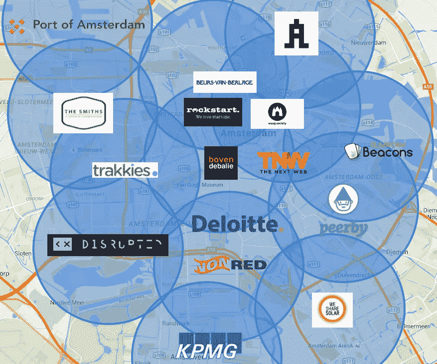

# 智能城市:普通市民一直是缺失的一环

> 原文：<https://towardsdatascience.com/smart-cities-ordinary-citizens-were-the-missing-link-all-along-7487e1753e10?source=collection_archive---------2----------------------->

# 首尔一名学生的一条推文让每年的汽车出行减少了 230 万次

当你听到的都是自动驾驶汽车和人工智能等高科技概念时，很容易感到与智能城市的对话疏远。但到目前为止，实际建设智能城市的经验告诉我们，我们必须首先从人开始。当城市在搞清楚技术的用途之前就购买了昂贵的技术，这就犯了错误。在阿姆斯特丹，市民不仅提供想法，还提供资金、人才和专业知识来创建真正需要的智能城市解决方案。

# 第一步:合适的人——公民、政府和人才

2012 年，首尔一名学生的一条推文使每年的汽车出行减少了 230 万次，每年为居民节省了 40 万美元，并使城市在夜间更加安全。这条推文是对市长的一个建议，移动电话公司的电话和短信数据可以用来绘制城市地区的深夜出行地图。这些数据可以用来在首尔地铁停止运营的午夜和凌晨 5 点之间为公交车引入更好的路线。当市长将这个想法转发到他的脸书主页上时，3 万多名居民立即支持了这个计划。

**韩国电信免费提供了超过 30 亿条匿名电话和短信记录**，他们与首尔市政府一起对这些记录进行了分析。因此，如果一个人用他们的移动电话从市中心打电话，然后，一个小时后，从城外发短信，这将被标绘为一次旅行。他们很快确定了最繁忙的路线，并提供了“夜猫子”巴士来覆盖它们。试点项目立即取得了成功，除了已经提到的改进之外，还减少了非法出租车的数量，减少了污染，振兴了深夜经济。

# 与公民接触至关重要

智慧城市要想运转，首先需要的是人。使用交通工具、呼吸空气和制造废物的是公众。他们产生的数据是对诊断问题和找到解决方案都至关重要的反馈。过去，城市只是打击无证出租车，或者依靠耗时的人工问卷来确定该地区最需要的交通工具。首尔的解决方案使用已经数字化的预先存在的被动数据进行高效分析。我们不要忘记，首先提出解决方案的也是一个公民——避开了在市政厅召开冗长而昂贵的解决问题会议的通常过程。从数以千计(如果不是数百万的话)不同经验和专业知识的公民中众包想法，比询问一小组政府官员要好。

# 合适的人并不总是最明显的选择

然而，你仍然需要合适的管理人员来协调你的智能城市。在首尔夜班车事件中，如果市长没有在社交媒体上与市民互动，并积极选择分享推文，该项目就不会存在。在运营阿姆斯特丹智能城市六年后，Ger Baron 向市政府建议，他们需要一名首席技术官来调解其智能城市过渡。这既是为了防止私营企业的需求超过公众的需求，也是为了确保这座城市愿意灵活地制定法规，以跟上创新的步伐。该市拒绝了 Baron 提出的候选人，而是更愿意给他这个职位，因为他有这样一个新项目所需要的确切经验。

当荷兰首都的市政当局决定他们也需要一个“夜间市长”来解决该市政党区的噪音、垃圾和暴力问题时，他们举行了投票。一个由五名专家、音乐节与会者和公众组成的小组选择雇用一名经验丰富的俱乐部发起人，而不是另一名公务员。Mirik Milan 已经与酒吧老板和用户建立了关系，了解规则，最重要的是，对夜生活有着真正的理解和热情。在接受《卫报》采访时，他说他想做些不同的事情，因为当人们抱怨时，城市当局的本能是**“实行宵禁，收紧法规，关闭场所，禁止东西。这是可以理解的:如果你在市政厅，对晚上发生的事情毫无头绪，你怎么能制定好的法律呢？”**。

他所不具备的是官僚专业知识或权力，这就是为什么与日间市长办公室的联系如此重要。米兰告诉花旗集团，他最自豪的成就之一是能够向场馆授予 24 小时许可证。他确保他们不在居民区，并能证明他们会策划他们的议程，以确保他们为城市增加文化价值，而不仅仅是促进夜生活和旅游经济。此外，当俱乐部成员在凌晨 5 点被驱逐出会场时，街道上突然出现了很多混乱。24 小时营业的许可证让夜晚更自然地结束，这意味着当人们离开时，他们是在一个可管理的流中这样做，并直接回家睡觉，而不是继续聚会。**对俱乐部和居民都好**。

# 解决方案应该惠及所有人

24 小时营业执照之所以成为可能，是因为与阿姆斯特丹夜生活相关的反社会行为和犯罪减少了。同样，解决方案来自于选择正确的人。该市的警察太忙了，无法对每一个电话作出反应，等到有人向市政当局投诉时，处理几天或几周前造成问题的人已经太晚了。所以安装了“方形主机”。他们是训练有素的社会工作者，可以充当警察、居民、俱乐部和狂欢者之间的无所畏惧的交汇点。虽然他们的主要目的是让参加聚会的人保持秩序，但他们也可以为那些寻找方向、选择哪个俱乐部或最近的厕所的人提供友好的建议。下一阶段包括计划创建一个应用程序，以便居民可以立即将任何问题转达给社区官员，社区官员将通知地面上的广场主持人。

**你需要的最后一群人是人才，那些拥有促进创新的技术专长的人**。在首尔，数据科学家必须用算法或人工智能来收集和分析证据。市长想要的市民投诉实时应用程序可能需要前端和后端开发人员，UX 和用户界面设计师。因此，想要成为智能城市的人必须吸引人才，激发创意，并为创新者的蓬勃发展提供支持。借助城市数据、阿姆斯特丹智能城市挑战赛和循环挑战赛等激励措施，阿姆斯特丹正积极推动变革，通过一个共同的目标将各个群体联系起来——改善城市区域。就国内而言，荷兰已确保其拥有具有竞争力的基础设施、优惠的税收和稳健的国际旅游框架，这也是网飞和优步等几家大型科技公司将欧盟总部设在阿姆斯特丹的原因。

对于创业公司来说，阿姆斯特丹是一些孵化器、加速器和政府支持的计划的所在地，如 StartupDelta 和 Startup Amsterdam。稍远一点的代尔夫特大学继续培养年轻人才，他们与美国阿姆斯特丹的 AMS 学院和麻省理工学院密切合作。埃因霍温仍然被认为是世界上最具硬件创新的城市之一。根据经济合作与发展组织的数据，2013 年，该市平均每 10 万居民拥有 23 项专利，与之最接近的竞争对手圣地亚哥只有 9 项。

# 步骤 2:基础设施—连接性、隐私和安全性

正如我们刚才提到的，在许多项目成为现实之前，您的智能城市将需要高速宽带、传感器和物联网连接等基础设施。然而，它在我们的列表中排在第二位，因为在过去，城市规划者在知道它将有什么用途之前就仓促行事，大量投资于基础设施。这就是为什么你必须首先依靠人们来确定问题并提出解决方案，这样你就知道需要建立什么。

但是，如果没有收集和分析城市数据所需的传感器、节点和应用程序网络，这些智能城市计划很难奏效。对阿姆斯特丹来说幸运的是，荷兰政府已经投资了高速宽带。然而，对于像物联网这样的庞大网络来说，大都市需要低电池使用量、远程和低带宽的网络，而 LoRaWAN(远程广域网)正是这种网络。它允许东西在没有 3G 或 WiFi 的情况下与互联网“对话”。

# 连接物体、设备和人

物联网成立于阿姆斯特丹，是一个“全球化、众包、开放、免费和去中心化的物联网网络”。**他们的设备成本大约是目前最流行的 LoRaWAN 网关的 20%，提供 10 公里的覆盖半径，服务多达 10，000 个节点**。网关是所有事物和互联网之间的路由器，而节点是附在每个“事物”上使其连接的设备。例如，可以在运河船上放置一个节点来探测水。如果节点中的传感器检测到泄漏，它将通过 LoRaWAN 网络向网关无线发送警报，网关连接到互联网，并可以向您的手机发送消息。

目前，在各大洲 23 个国家的 82 个城市中有 1380 个活跃的网关。24777 名开发人员已经注册，他们已经部署了 11444 个应用程序。考虑到每个网关仅花费€200 英镑，而且仅用 10 个网关就覆盖了整个阿姆斯特丹市，这还算不错。该公司现在还为开发人员推出了支持 LoRaWAN 的 Arduino 单元，以及一种更简单的设备(node ),该设备已经包含温度、运动和光线传感器，适用于那些希望参与其中但不太懂技术的人。本着该项目的精神，他们也将开放所有的代码和设计。

信用:下一个网络

# 平衡公私利益

物联网是利用众筹来避免官僚主义拖延的一个例子。**说到智能城市，政府制定政策和立法的通常方法可能效率低下。**随着数据的实时收集和创新发展步伐的加快，预测或调整法规以适应新趋势和变化变得越来越困难。直到最近，阿姆斯特丹仍在使用基于五年前统计数据的交通管理模型，这些模型已不再适用，因为自 2011 年以来，汽车使用量下降了四分之一，摩托车使用量增加了一倍。

然而，一个有助于引导城市发展的独特愿景是必要的，以避免过去规划不当的发展所犯的错误。经常被引用的例子是美国州际高速公路系统的破坏性影响，它很好地改善了各州之间的交通，但是，通过直接穿过市中心，该项目也破坏了街区，导致大量人口和企业在郊区流离失所。通常，越是贫困的公民损失越大。

正如阿姆斯特丹的第一任首席技术官 Ger Baron 必须尽力平衡公共和私人利益一样，同样的规则也必须适用于全国和全世界。这正是联合国试图通过其国家城市政策指令鼓励的。该政策侧重于为城市的长远未来发展一个包容性的全球基础设施。这意味着为所有社会成员服务，不论性别、种族、财富、阶级，也不论他们是否喜欢在凌晨睡觉或聚会。它试图涵盖更广泛的问题，如生产可持续能源和回收日益减少的原材料库存，但也对每个城市特有的较小问题提出建议，如阿姆斯特丹运河船上的大声音乐或巴塞罗那的停车位。在 Eli5，我们为 Mobypark 创建了一个平台，这个应用程序允许你在世界上最繁忙的一些城市租赁停车位，包括我们的家乡阿姆斯特丹。与一些路边停车费相比，这为司机节省了高达 70%的费用，平均 20 分钟就能找到一个停车位，这也意味着租用的停车位得到了充分利用。此外，停车位所有者可以从租赁中获得少量收入。

# 在数据共享方面重建信任

当许多人想到数据时，他们想到的第一个词是“隐私”。公众必须有信心，不仅他们的信息在城市数据库中是匿名和安全的，而且他们可以相信政府会负责任地使用他们的数据。这意味着使用公共数据来造福城市，而不是被企业滥用来获利。

DECODE——即分散化的公民数据生态系统——是一个为期三年的项目，由 EU-资助，旨在改善数据共享的体验。他们的一个试点项目将于 2017 年底在阿姆斯特丹和巴塞罗那推出，1000 名测试人员将能够准确选择他们想要上传的关于自己的信息。**重要的是，他们还可以决定如何使用以及由谁使用**。因此，他们可以选择参与一个特定的计划来管理他们街道上的垃圾，同时向私营公司隐瞒这些信息。DECODE 还将利用区块链技术来确保信息安全，防止黑客攻击。

来自英国创新慈善机构 Nesta 的 Tom Symons 正在研究 DECODE，他告诉《新科学家》杂志(New Scientist)说，“人们并不能真正控制他们的数据”。DECODE 已经公开批评网络公司不共享他们从公众那里收集的数据，以造福社会，就像韩国电信对夜猫子风险投资所做的那样。

# 步骤 3:合作:国际、国家和个人

所以现在你有了合适的人，技术，法律基础设施，来自你的城市和市民的数据，你就有了开创性的智慧城市想法。

现在你需要开发、验证和实现你的项目。为此，你必须找到资金，最好是一些专家的指导。您可以通过地方、国家或国际层面的捐赠、众筹、激励、竞赛、奖励、公共部门支持或私营部门投资来筹集资金。

**正如物联网所证明的，众筹可以成为项目融资的直接解决方案**。鹿特丹的另一项提议是，在一个办公楼开发项目告吹后，建造一座临时木桥，连接该市被公路和铁路封锁的部分地区。8000 多名捐赠者每人给了€25 英镑——奖励是把他们的名字刻在一块木头积木上——理事会批准了这个计划。Luchtsingel 桥现在有 390 米长，有 18 个桥，连接鹿特丹的北部和中心。荷兰在线平台 Voor Je Buurt 现在每年处理数十万欧元的公民众筹捐款，以资助对其社区至关重要的项目。

# 用人们的语言与他们交谈

由于他们自己忙碌的生活，很难让社区对可持续发展这样的大问题感到兴奋。但你不能只是假设公民想要什么。否则，你的冒险会失败。碳扫盲项目认为他们找到了答案。去年，他们开展了一项让曼彻斯特及其周边地区的人们对气候变化感兴趣的计划，最终招募了令人印象深刻的 4000 人。他们的方法只是不关注你认为重要的事情，而是关注对你试图参与的社区来说重要的事情。这篇[阿姆斯特丹智能城市](https://amsterdamsmartcity.com/posts/the-secret-to-citizen-engagement-lessons-from-a-m)文章中引用的例子是减少开车去看比赛的足球迷的数量，不是告诉他们这对环境更好，而是提到他们关心的事情，如省钱，不用担心停车，与朋友一起旅行，可以在比赛时分享啤酒。或者通过与团队本身合作来传达信息，并促进对作为一个集体共同努力减少排放的自豪感。

**我们现在已经兜了一圈，回到了人民**身边。通过合作，你让更多的人参与进来。更多的人意味着更多的数据。更多的数据意味着更多的项目，更多的专家。他们需要基础设施和援助来启动他们的项目。所有这些造就了一个智能城市。

