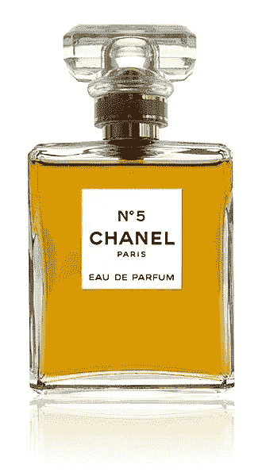
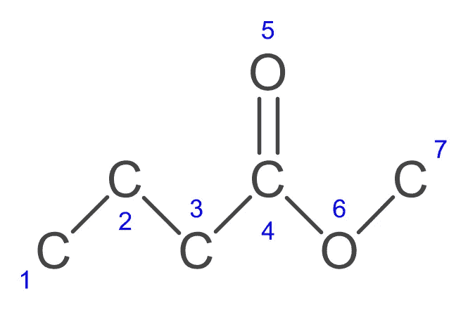

# 闻起来像机器学习的进步

> 原文：<https://towardsdatascience.com/smells-like-machine-learning-progress-611a2851acec?source=collection_archive---------4----------------------->

*注意:我想指出的是，我是作为机器学习的实践者来探讨这个话题的，而不是作为化学家、神经科学家或香水设计师。如果在读完这篇文章后，你决定……原谅这个双关语……把你的鼻子放在不属于它的地方，我将不负任何责任。*

对于某些类型的刺激，机器学习已经取得了相当大的进展。

计算机视觉系统在越来越多的任务上超越了人类，并在从医学成像到自动驾驶汽车(以及[收割机器人](/the-fruits-of-deep-learning-how-convolutional-neural-networks-support-robotic-harvesting-and-yield-35e2d383e2d8))的广泛技术中发挥着核心作用。

关于声音处理的一般问题的进展，可能被一个特定应用，即语音识别的日益流行所掩盖。

迄今为止，很少有人关注嗅觉。最近的发展表明，这种情况即将改变。

主观体验玫瑰的气味可能暂时仍是生物的专属。然而，这并不能阻止机器学习*预测*各种气味的数字和语言体验。

在很大程度上，机器学习是围绕竞赛来组织的。这一特殊领域的核心竞争是梦境嗅觉预测挑战。[1] 476 种不同的气味分子，以低浓度和高浓度呈现，由 49 个人在 21 个维度上进行评级。这就是“挑战”的开始。

评级可变性至少有两个来源。首先，由于遗传和环境原因，个体的实际嗅觉是不同的。[2]其次，描述词在语言上的模糊性使问题更加复杂。我对“麝香”的感觉可能和你不同。

文献中指出了在 0 到 100 的范围内匿名化评级的一些显著差异。[3]例如，个体 46 显示出在 50 左右评级趋势。显然，29 号个体有更强烈的观点，并表现出对 100 分的偏好。个人 10 依次将其等级均匀地分布在 0 到 100 之间。

环戊烷硫醇是一种具有强烈气味的调味成分，通常被描述为大蒜[4]。该研究中的 9 名受试者完全同意这种看法，并给这种分子打了 100 分的大蒜最高分。然而，三分之一的参与者根本不认为这是一种大蒜味。其余的在极端分数之间分配得相当均匀。

参与者对气味的强度和愉悦程度基本一致。评分变化最大的两个属性是“木质”和“温暖”。有趣的是,“冷”的描述比“暖”的描述更符合事实。

由于这些个体差异，梦嗅觉预测挑战分为两部分:子挑战#1 处理群体水平上的预测，而子挑战#2 基于模型预测个体嗅觉等级的能力来评估模型。

除了评级，数据集还提供了 4，884 种化学特征。让我们以丁酸甲酯为例，讨论特征的一个子集，莫罗-布罗托自相关。

这种特殊的分子显示出令人愉快的水果气味，由五个碳原子、十个氢原子和两个氧原子组成。除去氢，原子按以下方式排列:

Methyl Butyrate (without hydrogen atoms)

我们可以从分子图的角度来考虑这种排列，节点代表原子，边对应于原子之间的键。两个原子之间的边/键的数量称为距离。

我们例子中的每个原子至少有一个距离为 1 的邻居。对于一些对，例如碳原子 2 和碳原子 4 的对，有一个距离为 2 的路径。丁酸甲酯分子中的最大距离是 6。

为了计算莫罗-布罗托自相关[6]，我们需要两个循环。设 *i* 表示外环的索引，设 *j* 为内环的索引。外部循环从 1 迭代到最后一个原子的索引减去 *d* 。对于给定的距离 *d* ，内循环从 *i+d* 迭代到最后一个索引。我们必须决定的另一个因素是，每个原子的属性。一个常见的选择，也是下面例子中使用的，是原子质量。

对于由距离为 *d* 的路径连接的每对原子【T10(I，j)】，我们计算原子 *i* 的质量乘以原子 *j 的质量。*原子质量和距离为 *d* 的莫罗-布罗托自相关是这些乘积的总和。

假设我们将距离 d 设为 2。为了获得特征值，我们必须考虑以下对:(1，3)，(2，4)，(3，5)和(3，6)，(4，7)。设 *w_k* 表示原子 *k* 的质量。然后，特征值是以下计算的结果:

w _ 1 * w _ 3+w _ 2 * w _ 4+w _ 3 * w _ 5+w _ 3 * w _ 6+w _ 4 * w _ 7

既然我们已经讨论了数据集，并了解了一组常用的特征，我们可以继续研究最先进的技术。梦嗅觉预测挑战的获胜者是密歇根大学研究人员提交的模型，李等人(2017)[3]对此进行了描述。

获胜的模型有三个关键特征:(1)随机森林的使用，(2)单个目标的重新加权以及(3)包含四克特征。

特征空间远大于样本空间。4885 个基本功能与 992 个评级形成鲜明对比。因此，需要采取措施来防止过度拟合的风险。为数不多的可用数据点充斥着异常值，证明了嗅觉感知的非线性。出于这些原因，作者认为随机森林是合适的，这是一种流行的学习方法，可以在数据集的不同部分训练一组单独的决策树。

为了进一步减少异常值对模型的影响，使用个人评级和所有 49 名受试者的平均评级(群体评级)的仿射组合对目标进行重新加权:

*重新加权目标= alpha *个人评分+ (1 - alpha) *群体评分*

最后，数据集提供的基本特征被丰富为四个字母的特征，即通过在分子名称上滑动窗口产生的四个字母的字符序列。例如，“丁酸甲酯”包含以下附加特征:“甲基”、“乙基”、“htyl”、“tyra”、“yrate”、“rate”。

按照刚刚概述的方法，测试数据中预测等级和实际等级之间的报告相关性对于气味强度约为 0.4，对于愉快度接近 0.3。

总的来说，19 个语义描述符变得更难预测，相关性低于 0.2。特别是，对于个人强烈反对的描述词“温暖”和“木头”，预测和实际评分之间几乎没有线性关系。相比之下，关于描述符“水果”和“甜食”的表现与愉悦属性的结果相当。

5 重交叉验证表明 0.2 的小值是 *alpha* 的合适选择，alpha 是调节单个目标值重新加权的参数。

简单的化学特征，如分子量或官能团的存在，几乎没有预测能力。在 21 个属性中，超过 20%的前 5 个特征是莫罗-布罗托自相关。值得注意的是，基于前 15 个特性的随机森林实现了与访问全部特性集的模型相当的性能。

因此，在梦嗅觉预测挑战中获胜的参赛作品是一个传统的随机森林，它能够根据一些化学特征和小而嘈杂的数据集以中等精度预测个体的嗅觉感知。

在其他应用中，这开辟了使用机器学习作为现有香水设计方法的替代或补充的可能性。据估计，全球香水、除臭剂和止汗剂的市场价值约为 700 亿美元。[7]由机器学习支持的设计过程可能与定制和小众香水的增长趋势特别相关。

我期待着(也嗅到了)带有工作名称的产品的发布，比如“随机森林的气味”，当然还有“深层香水”。

# 感谢您的阅读！如果你喜欢这篇文章，请点击拍手按钮并关注我，以接收更多关于令人兴奋的机器学习应用程序的信息。

# 笔记

[1] Keller，a .，Gerkin，R.C .，Guan，y .，Dhurandhar，a .，Turu，g .，Szalai，b .，大陆，J.D .，Ihara，y .，Yu，C.W .，Wolfinger，r .和 Vens，c .，2017 .从气味分子的化学特征预测人的嗅觉。*科学*，p.eaal2014。

[2] Menashe，I .，Man，o .，Lancet，d .和 Gilad，y .，2003 年。不同的人有不同的鼻子。*自然遗传学*， *34* (2)，第 143 页

[3]李，h .潘瓦尔，b .奥门，G.S .和关，y . 2017。根据大规模化学信息特征精确预测个性化嗅觉。*千兆科学*。

[4]环戊烷硫醇，[thegoodscentscompany.com](http://www.thegoodscentscompany.com/data/rw1015151.html)。

[5]丁酸甲酯，[thegoodscentscompany.com](http://www.thegoodscentscompany.com/data/rw1008721.html)。

[6] Todeschini，r .和 Consonni，v .，2008 年。*分子描述符手册*(第 11 卷)。约翰·威利的儿子们。

[7]2012-2024 年全球香水、除臭剂和止汗剂市场规模(以十亿美元计)，[statista.com](http://statista.com/statistics/259221/global-fragrance-market-size/)