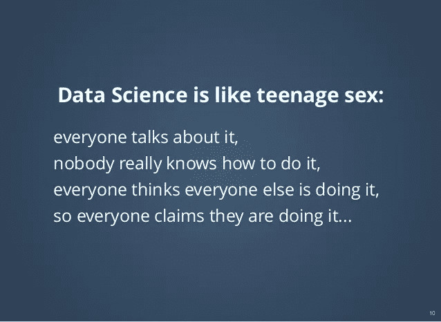
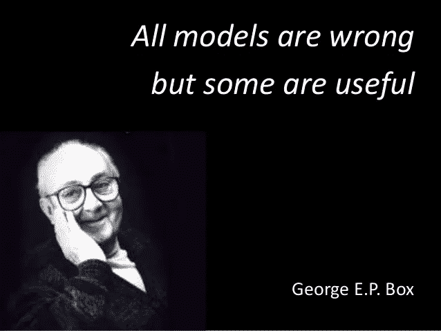

# 那么，你有多少 ML 模型没有造出来？

> 原文：<https://towardsdatascience.com/so-how-many-ml-models-you-have-not-built-e692f549b163?source=collection_archive---------12----------------------->

Source : Pixabay

好奇怪的问题！！这是你看了标题后会想到的。也许你认为“不是”这个词是偶然的。

嗯，在过去的几年里，我们很多人都遇到过这样的文章

> “十大机器学习算法每个数据科学家**都应该** **知道**”
> 
> "每个数据科学家**都应该知道的前 20 个 R 包**"
> 
> "每个数据科学家**都应该知道的前 30 个 Python 库**"

不胜枚举。任何新的数据科学追求者仅仅通过在互联网上看到“**应该知道**”类型的文章就已经挥舞起白旗了。

[Source](https://www.beforethecross.com/encouragements/wave-the-white-flag/)

一天结束时，由于信息量太大，一个人不知道首先从哪里开始。

从一个有抱负的数据科学家的角度来看，我上面描述的是一个问题。

## 给我造一个 ML 模型

由于“应该知道”类型的文章，有一个更大的问题，问题的承担者是公司——初创公司和大型跨国公司。

你问的问题是什么？

每个人都想分享最新的“数据科学”。

Adapted from Dan Ariely’s original Quote

许多公司想做数据科学，因为

> 他们认为他们的竞争对手正在这么做
> 
> 他们不想被视为落后者
> 
> 他们相信会有很好的投资回报

但对于这些公司中的许多人来说，数据科学完全是一个新领域，因此他们的工作描述通常很奇怪，面试过程甚至更奇怪。

一些受“应该知道”类文章影响的公司告诉求职者

> 这是我们面临的问题，告诉我们有哪些机器学习算法可以应用？

新培养的数据科学家很快脱口而出 2-3ML 算法，并被倾心的公司聘用。在适当的时候，算法被实现。这位数据科学家给公司留下了良好的印象，他的模型准确率高达 90% .这些模型已投入生产。但是你瞧，这个模型并没有给公司带来它所希望的投资回报率。发生了什么事？

事实是，数据科学家没有商业头脑，认为他/她的 KPI 只是构建“好的”ML 模型。这家公司有商业头脑，但没有机器学习/统计知识。理想的婚姻从未发生过。

## 修船人的故事

我们都听说过这个故事或者这个故事的变体。

Source : Pixabay

一家轮船公司雇用了一名工程师来修理轮船的发动机。工程师的工具箱里有所有的工具。经过一番分析后，工程师拿出一把锤子，敲击发动机的一个部件。发动机开始工作了。第二天，工程师把发票寄给了轮船公司，仅仅 5 分钟的工作就要支付 10，000 美元的巨额费用。

船公司经理大吃一惊，要求工程师逐项列出发票。该法案内容如下

> 用锤子敲打——2 美元
> 
> 知道去哪里——9998 美元

现在你可能认为我强调领域知识和经验，是的，你猜对了。

## 修船人—数据科学家类比

故事中的工程师工具箱里有所有的工具，但他只选择了锤子(也许是最简单的工具)来修理发动机。此外，最重要的是，他知道问题出在哪里。同样，一个数据科学家不应该选择先用基础分析解决问题吗？而是直接实现机器学习算法？

## 最小化损失函数

“所有的模型都是错的，有些是有用的”。

在大多数机器学习算法中，我们试图最小化损失函数。

模型是现实的抽象。这里的词是抽象。这不是真的。

你想想，构建机器学习算法的过程本身就有更大的‘损失函数’。那就是我们与现实不同。

那么，我们是不是应该少建一些模型来最小化这个更大的‘损失函数’呢？

## 嘿，数据科学家，像 CEO 一样思考

我们这些数据科学家经常陷入非常技术性的思维。我们只考虑哪种 ML 算法适用于 x，y，z 问题。如何做特征选择？如何减少特征的数量？如何提高模型的精度？

我们不认为最大似然算法会给公司带来什么好处。通过我的 ML 算法我能为公司省多少钱。投资回报率会是正数吗？

我们忘记问的最重要的问题是**“这个商业问题真的需要机器学习算法吗”？**

我知道最后一句话会引起轩然大波。你们中的许多人会感到震惊，可能会问“你是想让我们失业吗？”

相反，没有。

有许多商业问题确实需要机器学习方法，但不是所有的。大多数业务问题都可以通过简单的分析或[基线](/first-create-a-common-sense-baseline-e66dbf8a8a47)方法来解决。

会让我们失业的是机器学习的过度杀伤。我见过用机器学习算法来解决非常琐碎的问题，更糟糕的是，这些公司在这个想法上投入了大量资金。这是一颗定时炸弹。一旦公司意识到投资回报率为负，他们就会完全回避数据科学实践。我们都知道赢得一个被责骂的顾客有多难。没有数据科学，就没有数据科学家。

## 尊重

我相信，当数据科学家说“*对不起，你的业务问题不值得使用机器学习算法*”时，这极大地提高了数据科学家在客户/公司眼中的地位。照吩咐去做比违背要容易得多。当数据科学家拒绝时，它会做两件事

1.  它展示了数据科学家拥有丰富的知识，因此也知道局限性
2.  它展示了数据科学家不仅了解业务，还关心客户/公司的福祉(业务方面)

## 时间到了，数据科学审计员来了

业界对数据科学的前景既兴奋又警惕。许多已经实施了数据科学解决方案的人由于投资回报率低而不再抱有幻想。

**进入数据科学审核员**

我预见到一个新的工作角色将被创造出来“**数据科学审计员**”，公司将雇佣有经验的数据科学家(统计学家/应用数学家)来审计数据科学项目。

在我最近的一个咨询项目中，我感觉自己就像一名审计员。我被要求即兴创作一个由数据科学家建立的 ML 模型，但经过分析发现，所应用的 ML 算法不仅是错误的，而且对于给定的业务问题，没有 ML 算法会起作用！！

客户只是被骗了。

反响——客户对数据科学家没有好感，感觉在情感和金钱上都受到了欺骗。

也许，下次不要问数据科学家“你已经建立了多少 ML 算法”

宁愿问

## “您还没有构建多少 ML 算法”

如果你喜欢我的文章，给它一些掌声，你也可以在下面发表评论，表达你对这篇文章的看法。

你可以联系我

[领英](http://www.linkedin.com/in/venkat-raman-Analytics)

[推特](https://twitter.com/venksaiyan)

我的博客:[分析洛卡](https://wordpress.com/view/analyticsloka.blog)