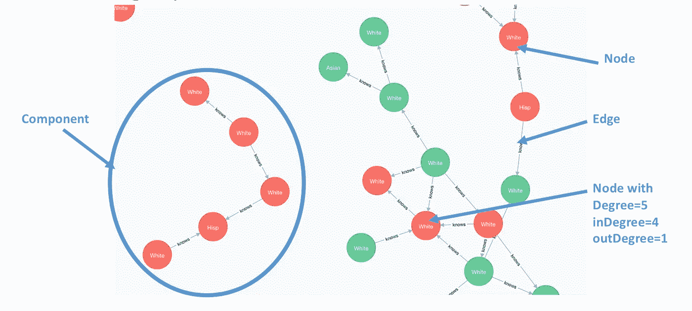
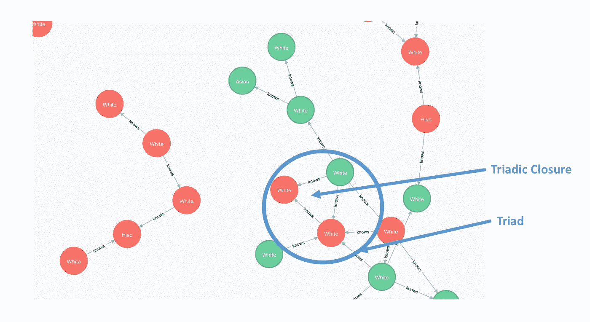
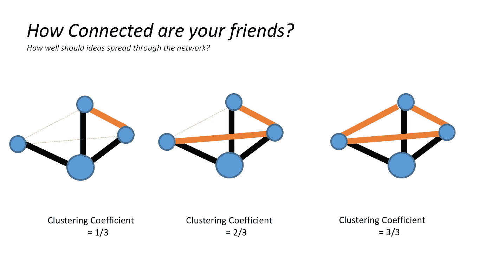
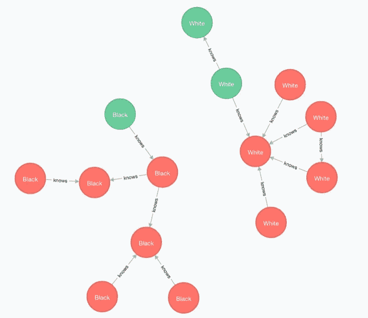
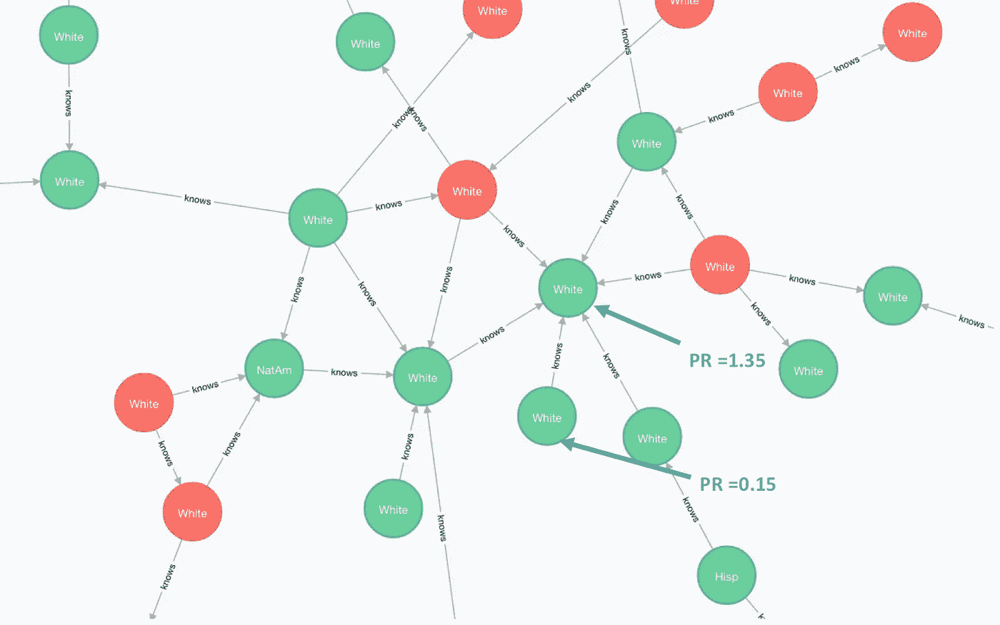

# 使用 Apache Spark 和 Neo4J 进行社交网络分析

> 原文：<https://towardsdatascience.com/social-network-analysis-using-apache-spark-and-neo4j-1ccba3c8af9a?source=collection_archive---------6----------------------->

## 了解社会系统和互动的旅程

Photo by [Matthew Cabret](https://unsplash.com/photos/ub1sSvJ_Tbs?utm_source=unsplash&utm_medium=referral&utm_content=creditCopyText) on [Unsplash](https://unsplash.com/?utm_source=unsplash&utm_medium=referral&utm_content=creditCopyText)

我对社会网络分析(SNA)感兴趣已经有一段时间了，从小规模问题开始，最终使用手机数据解决大规模问题。以我目前在 Praekelt 的角色，我们可以利用这些概念来接触难以接触到的个人，例如，鼓励他们进行 HIV 检测。

作为学习曲线的一部分，我发现 Apache Spark 在处理能力方面提供了实质性的提升，当与图形数据库(Neo4J)结合时，完全改变了必要的东西。在这篇文章中，我试图给出 SNA 可能有用的地方，一些 SNA 术语和指标，以及一个可以用来大规模分析社交网络的代码链接。

为了将这篇博文建立在真实数据的基础上，我使用了 Statnet R 包中的一个数据集。这些数据是基于哈里斯、弗洛里、塔博尔、贝尔曼、琼斯和乌德里*的数据通过模拟生成的。*由于数据是通过模拟生成的，因此不存在匿名或隐私问题。这些数据是一个不变的、无方向的友谊网络，由 1，461 个模拟个体组成，包括他们的年级、性别和种族。

查看社交网络时，理解一些词汇很重要。下面我们找到了一些常用词:

1.  **节点:**个人的图形化表示。
2.  **边:**边代表两个个体(节点)之间的关系
3.  **度:**连接一个节点的边数。这些可以进一步细分为*入度*(即传入边沿的数量)或*出度*(传出边沿的数量)。
4.  **组件:**这是一组*独立的*个体(在图中表示为节点)，它们相互连接。

A graph representation of part of thesimulated social network used in this blog post

现实社会网络中有许多有趣的观察结果。其中之一是，如果一个人有两个朋友(一个*三联体)*，那么这两个朋友也很有可能是朋友。这就是所谓的**。当试图影响社交网络中的信息传播或连通性时，这可能是有用的。**

**

*Demonstration of triadic closure*

*第二个有用的度量被称为 ***聚类系数*** *。*这衡量一个集群中实际连接的百分比，与可能连接的数量进行比较。较高的聚类系数表示图中的高连通性。*

**

**(*【物以类聚】)*是现实世界网络的属性。个人更有可能与和他们至少有一些相似之处的其他个人联系在一起。在下面的图表中，我们展示了模拟数据集中种族的同质性，然而，这也与性别和年级有关。**

****

**另一个有用的度量是给每个节点分配一个影响级别。有很多方法可以实现这一点，但最广为人知的可能是 ***PageRank。*** 下图证明了这一点，其中，与联系较少的个人相比，联系较多的个人被分配了较高的 PageRank (PR)。**

****

**能够处理大型社交网络是很有用的，考虑到边的数量，这些很快成为难题。这得益于大规模并行处理平台，如 Apache Spark。我在我的 github 页面([https://github.com/chopley/spark_social_network_analysis](https://github.com/chopley/spark_social_network_analysis))上放了一个教程来指导用户完成这个过程。特别是 Apache Zeppelin 文件将引导新用户完成计算上述值的过程。本教程还将指导您设置 Neo4J 并生成上面的图。**

**我希望你玩得开心！如果你觉得这个有用，请给我一个掌声！**

1.  **Mark S. Handcock、David R. Hunter、Carter T. Butts、Steven M. Goodreau 和 Martina Morris (2003 年)。 **statnet** :网络数据统计建模软件工具。网址[http://statnetproject.org](http://statnetproject.org/)**
2.  **Harris KM，Florey F，Tabor J，Bearman PS，Jones J，Udry JR (2003)。"全国青少年健康纵向研究:研究设计."北卡罗来纳大学技术报告。网址[http://www.cpc.unc.edu/projects/addhealth/design.](http://www.cpc.unc.edu/projects/addhealth/design.)**