# 带 Tensorflow 的软标志激活功能[带 TF 的手动后撑]

> 原文：<https://towardsdatascience.com/soft-sign-activation-function-with-tensorflow-manual-back-prop-with-tf-5a04f3c8e9c1?source=collection_archive---------13----------------------->

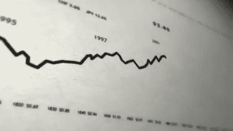

GIF from this [website](/basic-data-cleaning-engineering-session-twitter-sentiment-data-95e5bd2869ec)

因此，论文“[二次特征和分块的深度架构](https://dl.acm.org/citation.cfm?id=1620921)”自 2009 年就已经存在，然而我最近在阅读“[理解训练深度前馈神经网络](http://proceedings.mlr.press/v9/glorot10a/glorot10a.pdf)的困难”时发现了该论文中介绍的激活函数(我也就此事做了一篇论文总结，如果有人对[感兴趣，请点击此处](https://medium.com/@SeoJaeDuk/paper-summary-understanding-the-difficulty-of-training-deep-feed-forward-neural-networks-ee34f6447712))。)

只是为了好玩，让我们比较许多不同的情况，看看哪个给我们最好的结果。

***案例 a) Tanh 激活函数*** [***与 AMS Grad***](https://medium.com/@SeoJaeDuk/implementation-of-optimization-for-deep-learning-highlights-in-2017-feat-sebastian-ruder-61e2cbe9b7cb) ***案例 b)软签激活函数*** [***与 AMS Grad***](https://medium.com/@SeoJaeDuk/implementation-of-optimization-for-deep-learning-highlights-in-2017-feat-sebastian-ruder-61e2cbe9b7cb) ***案例 c) ELU 激活函数*** [***与 AMS Grad***](https://medium.com/@SeoJaeDuk/implementation-of-optimization-for-deep-learning-highlights-in-2017-feat-sebastian-ruder-61e2cbe9b7cb)

**软标志激活功能**

**红线** →软标志激活功能
**蓝线** →双曲正切激活功能
**绿线** →软标志功能的导数
**橙线** →双曲正切激活功能的导数

如上所述，我们可以直接观察到软符号激活函数比双曲正切激活函数更平滑的事实。(具体来说，该函数名义上是多元增长，而不是指数增长。)并且这种更温和的非线性实际上导致更好更快的学习。在更详细的解释中，研究人员发现，柔和的手势可以防止神经元饱和，从而提高学习效率。(要了解更多信息，请阅读这篇[博文。)](https://medium.com/@SeoJaeDuk/paper-summary-understanding-the-difficulty-of-training-deep-feed-forward-neural-networks-ee34f6447712)

**网络架构/数据集**

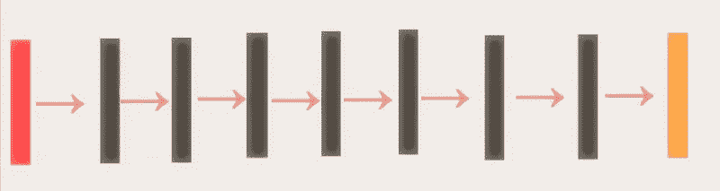

**红框** →输入图像
黑框 →与不同激活函数的卷积运算
**橙框** →分类的软 Max 运算

如上所述，我们将使用的基础网络架构是 ICLR 2015 中展示的[全卷积网络。最后，我们将用来评估我们网络的数据集是](/iclr-2015-striving-for-simplicity-the-all-convolutional-net-with-interactive-code-manual-b4976e206760) [CIFAR 10 数据。](https://www.cs.toronto.edu/~kriz/cifar.html)

**结果:情况 a) Tanh 激活功能** [**与 AMS Grad (CNN)**](https://medium.com/@SeoJaeDuk/implementation-of-optimization-for-deep-learning-highlights-in-2017-feat-sebastian-ruder-61e2cbe9b7cb)

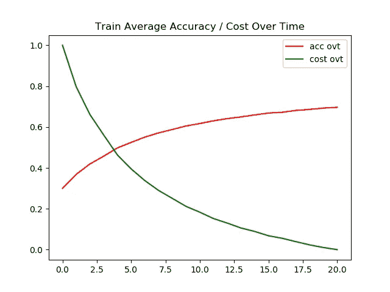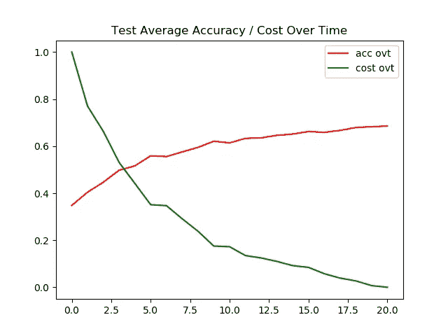

**左图** →一段时间内的训练精度/成本
**右图** →一段时间内的测试精度/成本

如上所述，对所有卷积网络使用 tanh 的图像分类任务似乎需要更长的时间来收敛。在 21 世纪末期，该模型只能在训练图像上达到 69%的准确度(在测试图像上达到 68%的准确度)，然而该模型似乎在正则化方面做得很好。

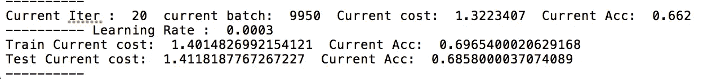

**结果:情况 b)软标志激活功能** [**与 AMS Grad (CNN)**](https://medium.com/@SeoJaeDuk/implementation-of-optimization-for-deep-learning-highlights-in-2017-feat-sebastian-ruder-61e2cbe9b7cb)

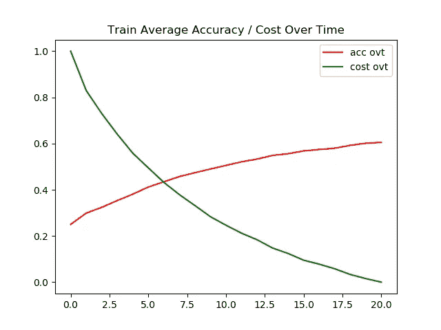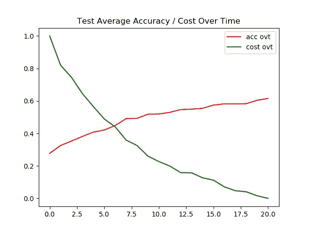

**左图** →一段时间内的训练精度/成本
**右图** →一段时间内的测试精度/成本

我其实很惊讶，软标志激活功能的表现不如 tanh。花费更长的时间来收敛并不总是意味着激活函数不好，然而对于这种设置，软符号激活函数可能不是最佳选择。

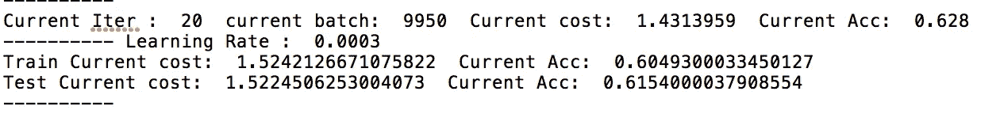

**结果:情况 c) ELU 激活功能** [**与 AMS Grad (CNN)**](https://medium.com/@SeoJaeDuk/implementation-of-optimization-for-deep-learning-highlights-in-2017-feat-sebastian-ruder-61e2cbe9b7cb)

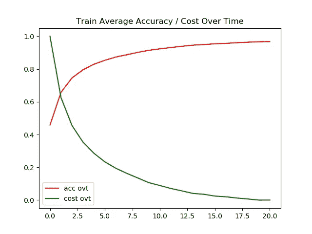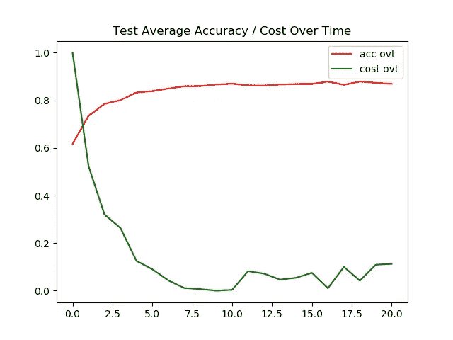

**左图** →一段时间内的训练精度/成本
**右图** →一段时间内的测试精度/成本

对于图像分类，传统的 relu 类激活似乎是最好的选择。因为它们不仅在训练/测试图像上具有最高的精度，而且收敛得更快。

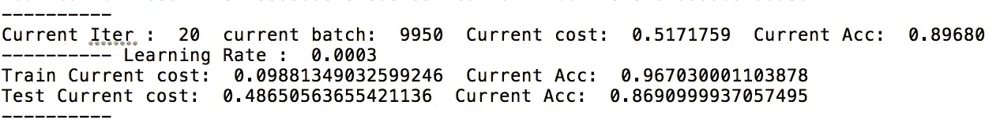

**交互代码**

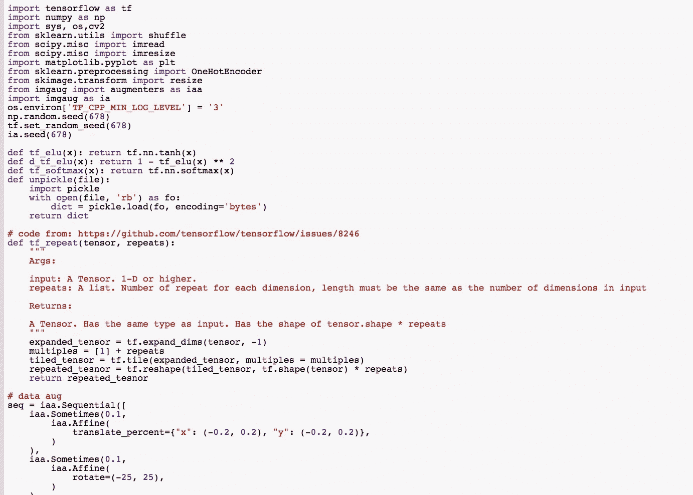

对于 Google Colab，你需要一个 Google 帐户来查看代码，而且你不能在 Google Colab 中运行只读脚本，所以在你的操场上复制一份。最后，我永远不会请求允许访问你在 Google Drive 上的文件，仅供参考。编码快乐！同样为了透明，我在 github 上上传了所有的训练日志。

要访问[案例的代码，点击这里，](https://colab.research.google.com/drive/1QDfuDXl2LGYxwdjz6W1iHmsvzbXm4Snh)[日志的](https://github.com/JaeDukSeo/Daily-Neural-Network-Practice-2/blob/master/NeuralNetwork/softsign/a1/casea.txt)点击这里。
点击此处查看[案例 b 的代码](https://colab.research.google.com/drive/1zSfBmrTBH0sX4LOPXkn48lUC6dz3xXg6)，点击此处查看[日志。](https://github.com/JaeDukSeo/Daily-Neural-Network-Practice-2/blob/master/NeuralNetwork/softsign/b1/caseb.txt)
要访问[案例 c 的代码，请点击此处](https://colab.research.google.com/drive/126dgOgW2wNbnxKEzdrDbifZB7JWbDU0x)，要查看[日志，请点击此处。](https://github.com/JaeDukSeo/Daily-Neural-Network-Practice-2/blob/master/NeuralNetwork/softsign/c1/casec.txt)

**遗言**

另外，[这篇博文](/deep-study-of-a-not-very-deep-neural-network-part-2-activation-functions-fd9bd8d406fc)在比较许多其他激活功能方面做得非常出色，所以如果有人感兴趣，请查看一下。

如果发现任何错误，请发电子邮件到 jae.duk.seo@gmail.com 给我，如果你想看我所有写作的列表，请在这里查看我的网站。

同时，在我的推特[这里](https://twitter.com/JaeDukSeo)关注我，并访问[我的网站](https://jaedukseo.me/)，或我的 [Youtube 频道](https://www.youtube.com/c/JaeDukSeo)了解更多内容。我还实现了[广残网，请点击这里查看博文 pos](https://medium.com/@SeoJaeDuk/wide-residual-networks-with-interactive-code-5e190f8f25ec) t。

**参考**

1.  图瑞安、伯格斯特拉和本吉奥(2009 年)。组块的二次特征和深层结构。人类语言技术会议录:计算语言学协会北美分会 2009 年度会议，配套卷:短文，245–248。从[https://dl.acm.org/citation.cfm?id=1620921](https://dl.acm.org/citation.cfm?id=1620921)取回
2.  作为神经网络激活函数的软设计。(2017).赛菲克·伊尔金·塞伦吉尔。检索于 2018 年 5 月 28 日，来自[https://sefiks . com/2017/11/10/soft sign-as-a-neural-networks-activation-function/](https://sefiks.com/2017/11/10/softsign-as-a-neural-networks-activation-function/)
3.  对一个不很深的神经网络的深入研究。第 2 部分:激活函数。(2018).走向数据科学。2018 年 5 月 28 日检索，来自[https://towards data science . com/deep-study-of-a-not-very-deep-neural-network-part-2-activation-functions-FD 9 BD 8d 406 fc](/deep-study-of-a-not-very-deep-neural-network-part-2-activation-functions-fd9bd8d406fc)
4.  (2018).Proceedings.mlr.press .检索于 2018 年 5 月 28 日，来自[http://proceedings.mlr.press/v9/glorot10a/glorot10a.pdf](http://proceedings.mlr.press/v9/glorot10a/glorot10a.pdf)
5.  【论文摘要】了解训练深度前馈神经网络的难度。(2018).中等。检索于 2018 年 5 月 28 日，来自[https://medium . com/@ SeoJaeDuk/paper-summary-understanding-the-difference-of-training-deep-feed-forward-neural-networks-ee34f 6447712](https://medium.com/@SeoJaeDuk/paper-summary-understanding-the-difficulty-of-training-deep-feed-forward-neural-networks-ee34f6447712)
6.  导数双曲函数。(2018).Math2.org。检索于 2018 年 5 月 28 日，来自[http://math2.org/math/derivatives/more/hyperbolics.htm](http://math2.org/math/derivatives/more/hyperbolics.htm)
7.  2017 年深度学习优化实现亮点(feat。塞巴斯蒂安·鲁德)。(2018).中等。检索于 2018 年 5 月 28 日，来自[https://medium . com/@ SeoJaeDuk/implementation-of-optimization-for-deep-learning-highlights-in-2017-feat-sebastian-ruder-61e 2 CBE 9 b 7 CB](https://medium.com/@SeoJaeDuk/implementation-of-optimization-for-deep-learning-highlights-in-2017-feat-sebastian-ruder-61e2cbe9b7cb)
8.  Wolfram|Alpha:让世界知识可计算。(2018).Wolframalpha.com。检索于 2018 年 5 月 28 日，来自[http://www.wolframalpha.com/input/?I = f(x)+% 3D+x % 2F(1% 2B % 7Cx % 7C)](http://www.wolframalpha.com/input/?i=f(x)+%3D+x%2F(1%2B%7Cx%7C))
9.  Numpy 向量(N，)。(2018).Numpy 向量(N，1)维-> (N，)维转换。堆栈溢出。检索于 2018 年 5 月 29 日，来自[https://stack overflow . com/questions/17869840/numpy-vector-n-1-dimension-n-dimension-conversion](https://stackoverflow.com/questions/17869840/numpy-vector-n-1-dimension-n-dimension-conversion)
10.  CIFAR-10 和 CIFAR-100 数据集。(2018).Cs.toronto.edu。检索于 2018 年 5 月 29 日，来自 https://www.cs.toronto.edu/~kriz/cifar.html
11.  [ ICLR 2015 ]追求简单:具有交互码的全卷积网。(2018).走向数据科学。检索于 2018 年 5 月 29 日，来自[https://towards data science . com/iclr-2015-力争简单-所有卷积网与交互式代码手册-b4976e206760](/iclr-2015-striving-for-simplicity-the-all-convolutional-net-with-interactive-code-manual-b4976e206760)
12.  [谷歌]连续可微分指数线性单位与互动代码。(2018).中等。检索于 2018 年 5 月 29 日，来自[https://medium . com/@ SeoJaeDuk/Google-continuously-differentiable-index-linear-units-with-interactive-code-manual-back-2d 0a 56 DD 983 f](https://medium.com/@SeoJaeDuk/google-continuously-differentiable-exponential-linear-units-with-interactive-code-manual-back-2d0a56dd983f)