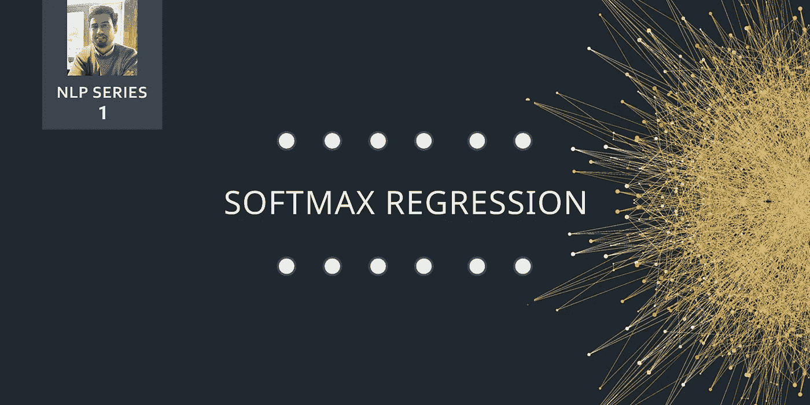

# 简化的 Softmax 函数

> 原文：<https://towardsdatascience.com/softmax-function-simplified-714068bf8156?source=collection_archive---------2----------------------->

## 回归公式如何提高深度学习模型的准确性

> **TL；这是我致力于机器/深度学习和自然语言处理主题系列的第一篇文章。这篇文章讨论了 Softmax 回归，其中我们计算输入向量的指数，以便将数据集归一化为值总和为 1 的概率分布。适合多维分类，而不是二元分类。**

## 序言

我对机器学习(ML)产生了浓厚的兴趣，特别是探索自然语言处理(NLP)领域。通过研究论文和算法，引起我对这个领域的好奇心；总的来说，人工智能在优化实验结果方面总是有改进的空间，100 行代码如何能够让行业自动化那些否则需要漫长而乏味的时间才能完成的任务。在我们必须学习一个数据集的情况下，然后输出有意义的信息，这些信息是认知的或与现实世界的期望一致的，并迭代地这样做，以通过增量变化来实现更高的准确性，这对我来说绝对是令人着迷的。

对我的学术旅程的洞察对大多数人来说是独特的，因为我的大多数课程都与产品工程和数据分析有关。然而，我想给这次学术经历增添一些额外的趣味。为了做到这一点，我决定报名参加学校计算机科学系开设的自然语言处理课程。

该课程在揭示大量可供学习的主题方面做得非常出色，随着该领域取得如此多的进展，我非常有动力开始撰写与 ML、NLP 和深度学习相关的概念。然而，随之而来的是一个挑战。课内外学习的概念已经是数学密集型的，充满了令人困惑的符号和推导。我想以这样一种方式简化它们，任何对某些主题有热情的人都可以很容易地理解它们，甚至可能将它们应用于研究、职业、创业或黑客马拉松。

所以在最初的几堂课中，教授带我们浏览了与*语言建模*相关的材料；这是智能系统使用的*、*技术，用于准确预测任何给定文本中的单词或句子。直到教授引入了一个特殊的术语叫做最大回归的 S**之前，这些内容都是有意义的。我被那些看起来像法语(或者更像拉丁语)的符号淹没了。)对我来说。通过几个小时的自学和一杯热腾腾的榛子咖啡，这个概念很快就有了意义。**

**为了以一种更加简化和进步的方式解释它，我们将首先从定义开始，然后理解所涉及的符号，最后看到函数本身的编码实现。**

## **定义**

**Softmax 回归是逻辑回归的一种形式，它将输入值归一化为值的向量，该向量遵循总和等于 1 的概率分布。输出值在范围[0，1]之间，这很好，因为我们能够避免二进制分类，并在我们的神经网络模型中容纳尽可能多的类或维度。这就是 softmax 有时被称为多项式逻辑回归的原因。**

> **顺便说一下，Softmax 回归的另一个名字是最大熵(MaxEnt)分类器。**

**该函数通常用于计算训练数据集时的预期损失。softmax 回归的已知用例在**判别** **模型**中，如**交叉熵**和**噪声对比估计**。这些只是试图优化当前训练集以增加预测正确单词或句子的可能性的各种技术中的两种。(我们将在接下来的几篇文章中触及上述技术，敬请关注。)**

**如果你从一开始就看它，这个定义可能听起来微不足道，但在机器学习和 NLP 领域，这个回归函数作为一个*基线*比较器是有用的。设计新解决方案的研究人员必须进行实验，并将 softmax 结果作为参考。然而，应该注意的是，softmax 并不像 **Sigmoid** 或 **ReLU** (整流线性单元)那样理想地用作激活功能，而是用于多层或单层之间。**

## **注释**

**分类器函数涉及一些高级符号，我们接下来将深入探讨。下图展示了 Softmax 函数的样子。让我们试着一点一点去理解。**

****

**A mathematical representation of the Softmax Regression function**

1.  **给定一个**独热编码**矩阵 **θ、**形式的净输入参数，我们的目标是预测训练的特征集***x；*** *每一个*都有自己设定的权重，都是 ***j*** 的一类。一个独热矩阵由二进制值组成，数字 1 代表列的 iᵗʰ位置的元素，而其余的是 0(相对较大的矩阵有稀疏的风险，我们将在下一篇文章中讨论)。**
2.  **在公式中，我们计算输入参数的**指数**和输入中所有现有值的**指数参数总和**。Softmax 函数的输出是参数的指数与指数参数之和的比值。**
3.  ****θ** ，在高层次上是向量中每个出现元素的得分之和。在一般形式中，我们说θ是权重矩阵 ***w*** 的转置，乘以特征矩阵 ***x.*****
4.  **术语 w₀x₀是需要在每次迭代中添加的偏差。**

## **代码实现**

**实现代码非常容易，有趣的是，考虑到我们有必要的 Python 助手函数，它只有一行代码。在下面的 Github 要点中，我使用了 **Numpy** 和 **Tensorflow** 来编写 Softmax 函数，如前一节所述。这两个提到的库普遍用于执行数学和神经网络相关的操作。**

## **结论**

**在下一篇文章中，我们将进一步了解如何利用 softmax 函数作为对数损失神经网络的一部分进行计算，以最小化单词嵌入中的预测误差。我们将获取文本样本，这将允许我们理解关于 NLP 及其在现实世界中的实际应用的更深层次的概念。**

**敬请关注。:)**

## **引用的作品**

** [## Softmax 函数和 Sigmoid 函数的区别

### 在学习逻辑回归概念时，主要的困惑是用于计算的函数…

dataaspirant.com](http://dataaspirant.com/2017/03/07/difference-between-softmax-function-and-sigmoid-function/) 

[https://sebastianraschka . com/FAQ/docs/soft max _ regression . html](https://sebastianraschka.com/faq/docs/softmax_regression.html)** 

***传播和分享知识。这篇文章是致力于理解 NLP 核心概念的系列文章中的第一篇。如果这篇文章激起了你的兴趣，请鼓掌，因为它总是激励我写出更多的信息内容。此外，请关注我的个人资料，获取更多与技术相关的文章。—哈姆扎***