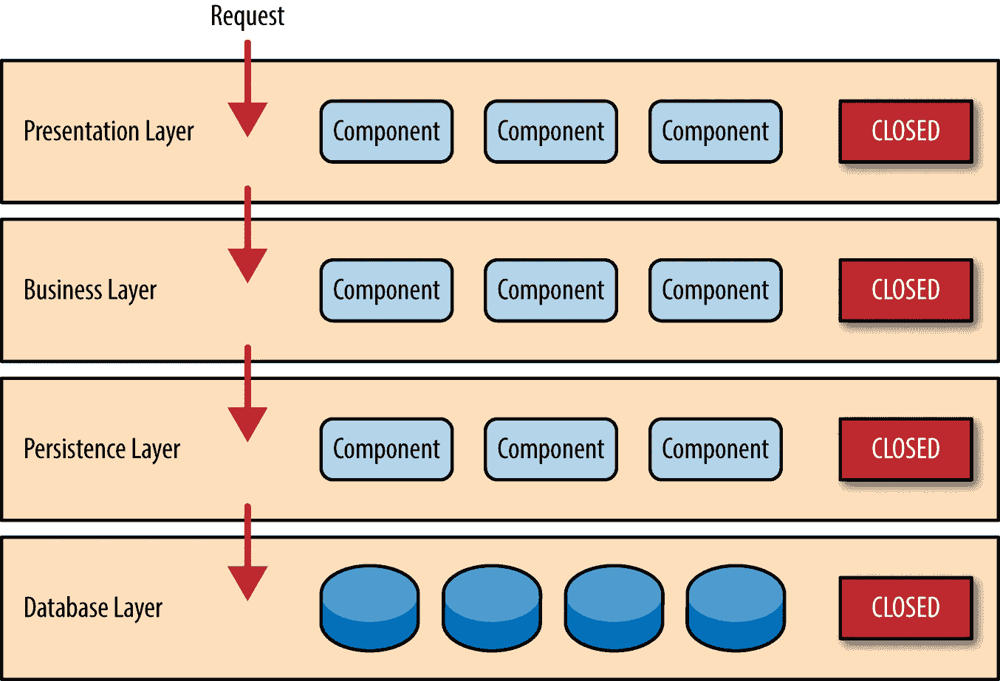
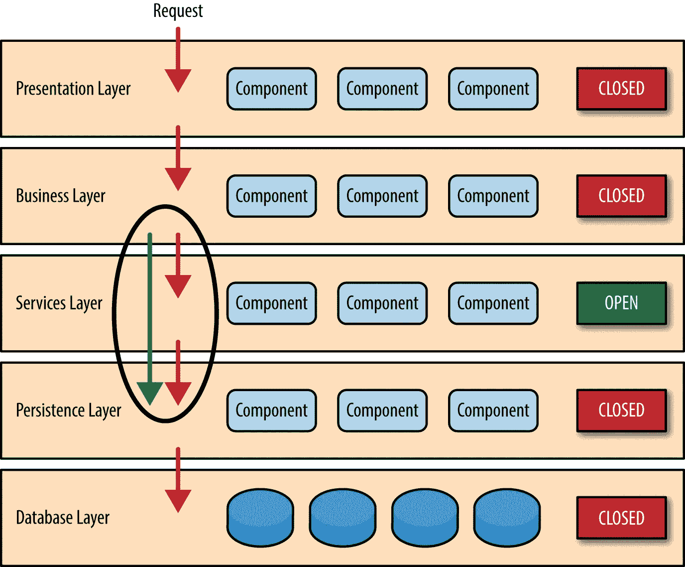

# 软件架构模式

> 原文：<https://towardsdatascience.com/software-architecture-patterns-98043af8028?source=collection_archive---------0----------------------->

## 分层架构

这是大多数企业级应用程序中最常见的架构模式。假设层数为 **n** ，这也被称为 **n 层**模式。这是 JAVA EE 应用程序的事实模式。

# 层的示例场景

Source: [https://www.oreilly.com/ideas/software-architecture-patterns/page/2/layered-architecture](https://www.oreilly.com/ideas/software-architecture-patterns/page/2/layered-architecture)

## **表示层**

网页、UI 表单和最终用户交互 API 的呈现

## 业务层

可访问性、安全性和身份验证背后的逻辑发生在这一层。这包括 ESB(企业服务总线)、中间件和其他各种请求拦截器来执行验证。

## 持久层

这是数据的表示层。这包括 DAO(数据访问对象)表示、ORM(对象关系映射)和其他在应用程序级别表示持久数据的模式。换句话说，这展示了 RAM 中的持久数据。它通常位于下层的磁盘中。

## 数据库层

简单的数据库扩展到 San(存储区域网络)

# 层的组成

层由组件组成。这些组件比对象类和包更抽象。一个组件可以演示一组执行单一任务的包。

> “组件加强了关注点的分离”

# 关键概念

## 封闭层

这展示了 ***隔离层*** 的概念，它以更严格的方式分隔每一层，只允许顺序通过各层，而不允许旁路。如图所示，这加强了层的更好的解耦，使得整个系统对于变化更加可行。

Source: [https://www.oreilly.com/ideas/software-architecture-patterns/page/2/layered-architecture](https://www.oreilly.com/ideas/software-architecture-patterns/page/2/layered-architecture)

## 打开图层

开放层允许系统绕过层并触及下面的层。这是在任务关键型系统中完成的，在这些系统中，延迟会造成很大的损失。通常这些层意味着通信开销。因此，有时绕过层并直接从正确的层寻找数据是合理的。

Source: [https://www.oreilly.com/ideas/software-architecture-patterns/page/2/layered-architecture](https://www.oreilly.com/ideas/software-architecture-patterns/page/2/layered-architecture)

# 模式分析

采用分层模式可能会误导并导致一种称为 ***“架构陷坑反模式”*** 的反模式，这种反模式展示了具有不执行任何逻辑的层，但增加了通信开销。因此，这些层必须以执行特定任务的方式进行设计，以补偿整个系统的通信开销和可维护性。

## 模式可测试性

由于分层的性质，这个值更高。通过传递虚拟消息并使用虚拟接口来演示直接层，可以单独测试每一层。

## 性能和可扩展性

由于有通信开销，这可能很低。这可能需要转换消息类型等。就可伸缩性而言，添加更多层不是一个选择。该模式不会无限扩展。

> 尽管有起有落，开发工作还是少了很多，因为一旦确定了通信协议，不同的团队就可以在不同的层上工作，并在每个团队的成员之间分配组件。