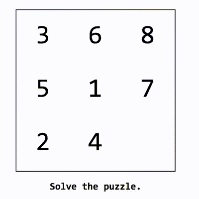
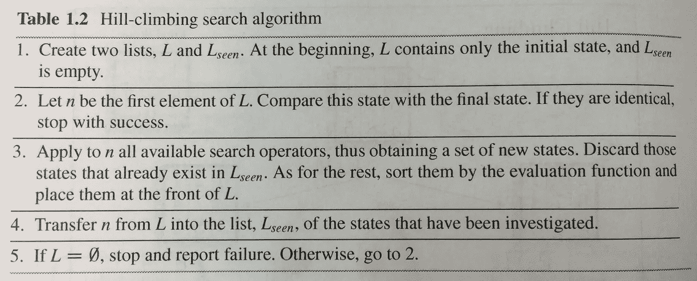
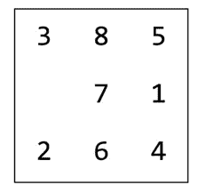
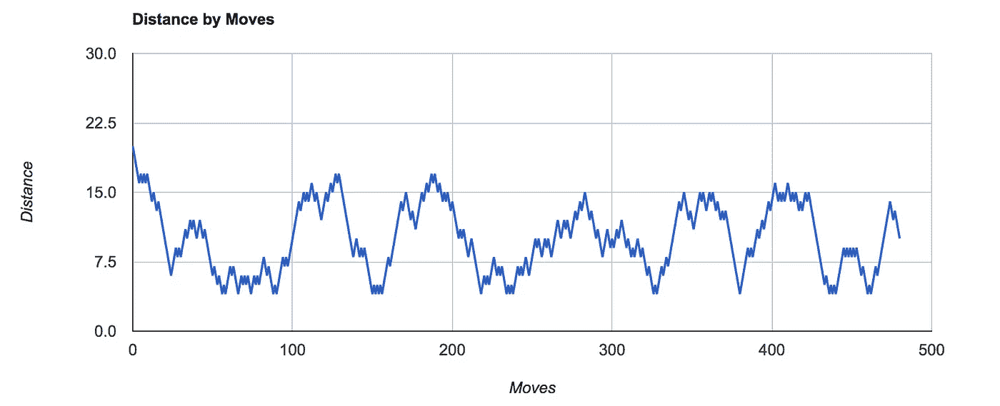
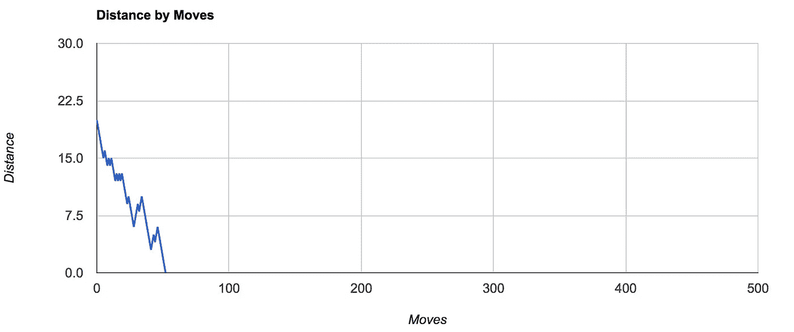
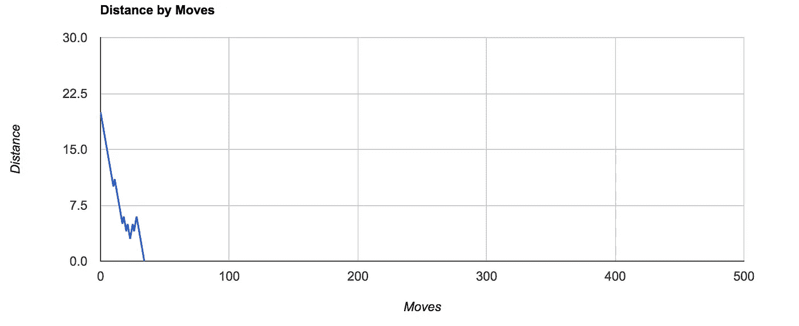
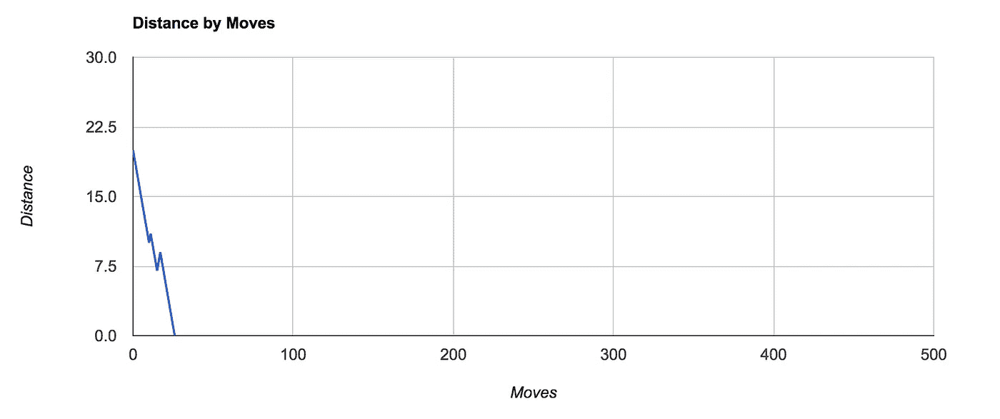

# 用爬山搜索算法解决幻灯片难题

> 原文：<https://towardsdatascience.com/solve-slide-puzzle-with-hill-climbing-search-algorithm-d7fb93321325?source=collection_archive---------0----------------------->



爬山搜索算法是局部搜索和优化技术中最简单的算法之一。Miroslav Kubat 在《机器学习导论》一书中是这样定义的:



Hill Climbing Algorithm Steps

步骤 3 中的评估函数计算当前状态与最终状态的距离。所以在 3x3 幻灯片拼图的情况下，我们有:

```
Final State: 
1 2 3
4 5 6 
7 8 Consider Current State: 
1 2 3 
4 5 6 
7   8
```

评估函数 dF 计算每个瓦片达到其最终状态所需的移动的总和。由于图块 1 至 7 已经位于正确的位置，因此不需要移动它们。然而，瓦片 8 从其最终位置移开。

```
dF(8) = m(1)+m(2)+m(3)+m(4)+m(5)+m(6)+m(7)+m(8)
= 1
```

爬山评估可能的下一步，选择距离最短的一步。它还检查是否已经观察到移动后的新状态。如果为真，那么它跳过这步棋，选择下一步最好的棋。由于空缺的瓷砖只能由其邻居填充，爬山有时会被锁定，无法找到任何解决方案。这是这个算法的主要缺点之一。

另一个众所周知的缺点是*局部最优*。该算法根据即时距离(成本)决定下一步行动(状态)，假设现在的小改进是达到最终状态的最佳方式。但是，选择的路径可能会导致后期成本更高(步骤更多)。

> 类似于爬上一座小山后进入一个山谷。

为了避开局部最优，我建议使用深度优先的方法。

# 深度优先法爬山

想法是遍历一条路径一个确定的步骤数(深度)以确认它是最好的移动。

1.  对当前状态的所有可能的下一步(状态)进行循环。
2.  调用步骤 1，直到达到深度 d。这会生成一棵高度为 d 的树。
3.  选择最小成本(dF)的移动(状态)
4.  返回 dF，以便在`depth-1`级别进行评估。

我观察到深度优先的方法提高了到达最终状态的整体效率。但是，它占用大量内存，与使用的深度值成比例。这是因为系统必须根据使用的深度跟踪未来状态。

以下是各种深度的移动距离图表的简要比较:



Puzzle Initial State



Depth=0, Puzzle Unresolved even after 480 steps



Depth=1, Puzzle Unresolved in 48 Steps



Depth=3, Puzzle Unresolved in 34Steps (Note fewer hills)



Depth=6, Puzzle Unresolved in 26 Steps (Even fewer hills)

这里可以进行现场评估[。尝试各种深度和复杂性，并查看评估图。有时，由于锁定(没有新状态)，谜题仍未解决。](http://ecotaru.com/slide-puzzle-eval/)

或者，如果你只是有解谜的心情，试试自己对抗由爬山算法驱动的 [bot](http://ecotaru.com/puzzle/) 。

每当你输给机器人时，点击这篇文章的“喜欢”按钮:-)

玩得开心！

已编辑:Live evaluation 和 bot 目前无法在移动设备上运行。