# 用 Python 解决简单的分类问题——水果爱好者版

> 原文：<https://towardsdatascience.com/solving-a-simple-classification-problem-with-python-fruits-lovers-edition-d20ab6b071d2?source=collection_archive---------1----------------------->

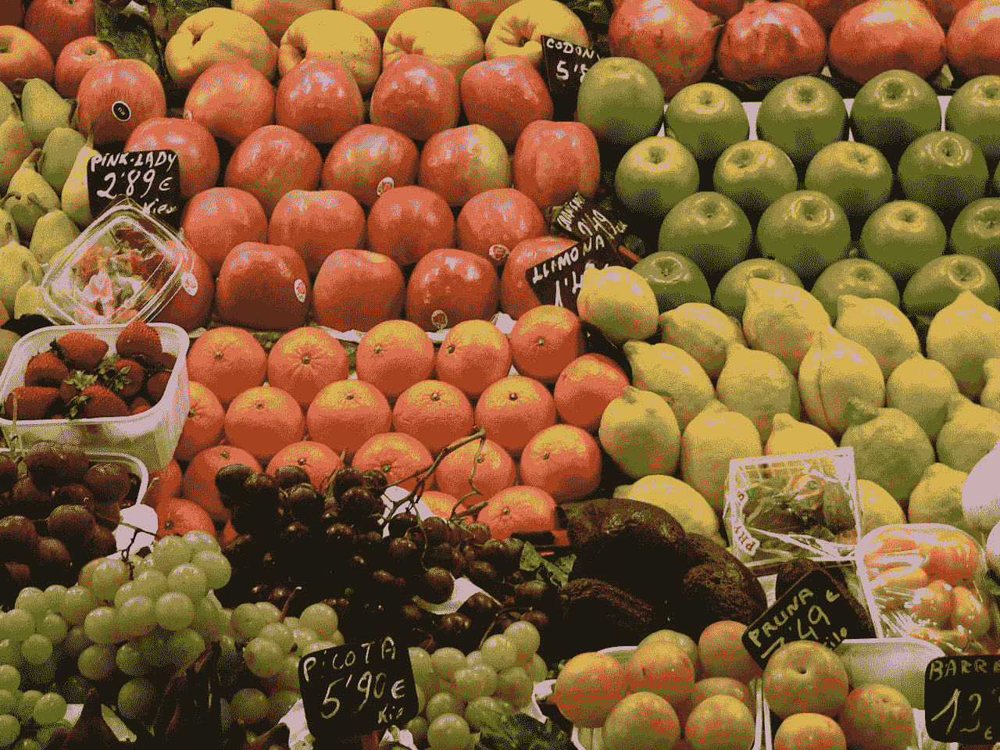

Photo credit: Pixabay

在这篇文章中，我们将使用 Python 最流行的机器学习工具 [Scikit-learn](http://scikit-learn.org/stable/) 在 Python 中实现几个机器学习算法。使用简单的数据集来训练分类器以区分不同类型的水果。

这篇文章的目的是确定最适合手头问题的机器学习算法；因此，我们希望比较不同的算法，选择性能最好的算法。我们开始吧！

# 数据

水果数据集是由爱丁堡大学的[伊恩·默里](http://homepages.inf.ed.ac.uk/imurray2/)博士创建的。他买了几十个不同品种的橘子、柠檬和苹果，并把它们的尺寸记录在一个表格里。然后密执安大学的教授将水果数据稍微格式化，可以从[这里](https://github.com/susanli2016/Machine-Learning-with-Python/blob/master/fruit_data_with_colors.txt)下载。

让我们看看前几行数据。

```
%matplotlib inline
import pandas as pd
import matplotlib.pyplot as pltfruits = pd.read_table('fruit_data_with_colors.txt')
fruits.head()
```

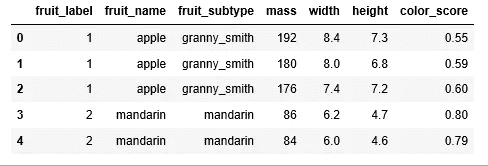

Figure 1

数据集的每一行都代表一片水果，由表的列中的几个要素表示。

数据集中有 59 种水果和 7 个特征:

```
print(fruits.shape)
```

***(59，7)***

数据集中有四种水果:

```
print(fruits['fruit_name'].unique())
```

***['苹果' '橘子' '橘子' '柠檬]]***

除了普通话，其他数据都很平衡。我们只能顺其自然了。

```
print(fruits.groupby('fruit_name').size())
```

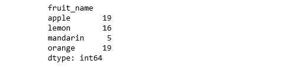

Figure 2

```
import seaborn as sns
sns.countplot(fruits['fruit_name'],label="Count")
plt.show()
```

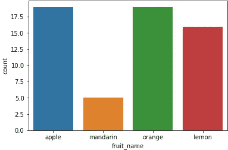

Figure 3

# 形象化

*   每个数值变量的箱线图将使我们对输入变量的分布有一个更清晰的概念:

```
fruits.drop('fruit_label', axis=1).plot(kind='box', subplots=True, layout=(2,2), sharex=False, sharey=False, figsize=(9,9), 
                                        title='Box Plot for each input variable')
plt.savefig('fruits_box')
plt.show()
```

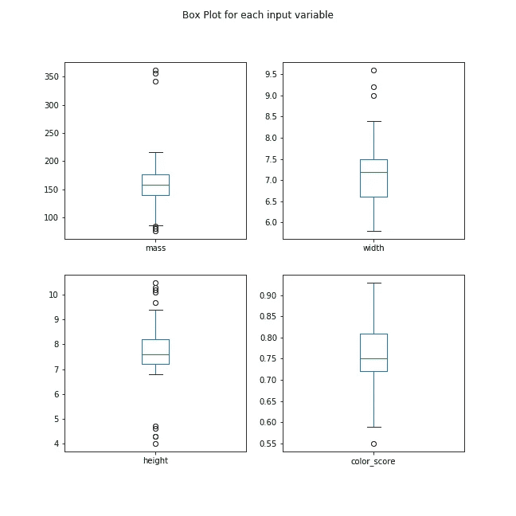

Figure 4

*   看起来颜色分数可能具有近似高斯分布。

```
import pylab as pl
fruits.drop('fruit_label' ,axis=1).hist(bins=30, figsize=(9,9))
pl.suptitle("Histogram for each numeric input variable")
plt.savefig('fruits_hist')
plt.show()
```

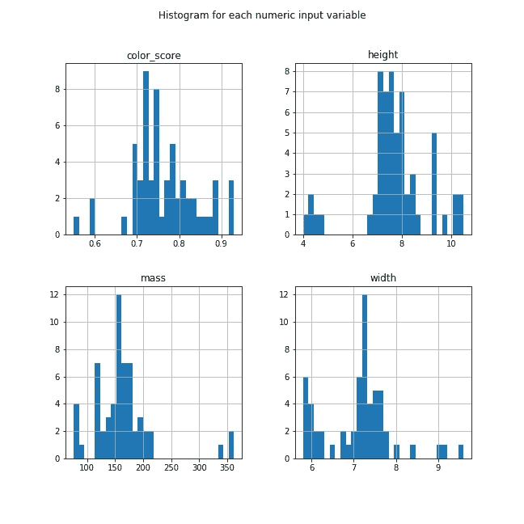

Figure 5

*   一些属性对是相关的(质量和宽度)。这表明了高度的相关性和可预测的关系。

```
from pandas.tools.plotting import scatter_matrix
from matplotlib import cmfeature_names = ['mass', 'width', 'height', 'color_score']
X = fruits[feature_names]
y = fruits['fruit_label']cmap = cm.get_cmap('gnuplot')
scatter = pd.scatter_matrix(X, c = y, marker = 'o', s=40, hist_kwds={'bins':15}, figsize=(9,9), cmap = cmap)
plt.suptitle('Scatter-matrix for each input variable')
plt.savefig('fruits_scatter_matrix')
```

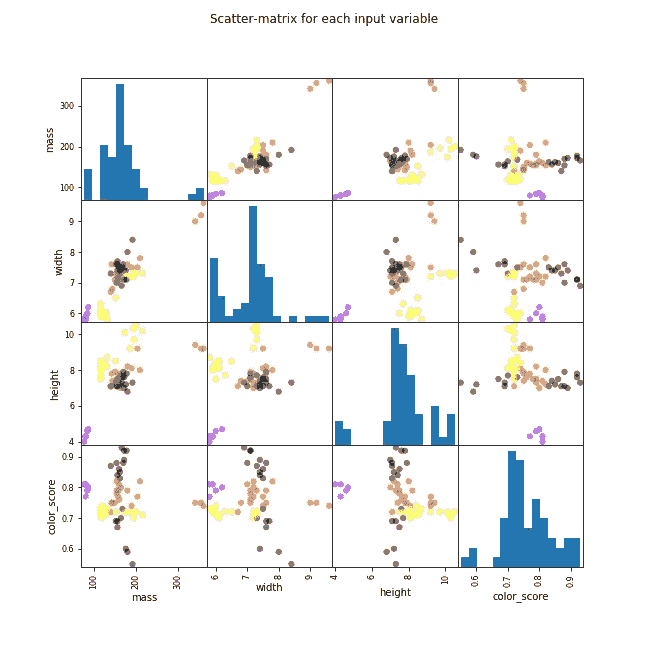

Figure 6

# 统计摘要

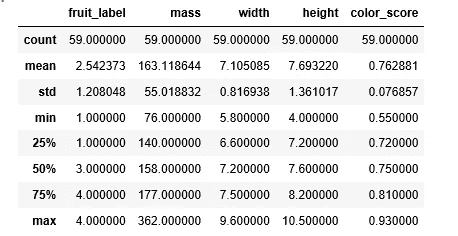

Figure 7

我们可以看到数值没有相同的标度。我们需要对我们为训练集计算的测试集应用缩放。

# 创建训练集和测试集并应用缩放

```
from sklearn.model_selection import train_test_splitX_train, X_test, y_train, y_test = train_test_split(X, y, random_state=0)from sklearn.preprocessing import MinMaxScaler
scaler = MinMaxScaler()
X_train = scaler.fit_transform(X_train)
X_test = scaler.transform(X_test)
```

# 构建模型

## **逻辑回归**

```
from sklearn.linear_model import LogisticRegressionlogreg = LogisticRegression()
logreg.fit(X_train, y_train)print('Accuracy of Logistic regression classifier on training set: {:.2f}'
     .format(logreg.score(X_train, y_train)))
print('Accuracy of Logistic regression classifier on test set: {:.2f}'
     .format(logreg.score(X_test, y_test)))
```

***逻辑回归分类器对训练集的准确率:0.70
逻辑回归分类器对测试集的准确率:0.40***

## **决策树**

```
from sklearn.tree import DecisionTreeClassifierclf = DecisionTreeClassifier().fit(X_train, y_train)print('Accuracy of Decision Tree classifier on training set: {:.2f}'
     .format(clf.score(X_train, y_train)))
print('Accuracy of Decision Tree classifier on test set: {:.2f}'
     .format(clf.score(X_test, y_test)))
```

***决策树分类器在训练集上的准确率:1.00
决策树分类器在测试集上的准确率:0.73***

## **K-最近邻**

```
from sklearn.neighbors import KNeighborsClassifierknn = KNeighborsClassifier()
knn.fit(X_train, y_train)
print('Accuracy of K-NN classifier on training set: {:.2f}'
     .format(knn.score(X_train, y_train)))
print('Accuracy of K-NN classifier on test set: {:.2f}'
     .format(knn.score(X_test, y_test)))
```

***K-NN 分类器在训练集上的准确率:0.95
K-NN 分类器在测试集上的准确率:1.00***

## 线性判别分析

```
from sklearn.discriminant_analysis import LinearDiscriminantAnalysislda = LinearDiscriminantAnalysis()
lda.fit(X_train, y_train)
print('Accuracy of LDA classifier on training set: {:.2f}'
     .format(lda.score(X_train, y_train)))
print('Accuracy of LDA classifier on test set: {:.2f}'
     .format(lda.score(X_test, y_test)))
```

***LDA 分类器在训练集上的准确率:0.86
LDA 分类器在测试集上的准确率:0.67***

## 高斯朴素贝叶斯

```
from sklearn.naive_bayes import GaussianNBgnb = GaussianNB()
gnb.fit(X_train, y_train)
print('Accuracy of GNB classifier on training set: {:.2f}'
     .format(gnb.score(X_train, y_train)))
print('Accuracy of GNB classifier on test set: {:.2f}'
     .format(gnb.score(X_test, y_test)))
```

***GNB 分类器在训练集上的准确率:0.86
GNB 分类器在测试集上的准确率:0.67***

## 支持向量机

```
from sklearn.svm import SVCsvm = SVC()
svm.fit(X_train, y_train)
print('Accuracy of SVM classifier on training set: {:.2f}'
     .format(svm.score(X_train, y_train)))
print('Accuracy of SVM classifier on test set: {:.2f}'
     .format(svm.score(X_test, y_test)))
```

***SVM 分类器在训练集上的准确率:0.61
SVM 分类器在测试集上的准确率:0.33***

KNN 算法是我们尝试过的最精确的模型。混淆矩阵提供了对测试集没有错误的指示。然而，测试集非常小。

```
from sklearn.metrics import classification_report
from sklearn.metrics import confusion_matrix
pred = knn.predict(X_test)
print(confusion_matrix(y_test, pred))
print(classification_report(y_test, pred))
```

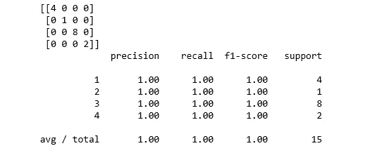

Figure 7

# 绘制 k-NN 分类器的决策边界

```
import matplotlib.cm as cm
from matplotlib.colors import ListedColormap, BoundaryNorm
import matplotlib.patches as mpatches
import matplotlib.patches as mpatchesX = fruits[['mass', 'width', 'height', 'color_score']]
y = fruits['fruit_label']
X_train, X_test, y_train, y_test = train_test_split(X, y, random_state=0)def plot_fruit_knn(X, y, n_neighbors, weights):
    X_mat = X[['height', 'width']].as_matrix()
    y_mat = y.as_matrix()# Create color maps
    cmap_light = ListedColormap(['#FFAAAA', '#AAFFAA', '#AAAAFF','#AFAFAF'])
    cmap_bold  = ListedColormap(['#FF0000', '#00FF00', '#0000FF','#AFAFAF'])clf = neighbors.KNeighborsClassifier(n_neighbors, weights=weights)
    clf.fit(X_mat, y_mat)# Plot the decision boundary by assigning a color in the color map
    # to each mesh point.

    mesh_step_size = .01  # step size in the mesh
    plot_symbol_size = 50

    x_min, x_max = X_mat[:, 0].min() - 1, X_mat[:, 0].max() + 1
    y_min, y_max = X_mat[:, 1].min() - 1, X_mat[:, 1].max() + 1
    xx, yy = np.meshgrid(np.arange(x_min, x_max, mesh_step_size),
                         np.arange(y_min, y_max, mesh_step_size))
    Z = clf.predict(np.c_[xx.ravel(), yy.ravel()])# Put the result into a color plot
    Z = Z.reshape(xx.shape)
    plt.figure()
    plt.pcolormesh(xx, yy, Z, cmap=cmap_light)# Plot training points
    plt.scatter(X_mat[:, 0], X_mat[:, 1], s=plot_symbol_size, c=y, cmap=cmap_bold, edgecolor = 'black')
    plt.xlim(xx.min(), xx.max())
    plt.ylim(yy.min(), yy.max())patch0 = mpatches.Patch(color='#FF0000', label='apple')
    patch1 = mpatches.Patch(color='#00FF00', label='mandarin')
    patch2 = mpatches.Patch(color='#0000FF', label='orange')
    patch3 = mpatches.Patch(color='#AFAFAF', label='lemon')
    plt.legend(handles=[patch0, patch1, patch2, patch3])plt.xlabel('height (cm)')
plt.ylabel('width (cm)')
plt.title("4-Class classification (k = %i, weights = '%s')"
           % (n_neighbors, weights))    
plt.show()plot_fruit_knn(X_train, y_train, 5, 'uniform')
```

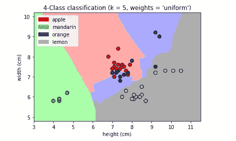

Figure 8

```
k_range = range(1, 20)
scores = []for k in k_range:
    knn = KNeighborsClassifier(n_neighbors = k)
    knn.fit(X_train, y_train)
    scores.append(knn.score(X_test, y_test))
plt.figure()
plt.xlabel('k')
plt.ylabel('accuracy')
plt.scatter(k_range, scores)
plt.xticks([0,5,10,15,20])
```

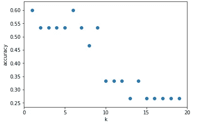

Figure 9

对于这个特定的日期集，当 k=5 时，我们获得最高的精确度。

# 摘要

在这篇文章中，我们关注的是预测的准确性。我们的目标是学习一个具有良好泛化性能的模型。这种模型最大限度地提高了预测精度。我们确定了最适合手头问题(即水果类型分类)的机器学习算法；因此，我们比较了不同的算法，并选择了性能最好的算法。

创建这篇文章的源代码可以在[这里](https://github.com/susanli2016/Machine-Learning-with-Python/blob/master/Solving%20A%20Simple%20Classification%20Problem%20with%20Python.ipynb)找到。我将很高兴收到关于上述任何反馈或问题。