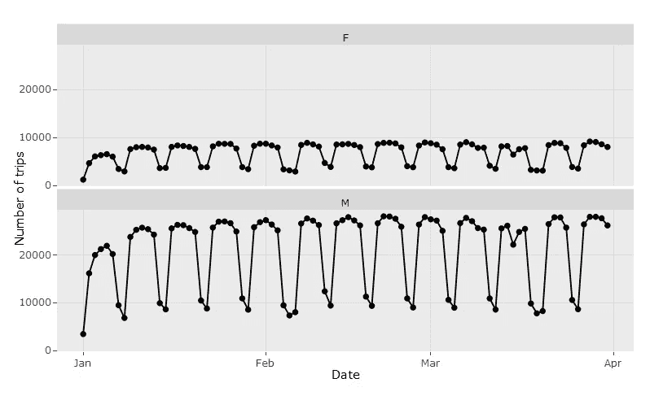
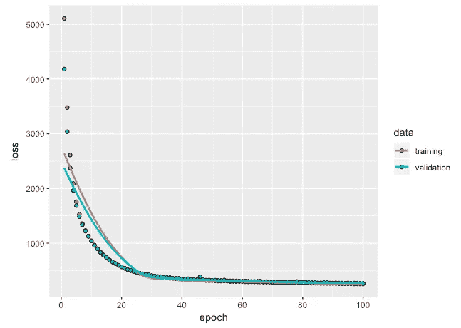
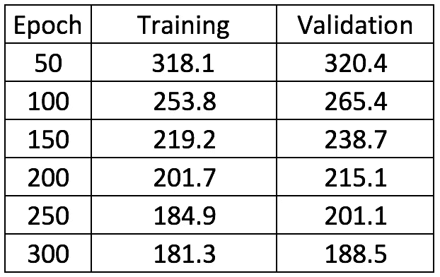
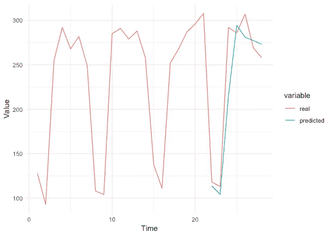
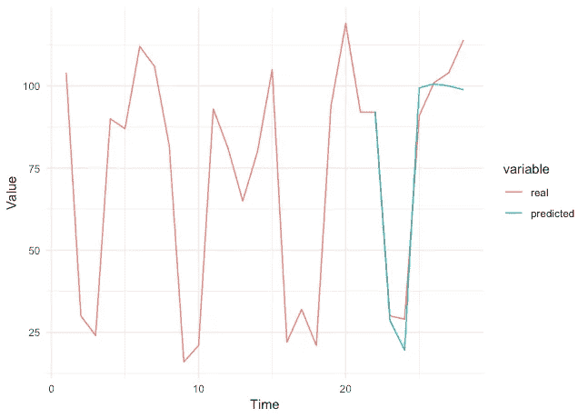
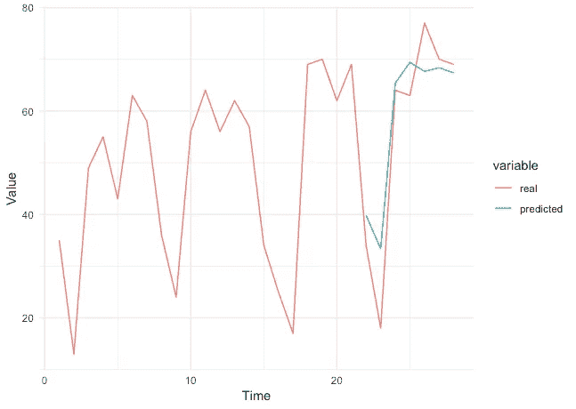

# 解决墨西哥城的自行车站问题

> 原文：<https://towardsdatascience.com/solving-bike-stations-problem-in-mexico-city-f35b1cfd3ff1?source=collection_archive---------9----------------------->

Photo by [Wayne Bishop](https://unsplash.com/@wayneb250?utm_source=medium&utm_medium=referral) on [Unsplash](https://unsplash.com?utm_source=medium&utm_medium=referral)

几年前，我住在墨西哥城，是名为 eco bici T1 的城市自行车系统的常客。这个系统真的很容易使用，在过去的几年里它变得如此受欢迎真是令人惊讶。然而，由于墨西哥城是一个巨大的城市，对于用户来说，关于在不同的取货站分配自行车的许多问题是日常事务。我们分两节课总结一下这些问题:接送问题和落车问题。这些问题中的第一个是当用户想要骑自行车时缺少可用的自行车。第二类问题依赖于你可以归还自行车的免费停车位的稀缺。从现在起，我将集中讨论第一类问题。

> 一名 EcoBici 用户抱怨自行车在取货站的分配不合理。这只是这个庞大的交通系统每天都会遇到的问题的一个例子。

我将在接下来的文章中解释一个基于公开可用的[数据](https://www.ecobici.cdmx.gob.mx/en/informacion-del-servicio/open-data)的每日预测模型。首先，我试图通过使用 [ARIMA](https://en.wikipedia.org/wiki/Autoregressive_integrated_moving_average) 模型来模拟每天的出行次数，但我意识到如果我想让这个模型真正准确和有用，我需要模拟每个车站的每日出行次数，这将涉及到创建大约 400 个 ARIMA 模型。经过一些考虑，我决定使用著名的 LSTM 网络(如果你不熟悉他们，看看[这里](https://colah.github.io/posts/2015-08-Understanding-LSTMs/))。

首先，让我们看看按性别划分的旅行总次数。

从这张图表中很容易看出周末的季节性影响，而且只有 24%的日常出行是由女性完成的。这段时间从 2017/01/01 到 2017/03/31。

## **在研究期间关于 EcoBici 系统的事实**

448 个站点
41%的站点每天最多有 5 场活动
27，593 次平均每日出行
5，072 辆平均每月有用的自行车
34.7 岁是用户的平均年龄

## **数据**

该模型旨在根据每个车站最近 3 周的活动预测一整周的活动。为此，我需要“打包”28 天的行程(21 天作为输入，7 天作为输出),为此，我移动了 28 天的时间段，从 2017 年 1 月 1 日开始，到 2017 年 3 月 3 日结束，得到 62 组 28 天的行程。最后一个需要乘以站的数量，我们总共有 27，776 个实例，应该分成训练集和验证集。此外，正如我们之前看到的，周末有很强的季节性影响，所以我引入了一个分类变量来表示工作日(星期一、星期二、星期三……)

最后，数据集的结构为:
(#stations*#sets，#days，trips+one-hot encoding for weekdays)
=(448 * 62，28，1+7) = ( 27776，28，8)
这 27776 个实例需要划分为训练集和验证集。通过将 75%的实例设置为训练集，我们有:20，832 个训练实例和 6，944 个验证实例。

## 模型结构

我使用一个批量大小为 32 的 LSTM 层、一个 p=0.5 的下降层和一个 7 个单位的密集层来连接输出。而且我用的是 [keras](https://keras.io) 的[亚当优化器](https://arxiv.org/abs/1412.6980)，学习率 0.0005。最后，作为损失函数，我考虑了均方误差。

## **业绩和预测**

我运行了 300 个时期的训练过程，但是为了更好的可视化，这里是前 100 个时期的损失值的图。

损失值如下所示:

Loss function values over epochs

可视化预测的一种方法是计算网络的预测值，并将这些值与真实值进行比较。由于我们有大约 6900 个测试实例，我决定简单地随机选取一个实例，并绘制预测值与真实值的对比图。下面是一些相应的 MAPE(平均百分比误差)值的例子。

MAPE 8.3%

MAPE 9.1%

MAPE 18.7

## 摘要

我引入了一个 LSTM 模型来预测墨西哥城 EcoBici 系统的自行车使用量。该模型的输入是 21 天内的旅行次数，以预测随后 7 天的旅行次数，此外，该模型将一周中的某一天视为一次性编码向量。

该模型产生的平均 MAPE(测试集的平均值)为 21%，这意味着还有很多需要改进的地方。

## 后续步骤

为了获得更好的结果，可以添加更多的信息:假期、允许识别站点是否在线的布尔变量、每天有用自行车的数量等。

应测试输入内容的不同组合。也许考虑到前 21 天可能会有很多噪音，

由于我打算让这个模型成为一个可操作的工具，所以我认为聚合级别应该以小时为基础。

换句话说，更多的信息，更好的结果，这可能会导致更好的自行车分布在不同的车站。

这款车型的代码可在[这里](https://github.com/cristhianrivera/EcoBiciDS/blob/master/EcoBiciLSTMDay.R)获得。

我的下一篇文章将展示该模型的第二个版本。请随意评论！