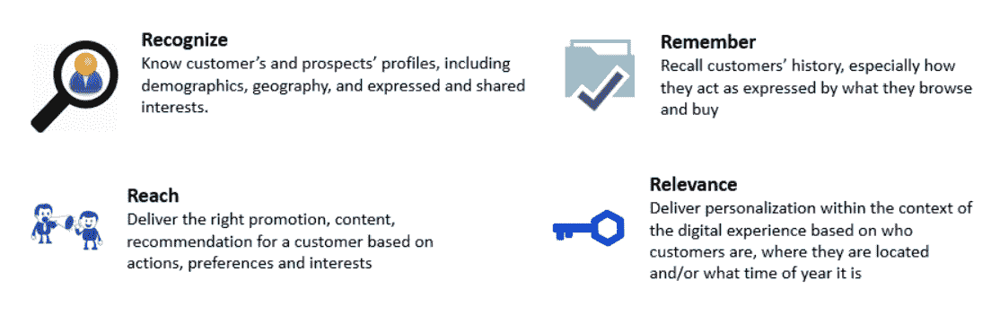
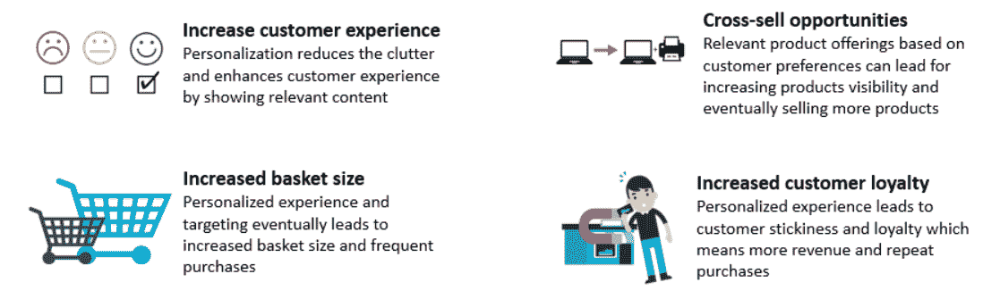
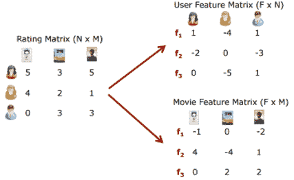
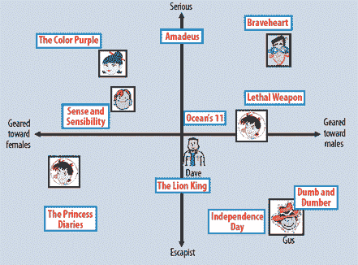
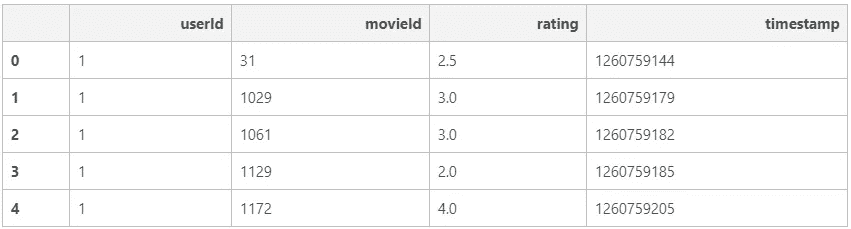
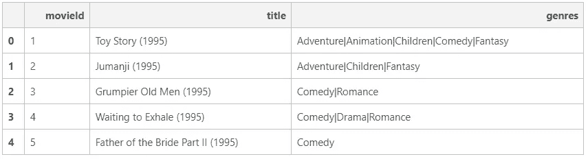
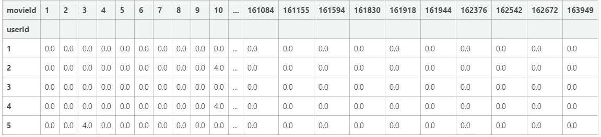
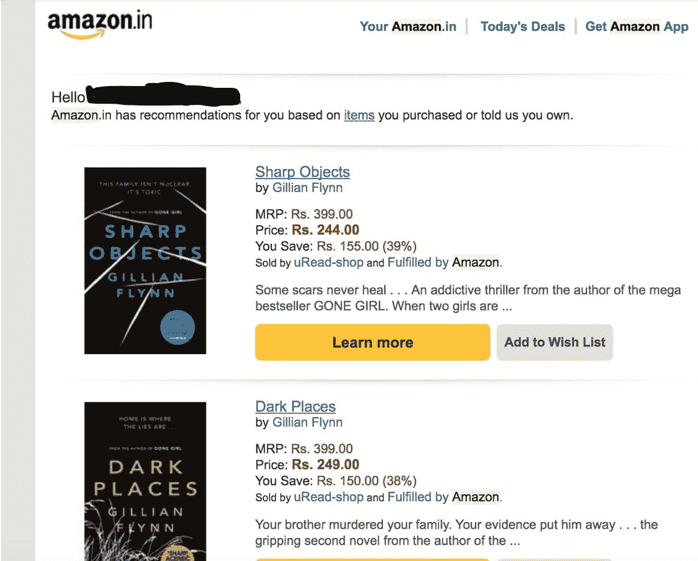
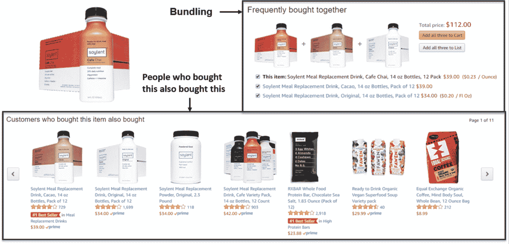
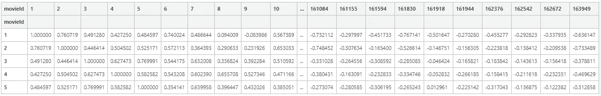

# 使用 lightFM 通过推荐系统解决业务用例

> 原文：<https://towardsdatascience.com/solving-business-usecases-by-recommender-system-using-lightfm-4ba7b3ac8e62?source=collection_archive---------2----------------------->

## 对 LightFM、推荐系统和代码重用食谱概念的简单介绍。

在这篇[帖子](https://aayushmnit.github.io/posts/2018/04/Business_usecases_by_recommender_system_using_lightFM/)中，我将写一些关于推荐系统的内容，它们是如何在许多电子商务网站中使用的。这篇文章还将涉及使用矩阵分解算法，使用 [lightFM](https://github.com/lyst/lightfm) 软件包和我的[推荐系统食谱](https://github.com/aayushmnit/cookbook/blob/master/recsys.py)来构建简单的推荐系统模型。这篇文章将关注业务用例以及简单的实现。这篇文章只涉及算法的基本直觉，如果你想理解算法背后的数学，还会提供资源链接。

# 动机

我是一个狂热的读者和开源教育的信徒，并通过使用在线课程、博客、Github 存储库和参加数据科学竞赛，不断扩展我在数据科学和计算机科学方面的知识。在互联网上搜索优质内容时，我遇到了各种学习链接，这些链接要么关注使用 ABC 语言的特定数据/建模技术实现算法，要么关注使用一系列算法(如分类、预测、推荐系统等)的广义概念的业务影响/结果。)但具体怎么做就不细说了。因此，我的想法是写一些博客，将业务用例与代码和算法直觉结合起来，以提供数据科学如何在业务场景中使用的整体视图。

随着世界变得越来越数字化，我们已经习惯了大量的个性化体验，而帮助我们实现这一点的算法属于推荐系统家族。几乎每个基于网络的平台都使用一些推荐系统来提供定制内容。以下是我最钦佩的公司。


# 什么是个性化？

个性化是一种根据每个用户的需求动态定制内容的技术。个性化的简单例子可以是网飞上的电影推荐、电子商务平台的个性化电子邮件定向/重新定向、亚马逊上的商品推荐等。个性化帮助我们实现这四个 r-

*   **认识:**了解客户和潜在客户的概况，包括人口统计、地理位置以及表达和分享的兴趣。
*   记住:回忆顾客的历史，主要是他们浏览和购买的商品所表达的行为
*   **接触:**根据行动、偏好和兴趣为客户提供合适的促销、内容和推荐
*   **相关性:**在数字体验的背景下，根据客户是谁、他们在哪里以及现在是一年中的什么时候来提供个性化服务



4 R’s of personalization

# 为什么要个性化？

个性化对用户和公司都有很多好处。对于用户来说，这让他们的生活变得轻松，因为他们只能看到与他们更相关的东西(除非是广告，即使它们是个性化的)。因为商业利益数不胜数，但这里我想提几个-

*   **增强客户体验:**个性化通过显示相关内容来减少混乱并增强客户体验
*   **交叉销售/追加销售机会:**根据客户偏好提供相关产品可以提高产品知名度，最终销售更多产品
*   **增加购物篮的容量:**个性化的体验和针对性最终会增加购物篮的容量和购买频率
*   **提高客户忠诚度:**在数字世界中，客户保留/忠诚度是许多公司面临的最突出的问题，因为找到特定服务的替代品相当容易。根据《福布斯》的一篇文章，44%的消费者表示他们可能会在个性化体验后再次光顾



Benefits of personalization

# 矩阵分解导论

矩阵分解是推荐系统家族中的算法之一，顾名思义，它分解一个矩阵，即将一个矩阵分解成两个(或更多)矩阵，这样一旦你将它们相乘，你就可以得到你的原始矩阵。在推荐系统的情况下，我们通常会从用户和项目之间的交互/评级矩阵开始，矩阵分解算法会将该矩阵分解为用户和项目特征矩阵，这也称为嵌入。交互矩阵例子可以是电影推荐者的用户电影评级、交易数据的用户产品购买标志等。



典型地，用户/项目嵌入分别捕获关于用户和项目属性的潜在特征。本质上，潜在特征是用户/项目在任意空间中的表示，其表示用户如何评价电影。在电影推荐器的例子中，用户嵌入的例子可以表示当潜在特征的值高时用户喜欢观看严肃类型的电影，当潜在特征的值低时喜欢观看喜剧类型的电影。类似地，当电影更多地由男性驱动时，电影潜在特征可能具有高价值，而当电影更多地由女性驱动时，该价值通常较低。



有关矩阵分解和因式分解机器的更多信息，您可以阅读这些文章—
[矩阵分解:Python 中的简单教程和实现](http://www.quuxlabs.com/blog/2010/09/matrix-factorization-a-simple-tutorial-and-implementation-in-python/)
[入门指南—因式分解机器&它们在巨大数据集上的应用(用 Python 编写代码)](https://www.analyticsvidhya.com/blog/2018/01/factorization-machines/)

# HandOn:用 Python 中的 LightFM 包构建推荐系统

在动手操作部分，我们将为不同的场景构建推荐系统，这些场景我们通常会在许多使用 LightFM 包和 [MovieLens](https://grouplens.org/datasets/movielens/) 数据的公司中看到。我们使用的是[小型数据](http://files.grouplens.org/datasets/movielens/ml-latest-small.zip)，其中包含 700 名用户对 9000 部电影的 100，000 个评分和 1，300 个标签应用

# 数据

让我们从导入数据、[推荐系统指南](https://github.com/aayushmnit/cookbook/blob/master/recsys.py)和[预处理指南](https://github.com/aayushmnit/cookbook/blob/master/generic_preprocessing.py)文件开始，这是实际操作部分。我编写了这些可重用的通用[食谱代码](https://github.com/aayushmnit/cookbook)来提高生产率和编写干净/模块化的代码；你将会看到，通过使用这些食谱，我们可以用 10-15 行代码构建一个推荐系统(事半功倍！).

```
# Importing Libraries and cookbooks
from recsys import * ## recommender system cookbook
from generic_preprocessing import * ## pre-processing code
from IPython.display import HTML ## Setting display options for Ipython Notebook# Importing rating data and having a look
ratings = pd.read_csv('./ml-latest-small/ratings.csv')
ratings.head()
```



Ratings data

正如我们所看到的，评级数据包含用户 id、电影 id 和 0.5 到 5 之间的评级，时间戳表示给出评级的时间。

```
# Importing movie data and having a look at first five columns
movies = pd.read_csv('./ml-latest-small/movies.csv')
movies.head()
```



Movies data

电影数据由电影 id、标题和所属类型组成。

# 预处理

正如我之前提到的，要创建一个推荐系统，我们需要从创建一个交互矩阵开始。对于这个任务，我们将使用 recsys cookbook 中的**create _ interaction _ matrix**函数。该函数要求您输入一个 pandas 数据框架和必要的信息，如用户 id、项目 id 和评级的列名。如果 norm=True，它还需要一个额外的参数**阈值**，这意味着任何高于上述阈值的评级都被视为正面评级。在我们的例子中，我们不需要标准化我们的数据，但是在零售数据的情况下，任何特定类型的商品的购买都可以被认为是积极的评价，数量并不重要。

```
# Creating interaction matrix using rating data
interactions = create_interaction_matrix(df = ratings,
                                         user_col = 'userId',
                                         item_col = 'movieId',
                                         rating_col = 'rating')
interactions.head()
```



Interaction data

正如我们所看到的，数据是以交互格式创建的，其中行代表每个用户，列代表每个电影 id，评级作为值。
我们还将创建用户和项目字典，以便稍后通过使用 **create_user_dict** 和 **create_item dict** 函数将 user_id 转换为 user_name 或将 movie_id 转换为 movie_name。

```
# Create User Dict
user_dict = create_user_dict(interactions=interactions)
# Create Item dict
movies_dict = create_item_dict(df = movies,
                               id_col = 'movieId',
                               name_col = 'title')
```

# 构建矩阵分解模型

为了构建一个矩阵分解模型，我们将使用 **runMF** 函数，它将接受以下输入-

*   **互动矩阵:**上一节创建的互动矩阵
*   **n_components:** 为每个用户和项目生成的嵌入数
*   **损失:**我们需要定义一个损失函数，在这种情况下，我们使用[扭曲损失](https://lyst.github.io/lightfm/docs/examples/warp_loss.html)，因为我们最关心的是数据的排序，即我们应该首先显示哪些项目
*   **epoch:** 运行的次数
*   **n_jobs:** 并行处理中使用的内核数量

```
mf_model = runMF(interactions = interactions,
                 n_components = 30,
                 loss = 'warp',
                 epoch = 30,
                 n_jobs = 4)
```

现在我们已经建立了矩阵分解模型，我们现在可以做一些有趣的事情。有各种各样的用例可以通过在 web 平台上使用这个模型来解决，让我们来研究一下。

# 用例 1:向用户推荐商品

在这个用例中，我们希望向用户展示，根据他/她过去的互动，他/她可能有兴趣购买/查看的商品。典型的行业例子是亚马逊上的“推荐给你的交易”或网飞上的“用户最佳照片”或个性化电子邮件活动。


对于这种情况，我们可以使用**sample _ re commendation _ user**函数。该函数将矩阵分解模型、交互矩阵、用户字典、项目字典、user_id 和项目数量作为输入，并返回用户可能有兴趣交互的项目 id 列表。

```
## Calling 10 movie recommendation for user id 11
rec_list = sample_recommendation_user(model = mf_model, 
                                      interactions = interactions, 
                                      user_id = 11, 
                                      user_dict = user_dict,
                                      item_dict = movies_dict, 
                                      threshold = 4,
                                      nrec_items = 10,
                                      show = True)Known Likes:
1- The Hunger Games: Catching Fire (2013)
2- Gravity (2013)
3- Dark Knight Rises, The (2012)
4- The Hunger Games (2012)
5- Town, The (2010)
6- Exit Through the Gift Shop (2010)
7- Bank Job, The (2008)
8- Departed, The (2006)
9- Bourne Identity, The (1988)
10- Step Into Liquid (2002)
11- SLC Punk! (1998)
12- Last of the Mohicans, The (1992)
13- Good, the Bad and the Ugly, The (Buono, il brutto, il cattivo, Il) (1966)
14- Robin Hood: Prince of Thieves (1991)
15- Citizen Kane (1941)
16- Trainspotting (1996)
17- Pulp Fiction (1994)
18- Usual Suspects, The (1995) Recommended Items:
1- Dark Knight, The (2008)
2- Inception (2010)
3- Iron Man (2008)
4- Shutter Island (2010)
5- Fight Club (1999)
6- Avatar (2009)
7- Forrest Gump (1994)
8- District 9 (2009)
9- WALL·E (2008)
10- Matrix, The (1999)print(rec_list)[593L, 260L, 110L, 480L, 47L, 527L, 344L, 858L, 231L, 780L]
```

正如我们在这种情况下看到的，用户对*《黑暗骑士崛起(2012)》*感兴趣，所以第一个推荐是*《黑暗骑士(2008)》*。该用户似乎也非常喜欢戏剧、科幻和惊悚类型的电影，并且有许多相同类型的电影推荐，如《黑暗骑士》(戏剧/犯罪)、《盗梦空间》(科幻、惊悚)、《钢铁侠》(科幻惊悚)、《禁闭岛》(德拉姆/惊悚)、《搏击俱乐部》(戏剧)、《阿凡达》(科幻)、《阿甘正传》(戏剧)、《第九区》(惊悚)、《瓦力》(科幻)、《黑客帝国》(科幻)

类似的模型也可以用于构建类似“基于您最近的浏览历史”推荐的部分，只需改变评级矩阵，以包含最近的和基于特定项目的浏览历史访问的交互。

# 用例 2:用户对商品的推荐

在这个用例中，我们将讨论如何推荐针对某个特定项目的用户列表。这种情况的一个例子是，当您正在对某个项目进行促销，并希望围绕该促销项目向可能对该项目感兴趣的 10，000 名用户发送电子邮件时。



对于这种情况，我们可以使用**sample _ re commendation _ item**函数。该函数将矩阵分解模型、交互矩阵、用户字典、项目字典、item_id 和用户数量作为输入，并返回更可能对项目感兴趣的用户 id 列表。

```
## Calling 15 user recommendation for item id 1
sample_recommendation_item(model = mf_model,
                           interactions = interactions,
                           item_id = 1,
                           user_dict = user_dict,
                           item_dict = movies_dict,
                           number_of_user = 15)[116, 410, 449, 657, 448, 633, 172, 109, 513, 44, 498, 459, 317, 415, 495]
```

正如您所看到，函数返回了一个可能对项目 ID 1 感兴趣的用户 id 列表。另一个你可能需要这种模型的例子是，当你的仓库里有一个旧库存需要清理，否则你可能不得不注销它，你想通过给可能有兴趣购买的用户一些折扣来清理它。

# 用例 3:商品推荐

在这个用例中，我们将讨论如何推荐针对某个特定项目的项目列表。这种模型将帮助您找到相似/相关的项目或可以捆绑在一起的项目。此类模型的典型行业用例是产品页面上的交叉销售和向上销售机会，如“与此商品相关的产品”、“经常一起购买”、“购买此商品的客户也购买此商品”和“查看此商品的客户也查看过”。
*“买了这个的顾客也买了这个”“查看了这个商品的顾客也查看了”也可以通过购物篮分析解决。*



为了实现这个用例，我们将使用由矩阵分解模型生成的项目嵌入来创建余弦距离矩阵。这将帮助我们计算相似性 b/w 项目，然后我们可以向感兴趣的项目推荐前 N 个相似的项目。第一步是使用**create _ item _ emdedding _ distance _ matrix**函数创建一个物品-物品距离矩阵。该函数将矩阵分解模型和交互矩阵作为输入，并返回一个 item_embedding_distance_matrix。

```
## Creating item-item distance matrix
item_item_dist = create_item_emdedding_distance_matrix(model = mf_model,
                                                       interactions = interactions)## Checking item embedding distance matrix
item_item_dist.head()
```



Item-Item distance

正如我们所看到的，矩阵的行和列都有电影，值代表它们之间的余弦距离。下一步是使用 **item_item_recommendation** 函数获得关于 item_id 的前 N 个项目。该函数将项目嵌入距离矩阵、项目 id、项目字典和要推荐的项目数作为输入，并将相似项目列表作为输出返回。

```
## Calling 10 recommended items for item id 
rec_list = item_item_recommendation(item_emdedding_distance_matrix = item_item_dist,
                                    item_id = 5378,
                                    item_dict = movies_dict,
                                    n_items = 10)Item of interest :Star Wars: Episode II - Attack of the Clones (2002)
Item similar to the above item:
1- Star Wars: Episode III - Revenge of the Sith (2005)
2- Lord of the Rings: The Two Towers, The (2002)
3- Lord of the Rings: The Fellowship of the Ring, The (2001)
4- Lord of the Rings: The Return of the King, The (2003)
5- Matrix Reloaded, The (2003)
6- Harry Potter and the Sorcerer's Stone (a.k.a. Harry Potter and the Philosopher's Stone) (2001)
7- Gladiator (2000)
8- Spider-Man (2002)
9- Minority Report (2002)
10- Mission: Impossible II (2000)
```

正如我们看到的“星球大战:第二集-克隆人的进攻(2002)”电影，我们得到了它的下一部上映的电影是“星球大战:第三集-西斯的复仇(2005)”作为第一推荐。

# 摘要

像任何其他博客一样，这种方法并不是对每个应用程序都完美，但是如果我们有效地使用它，同样的想法也可以起作用。随着深度学习的出现，推荐系统有了很大的进步。虽然还有改进的空间，但我对目前为止它对我的作用感到满意。以后我可能会写一些基于深度学习的推荐系统。

与此同时，我希望您喜欢阅读，并随时使用我的代码为您的目的进行尝试。此外，如果对代码或博客帖子有任何反馈，请随时联系 LinkedIn 或给我发电子邮件，地址是 aayushmnit@gmail.com。