# 用交互代码解决深度学习中链接神经元的内部同变移位[TF 中的手动反推]

> 原文：<https://towardsdatascience.com/solving-internal-co-variate-shift-in-deep-learning-with-linked-neurons-with-interactive-code-61859388af76?source=collection_archive---------9----------------------->

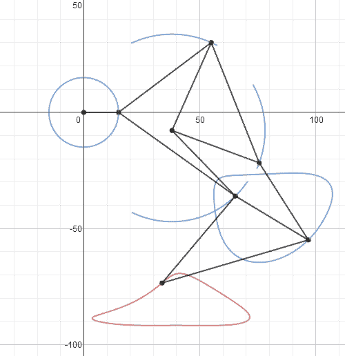

GIF from this [website](https://imgur.com/gallery/dhAQp6B)

所以我仍然在写我的期末论文，但是我真的很想写这篇论文。“ [*用链接的神经元解决深度学习中的内部同变量移位*](https://arxiv.org/abs/1712.02609) ”和往常一样，让我们执行手动反向传播，看看我们是否能胜过自动微分。

**激活功能**

我喜欢这篇论文的原因之一是因为它在介绍各种激活函数方面做了一件令人惊奇的工作。我从来不知道[唰激活功能](https://arxiv.org/pdf/1710.05941.pdf)的存在，所以这是一个很好的发现。

**链接神经元/实现**

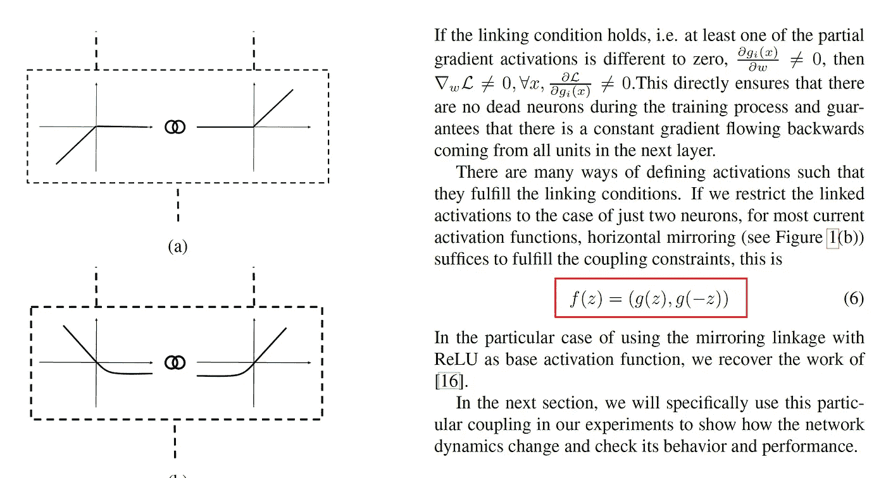

**红框→** 链接神经元的数学公式。

本文的主要贡献是链接神经元，这意味着梯度的导数中至少有一个非零，这将解决神经元死亡的问题。这是一个非常有趣的提议。此外，这种“链接神经元”的实现也非常简单。

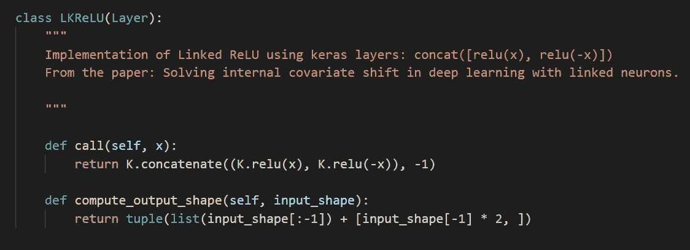

Implementatio[n from here](https://github.com/blauigris/linked_neurons)

所以基本上，我们连接每个激活函数的输出，并传递到下一层，很简单！现在让我们来看看实际情况。

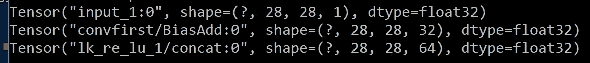

当我们给这一层一个形状张量[？，28，28，32]输出为[？28，28，64]，因为它在信道维度中被连接。

**网络架构(图形/ OOP 形式)**

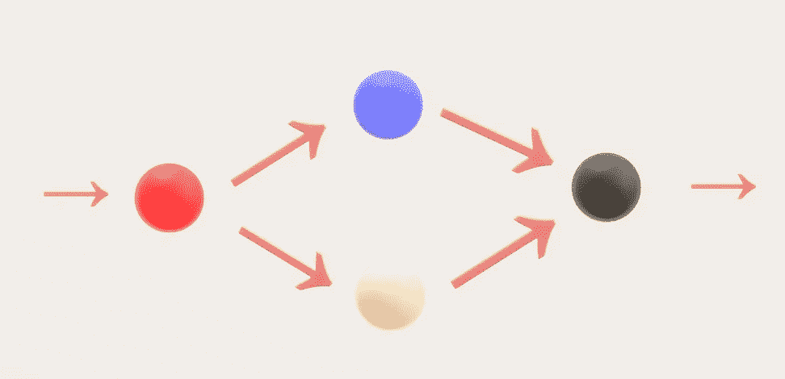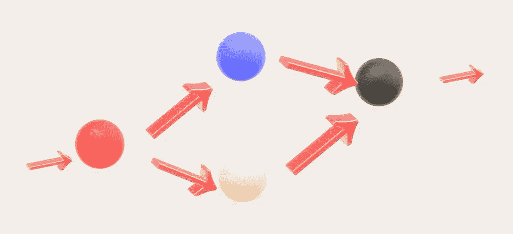

**红圈** →卷积运算
**蓝/白圈** →不同输入的激活功能
**黑圈** →串接输出层

所以以上是我们网络的基本积木，每一层都是由卷积，2 激活，最后是均值池运算组成。现在让我们看看 OOP 表单。

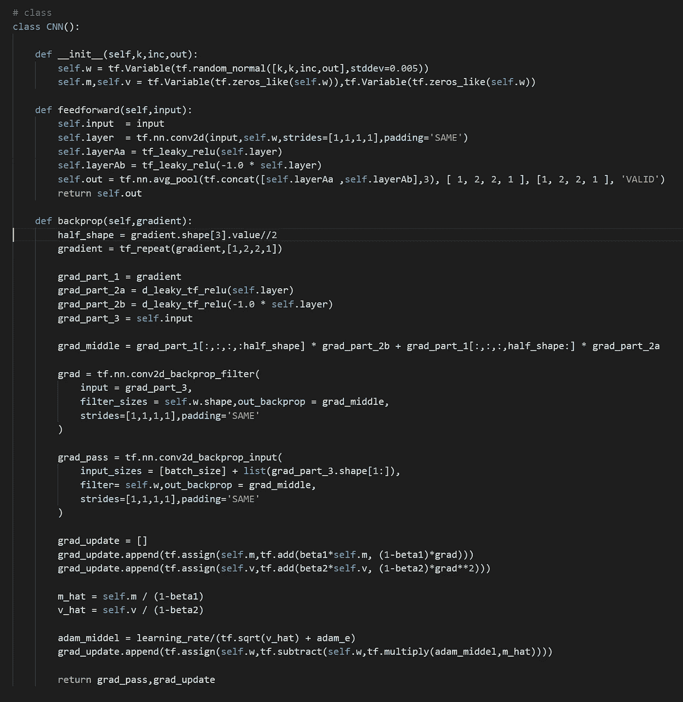

使用上述架构，我们将创建 5 个完全卷积网络，并在 MNIST 数据集上进行测试。

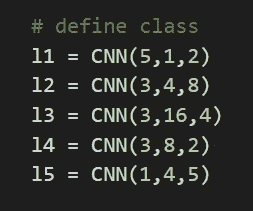

**结果(自动微分)**

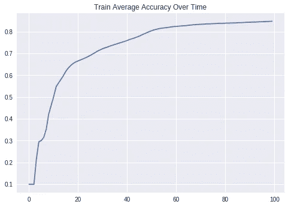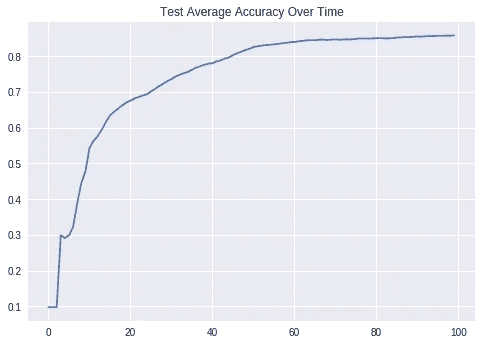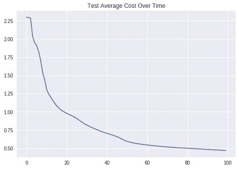

**右上** →训练图像的平均时间成本
**左上** →训练图像的平均时间精度
**左下** →测试图像的平均时间成本
**右下** →测试图像的平均时间精度

使用自动微分，我能够在 100 个历元内获得 85%的准确度。学习率是 0.0003，但是我做了额外的实验，将学习率设置为 0.003，并且能够在相同的时间内达到+92%。

**结果(扩张反向传播)**

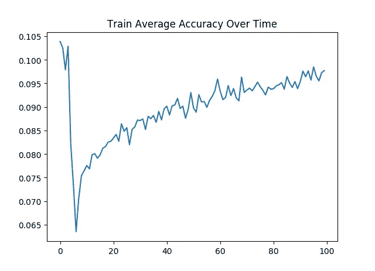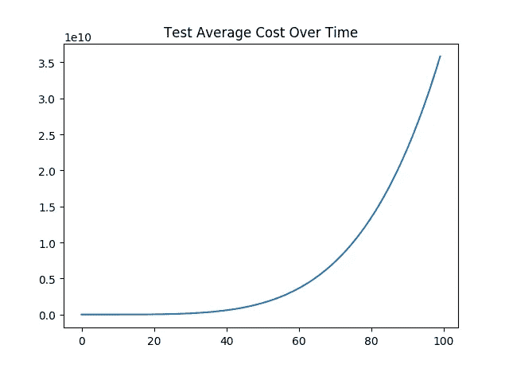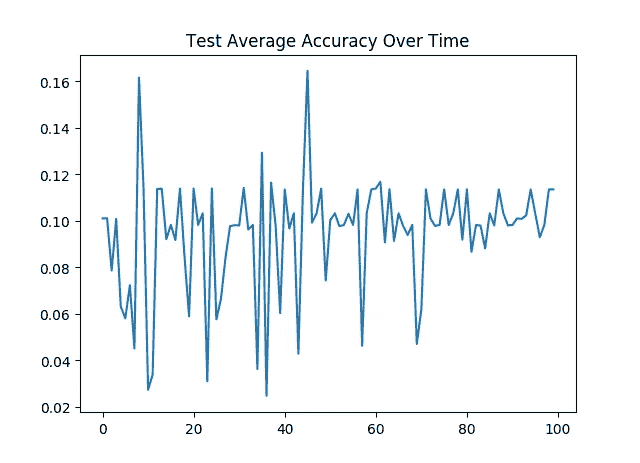

**右上** →训练图像的平均时间成本
**左上** →训练图像的平均时间精度
**左下** →测试图像的平均时间成本
**右下** →测试图像的平均时间精度

对于这个案例，我得到了一个非常令人失望的结果。该模型甚至无法达到 20%的准确率，而且随着时间的推移，成本实际上还在增加！我再三检查了我是否正确地进行了求导，结果似乎是正确的。这绝对是我想要深入研究的案例。

**互动代码\透明度**

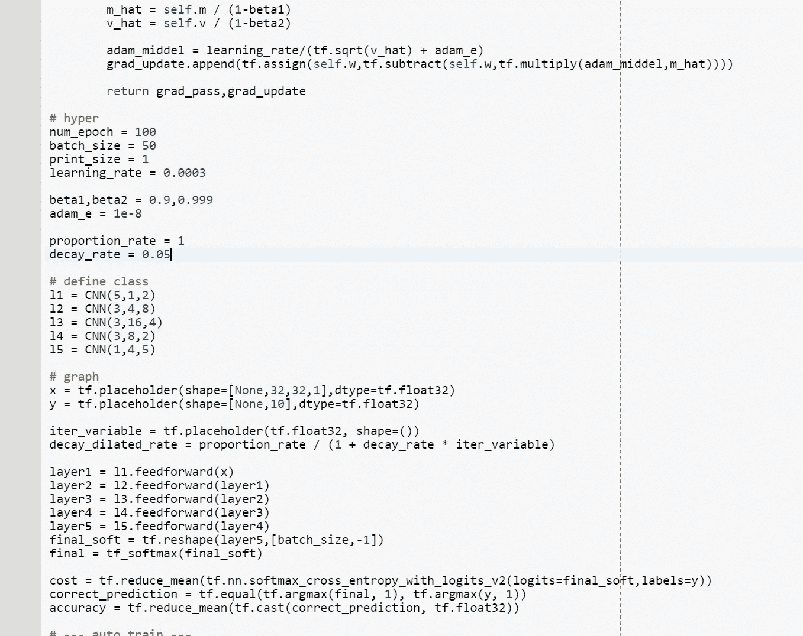

*对于 Google Colab，您需要一个 Google 帐户来查看代码，而且您不能在 Google Colab 中运行只读脚本，因此请在您的操场上创建一个副本。最后，我永远不会请求允许访问你在 Google Drive 上的文件，仅供参考。编码快乐！*

要访问[自动微分的代码，请点击此处。](https://colab.research.google.com/drive/1OGSB6AroeeA6MSEPTl3pNyiltfab0474)

要访问[扩张反向传播的代码，请点击此处。](https://colab.research.google.com/drive/1GIs92XHrGwDoO_hcvpKclj_ZzKwDt0CZ)

为了使这个实验更加透明，我已经将我的命令窗口的所有输出上传到我的 github，要访问自动微分[模型的输出，请单击此处](https://github.com/JaeDukSeo/Daily-Neural-Network-Practice-2/blob/master/NeuralNetwork/linked_neuron/auto_train.txt)，要访问手动反向传播[，请单击此处](https://github.com/JaeDukSeo/Daily-Neural-Network-Practice-2/blob/master/NeuralNetwork/linked_neuron/man_train.txt)。

**最后的话**

我不确定这种方法是否能完全取代批量标准化，但是这种方法确实很有趣。

如果发现任何错误，请发电子邮件到 jae.duk.seo@gmail.com 给我，如果你想看我所有写作的列表，请在这里查看我的网站。

同时，在我的 twitter 上关注我[这里](https://twitter.com/JaeDukSeo)，访问[我的网站](https://jaedukseo.me/)，或者我的 [Youtube 频道](https://www.youtube.com/c/JaeDukSeo)了解更多内容。如果你感兴趣的话，我还做了解耦神经网络[的比较。](https://becominghuman.ai/only-numpy-implementing-and-comparing-combination-of-google-brains-decoupled-neural-interfaces-6712e758c1af)

**参考**

1.  Molina，C. R. R .，& Vila，O. P. (2017)。用链接神经元解决深度学习中的内部协变量移位。 *arXiv 预印本 arXiv:1712.02609* 。
2.  适合 ML 初学者的 MNIST。(2018).张量流。检索于 2018 年 4 月 18 日，来自[https://www . tensor flow . org/versions/r 1.1/get _ started/mnist/初学者](https://www.tensorflow.org/versions/r1.1/get_started/mnist/beginners)
3.  梯度下降优化算法综述。(2016).塞巴斯蒂安·鲁德。检索于 2018 年 4 月 18 日，来自[http://ruder.io/optimizing-gradient-descent/index.html#adam](http://ruder.io/optimizing-gradient-descent/index.html#adam)
4.  用交互式代码实现英伟达用于自动驾驶汽车的神经网络。(2018).走向数据科学。检索于 2018 年 4 月 18 日，来自[https://towards data science . com/implementing-neural-network-used-for-driving-cars-from-NVIDIA-with-interactive-code-manual-aa 6780 BC 70 f 4](/implementing-neural-network-used-for-self-driving-cars-from-nvidia-with-interactive-code-manual-aa6780bc70f4)
5.  CIFAR-10 和 CIFAR-100 数据集。(2018).Cs.toronto.edu。检索于 2018 年 4 月 18 日，来自[https://www.cs.toronto.edu/~kriz/cifar.html](https://www.cs.toronto.edu/~kriz/cifar.html)
6.  JaeDukSeo/个人 _ 日常 _ 神经网络 _ 实践。(2018).GitHub。检索于 2018 年 4 月 18 日，来自[https://github . com/JaeDukSeo/Personal _ Daily _ neural network _ Practice/blob/master/y _ ndi via/d _ upload . py](https://github.com/JaeDukSeo/Personal_Daily_NeuralNetwork_Practice/blob/master/y_NDIVIA/d_upload.py)
7.  欢迎阅读链接神经元的文档！—链接神经元 0.1.0 文档。(2018).linked-neurons . readthedocs . io . 2018 年 4 月 19 日检索，来自[https://linked-neurons.readthedocs.io/en/latest/](https://linked-neurons.readthedocs.io/en/latest/)
8.  JaeDukSeo/个人 _ 日常 _ 神经网络 _ 实践。(2018).GitHub。检索于 2018 年 4 月 19 日，来自[https://github . com/JaeDukSeo/Personal _ Daily _ neural network _ Practice/blob/dd6f 52 b 24 f 45 CDB 73 b 46 de 5 eeca 07 B3 be 1b 7 a 195/3 _ tensor flow/archieve/7 _ auto _ CNN . py](https://github.com/JaeDukSeo/Personal_Daily_NeuralNetwork_Practice/blob/dd6f52b24f45cdb73b46de5eeca07b3be1b7a195/3_tensorflow/archieve/7_auto_cnn.py)
9.  TensorFlow 等同于 numpy .重复问题#8246 tensorflow/tensorflow。(2018).GitHub。检索于 2018 年 4 月 19 日，来自 https://github.com/tensorflow/tensorflow/issues/8246
10.  Ramachandran，p .，Zoph，b .，& Le，Q. V. (2018 年)。搜索激活功能。