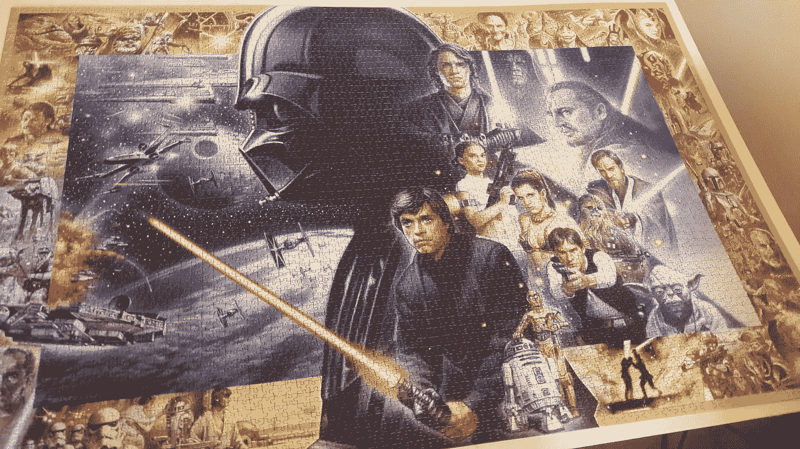
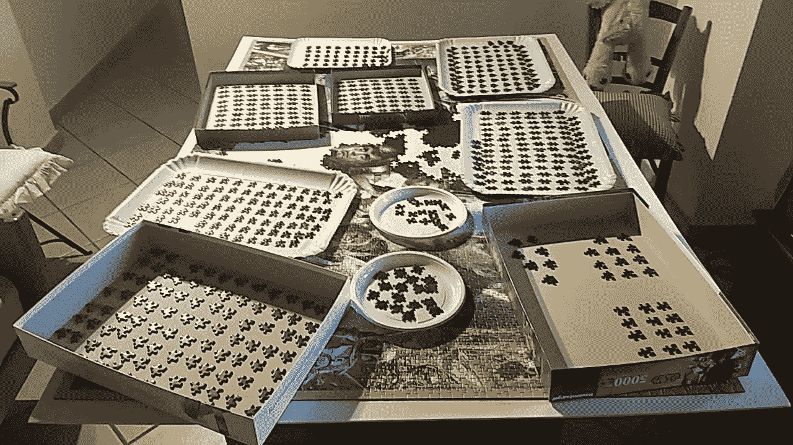
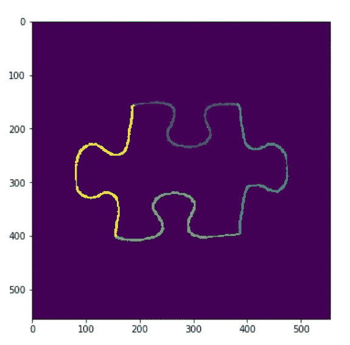
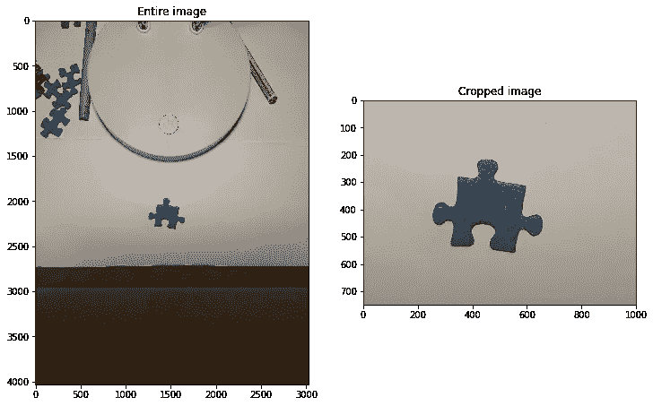
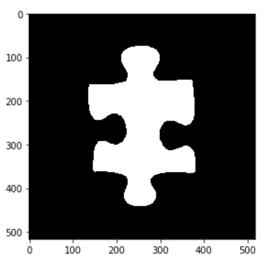
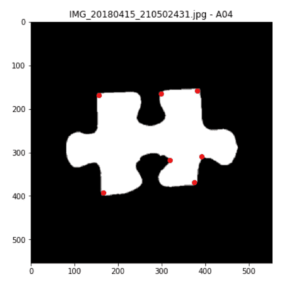
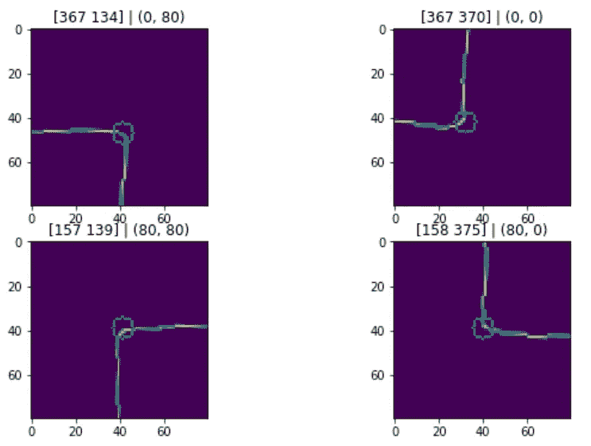
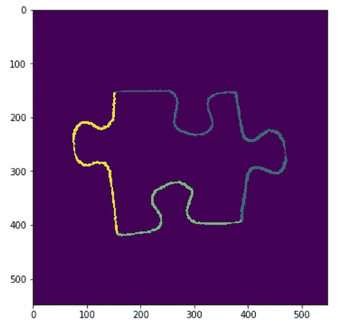

# 用 Python 和 OpenCV 解拼图

> 原文：<https://towardsdatascience.com/solving-jigsaw-puzzles-with-python-and-opencv-d775ba730660?source=collection_archive---------8----------------------->

[源代码在这里](https://github.com/ralbertazzi/jigsaw-puzzle-solver)

2018 年初，我收到了一个很棒的星球大战 5000 块拼图(你可以在亚马逊[这里](https://www.amazon.com/Ravensburger-Star-Jigsaw-Puzzle-Piece/dp/B00VR4LYP8)找到它)。完成这个拼图花了我大约 2 个月的耐心和毅力，但现在我可以满意和高兴地看着我的杰作。



然而，我仍然记得当我必须完成拼图的中心部分时，它是由一个巨大的达斯·维德和卢克·天行者组成的(剧透警告:达斯·维德的儿子！！).我基本上发现自己坐在一千件黑色和深蓝色的衣服前，寻找匹配的衣服成了一件真正的痛苦。



They are all black!!!!!!!!

这时候，我决定给计算机视觉一个机会，尝试编写一个程序，能够通过查看它们的形状来找到匹配的碎片。

在这第一部分，我将解释我是如何从每一件作品中提取出四个边的，以便在将来匹配形状。在这里，我将展示一个输出图像，以明确我在这里试图实现的目标:



# 1.创建数据集

首先要做的是在最佳光线条件下(用我的手机)拍摄 200 多张照片。请注意，我拍了拼图背面的照片，因为我不需要拼图内容，只需要它的形状。我还固定了相机和拼图的位置，这样从整个图像中裁剪出碎片就成了一件小事:

```
img = cv2.imread(join('images', filename))
img = img[1750:2500, 1000:2000]
```



Example of picture of puzzle piece and cropping

# 2.分段

由于数据集内的光线条件和块颜色都不会改变，因此使用简单的二进制阈值分割来实现分割。
在应用二值化之前，对灰度图像应用中值滤波器，以去除拼图块上的白噪声。然后使用均值滤波器平滑二值化图像:

```
gray   = cv2.cvtColor(img, cv2.COLOR_BGR2GRAY)
gray   = cv2.medianBlur(gray, ksize=5)
thresh = cv2.threshold(gray, 130, 255, cv2.THRESH_BINARY)[1]
thresh = cv2.blur(thresh, ksize=(3, 3))
```

一旦获得了阈值图像，我通过使用`cv2.connectedComponents` OpenCV 函数并采用具有最大面积的连通分量(即拼图块本身)来清除潜在的假阳性区域(标记为拼图块像素的背景像素)。最后，我进一步把它裁剪成一个正方形的图像，这样可以在不丢失部分图像的情况下进行旋转。以下是此阶段的输出图像示例:



Puzzle piece segmentation and post-processing

# 3.找出 4 块的角

为了分开拼图的每一面，我们需要正确地找到拼图的四个主要角。这是最关键的部分，因为如果角是正确的，所有接下来的步骤将完美地工作。

在第一步中，我找到了角点的大概位置，而在第四节中，我将解释如何改进角点检测以获得准确的位置。

# 3a。[不成功] Canny、Hough 变换和 KMeans

在我的第一次尝试中，我使用霍夫变换找到拼图块的主线，并试图将它们分成 4 个不同的子集(每边一个)。在这里，我将简要解释算法步骤:

1.  通过应用`cv2.Canny`功能对二值化图像进行边缘检测。
2.  应用霍夫变换进行直线检测:`cv2.HoughLines`。对于该函数返回的每一行，我们以参数形式获得其系数。
3.  通过估计棋子的方向来移除不需要的线:因为我们期望通过棋子的四个角的四条线形成一个矩形，所以我将具有相同方向的线组合在一起，以便修剪不属于这个组的线。
4.  用 KMeans 对线进行聚类:我们可以根据它们的系数，将所有的线分成 4 个不同的聚类，每条线代表一面。
5.  计算每个聚类的平均线。
6.  计算四条平均线之间的交点，最终获得四个角。


Blue lines are all the hough lines after the pruning phase. Green lines are the mean lines for each cluster of lines.

尽管简单明了，但这种算法并没有被证明是健壮的:这种情况尤其发生在拼图的一边只有几条线或者没有线的时候，使得聚类结果变得不可预测。此外，这些线并不总是足够接近真实的边线，使得它们的交点离真实的角太远。

# 3b。哈里斯角点检测器和最大矩形估计

在第二次尝试中，我应用了 [Harris 角点检测](https://docs.opencv.org/3.0-beta/doc/py_tutorials/py_feature2d/py_features_harris/py_features_harris.html)，以找到最佳候选角点，并使用一种能够始终检测到正确角点的算法来改进这种估计，该尝试被证明是准确和稳健的。

1.  我首先应用了`cv2.Harris`函数，它返回一个新的浮点图像，在这里计算每个像素的‘角度’值(越高，越健壮
2.  然后，我发现哈里斯图像的局部最大值高于某个阈值。在这一段之后，我有了离散的点，这些点代表了拼图块的候选角。好的一面是，对于我的数据集中的每个拼图块，该算法都返回一个候选角点，其中存在一个真实角点。请看这里的例子:



Candidate corners obtained by finding local maxima of the Harris corner detection function

3.给定所有候选角点，找出最大化一个函数的四个角点集合:
-由四个点形成的形状的“矩形度”:四个角越接近 90°，越好
-形状的面积:形状越大越好(这是因为我们期望我们能找到的最远的点就是真正的角点本身)

这个算法被证明对我所有的数据集图像都是成功的。耶！

# 4.改进角点检测

在进入下一个阶段之前，我旋转拼图块，使其水平(或垂直，取决于你的观点…)并使用 Canny 边缘检测器计算其边缘。

然后，我通过选择一个以检测到的角为中心的窗口，并从穿过拼图块中心的 45°或 135°方向的直线中找到最远的点，来优化检测到的角的位置。如您所见，结果相当准确:



Refinement of the 4 puzzle corners. The small circles are centered on the refined corner.

# 5.分开四边

现在我们有了一些好的拼图角落，我们需要将拼图块的周边分成四个边。每条边都是一条相连的曲线，从一个角开始，到另一个角结束。

最简单的想法非常有效:计算通过四个角的四条线，并根据最接近该点的线对每个周界点进行分类。
然而，在某些情况下，一侧有一个很大的突起，并且它的一部分被归类为属于错误的一侧，因为它最接近错误的线！
为了解决这个问题，我将这个简单的方法修改成了一个更健壮的方法:

1.  应用“最近线”的想法，直到一个最大阈值:如果一个点远离所有四条线，它就不会被分类
2.  对所有未分类的点应用滞后算法:对于每个未分类的点，检查其邻域中的周界点是否已被分类；如果这是真的，设置同一个“侧类”的要点，并继续。当所有的点都被分类后，算法结束。

最后的结果是惊人的！这里有一个例子:



In the final classification step each perimeter pixel gets assigned a different ‘side class’. In this image the four classes are shown with different colors.

我们需要的最后一个信息是每一面的方向:我们需要知道这一面是向内还是向外！(如果算法告诉我们连接两个都要出去的边，那就糟了…)
这一步非常简单，因为我们只需要检查每个边的平均点(通过平均属于同一边的所有点坐标获得)和拼图块的重心是否位于由连接其两个角的边缘线确定的同一半平面上；如果这个条件为真，那么侧面是进去的，否则是出来的。

# 结论

虽然我决定用蛮力的方法来完成我的星球大战拼图，但我真的很喜欢将计算机视觉算法应用到拼图中。即使这个任务乍一看似乎很简单，但需要使用大量的算法(二值化、均值滤波、边缘检测、角点检测、连通分量，……以及大量的几何图形！).

请分享你对这项工作的看法和可能的改进，也许我们可以一起建造一个完全自主的解谜机器人:)