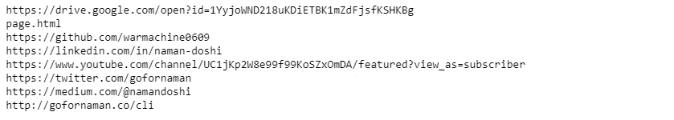
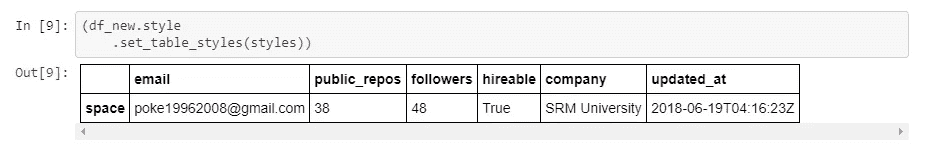
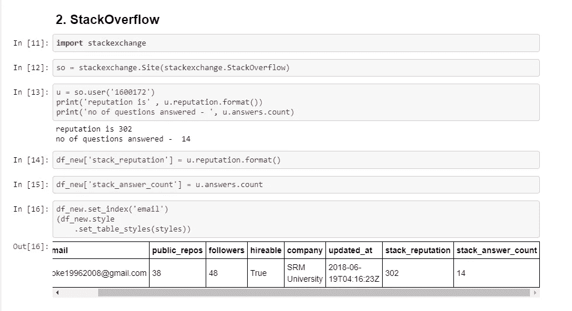
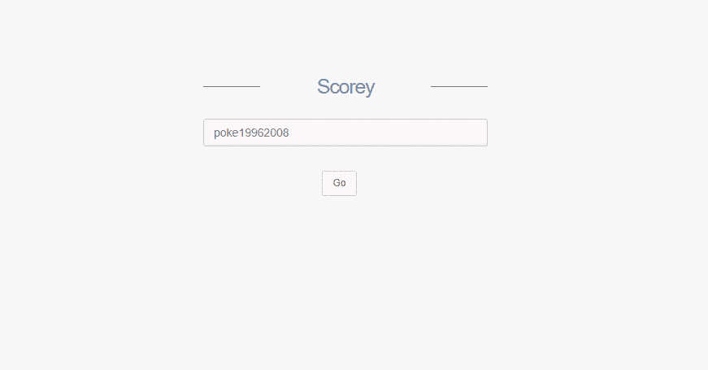

# 使用数据科学解决现实世界的问题

> 原文：<https://towardsdatascience.com/solving-real-world-problem-using-data-science-e2236159a1a9?source=collection_archive---------3----------------------->


Source: Betsol

数据科学的世界每天都在发展。这个领域的每一个专业人士都需要更新，不断学习，否则就有落伍的风险。你必须有解决问题的欲望。所以我决定研究并解决一个现实世界中的问题，这个问题是我们大多数人在职业生涯中都面临过的。面试中的技术回合！


有多少次你经历了一场技术面试，你觉得自己表现得很好，然后一个问题出现了，把你难住了？从那以后，整个面试就走下坡路了，因为现在你已经失去了信心，招聘人员也失去了兴趣。

但是完全根据 3 个小时的面试来判断一个应聘者的技术能力公平吗？这是两端的损失，因为现在公司失去了一个潜在的候选人，候选人也失去了一个机会。

要是有一种方法能让招聘人员在面试大厅之外了解候选人的技术能力就好了。各种各样的评分系统——给出理想的分数来衡量候选人的技术知识，从而帮助招聘人员做出明智、公正的决定。听起来像梦里的场景，对吧？

因此，我决定启动一个名为“Scorey”的项目，旨在破解这一挑战。

**Scorey 根据公开来源帮助搜集、汇总和评估候选人的技术能力。**

# **设置问题陈述**

当前的面试场景偏向于“候选人在 3 小时面试中的表现”，而没有考虑其他因素，例如候选人的竞争性编码能力，对开发人员社区的贡献，等等。

# 我们将采取的方法

Scorey 试图通过汇总各种网站的公开数据来解决这个问题，例如:

*   开源代码库
*   StackOverflow
*   厨师长
*   Codebuddy
*   代码力
*   黑客地球
*   SPOJ
*   git 奖

一旦收集到数据，算法就会定义一个综合评分系统，根据以下因素对候选人的技术能力进行评级:

*   等级
*   解决的问题数量
*   活动
*   名声
*   贡献
*   追随者

然后给候选人打分，满分为 100 分。这有助于面试官全面了解候选人的能力，从而做出公正、明智的决定。

# 设置项目

对于这个项目的整个范围，我们将使用 Python，一个 Jupyter 笔记本&抓取库。因此，如果你是一个喜欢笔记本的人，那么这一部分就是为你准备的。如果没有，请随意跳过这一部分，继续下一部分。

```
**def color_negative_red(val):
    *"""*
 *Takes a scalar and returns a string with*
 *the css property `'color: red'` for negative*
 *strings, black otherwise.*
 *"""*
    color = 'red' if val > 0 else 'black'
    return 'color: %s' % color*****( Set CSS properties for th elements in dataframe)*
th_props = [
  ('font-size', '15px'),
  ('text-align', 'center'),
  ('font-weight', 'bold'),
  ('color', '#00c936'),
  ('background-color', '##f7f7f7')
  ]

*# Set CSS properties for td elements in dataframe*
td_props = [
  ('font-size', '15px'),
    ('font-weight', 'bold')
  ]

*# Set table styles*
styles = [
  dict(selector="th", props=th_props),
  dict(selector="td", props=td_props)
  ]**
```

这将使您的 dataframe 输出看起来整洁，干净，真的很好！

现在我们已经有了我们要解决的问题的要点以及我们将如何去做，让我们开始编码吧！

# 第一步:抓取个人网站

我们需要汇总一个人在互联网上的整个*编码存在。但是我们从哪里开始呢？咄！他/她的个人网站。*当然，前提是我们有权访问候选人的个人网站。我们可以从那里解析所有必要的链接。**

```
**from** **bs4** **import** BeautifulSoup
**import** **urllib**
**import** **urllib.parse**
**import** **urllib.request**
**from** **urllib.request** **import** urlopen

url = input('Enter your personal website - ')

html = urlopen(url).read()
soup = BeautifulSoup(html, "lxml")

tags = soup('a')

**for** tag **in** tags:
    print (tag.get('href',**None**))
```

当我们运行这段代码时，我们得到下面的输出:



这里我们使用的是 *BeautifulSoup* ，这是一个流行的抓取库。使用这段代码，我们可以直接链接到候选人的在线个人资料。

现在，如果你必须在一个更精细的层次上评估一个程序员，你会从哪里开始呢？

1.  **Github**

首先，让我们使用 Github API 来获取我们需要的特定用户的所有信息。

对于我们的用例，我们只需要电子邮件、存储库数量、追随者、可雇佣者(对或错)、当前公司和最后记录的活动。



2. **StackOverflow**

啊。Devs 可能不相信上帝，但 StackOverflow 绝对是他们的圣殿。你可能已经知道，在 StackOverflow 上获得声誉是非常困难的。对于这一步，您可以使用 StackExchange 的 API——它为您提供用户数据，如信誉、回答数量等。

然后，我们将这些新属性添加到现有的数据帧中。



现在，我们将瞄准并收集全球竞争性编程平台，如 CodeChef、SPOJ、Codebuddy、Hackerearth、CodeForces & GitAwards(以深入了解他们的项目)。

如你所见，所有这些刮擦给了我们很多信息。代码是很容易解释的。我还使用注释进行了记录，以便于理解。

在不深入代码本质的情况下，我想把重点放在过程上。但是如果你在执行代码时遇到任何问题，你可以大声告诉我。:)现在我们已经有了所有的数据，我们将继续创建一个评分算法。

# 第二步:评分系统

下一步是根据以下参数对候选人进行评分:

*   排名(25 分)
*   解决的问题数量(25 分)
*   声誉(25 分)
*   关注者(15 分)
*   活动(5 分)
*   贡献(5 分)

所以如果你仔细阅读这段代码，你就会明白我们如何创建一个评分系统。虽然在这一点上它非常基础，但我们可以使用机器学习来创建一个强大的动态评分系统。

**最终得分**

基于我们上面看到的分数系统，算法现在将为候选人的技术能力分配一个最终分数。

所以用户 *poke19962008* 的**分是 100 分**中的 64 分！这会让招聘人员在面试室外了解候选人的技术能力。

# 步骤 3:预测建模

当你试图解决一个现实世界中的问题并"*有效化*解决方案时，考虑最终用户的需求是很重要的。
在这种情况下，是招聘人员。
*我们如何利用机器学习的力量为招聘人员增加价值？*

经过头脑风暴，我发现了以下用例—
1。预测候选人的技能组合是否能满足管理层需求的模型
2。预测招聘后候选人流失概率的模型
3。使用遗传算法将候选人链接分配到各自的团队

让我们试着编写第一个用例——预测公司的满意度
,假设招聘人员使用 Scorey 筛选候选人已经有一段时间了，现在有一个 100 名候选人的数据库。
招聘后，根据候选人的表现，招聘人员使用新的二进制属性“满意度”更新数据库，该属性的值为 0 或 1。
现在让我们创建一个虚拟数据库，并尝试使用 *Scikit-Learn、Pandas、Numpy* 创建一个模型，并构建一个预测模型。

1.  导入数据和库
2.  清理数据-移除重复项和空值
3.  使用标签编码器处理分类数据
4.  将数据集分为训练和测试
5.  使用 kNN 分类器进行预测
6.  检查准确性

使用这些步骤，你将得到一个利基模型，它将能够根据潜在趋势预测候选人是否适合该公司。
对于 eg——拥有更高声誉并对开源做出贡献的候选人更有可能保留更长时间。

# 第四步:仪表板

我做了一个仪表板。这仍然是一项正在进行中的工作，我很乐意分享一些界面截图。



这就是了。您自己的端到端产品。
总结一下——
1。我们发现了一个问题
2。有条不紊地思考如何解决这个问题。使用网络搜集收集数据
4。建立一个算法评分系统。机器学习建立预测模型
5。传达结果的仪表板

我们使用的技术栈— *Python: BeautifulSoup，Urllib，Pandas，Sklearn*

所以这篇文章到此为止。我们拿了一个现实生活中的问题，尝试用数据和算法去解决！

下次你去面试时，你可以向招聘人员推销这个系统。:)

# 那么下一步是什么？

整个项目的代码可以在 [Github 上找到——这里是](https://github.com/warmachine0609/Scorey)

*   集成用于规则生成的机器学习组件
*   动态处理缺失数据异常

如果你认为这个项目很酷，并且愿意贡献自己的一份力量，我们非常欢迎你！让我们为社区建造一些令人兴奋的东西。

您可以通过[**LinkedIn**](https://linkedin.com/in/naman-doshi) 或**[**Twitter**](https://twitter.com/gofornaman)**与我联系，以获取数据科学&机器学习的每日更新。****