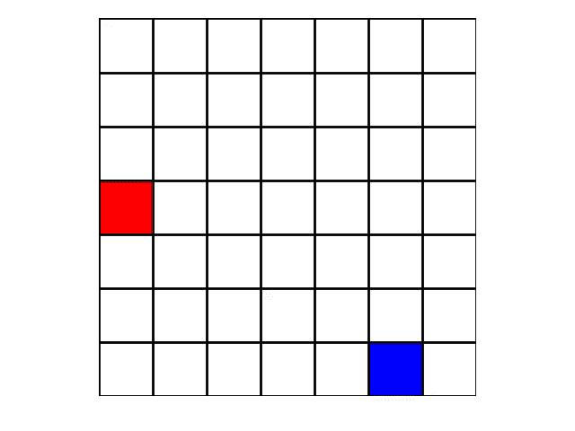

# 将猎人-猎物问题作为单智能体问题求解

> 原文：<https://towardsdatascience.com/solving-the-hunter-prey-problem-as-a-single-agent-problem-using-relative-coordinates-31c3b1daf441?source=collection_archive---------14----------------------->

在本文中，我们讨论如何使用猎人相对于猎物的相对坐标*将(N，N)网格上的双代理猎人-猎物问题简化为(2N-1，2N-1)网格上的单代理网格世界问题。*

The hunter agent (blue) capturing its constantly spawning prey (red)

虽然我们在这里描述的方法是解决猎人-猎物问题的许多独特方法之一，但它最大的效用是简单地重复利用以前在 [**解决单智能体网格世界问题**](https://medium.com/towards-data-science/training-an-agent-to-beat-grid-world-fac8a48109a8) (我们以前的帖子)中使用的经典强化学习技术，而不需要引入任何新技术！当然，我们不能将这个解决方案扩展到更复杂的多智能体问题，但它确实是一个强化学习的例子，在这个例子中，添加额外的物理或几何约束可以绕过对更高级方法的需求。

使用相对坐标实现猎人-猎物的 Python 代码可以在我的 Github 中找到:

> [*****](https://github.com/ankonzoid/Deep-Reinforcement-Learning-Tutorials/tree/master/hunterprey) ****当前代码实现正在重新完成(我现在正在升级我的许多 repos)* * *
> * * *完成后将使用链接更新这篇博文*****

更多我关于深度学习和强化学习的博客、教程、项目，请查看我的 [**中**](https://medium.com/@ankonzoid) 和我的 [**Github**](https://github.com/ankonzoid) **。**

# 如何将猎人-猎物问题格式化为固定环境下的单代理问题

尽管广义的猎人-猎物问题确实需要一个动态的第二智能体，在捕获猎物后在网格周围产卵的最简单版本可以简化为单智能体在*猎人相对于猎物的相对网格坐标*中找到原点(0，0)的静态环境。这种将参考系固定在运动物体上的方法，是二体经典力学物理问题中非常常用的一种方法，用来获得更简单的运动方程。

为了说明相对坐标是如何工作的，考虑一个位于全局笛卡尔坐标(2，4)的猎人和一个位于全局笛卡尔坐标(1，1)的猎物。用猎物坐标减去猎人坐标，我们得到(2，4) - (1，1) = (+1，+3)作为在笛卡尔坐标中猎人相对于猎物的相对位置。如果猎人能够以某种方式学会在这个坐标系中导航并到达(0，0)，那么我们将使猎人与猎物在同一个网格方块上重合(也称为猎人捕获猎物！).

通过将参照系固定在猎物上，我们不再需要关心全球地球参照系——我们可以单独在猎物参照系中工作。这意味着我们可以关注 S_{hunter，relative}的相对状态空间，而不是更令人生畏的直积 S_{hunter} x S_{prey}全局状态空间。这样做不仅缩小了我们的状态搜索空间，以更快地训练我们的代理，而且还消除了在翻译等价的物理情况下训练代理的许多冗余*，即，现在教(2，4)处的猎人在(1，1)处捕捉猎物也教(3，5)处的猎人在(2，2)处捕捉猎物，因为猎人与猎物的相对位置(+1，+3)是等价的。*

为了确切地了解我们如何建立单代理框架，让我们从一个大小为(N，N)的全局网格开始。作为与单个智能体合作的交换，我们将不得不扩展我们的相对位置状态空间网格，以容纳所有可能的相对位置。具体来说，这个数字是一个大小为(2N-1，2N-1)的放大的状态空间网格，其整数值为[-N+1，N-1] x [-N+1，N-1]。这背后的推理是给定 x 或 y 的特定笛卡尔方向，全局网格上任意 2 个网格点之间的最大位移是 N 个网格正方形。因此，通过考虑正位移和负位移，我们有 2*N-1 个可能的网格平方位移的完整范围(这里的-1 来自共享的零网格平方距离)。一旦我们确定了这个扩大的(但固定的)网格状态空间，我们就可以简单地将我们看似双智能体的猎人-猎物问题解决为在[-N+1，N-1] x [-N+1，N-1]网格上搜索(0，0)的单智能体网格世界问题！