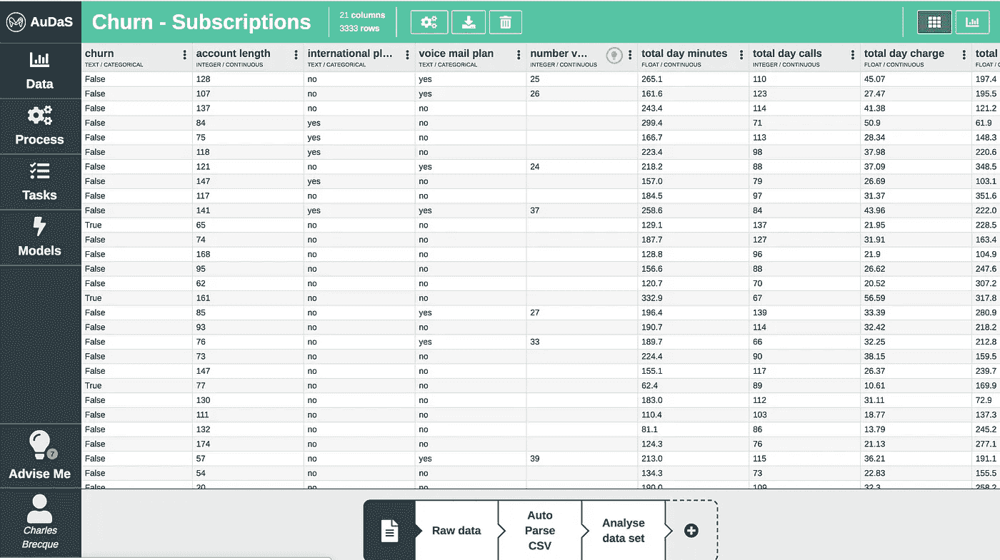
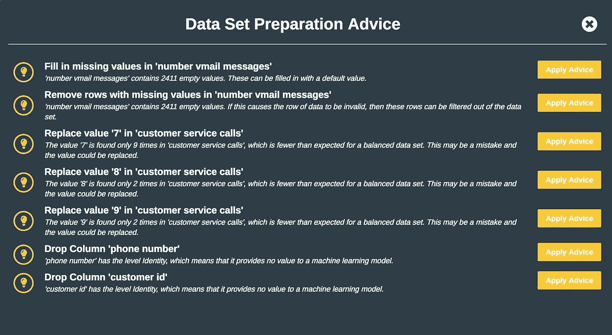
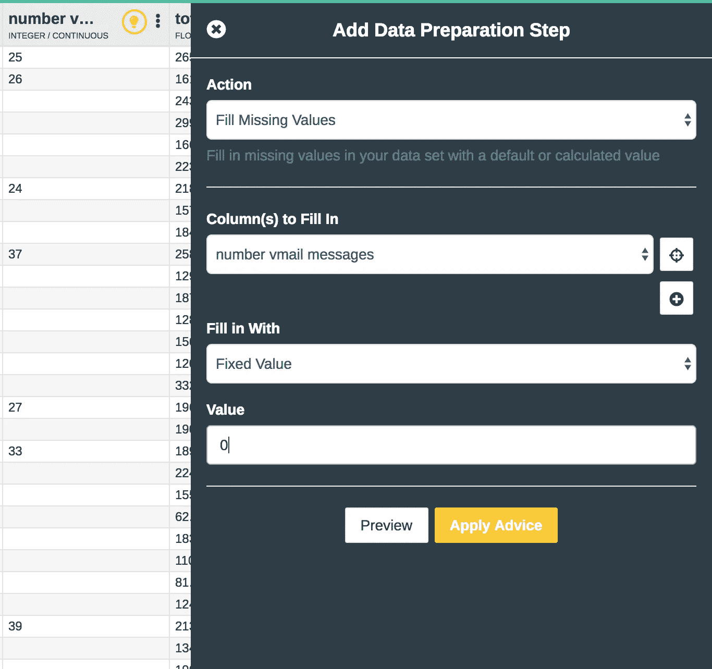
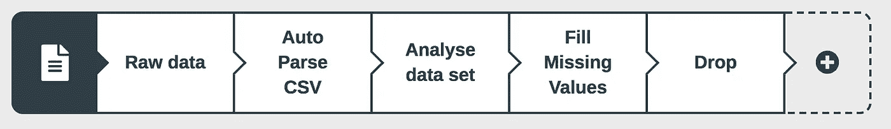
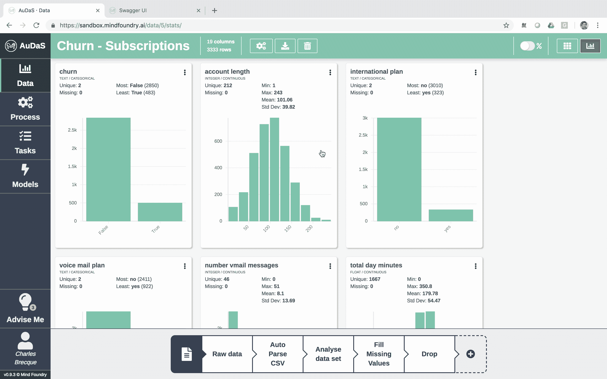
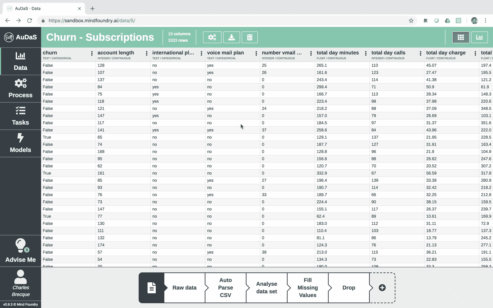
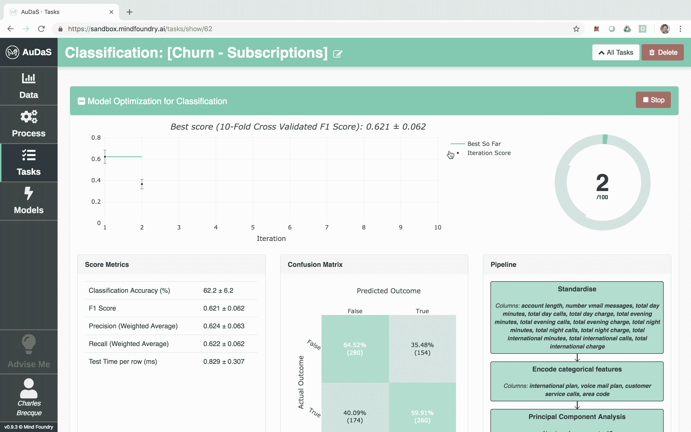
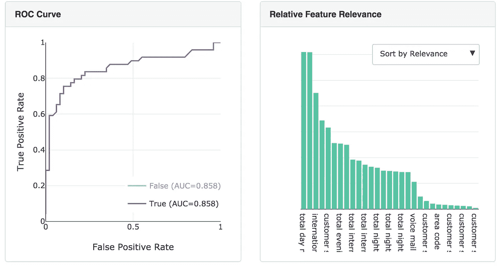
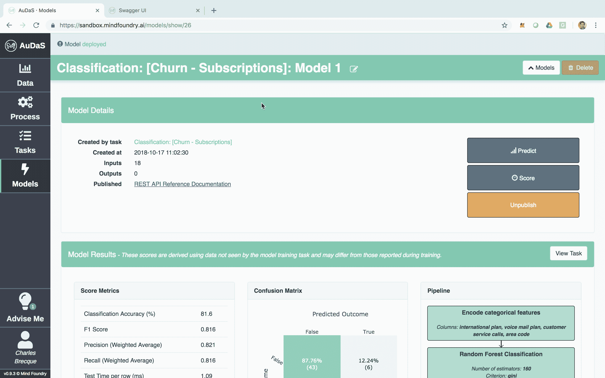

# 使用 AuDaS 在几分钟内解决 Kaggle Telco 客户流失挑战

> 原文：<https://towardsdatascience.com/solving-the-kaggle-telco-customer-churn-challenge-in-minutes-with-audas-2273fed19961?source=collection_archive---------9----------------------->

【**更新**:我开了一家科技公司。你可以在这里找到更多

A uDaS 是由 [Mind Foundry](http://mindfoundry.ai) 开发的自动化数据科学家，旨在让任何人，无论有没有数据科学背景，都可以轻松构建和部署质量受控的机器学习管道。AuDaS 通过允许业务分析师和数据科学家在模型构建过程中轻松插入他们的领域专业知识，并提取可操作的见解，为他们提供支持。

在本教程中，我们将看到如何使用 AuDaS 在几分钟内建立一个分类管道。目标是使用来自 [Kaggle](https://www.kaggle.com/blastchar/telco-customer-churn) 的数据预测电信客户流失。在这种情况下，当客户决定取消订阅或不续订时，他们会感到不安。这对电信公司来说代价很高，因为获得新客户比留住现有客户更昂贵。通过预测模型，电信公司可以预测哪些客户最有可能流失，并采取适当的决策来留住他们。

在本教程中，我们将遵循标准的数据科学流程:

1.  数据准备
2.  管道施工和调整
3.  解释和部署

## 数据准备

首先，我们将数据加载到 AuDaS 中，在本例中，它是一个简单的 csv，有 21 列和 3333 行:

每行代表一个客户，每列代表一个属性，包括语音邮件数量、总分钟数(日/夜)、总呼叫数(日/夜)等。

AuDaS 自动扫描数据，检测每个列的类型，并提供灯泡突出显示的数据准备建议。**在这里，数据科学家的业务分析师可以根据相关建议和适当的答案来介绍他们的领域知识。**

在这种情况下，我们知道“语音邮件消息数”列中缺少的值实际上应该用 0 来填充，只需单击:

一旦我们做到了这一点，并删除了不包含任何预测功能的客户 id 和电话号码，我们就能够获得所有数据准备步骤的完整审计跟踪。如果我们愿意，我们也可以很容易地恢复到预先准备好的数据版本。

AuDaS 还会自动为您生成漂亮的数据可视化效果。

您还可以通过加入其他数据集来丰富数据集(如果适用)。AuDaS 支持您通常会做的所有其他数据准备步骤。现在，我们对数据感到满意，我们将建立我们的分类管道。

## 处理数据

AuDaS 允许您快速设置分类过程，为此您只需选择目标列并指定模型验证框架和评分标准。

然后，AuDaS 使用我们的贝叶斯优化器 [OPTaaS](https://mindfoundry.ai/optaas) 启动并搜索可能的管道(特征工程和机器学习模型)及其相关超参数的解决方案空间。AuDaS 还对其评估的所有管道进行审计跟踪，如果需要，您可以查询这些跟踪。

我以前写过使用[贝叶斯优化](/the-intuitions-behind-bayesian-optimization-with-gaussian-processes-7e00fcc898a0)的直觉和优势。OPTaaS 也可以作为一个 [API](https://optaas.mindfoundry.ai) 获得，你可以[联系](http://Charles.brecque@mindfoundry.ai)我要一个密钥。

## 部署解决方案

一旦 AuDaS 找到了最好的管道，它将对从一开始就展示出来并且从未在任何模型训练中使用过的 10%的数据进行最终质量检查。这 10%的性能指标在最后给出，AuDaS 提供了其选择的最终管道的完全透明性(特征工程、模型、超参数值)。

然后，该模型可以通过自动生成的 RESTful API 集成到您的网站、产品或业务流程中。功能相关性由 [LIME](https://homes.cs.washington.edu/~marcotcr/blog/lime/) 提供，对于我们的最终模型，预测客户流失的主要功能是每日总费用。

更完整的教程可以在[这里](https://www.youtube.com/watch?v=Szw9vbwKKV4&t=5s)找到。如果你有兴趣尝试奥达斯，请不要犹豫，联系 [out](http://Charles.brecque@mindfoundry.ai) ！

## 团队和资源

Mind Foundry 是牛津大学的一个分支机构，由斯蒂芬·罗伯茨(Stephen Roberts)和迈克尔·奥斯本(Michael Osborne)教授创建，他们在数据分析领域已经工作了 35 年。Mind Foundry 团队由 30 多名世界级的机器学习研究人员和精英软件工程师组成，其中许多人曾是牛津大学的博士后。此外，Mind Foundry 通过其分拆地位，拥有超过 30 名牛津大学机器学习博士的特权。Mind Foundry 是牛津大学的投资组合公司，其投资者包括[牛津科学创新](https://www.oxfordsciencesinnovation.com)、[牛津技术与创新基金、](http://www.oxfordtechnology.com)、[牛津大学创新基金](https://innovation.ox.ac.uk/award-details/university-oxford-isis-fund-uoif/)和 [Parkwalk Advisors](http://parkwalkadvisors.com) 。