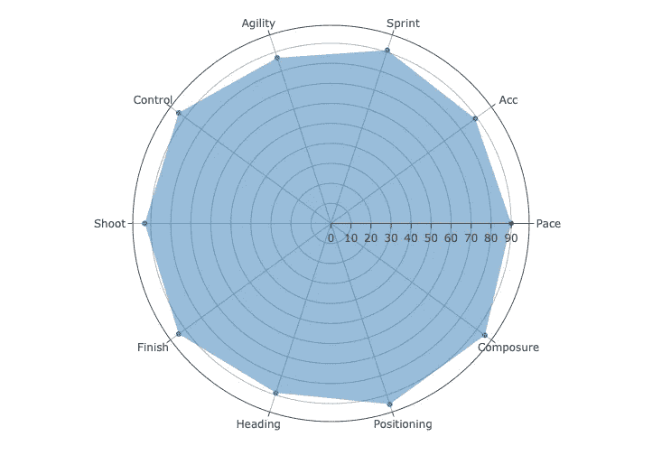
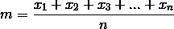
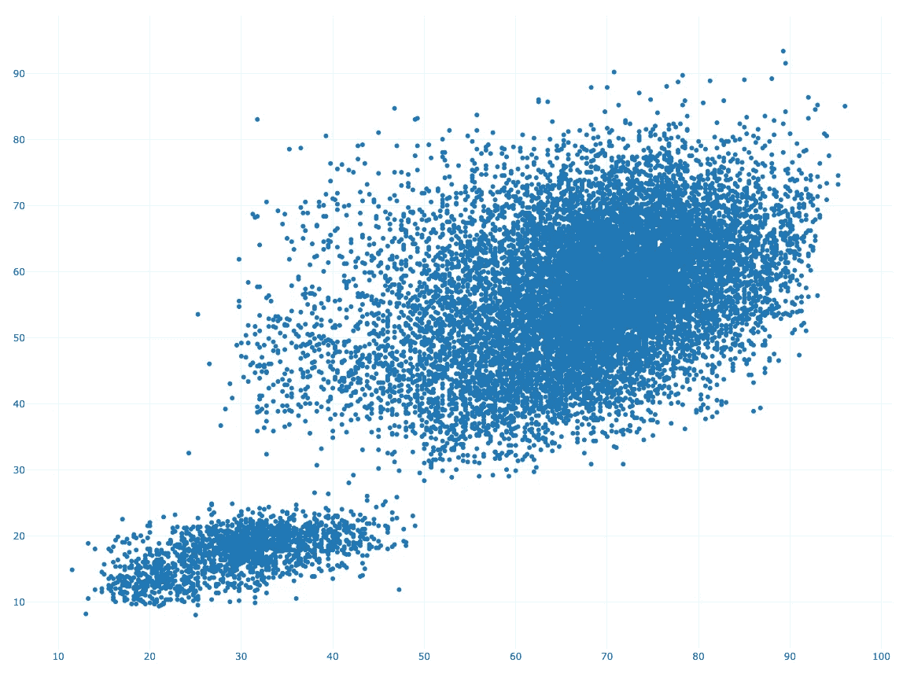
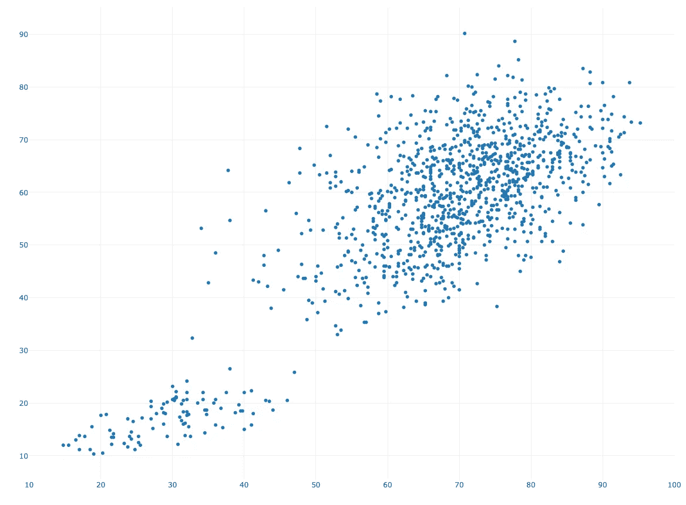
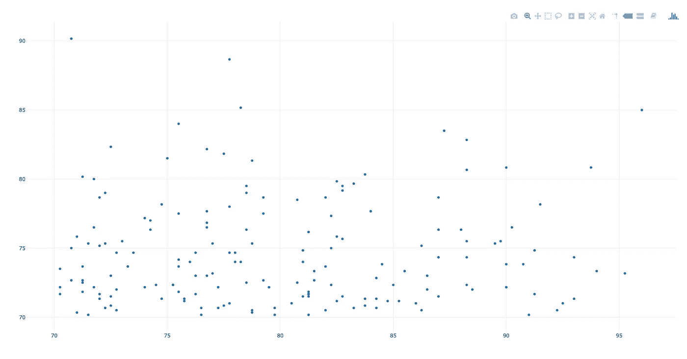
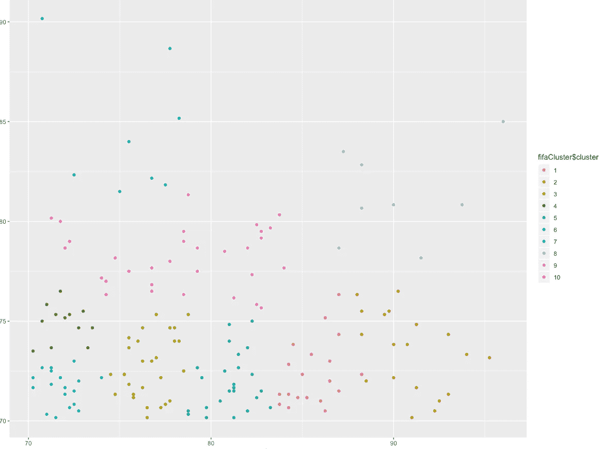
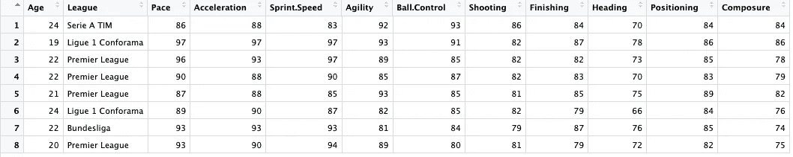
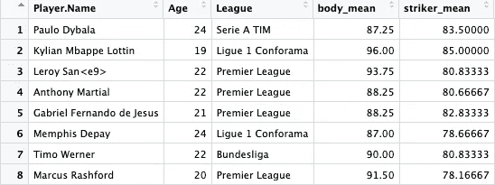

# 用数据科学解决“X 先生转移问题”

> 原文：<https://towardsdatascience.com/solving-the-mr-x-transfer-problem-with-data-science-ab49f38f621c?source=collection_archive---------14----------------------->

在现代足球世界中，我们能够衡量每个球员和球队的表现。这给了我们一堆数据，可以用作机器学习和统计的有价值的信息来源。现代足球比赛建立在统计数据的基础上，遵循既定的规则。每个赛季，俱乐部都必须接受寻找新球员的挑战，这些新球员要么应该提高他们的比赛水平，要么支持另一名离开俱乐部的球员。

All credits and rights to Mitch Rosen [https://unsplash.com/photos/g9SNY0aLMF0](https://unsplash.com/photos/g9SNY0aLMF0)

对于这篇文章，让我们假设我们有一个球员 x 在夏天离开了俱乐部，现在我们必须找到一个合适的替代者。找到一名球员替代另一名球员的最简单的方法是分析老球员的给定统计数据，并找到一些进球和助攻数量几乎相同的球员。这种方法给我们带来了一个大问题:这种假设让我们完全忽略了球员在哪个球队踢球，以及他的球队在一个赛季中表现出了什么样的踢球风格，这对我们的指标也有很大的影响。对于本文，我们将使用不同的方法。让我们假设我们可以用数字来定义离开的玩家的优势和劣势。通过这样做，我们将能够专注于个人指标，而不是仅仅关注目标和助攻。这将使我们能够寻找与老球员相比在特定领域具有相同天赋的球员——这也可以理解为潜力。这意味着我们将寻找有潜力的新球员来取代老球员。

在这篇文章中，我们将使用 FIFA 19 球员属性，因为它们使我们能够使用超过 14000 名球员的个人优势和技能，并且它们也是球员个人数字素质和技能的良好指标。您可以在此处找到数据集:

[https://www . ka ggle . com/aishwarya 1992/FIFA-19-player-database](https://www.kaggle.com/aishwarya1992/fifa-19-player-database)

# 定义指标

在我们开始之前，我们必须看看我们想要替换的球员:

*   向前
*   左脚和右脚
*   年龄:33 岁
*   联赛:西甲

现在让我们来看看前锋位置的 10 大参数以及球员的这些属性:

*   步速:90
*   加速度:89
*   冲刺:91
*   敏捷:87
*   控球:94
*   拍摄:93
*   完成:94
*   标题:89
*   定位:95°
*   沉着:95

如果我们将这个玩家的个人资料可视化，我们会得到这样的结果:

这个球员的参数形象告诉我们，我们必须更换一个“世界级球员”。上面列出的所有参数都接近或高于 90。现在我们知道了我们想要取代什么，我们必须寻找有潜力取代这种“世界级球员”的球员。

**听起来是个有趣的任务。**😎

# 定义配置文件

在我们开始寻找有潜力取代老球员的球员之前，我们必须指定我们希望球员所处的重要条件:球员不应超过 26 岁，因为我们希望有人能够从一开始就表现出高水平，但也有改进和适应的空间。除此之外，球员应该在欧洲顶级联赛之一踢球，因为这意味着球员习惯于在一个赛季踢很多比赛，也习惯于在最高水平上竞争。

个人资料:

*   我们如何处理和评定这类参数？
*   对于这个问题，我想具体说明我们的参数以及如何划分这些参数。考虑一个足球运动员的表现，我们有两个非常重要的因素:身体素质和技术。如果我们现在看一下我们选择的参数，我们可以将它们分成两个新的参数:

body_gene =配速+速度+加速度+敏捷

# 前锋 _ 基因=控球+射门+射门+头球+定位+沉着

对于这种方法，我们将使用算术平均值。算术平均值的公式如下:

对于我们的老玩家，指标如下:

*   身体基因= 89.25
*   striker_gene = 93.2

这允许我们使用平均值作为球员身体和射手能力的指标。如果我们现在应用这两个参数，并为数据集中的所有玩家计算它们，我们将得到下面的图:

Formula arithmetic mean

该图包含我们数据集中的所有玩家。现在我们不得不减去那些没有在五个联赛中比赛的和/或年龄超过 26 岁的球员。在这一步之后，我们得到相同的图，但是只有相关和合适的样本。

仔细观察我们的图会发现，它可以很容易地分为两类。第一个从左下角区域开始，在(50，30) (x，y)处停止。第二个从(50，40)开始。对于我们的任务——找到一个与我们的老玩家潜力相当的玩家——我们只能关注第二个集群，因为那里有真正优秀的玩家。我们要考虑的下一件事是，如果我们今天签下他们，我们想要那些有潜力表现出色的球员。正因为如此，我们关注所有身体基因和前锋基因至少有 70 分的球员。这导致了下面的图:

既然我们已经选择了球员，我们可以用 k-means 把他们分成不同的类别。K-means 是一种将选择的点分成多个聚类的算法。对于我们的例子，我们将把样本分成十个组。这使我们对我们的球员进行了如下划分:

显而易见，最适合我们任务的星团是星团‘8’。如果我们仔细观察聚类 8 中的点，我们可以看到这些点是我们定义的两个参数之间的最佳连接。此外，我们还有一个“离群值”,它独立于集群中其他真正优秀的参与者..聚类 2 和聚类 5 包含部分合适的玩家，因为它们在参数中的一个方面都非常好，但在两个方面都不好。我们寻找的球员需要在这两方面都很优秀或者很有潜力。

x = body_gene , y = striker_gene (over 14000 players)

我们选择了哪些球员？

x = body_gene , y = striker_gene (1426 players)

在集群 8 中，我们找到了八名符合我们要求的玩家，现在我们必须仔细查看他们的个人资料。通过分析分离的参数，我们看到我们有优秀的球员，但他们都有一些斗争考虑一个或两个参数相比，我们的原始球员的参数。但是在我们旅程的这一点上，我们可以说我们已经发现了八个非常有趣的球员。

x = body_gene , y = striker_gene (168 players)

上面所有的球员都很年轻，但就他们的职业生涯阶段而言，他们的发展还很远。如果我们现在想选择一名球员来代替我们的老队员，我们当然应该考虑比球员参数更多的因素，因为每支球队都踢得不同，阵容中有不同的球员。这让我们有了一个不可或缺的信念:如果某个球员在 A 队表现很好，不一定在 B 队也很好，因为 B 队对球员的表现也有很大的影响。但是在这篇文章中，我们关注于相似的玩家类型和属性，认为这是一个有趣的任务。

x = body_gene , y = striker_gene

**结果**

# 现在是时候看看我们选择的球员了，当然还有我们想要选择的球员。我想对你们大多数人来说，很明显，我们想在这个夏天寻找一个替代者:**克里斯蒂亚诺罗纳尔多**。众所周知，取代像罗纳尔多这样的球员是一项不可能的任务，但对于这项有趣的任务，我想发现那些有潜力成为前锋位置真正替代者的球员。我敢肯定，如果我们看看我们发现的八名球员的名字，你们大多数人都会在 2019 年夏天的下一次转会中至少将两名球员作为皇家马德里的转会目标。如果我们记得我们必须替换一个身体基因为 89.25，前锋基因为 93.2 的球员，我们会发现我们没有这样的球员，但是如果我们看一下我们选择的所有球员的年龄以及他们的身体和前锋基因，我们就知道我们选择了最有潜力的球员，有一天可能成为像罗纳尔多一样的球员。

这些是我们通过数据分析和聚类算法选出的球员。我个人认为这些球员是伟大的、有天赋的、年轻的，但也是昂贵的选择。我希望你喜欢这篇文章，并从中得到一点乐趣。⚽️

All of the players above are very young but also very far in their development in reference to their career-stage. If we now want to select one player to replace our the old one we should definteley consider more factors than the player’s parameters because every team plays differently and has different players in the squad. That leads us to the indispensable conviction that if a certain player plays really well in team A — does not have to bee immediately good in team B since the team has a big impact on a player’s performance as well. But for this article we focused on similar player-types and attributes considering this to be a fun task.

# **The results**

Now it’s time to look at the players we have selected and of course which player we want to choose. I think for the most of you it’s clear that we wanted to search an alternative for the transfer of the summer: **Cristiano Ronaldo**. As we all know it’s an impossible task to replace a player like Ronaldo but for this fun task I wanted to discover the players with the potential to become a real alternative considering their skillset for the forward position. I’m sure that if we take a look at the names of our discovered eight players most of you would minimum take two players as an real transfer target for Real Madrid in the next transfer summer 2019\. If we remember that we have to replace a player with a body_gene of 89.25 and a striker_gene of 93.2 we see that we don’t have a player that is in the direct space of this quality but if we take a look at the age of all our selected players and their body and striker_genes then we know that we have selected the players with the highest potential to maybe become one day a player like Ronaldo.

selection with body and striker mean

So these are the players we selected with our data analysis and cluster-algorithm. Personally I would evaluate those players as a great, talented, young but also expensive choice. I hope you enjoyed this article and had a little bit of fun. ⚽️