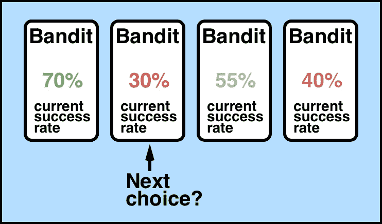
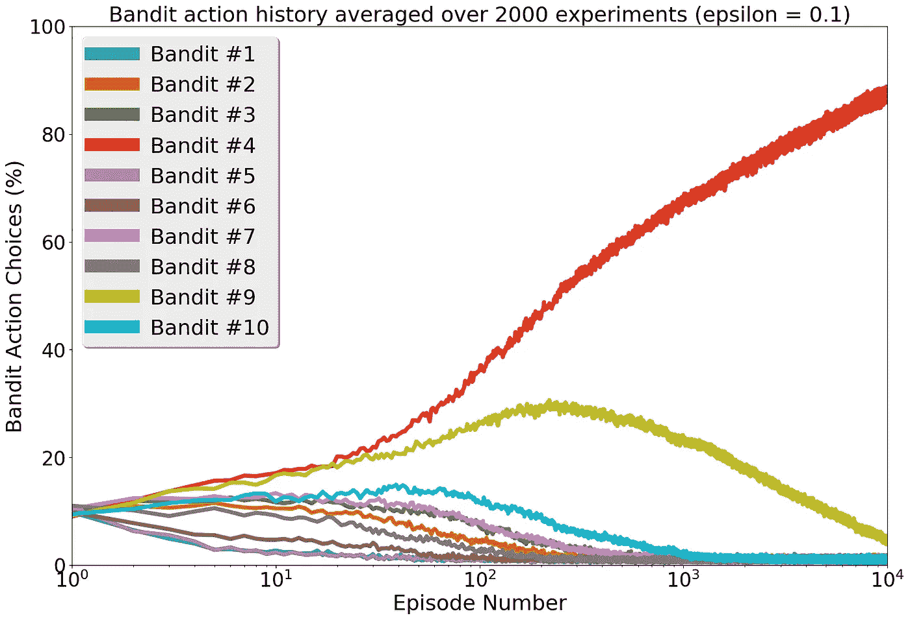
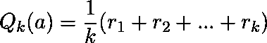
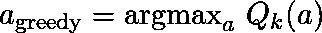

# 解决多臂强盗问题

> 原文：<https://towardsdatascience.com/solving-the-multi-armed-bandit-problem-b72de40db97c?source=collection_archive---------1----------------------->

多臂土匪问题是一个经典的强化学习例子，我们有一个带 *n* 个臂(土匪)的老虎机，每个臂都有自己操纵的成功概率分布。拉任何一只手臂都会给你一个随机奖励，成功的话 R=+1，失败的话 R=0。我们的目标是按顺序一个接一个地拉动手臂，这样从长远来看，我们可以获得最大的总回报。



多臂土匪问题的重要性在于我们(代理人)无法获得真正的土匪概率分布——所有的学习都是通过试错法和价值估计的方式进行的。所以问题是:

**我们如何设计一个系统的策略来适应这些随机的回报？**

这是我们针对多兵种土匪问题的目标，拥有这样的策略将在许多现实世界的情况下证明非常有用，在这些情况下，人们希望从一群土匪*中选出“最好的”土匪，即 A/B 测试、阵容优化、评估社交媒体影响力*。

在本文中，我们使用一种经典的强化学习技术来解决多臂强盗问题，这种技术由一个*ε-贪婪代理*和一个学习框架*报酬-平均抽样*来计算行动值 Q(a)以帮助代理改进其未来行动决策，从而实现长期报酬最大化。这个多臂 bandit 算法解决方案的 Python 代码实现可以在我的 Github 中找到，网址是:

> [**https://github . com/ankonzoid/learning x/tree/master/classical _ RL/multi armed _ bandit**](https://github.com/ankonzoid/LearningX/tree/master/classical_RL/multiarmed_bandit)

请参考我们的附录，了解关于ε贪婪代理的更多细节，以及如何使用平均回报采样方法迭代更新 Q(a)。在下一节中，我们将解释在 multi-armed bandit 环境中部署这样一个代理的结果。

我关于深度学习和强化学习的更多博客、教程和项目可以在我的[](https://medium.com/@ankonzoid)****和我的 [**Github**](https://github.com/ankonzoid) **找到。******

# ****结果:代理选择了哪些土匪？****

****考虑我们的 Python 代码示例，其中有 10 个硬编码的盗匪，每个盗匪都有自己的成功概率(请记住，我们的代理对这些数字视而不见，它只能通过对盗匪进行单独采样来实现这些数字):****

```
**Bandit #1 = 10% success rate
Bandit #2 = 50% success rate
Bandit #3 = 60% success rate
**Bandit #4 = 80% success rate (best)**
Bandit #5 = 10% success rate
Bandit #6 = 25% success rate
Bandit #7 = 60% success rate
Bandit #8 = 45% success rate
**Bandit #9 = 75% success rate (2nd best)**
**Bandit #10 = 65% success rate (3rd best)****
```

****通过检查，我们将期待我们的代理长期挑选出 Bandit #4 作为最强的信号，Bandit #9 紧随其后，Bandit #10 紧随其后，以此类推。****

****现在来看结果。我们以 10%的 epsilon 探索概率对 agent 进行了 2000 次从头开始的实验，每次实验对 agent 进行 10000 集的训练。代理选择的强盗的平均比例作为集数的函数如图 1 所示。****

********

****Fig 1) Bandit choices by the epsilon-greedy agent (epsilon = 10%) throughout its training****

****在图 1 中，我们可以看到，在训练开始(< 10 episodes) as it is in its exploratory phase of not knowing which bandits to take advantage of yet. It is until we reach later episodes (> 100 集)时，强盗的选择均匀地分布在所有强盗中约 10%。我们是否看到一个明显的贪婪机制优先于决定哪个强盗应该获得更高的优先级，因为到目前为止所采样的奖励。不出所料，在训练的中后期阶段，4 号、9 号和 10 号强盗是被代理人选中的。最后，几乎不可避免的是，在训练结束时，代理人倾向于几乎总是选择 Bandit #4 作为“最佳”Bandit，其平台期约为 90%(由于固定的 epsilon exploration 参数，应始终保持约 10%)。****

****尽管在这个问题中，最佳策略是选择强盗 4，但是你会注意到，这并不意味着拉强盗 4 就一定会在给定的拉中击败任何其他强盗，因为奖励是随机的；在长期平均回报中，你会发现土匪#4 占优势。此外，使用我们的代理来解决这个问题并没有什么特别之处——这只是可以适应性地最大化长期回报集合的许多方法之一。绝对存在这样的情况，完全探索性的(ε= 100%)，或完全贪婪的代理人(ε= 0%)，或介于两者之间的任何人，可能最终在有限的几集里获得比我们的ε= 10%贪婪的代理人更多的奖励。在我看来，部署这样一个代理的主要吸引力在于，可以自动最小化重新选择已经显示出一些失败迹象的强盗。从商业和实践的角度来看，这可以节省大量的时间和资源，否则会浪费在寻找“最佳”强盗的优化过程中。****

# ****附录:ε-贪婪代理“个性”和报酬平均抽样“学习规则”****

****简而言之，ε-贪婪代理是(1)完全探索代理和(2)完全贪婪代理的混合体。在多臂土匪问题中，一个完全探索性的代理将以统一的速率对所有土匪进行采样，并随着时间的推移获得关于每个土匪的知识；这种代理的警告是，这种知识从来没有被用来帮助自己做出更好的未来决策！在另一个极端，一个完全贪婪的代理人会选择一个强盗，并永远坚持自己的选择；它不会努力尝试系统中的其他强盗，看看他们是否有更好的成功率来帮助它实现长期回报的最大化，因此它是非常狭隘的！****

****为了得到一个拥有两个世界的最好的有点令人满意的代理，ε贪婪代理被设计为在任何状态下给ε机会(例如 10%)来随机地探索土匪，并且在所有其他时间贪婪地对其当前的“最佳”土匪值估计采取行动。围绕这一点的直觉是，贪婪机制可以帮助代理专注于其当前最“成功”的盗匪，而探索机制让代理探索可能存在的更好的盗匪。****

****剩下的唯一问题是:我们如何给代理定义一个强盗的“价值”概念，以便它可以贪婪地选择？借鉴强化学习，我们可以定义行动价值函数 Q(s，a)来表示从状态 **s** 采取行动 **a** 的预期长期回报。在我们的多臂强盗的例子中，每一个动作都将代理带入一个终结状态，因此长期回报就是直接回报，我们将动作价值的定义简化为****

********

****其中 **k** 是一个(强盗)在过去被选择的次数**的计数器，而 **r** 是每次选择强盗的随机奖励。通过一些额外的算术操作，这个定义可以递归地重写为******

****

**由于我们不知道从知道 Q(a)的“真实”值开始，我们可以使用这个递归定义作为迭代工具，在每集结束时近似 Q(a)。**

**为了将ε-贪婪代理与我们的动作值 Q(a)估计配对，我们让ε-贪婪代理在时间的随机ε-概率上选择一个强盗，并让代理在其余时间从我们的 Q(a)估计中贪婪地选择一个动作**

****

**有了这两个概念，我们现在可以着手解决多臂土匪问题！**