# 一些重要的数据科学工具，不是 Python、R、SQL 或 Math

> 原文：<https://towardsdatascience.com/some-important-data-science-tools-that-arent-python-r-sql-or-math-96a109fa56d?source=collection_archive---------2----------------------->

## 一些你可能想熟悉的必要的、重要的或者很酷的数据科学工具

如果你问任何一位数据科学家，要想在这个领域取得成功，你需要知道什么，他们可能会告诉你以上几点的组合。每一份 DS 的工作描述都会提到 Python 或 R(有时甚至是 Java lol)、SQL 和数学，还夹杂着一些火花、AWS/cloud 体验，并以一部分流行词汇结束。

Random pic from travel. West Lake in Hangzhou, China.

虽然这些是不可否认的必备条件，但现实是大多数数据科学家并不存在于真空中——你不太可能获得完美的数据，在自己的环境中在本地机器上构建模型，然后只需保存这些权重并收工。现代数据科学家需要必要的 CS 技能，以使他们的工作成为可能，并在其他工程师的 leu 中可用。你不会把你的 jupyter 笔记本通过电子邮件发给你的老板来展示你的工作。

这些可能并不适用于所有职位，但是以我的经验和观点来看，这些工具可以像你的面包和黄油 Python 一样重要(或者一样方便)(尽管 Python 肯定是最重要的)。我不打算深入解释这些事情，但我会解释为什么你会想了解它们，以成为一个好的数据科学家——一个能够构建生产就绪的应用程序，而不是在你的本地机器上凌乱的、探索性的笔记本。

# [Linux](https://www.linux.org/)

应该不用说。让我震惊的是，有多少数据科学家可能不熟悉命令行。使用 bash 脚本是计算机科学中最基本的工具之一，由于数据科学中很大一部分是编程性的，所以这项技能非常重要。

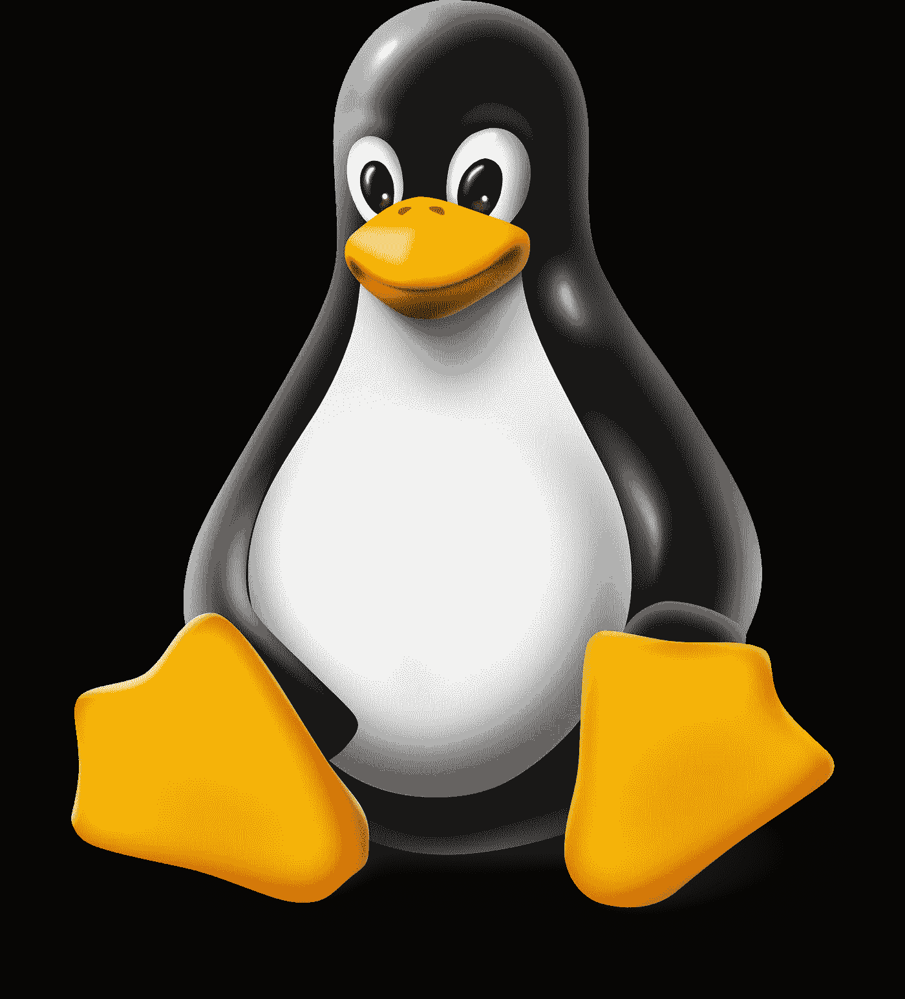

[Check out my dude the Linux Penguin](https://www.google.com/url?sa=i&source=images&cd=&cad=rja&uact=8&ved=2ahUKEwjl79a277PeAhXHY98KHSCdD30QjRx6BAgBEAU&url=http%3A%2F%2Fwww.crazy-audio.com%2F2014%2F03%2Fhelp-wanted-linux-kernel-development%2F&psig=AOvVaw2EgvXwZXxYiqxEyaTPSOtg&ust=1541184932307043)

几乎可以肯定，您的代码将在 linux 上开发和部署，因此我鼓励尽可能使用命令行。像数据科学一样，Python 也不存在于真空中，你几乎肯定必须通过一些命令行界面处理包/框架管理、环境变量、你的`$PATH`和许多其他东西。

# [Git](https://git-scm.com/)

也应该不用说。大多数数据科学家知道 git，但并不真正了解 git。因为数据科学的定义非常模糊，所以我们中有很多人没有遵循良好的软件开发实践。我甚至很久都不知道什么是单元测试。

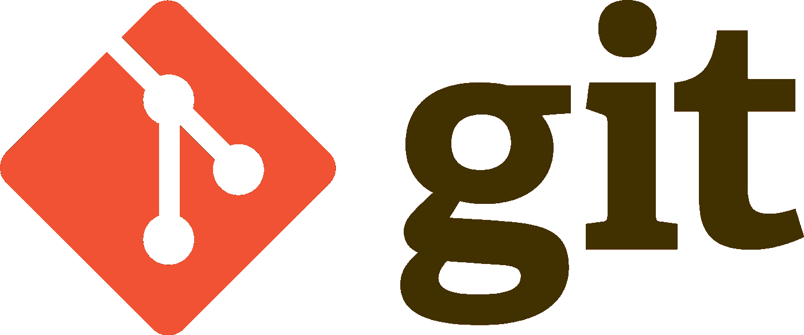

[Source](https://www.google.com/url?sa=i&source=images&cd=&cad=rja&uact=8&ved=2ahUKEwiX78rn77PeAhXrYt8KHU9lC8kQjRx6BAgBEAU&url=https%3A%2F%2Fhackernoon.com%2Fplease-use-git-da3bea7d1234&psig=AOvVaw170nyMgI_aSi-0KS389S17&ust=1541185037534128)

当在一个团队中编码时，知道 git 变得巨大。你需要知道当团队成员提交冲突时，或者当你需要挑选部分代码进行错误修复、更新等时，该怎么做。将代码提交给开源或私有的 repo(如 Github)也允许你使用像[工作服](https://coveralls.io/)这样的东西进行代码测试，还有其他框架可以在提交时方便地将代码部署到生产环境中。就 git 和开源回购协议提供的功能而言，偶尔承诺一个只有你使用的回购协议只是冰山一角。

# REST APIs

你已经训练了一个模型——现在呢？没人想看你的 jupyter 笔记本或者某种蹩脚的交互式 shell 程序。此外，除非您在共享环境中接受培训，否则您的模型仍然只对您可用。仅仅有模型是不够的，这是大量数据科学家碰壁的地方。

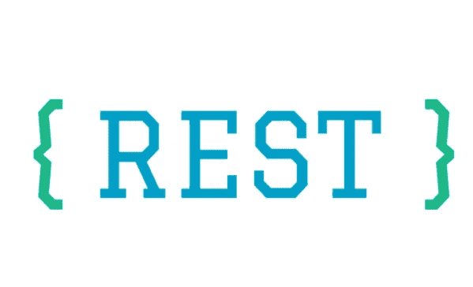

[Preach fam](https://www.google.com/url?sa=i&source=images&cd=&cad=rja&uact=8&ved=2ahUKEwiRm7Kv8rPeAhVkkeAKHWEqAboQjRx6BAgBEAU&url=https%3A%2F%2Frestful.io%2Frest-api-back-to-basics-c64f282d972&psig=AOvVaw2dlSpM-fWhBR3bJOVQ5Lk_&ust=1541185725250444)

为了实际服务于来自模型的预测，通过标准 API 调用或有助于应用程序开发的东西使其可用是一个好的实践。像[亚马逊 SageMaker](https://aws.amazon.com/sagemaker/) 这样的服务已经获得了巨大的欢迎，因为它能够无缝地以生产就绪的方式制作模型。你可以用 Python 中的 [Flask](http://flask.pocoo.org/) 之类的东西自己构建一个。

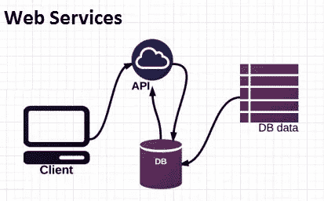

[Source](https://dzone.com/storage/temp/4801535-rest-api.jpg)

最后，有许多 Python 包在后端进行 API 调用，因此理解什么是 API 以及如何在开发中使用 API 有助于成为更有能力的数据科学家。

# [Docker](https://www.docker.com/)&[Kubernetes](https://kubernetes.io/)

我个人最喜欢的两个——docker 允许用户拥有一个生产就绪的应用程序环境，而不必为需要在其上运行的每一项服务集中配置生产服务器。与安装完整操作系统的大型虚拟机不同，docker 容器运行在与主机相同的内核上，并且更加轻量级。

[Love this guy](https://www.google.com/url?sa=i&source=images&cd=&cad=rja&uact=8&ved=2ahUKEwiXg_-g8LPeAhWRTt8KHQxuB9gQjRx6BAgBEAU&url=https%3A%2F%2Fwww.analyticsvidhya.com%2Fblog%2F2017%2F11%2Freproducible-data-science-docker-for-data-science%2F&psig=AOvVaw2CSQaWCTKLlkuyS-kMXIpH&ust=1541185153365242)

想象一下像 Python 的`venv`这样的 docker 容器，它有更多的功能。更高级的机器学习库，如谷歌的 Tensorflow，需要特定的配置，在某些主机上可能难以排除故障。因此，docker 经常与 Tensorflow 一起使用，以确保为训练模型提供一个开发就绪的环境。

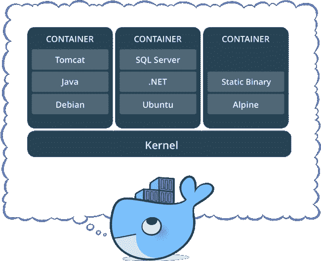

[Lil’ guy thinking about containerized, scalable applications](https://www.google.com/url?sa=i&source=images&cd=&cad=rja&uact=8&ved=2ahUKEwiOsLLu8bPeAhWFd98KHfCCACgQjRx6BAgBEAU&url=https%3A%2F%2Fblog.docker.com%2F2017%2F08%2Fdocker-101-introduction-docker-webinar-recap%2F&psig=AOvVaw1qyTjhFREEGZ3wvS3NqZyV&ust=1541185578595023)

随着市场趋向于更微的服务和容器化的应用，docker 是一项巨大的技能，并且越来越受欢迎。Docker 不仅适用于训练模型，也适用于部署。将你的模型想象成服务，你可以将它们容器化，这样它们就有了运行它们所需的环境*，然后可以与你的应用程序的其他服务无缝交互。这使得你的模型既可扩展*又可便携。**

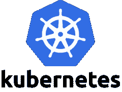

[Source](https://d1.awsstatic.com/PAC/kuberneteslogo.eabc6359f48c8e30b7a138c18177f3fd39338e05.png)

Kubernetes (K8s)是一个跨多个主机大规模管理和部署容器化服务的平台。本质上，这意味着您可以在一个可水平扩展的集群中轻松管理和部署 docker 容器。

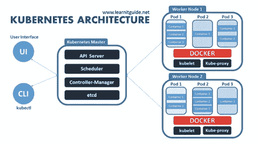

I wish Kubernetes also had a fun whale

当 Google 使用 Kubernetes 来管理他们的 Tensorflow 容器(以及其他东西)时，他们更进一步，开发了 [Kubeflow](https://www.kubeflow.org/) :一个在 Kubernetes 上训练和部署模型的开源工作流。容器化的开发和生产正越来越多地与机器学习和数据科学相结合，我相信这些技能对于 2019 年的数据科学家来说将是巨大的。

[One more for the fans](https://www.google.com/url?sa=i&source=images&cd=&cad=rja&uact=8&ved=2ahUKEwie7t6X9bPeAhWumuAKHdpGC2QQjRx6BAgBEAU&url=https%3A%2F%2Fgfycat.com%2Fgifs%2Fsearch%2Ffuck%2Byou%2Bwhale&psig=AOvVaw26GN5YBnyBR4M0-m4VnwaH&ust=1541186476319497)

# [阿帕奇气流](https://airflow.apache.org/)

现在我们变得更加小众，但是这个很酷。Airflow 是一个 Python 平台，使用有向无环图(Dag)以编程方式创作、调度和监控工作流。

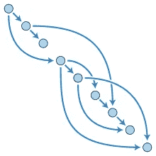

DAG

这基本上意味着您可以轻松地将 Python 或 bash 脚本设置为在您需要的时候运行，无论您需要多频繁。与不太方便和可定制的 cron 作业相反，Airflow 让您可以在一个用户友好的 GUI 中控制您的计划作业。超级毒品。

# [弹性搜索](https://www.elastic.co/)

一样小众。这个有点特别，取决于你是否有搜索/NLP 用例。然而，我可以告诉你，在一家财富 50 强公司工作，我们有大量的搜索用例，这是我们堆栈中最重要的框架之一。与用 Python 从头开始构建不同，Elastic 用一个方便的 [Python 客户端](https://elasticsearch-py.readthedocs.io/en/master/)提供了你需要的一切。

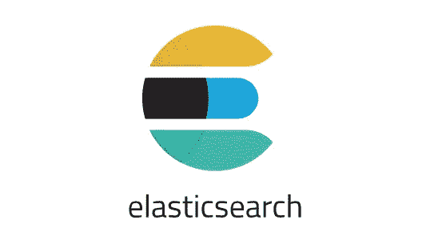

[Source](https://www.google.com/url?sa=i&source=images&cd=&cad=rja&uact=8&ved=2ahUKEwjP9uqX8bPeAhVhS98KHWxkBScQjRx6BAgBEAU&url=https%3A%2F%2Fmedium.com%2F%40victorsmelopoa%2Fan-introduction-to-elasticsearch-with-kibana-78071db3704&psig=AOvVaw1MydFp9Fb815ZvEKe13c3s&ust=1541185375295289)

Elasticsearch 让您能够以容错和可伸缩的方式轻松地索引和搜索文档。数据越多，运行的节点就越多，查询的执行速度就越快。Elastic 使用 [Okapi BM25](https://en.wikipedia.org/wiki/Okapi_BM25) 算法，该算法在功能上非常类似于使用 TF-IDF(term frequency——逆文档频率，Elastic 曾使用该算法)。它有很多其他的功能，甚至支持像多语言分析器这样的定制插件。

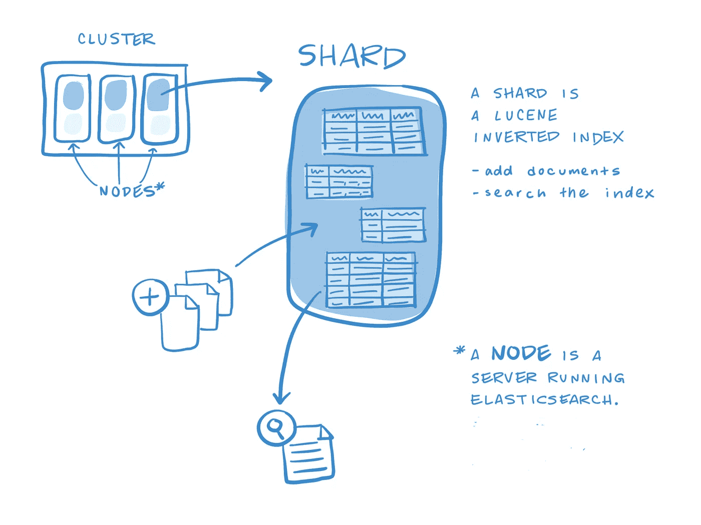

[Elasticsearch index](https://www.google.com/url?sa=i&source=images&cd=&cad=rja&uact=8&ved=2ahUKEwi11Kir8bPeAhWvmuAKHYj2De0QjRx6BAgBEAU&url=https%3A%2F%2Fwww.bogotobogo.com%2FHadoop%2FELK%2FELK_Elastic_Search_Tutorial.php&psig=AOvVaw15qDvIGNRvepeha3pKK4CF&ust=1541185443446281)

因为它本质上是在查询和索引中的文档之间执行相似性比较，所以它也可以用于比较文档之间的相似性。我强烈建议不要从 scikit-learn 导入 TF-IDF，而是看看 Elasticsearch 是否能为您提供开箱即用的一切。

# [自制](https://brew.sh/) (mac OS)

Ubuntu 有`apt-get`，Redhat 有`yum`，Windows 10 甚至有 [OneGet](https://www.howtogeek.com/200334/windows-10-includes-a-linux-style-package-manager-named-oneget/) ，我是从下面的一个评论得知的。这些包管理器通过 CLI 帮助安装，管理依赖关系，并自动更新您的`$PATH`。虽然 mac OS 开箱即用，但家酿软件可以通过终端命令轻松安装，这是本文的重点，因为它是我最喜欢的东西之一。

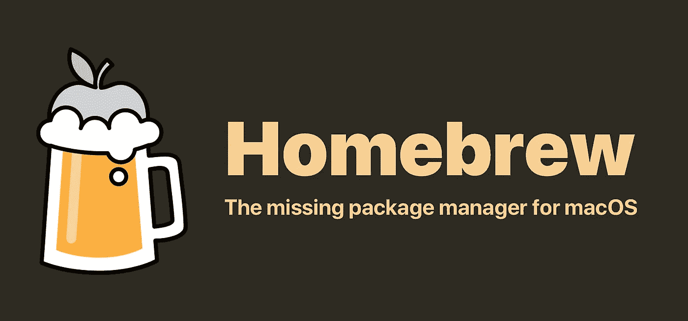

[Beer](https://www.google.com/url?sa=i&source=images&cd=&cad=rja&uact=8&ved=2ahUKEwjSu-rW8bPeAhVsQt8KHQPZDjAQjRx6BAgBEAU&url=https%3A%2F%2Fbrew.sh%2F&psig=AOvVaw1zMjD9_q3QSqjPfOIBseDX&ust=1541185538310043)

假设出于某种违反直觉的原因，您想在本地安装 Apache Spark。你可以去[https://spark.apache.org/downloads.html](https://spark.apache.org/downloads.html)，下载它，解压它，自己把`spark-shell`命令添加到你的`$PATH`中，或者在终端中键入`brew install apache-spark`就可以上路了(注意你还需要安装 scala 和 java 来使用 spark)。我知道这只是一个 mac OS 特有的东西，但我太喜欢它了，我不能不包括它。

# 还有更多…

我可能每天都会下载几个新的包或框架(这让我的电脑很懊恼)。这个领域变化如此之快，以至于很难跟上新的东西，更难分辨什么是真正有用的。然而，在我看来，以上的一切都将继续存在。希望你喜欢它，并随时通过 LinkedIn 联系我。以后再说。