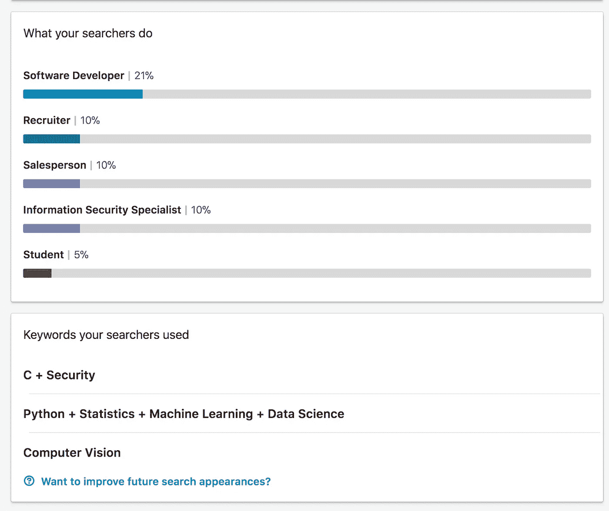

# 关于 Coursera 深度学习专业化的几点思考

> 原文：<https://towardsdatascience.com/some-thoughts-on-the-coursera-deep-learning-specialization-e4de77f15b65?source=collection_archive---------4----------------------->

最近完成了 Coursera 上的[深度学习专精。这个专业要求你参加一系列的五门课程。我想这让我有点像独角兽，因为我不仅完成了*的一门* MOOC，还完成了*的五门*相关课程。](https://www.coursera.org/account/accomplishments/specialization/3UMHKFEZ9CH7)

所以，我想分享一下我的想法。但是，我不想把这篇文章正式地当成一件事，所以把它当成一些未经修饰的思考:

*   你学习的东西的种类；
*   你做的事情的种类；而且，
*   49 美元/月，值得吗？

## 放弃

但是，首先:我可能不是这个专业的目标受众。因此，您的里程可能会有所不同。这门课程似乎是面向那些拥有计算机背景、希望在“深度学习”领域获得一份行业工作的人。我不是那样的。我有博士学位，并且是排名前十的计算机科学系的终身教职教师。我获得这个证书并不是为了推进我的职业生涯或者进入这个领域。相反，我参加了这一系列课程，方便地排序为“专业化”，从一个显然在吴恩达对深度学习了解很多的人那里学习更多关于深度学习的知识。

“为什么？”你可能会问。第一，能够聪明地谈论和思考似乎是一件有用的事情——几乎每个计算机科学部门都在试图雇用从事人工智能/人工智能/深度学习的人，你真的无法逃避关于它的对话。二、因为[刻意练习](http://www.nytimes.com/images/blogs/freakonomics/pdf/DeliberatePractice(PsychologicalReview).pdf)。三，因为我也想一年被引用 12000 次，因为我写了一些关于深度学习的东西。

总之。

## 你学到的东西的种类

专业化的第一门课程提供了对神经网络如何工作的基本的、表层的理解，以及我们如何和为什么使它们深入。Andrew 将会谈到为什么你应该深入学习，尽管你可能已经想这么做了，因为你正在学习这门课程。他把人工智能比作电。呃…

我发现第一门课的技术内容足够深入(没有双关语的意思)。Andrew 很好地传达了深层微积分背后的直觉——他详细到足以让你思考:“是的，我明白。我可以做到。我不想这么做，但我肯定能做到。”

第二道和第三道菜更元。他们:指导你如何有效地构建机器学习项目(例如，你应该将多少数据放入训练/开发/测试集？);诊断您的模型的问题(例如，它是一个偏见问题吗？方差问题？两者都有？您需要更多数据还是不同的架构？);并且，教你可以用来解决这些问题的策略(例如，什么时候使用什么优化器，如何初始化权重矩阵)。

第四和第五门课程是最酷的:它们教你卷积神经网络和递归神经网络，并带你了解计算机视觉、人脸识别、图像字幕、自然语言处理、音乐生成、神经风格转换等方面的前沿架构。在你做这些之前，你肯定需要学第一门课，但是你可以…也许跳过第二和第三门课。我不推荐，但是如果你很急，我又不是你爸。做你想做的。

总的来说，我认为这门课程的知识性内容是学术和应用知识的完美结合。他谈到了具体学术论文背后的见解和直觉，还谈到了像矢量化这样的实际实现细节。

## 你做的事情

我欣赏专业化的一点是，它不仅仅是讲座和测验:有实际的编程任务，你实际上可以对深度神经网络进行编程。当然，有很多自举——他们不只是让你前进和随机梯度下降。相反，所有的作业都在 Jupyter 的笔记本上做了注释，相关的理论信息在你要写的代码上方的单元格块中被很好地格式化了。

此外，因为有五门课程，所以进度很快。这些任务开始时相当简单——用 numpy 旋转一些向量和数组来实现单个神经元向前传递的一次迭代。在课程结束时，您将使用 Keras 等更高级的深度学习编程框架来实现实际的深度神经网络，该网络可以识别面部表情并生成(糟糕的)莎士比亚十四行诗。

## 49 美元/月，值得吗？

这是一个复杂的问题，取决于你期望从课程中得到什么。49 美元/月已经很多了。大概有 5 个网飞会员——或者大约 50 个网飞用户。所以，是的，尽管我对这个课程总体上是积极的，但我不认为我能明确地说答案是肯定的。

首先，我个人认为:

我喜欢这种专业化，并认为这是值得的，因为信息的组织方式最大限度地增加了我搜索的可能性。仅仅通过阅读大量免费提供的公共领域知识，我可能就能更便宜、更快、更有效地学到我在那门课程中学到的一切。但是，我不得不投入更多的前期工作，这需要时间，反过来，这可能意味着我永远不会这样做，因为没有人有时间。

有了这个专业，我知道什么是我知道的，什么是我不知道的，如果我想的话，大概知道如何让后者成为前者。我还可以与比我了解深度学习的人(例如，所有 ML/AI 教员候选人)进行关于深度学习的大致可理解的对话，并非常得意地评判所有了解较少的人。这门课程也让我大致了解了该领域的最新进展，现在我对如何将它应用到我自己的研究中有了很好的理解。

所以，对我来说是值得的。

但这句话出自一个人之口，这个人很幸运，有多余的钱，而且并不渴望这门课程能让我进入一个新的领域，帮我找到一份新工作。

如果你想进入深度学习领域，并在人工智能的某个高端领域找到一份工作，我认为 49 美元/月是一种相对便宜的方式，可以让你在简历上显示出你了解深度学习。课程结束时，你会获得一份证书，可以放在你的 LinkedIn 个人资料上。我不确定那个证书是否有用。

只是为了得到一些非常不科学的实证数据，就在一个多星期前，我把证书添加到了我的 LinkedIn 个人资料中。根据提供给非 LinkedIn 专业会员的非常粗略的指标，我注意到我的 LinkedIn 个人资料每周被查看的次数略有增加(显然，比前一周增加了 25%)。此外，第二个最受欢迎的搜索是“Python +统计学+机器学习+数据科学”，第三个最受欢迎的是“计算机视觉”。不过要记住，我之前在 LinkedIn 上被推荐过“python”、“机器学习”和“数据科学”。但是，我对计算机视觉没有兴趣。所以，你想怎么做就怎么做。

如果你现在就想深入学习某个特定的项目，那么这门课程对你来说可能太慢了。有许多免费的在线教程，介绍如何将带有预训练权重的高级深度学习框架用于许多开箱即用的应用(如面部识别和语音合成)。

如果你有更多的时间投资于深度学习的理论基础，并希望在完成课程后成为一名有效的深度学习者，那么…你可能会失望。还记得我说过的作业是强自举的吗？这有助于减少你不得不花在作业上的时间，但也使你很难轻松地将知识转移到课程之外。

在过去的一周左右，我个人一直在做一个兼职项目，它比我想象的要困难得多。不要误解我，很多知识肯定是可以转移的。但是，我必须阅读大量的文档并搜索大量的代码示例，然后才能做任何与我在课程中所做的相近的事情。哦，在课程结束后，他们会收回他们为作业提供的笔记本，所以你不可能回去重新学习你做过的事情。(如果您参加了本课程，您可能应该保存这些笔记本以供以后参考)。

所以:不好意思，值不值得我无法回答。这不是一个明确的“是”——这取决于你的目标、时间限制和可支配收入。不过，希望这篇评论至少给你一个权衡利弊的起点。

现在，像老板一样走下去。