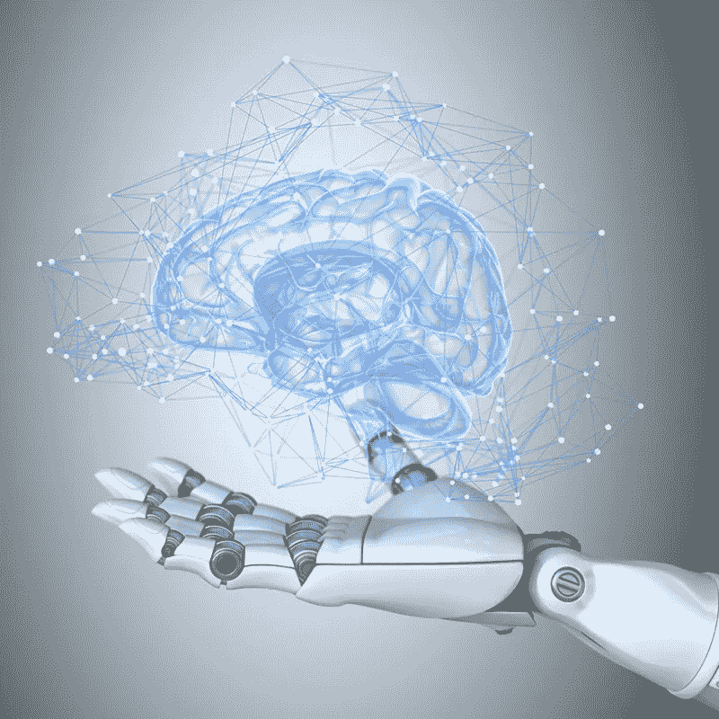
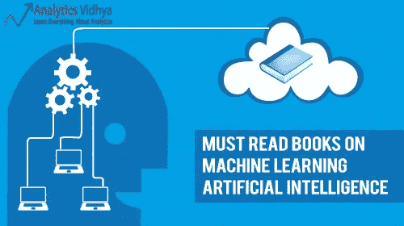
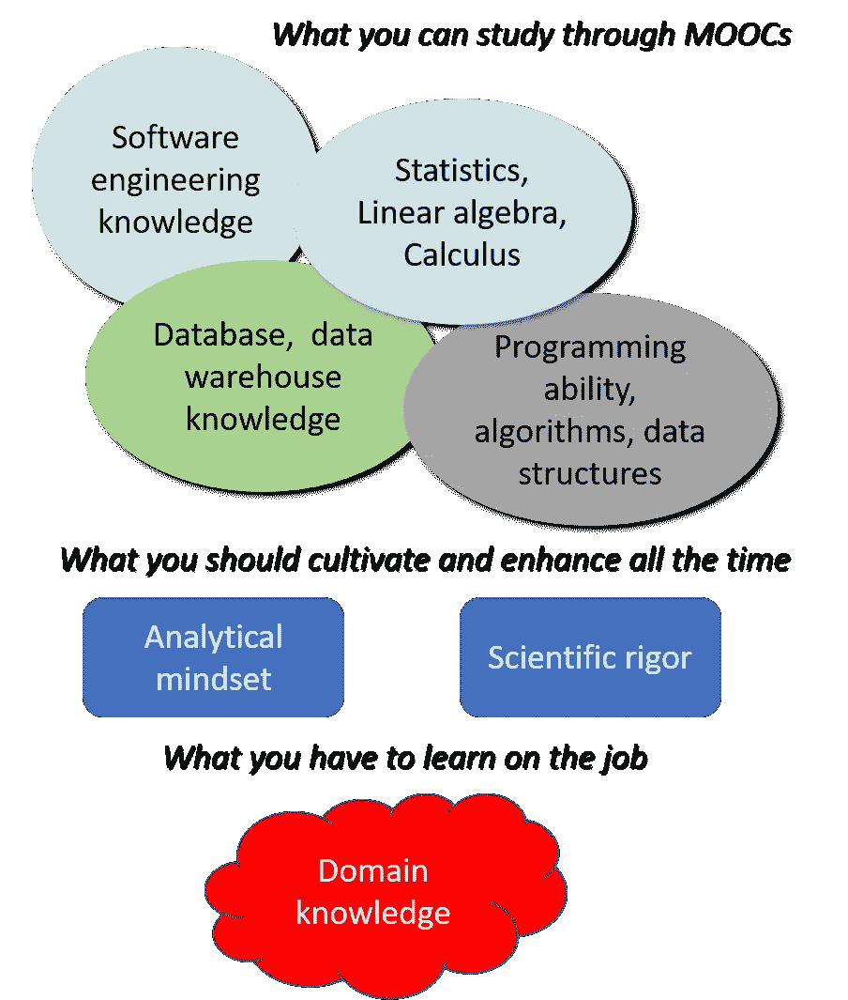
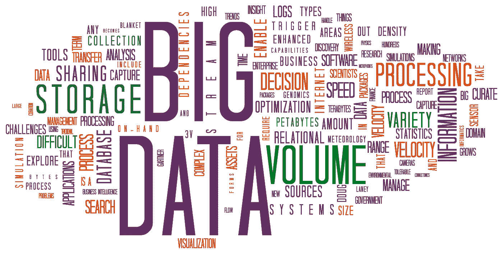
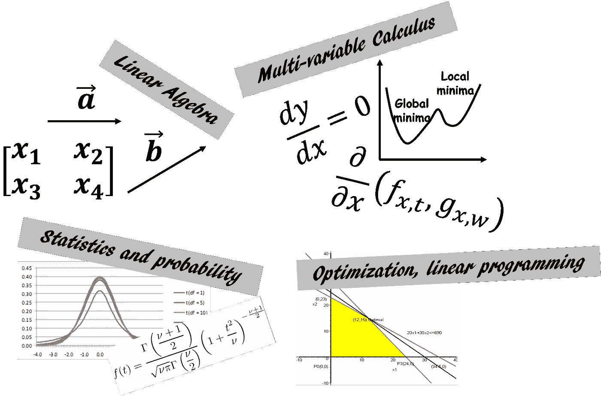
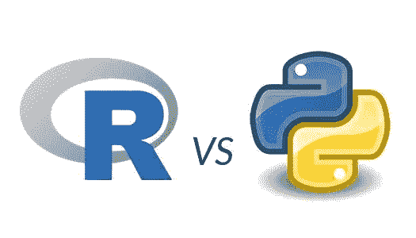
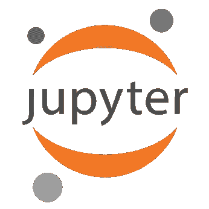
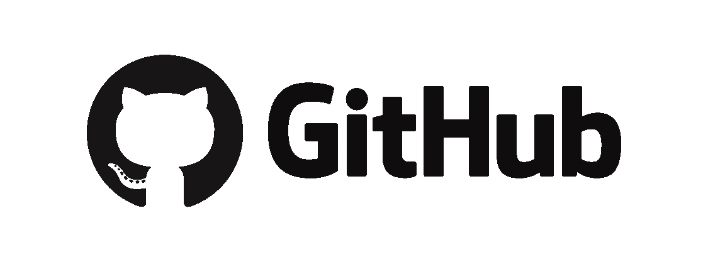
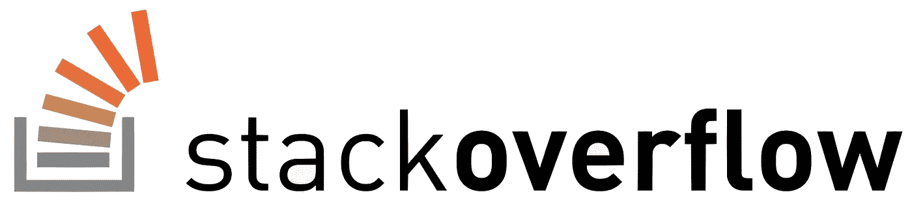

# 机器学习/数据科学入门问答

> 原文：<https://towardsdatascience.com/some-useful-advice-and-q-a-for-machine-learning-data-science-starters-part-i-54f8abd531d5?source=collection_archive---------3----------------------->

## 我们讨论了一些对机器学习/数据科学“初学者”有用的建议和问答。我们涵盖了开启旅程所需的关键书籍、课程、基础知识、数学和编程工具。

在获得电子工程博士学位后，我在 R&D 做了 8 年的工程师。我在半导体设备领域工作，仅在过去一年左右的时间里，我才开始学习和实践机器学习(ML)和相关的数据科学(DS)概念和技术。

除了[参加许多在线 mooc](/how-to-choose-effective-moocs-for-machine-learning-and-data-science-8681700ed83f)和[建立我的 GitHub repos](https://github.com/tirthajyoti) 之外，我还花时间在 Medium 上写了一些关于数据科学和机器学习主题的文章。他们中的一些人得到了很好的回应，并激发了有趣的讨论。在这段时间里，我的许多来自类似技术背景的朋友都问我是如何继续学习的，以及我专注于哪些方面来学习必不可少的 ML/DS 概念。此外，我在我参加的一些社交媒体论坛上默默地观察了数百个这样的问题。在我的个人收件箱中，我收到了来自完全陌生的人的电子邮件，他们讨论我的 Github 代码的问题，或者在作为一名机械工程师辛苦工作一整天后，寻求如何管理时间学习数据科学的技巧！

作为回应，我试着列出迄今为止在我的旅程中我所拥有并发现有价值的最重要的见解。当然，对于一个有经验的从业者来说，这些可能看起来很平常。但是，我的目标是给像我这样的初学者一些入门的思路。与此同时，我会试着写下我从朋友和陌生人的收件箱中收到的一些经常重复的问题的答案。

> 这将是高度*偏向*以我自己的经验。而且没有*方差*因为样本集只包含一个心智——我的:)因此，如果你继续读下去，请应用一个合适的过滤器(卷积与否)，然后放上最终的分类标签:-)

## 初学者的一般问答

“我 ***是计算机科学/工程专业的学生。我如何进入机器学习/深度学习/人工智能领域？”***

—你很幸运。当我还是学生的时候，这个领域仍然有点“冷”，我从来没有听说过:(不管你的主要研究领域是什么，你都可以阅读和获得关于机器学习的知识。请不要仅仅因为有人在网上滔滔不绝地谈论或者你在你朋友的 LinkedIn 个人资料上看到证书，就直接去 Coursera 注册 Ng 教授的课程。

1.  从 YouTube 上一些很酷的视频开始。读几本好书或文章。例如，你读过《[大师算法:对终极学习机的追求将如何重塑我们的世界](https://www.goodreads.com/book/show/24612233-the-master-algorithm)》吗？而且我敢保证你会爱上[这个很酷的关于机器学习的互动页面？](http://www.r2d3.us/visual-intro-to-machine-learning-part-1/)
2.  先学会明确区分流行语— *机器学习、人工智能、深度学习、数据科学、计算机视觉、机器人学*。阅读或听专家们关于每一个问题的演讲。[观看 Brandon Rohrer](https://www.youtube.com/watch?v=tKa0zDDDaQk) 的精彩视频，他是一位有影响力的数据科学家。或者这个[关于数据科学相关的各种角色](https://www.youtube.com/watch?v=Ura_ioOcpQI)的清晰定义和区别的视频。
3.  明确你想学什么的目标。然后，去上 Coursera 课程。在开始学习这门课程之前，确保你已经熟悉了 MATLAB，并且知道如何做矩阵乘法。或者考华盛顿大学的[另一个也不错。请不要在学习基础课程之前学习 deeplearning.ai 课程。](https://www.coursera.org/specializations/machine-learning)
4.  **关注一些好的博客** : [KDnuggets](https://www.kdnuggets.com/) ， [Mark Meloon 关于数据科学生涯的博客](http://www.markmeloon.com/)， [Brandon Rohrer 的博客](https://brohrer.github.io/blog.html)，[打开 AI 关于他们研究的博客](https://blog.openai.com/)，
5.  如果你已经开始学习和实践机器学习，但对自己的理解没有信心，你可以尝试 Simplilearn 的这个 [**12 个重要的机器学习面试问题**](https://www.simplilearn.com/machine-learning-interview-questions-and-answers-article) 指南，调整你的学习指南针。
6.  最重要的是，培养对它的感觉。加入一些好的社交论坛，但是**抵制住诱惑，不去关注耸人听闻的标题和发布的新闻。做你自己的阅读，了解它是什么和不是什么，它可能去哪里，它可以打开什么可能性。然后坐下来思考如何应用机器学习或将数据科学原理融入日常工作。构建一个简单的回归模型来预测您下一顿午餐的成本，或者从您的能源提供商那里下载您的用电数据，并在 Excel 中绘制一个简单的时间序列图来发现一些使用模式。 ***如果能下到那种个人水平，那么恋情自然有保障*** 。当你完全迷上机器学习后，你可以看这个视频**

“W***有哪些关于 AI/机器学习/深度学习的好书可以看？”***

—这个问题似乎有很多可靠的答案。我不会把我自己的偏见堆积起来，而是倾向于给你一些显示最有用的精选收藏的顶级链接，

1.  [10 本机器学习和数据科学的免费必读书籍](https://www.kdnuggets.com/2017/04/10-free-must-read-books-machine-learning-data-science.html)作者[马修·梅奥](https://medium.com/u/a0bc63d95eb0?source=post_page-----54f8abd531d5--------------------------------)。
2.  关于机器学习和人工智能的初学者必读书籍 —作者 AnalyticsVidhya。
3.  [这个牛逼的 GitHub 回购](https://github.com/josephmisiti/awesome-machine-learning/blob/master/books.md)。
4.  来自 machinelearningmastery.com 的各层次从业者的可靠指南。

"N ***现在告诉我一些最适合初学者的在线课程"***

—同样，几个链接和一些建议。首先是链接，

1.  顶级机器学习 MOOCs 和在线讲座:综合调查。
2.  [为机器学习和数据科学选择有效课程的 15 分钟指南](/how-to-choose-effective-moocs-for-machine-learning-and-data-science-8681700ed83f)。
3.  [最好的机器学习课程——班级中央职业指导](https://www.class-central.com/report/best-machine-learning-courses/)

建议是，只有你才能通过这些 MOOCs 决定正确的学习顺序和速度。有些人非常喜欢上在线课程，并能保持足够的动力去下载所有的编程材料并练习它们。有些人充满热情，但无法在网上视频讲座中保持清醒。介于两者之间的还有很多。作为一个初学者，你可以从在线课程中获得大量的知识并建立坚实的基础，但你必须掌握它们的节奏并正确地接近它们。

“O***K，那么你上网络课程有什么特别的小技巧？付费课程/证书值得吗？”***

1.  研究最佳课程的精选列表(如上),并全部参观。应该不会花你什么钱。**列出要求和难度，以及所涵盖主题的广度**。
2.  永远为你想学的东西保留一份个人路线图。它应该几乎像一个时间序列，即在确定的时间点要实现的明确目标。
3.  **戴上数据科学家的帽子，尝试用这个时间序列来适应课程**。它是否与你想要在不久的将来获得的有价值的概念和工具相匹配，即教给你这些概念和工具？它是否深入到了您已经知道但想要进一步完善的框架和专业领域？根据课程的实用性和你的个人需求给课程打分。
4.  列出一个季度的前 5 门课程。我发现用季度来思考很有用。
5.  现在，寻找成本的影响，阅读前 5 名学生的评论。尽量快速判断哪个评论者的个人情况最像你，并给那个评论高度加权。
6.  我大部分时间都参加了旁听课程/自由选择课程。我只为课程/证书付费，我认为这些课程/证书会提高我在这个领域的可信度。测验并不重要，但编程作业/笔记本很重要。大多数被审核的课程会让你免费下载笔记本。这就是你所需要的。相信我，如果你认真努力，你可以把这些笔记本做得比老师提供的版本好得多。
7.  如果你有一定的开支预算，我建议你去找当地提供证书的大学或者有课堂选择的训练营课程。这也适用于职业人士，因为他们大多在晚上或周末投递。**只有当你从 it 部门获得高度可信的证书时才花钱**——最好是从好的大学附属夏令营或项目中获得。
8.  **如果你需要从头开始温习编程语言技能，Udemy** 上几乎没有专注且节奏轻松的课程。一般来说，这些课程旨在用您选择的语言教授您编程的基本知识，而没有更深层次主题的负担。我发现，Coursera 或 edX 课程大多由学术研究人员提供，最适合于主题学习，而不是作为编程 101。另一方面，Udemy 课程非常适合复习基础知识。等待 Udemy 的 10 美元优惠活动(他们几乎每个月都有)，然后打包购买这些课程。我特别喜欢何塞·马西亚尔·波尔蒂利亚的关于 Python、R、SQL 和 Apache Spark 的课程。
9.  互联网是一所大学，图书馆也是一所大学。根据你的需要考虑和利用任何在线资源——整体的或零碎的。如果你对 Gits 一无所知，可以找一些关于 Gits 的短期课程。如果你需要了解一门特定语言的快速网页清理技术，只需观看一门更大课程的讲座。如果你真的认为基本的数据结构是神秘的，那就去参加大一计算机科学课程吧。[哈瓦德的 CS50](https://www.edx.org/course/introduction-computer-science-harvardx-cs50x) 就是一个很优秀的。或者甚至有一个为商务人士设计的[版本](https://www.edx.org/course/cs50s-computer-science-for-business-professionals)有着不同的味道。

抄袭托尔斯泰却反其道而行之，“每一个坏的过程都是相似的，每一个伟大的过程都有其独特的伟大之处 ”。培养发现顶级课程伟大之处的眼光。

“S***o、开启旅程需要哪些绝对的基岩知识？”***

——除了学习新事物的好奇心和为之努力的热情，什么都没有。你必须获得知识，实践，并在过程中内化概念。但即便如此，结构化学习方法还是有一些基本要点。同样，这是我个人的经验，因此需要根据你的个人情况和目标进行彻底的重新调整。

By Camelia.boban (Own work), via Wikimedia Commons

*   **用数字让自己适应数据和模式**。并接受数据可能来自任何类型的信号或来源的事实——电子表格财务、银行交易、广告点击、医院病历、可穿戴电子设备、亚马逊 echo、工厂装配线、客户调查。因此，它们可能是混乱的、不完整的和难以解读的，学习如何耐心和聪明地处理它们对于以后构建伟大的模型是有用的。这不是一门硬知识，而是一种才能。
*   你应该对高中水平的数学非常非常熟悉，包括基础微积分。[这里有一篇关于它的文章](/how-much-maths-does-an-it-engineer-need-to-learn-to-get-into-data-science-machine-learning-7d6a42f79516)。具体来说，关于多元函数、线性代数、导数和图形的概念应该是清楚的。

*   熟记基本统计学原理。大多数(如果不是全部的话)经典机器学习只不过是用计算机编程和优化技术的接口包装起来的合理的统计建模。深度学习是一个不同的领域，与之相关的理论仍在积极开发中。然而，如果你对基础统计学有扎实的掌握，你就离成为一名优秀的机器学习实践者还有很长的路要走。这是一本[优秀的免费在线书籍。](http://onlinestatbook.com/)或者说，[加州大学圣地亚哥分校的这门课程](https://www.edx.org/course/statistics-probability-data-science-uc-san-diegox-dse210x)确实以一种有趣的方式确定了基础知识。或者，如果你喜欢看有趣的 YouTube 视频，[你可以试试这个频道](https://www.youtube.com/channel/UCG32MfGLit1pcqCRXyy9cAg)。

*   熟悉至少一种高级编程语言是有用的。因为，除非你是机器学习领域的博士研究员，致力于一些复杂算法的纯理论证明，否则你应该主要使用现有的机器学习算法，将它们应用于解决新问题，并基于这些技术创建酷的预测模型。这需要戴上编程的帽子。虽然没什么特别的需要。仅仅是对特定语言的语法、变量、数据结构、条件、函数和类定义的基本熟悉。关于“数据科学的最佳语言”有大量的争论和积极的讨论。当争论激烈进行时，拿起你的咖啡，[阅读这篇有见地的文章来获得一个想法，看看你的选择](https://medium.freecodecamp.org/which-languages-should-you-learn-for-data-science-e806ba55a81f)。或者，在 KDnuggets 上查看[这篇文章。](https://www.kdnuggets.com/2017/09/python-vs-r-data-science-machine-learning.html)

*   **学习** [**Jupyter 基础**](http://jupyter.org/) 。对于数据科学家来说，这是一个非常棒的编程和实验工具。不仅要学习如何编码，还要学习如何使用 Jupyter 编写完整的技术文档或报告，包括图像、降价、LaTex 格式等。[这是我根据 markdown 功能](https://github.com/tirthajyoti/PythonMachineLearning/blob/master/Jupyter_Markdown_Primer.ipynb)整理的 Github 笔记本。请记住，Jupyter 项目最初是 IPython 的一个分支，但后来发展成为一个成熟的开发平台，支持您能想到的任何数量的编程语言。

*   **熟悉 Linux/命令行界面、git 和堆栈交换对于**您开始实际实现非常有帮助。令人惊讶的是，这比听起来要难。特别是，对于像我一样的许多工作专业人士来说，使用基于 Windows 或 Mac 的企业级工具已经成为一种根深蒂固的天性。对于软件工具的技术帮助，我们期望弹出一个闪亮的小电子手册。注册一个账号，在 Stack 论坛上发布一个框架良好的问题，对我们来说太多了。但是尽早学习它们，并且**拥抱开源文化。你会发现，甚至在你在 stack overllow**:)上打完你的问题之前，整个世界都渴望解决你的问题，你还会惊喜地发现，安装一个强大的软件库并不像那些极客让你相信的那样令人生畏。就像“ [*pip 安装…*](https://www.youtube.com/watch?v=FKwicZF7xNE) ”一样简单

第一部分到此为止。在第二部分中，我希望涵盖另外两个方面最重要的问答，

*   一些对初学者有用的关键机器学习/统计建模概念，
*   其他非常需要的技能，如在社交/专业平台上引人注目，以及定期关注构建材料。

如果您有任何问题或想法要分享，请通过[**tirthajyoti【AT】Gmail . com**](mailto:tirthajyoti@gmail.com)联系作者。你也可以查看作者的 [**GitHub 资源库**](https://github.com/tirthajyoti) 中其他有趣的 Python、R 或 MATLAB 代码片段和机器学习资源。如果你像我一样，对机器学习/数据科学/半导体充满热情，请随时[在 LinkedIn 上添加我](https://www.linkedin.com/in/tirthajyoti-sarkar-2127aa7/)或[在 Twitter 上关注我。](https://twitter.com/tirthajyotiS)